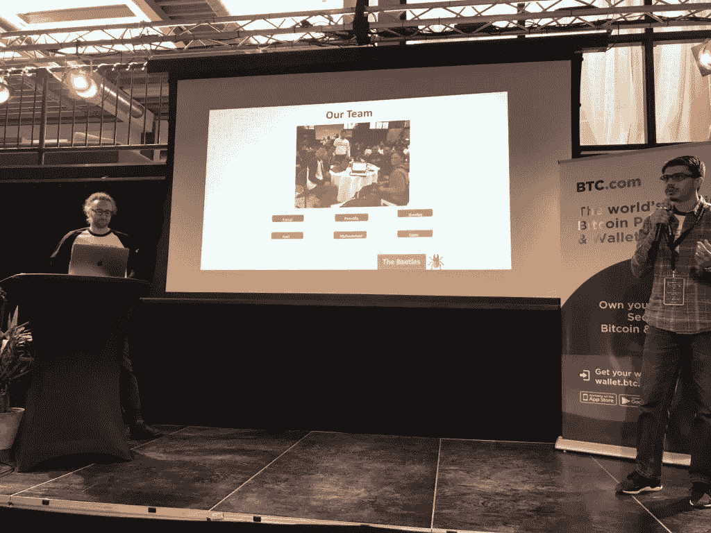

# 有没有关于我们、属于我们、对我们有益但我们不拥有的数据？

> 原文：<https://medium.com/hackernoon/bitcoin-cash-devcon-amsterdam-hackathon-2018-5149edb6a15c>

上周末，我参加了在阿姆斯特丹举行的 32 小时 BCH 黑客马拉松。这是一个令人惊叹的“学习、创新和分享”的环境，有 80 多名参与者和 13 多个团队，他们有着出色的想法、优秀的导师和组织者:)。

参赛团队想出了许多利用[区块链](https://hackernoon.com/tagged/blockchain)的创意，尤其是在小额支付方面。在黑客马拉松的最后，团队向评委和观众展示了工作原型。

我作为开发人员与一个小团队合作，探索在区块链上拥有个人反馈数据的可能性，作为使用 OP_RETURN 的交易的一部分。

为什么要反馈区块链？作为一个团队，我们讨论并试图解决以下问题。

**问题:**“有没有关于我们的、属于我们的、对我们有益但我们不拥有的数据？”。我们首先想到的是与他人合作时收集的工作参考和反馈。当我们开始一个新的角色时，我们会提供证明人，并且我们的同事和领导会定期向我们提供反馈，告诉我们我们的表现如何，我们的技能在 1-10 分的范围内处于什么位置，以及在接下来的几个月里应该关注哪些行为。当我们换工作时，我们必须从头再来。在过去 10 年的职业生涯中，我没有一个地方可以看到我的技能是如何以及是否得到了提高。

**我们的解决方案:**为了解决这个问题，我们决定创建一个非常简单但可行的概念验证应用程序。下一个问题是，在哪里存储数据？我们可以将应用程序数据存储在服务器上，但是谁将拥有服务器呢？一个中央集权的实体？您需要创建一个帐户，并与该实体共享您的所有个人数据。接下来呢？滥用数据、定向广告和影响观点。有印象吗？？

如果我们在区块链上存储数据。没有人拥有区块链，也没有附上可识别的数据。

我们开发了一个应用程序，本质上是一个“个人数据钱包”，用户使用私钥登录，无需提供个人信息。这个应用程序由三部分组成

From left feedback request section, reply section and feedback view section

*   反馈请求部分
*   反馈回复部分
*   反馈视图部分

这是应用流程

1.  反馈请求者使用私钥登录应用程序。
2.  反馈请求者通过向反馈提供者的数据钱包地址支付几分钱来发起请求，我们称之为“灰尘”。在进行转换之前，请求者选择一些与转换相关的问题。
3.  反馈提供者登录我们的应用程序，进行检查，并通过使用提供的“灰尘”作为交易费进行转换来响应请求。
4.  反馈请求者只需向数据钱包提供他的地址或地址列表(无需登录)，就可以看到收到的反馈。

如果请求者不希望反馈提供者查看以前的反馈，他可以简单地从不同的地址甚至不同的数据钱包发送每个请求。

那么，我们如何验证提供商的地址呢？个人和公司可以在网站、社交媒体上发布提供数据钱包地址的专用反馈，或者他们可以根据要求进行验证。

反馈提供者如何核实他们到底向谁提供了反馈？数据钱包可以为请求者提供一个唯一的 URL，重定向到应用程序的反馈回复部分，该 URL 可以使用一些已知的联系方式(如电子邮件、SMS、WhatsApp 或其他更好的方法)直接与反馈提供者共享。只有反馈提供者知道请求者的地址，其他人不知道。

应用程序的目的是永久保存我们的有用数据，而不附加个人信息。

下一个问题，用哪个区块链？老实说，任何区块链平台都可以使用，它允许小额支付，并允许一些数据附加到交易中。我们和来自 BCH 社区的优秀导师在 BCH DevCon，因此，我们决定使用比特币现金；) .

让我们讨论一下我们希望附加到交易中的数据，我们不想在区块链上存储大量数据，所以我们对数据使用了一个简单的协议。

**对于请求:**项目前缀，反馈类型，请求类型，问题 Id

示例:pdw、req、personal、q1、q2

**对于响应:**项目前缀，反馈类型，RESP，问题 Id:分数

示例:pdw、rsp、presonal、q1:5、q2:8

我们无视关于区块链某个地址的问题:

例如:pdw，def，q1:团队合作 _ 技能，q2:沟通 _ 技能

我们使用 Nodejs、Bitbox 和 React，在黑客马拉松的 32 小时内，通过测试网上的少量交易，成功构建并展示了我们的概念验证个人数据钱包。作为一个团队，我们真的很享受整个过程。

我们的项目收到了很多好的反馈，尤其是来自观众的积极认可，他们认为我们试图解决的问题是一个真实的问题。

现在，是什么阻止了像这样的区块链项目和黑客马拉松这样的项目成为主流和流行的呢？嗯，加密货币还没能降低微支付的交易手续费成本呢！以下是几个主要障碍

**可扩展性:【2017 年末，CryptoKitties dApp 项目明确强调了以太坊区块链的“可扩展性”问题。其他区块链平台也没有什么不同。可伸缩性是区块链的一个严重问题。如果区块链不能扩展，大规模采用就不会发生，原因很简单，因为大多数人不会仅仅为了去中心化而接受较慢的应用程序。这一领域的工作正在进行中。**

**可用性**:支付解决方案、钱包或其他基于区块链的应用程序应该可以被普通用户使用，而不仅仅是技术人员。我的祖母应该能够使用区块链发送和接收微支付或共享数据，而不用担心冗长难看的十六进制地址、高/低 tx 费用设置和 n 次确认。像[金钱按钮](https://www.moneybutton.com/)和[牌堆](https://cardstack.com/)这样的初创公司正在致力于这项挑战。

**互操作性**:我们见证了一波不同的区块链平台，它们拥有不同的共识算法**、**技术堆栈和架构，专注于解决“可扩展性”等主要问题。但是等等！太多的区块链平台。想象一下，在我们所处的世界中，不同的区块链平台可以共存，比如说至少有 5 个。如果我们在一个选定的平台上开发一个 dApp，这意味着该 dApp 将只对参与该特定区块链平台的社区成员开放。为了获得更广泛的受众，我们最终将为每个区块链平台创建单独的 dApps。这将是一场噩梦。

现在想象一下区块链项目的每一个分支！！！

> 开发者不可能基于不同区块链平台使用的不同技术栈来持续创建和管理区块链应用程序的不同副本。我们还没有吸取教训吗？我们试图创建混合开发平台，以避免 android 和 iOS 原生开发。

显然，如果我们想让区块链成为主流，不同区块链平台之间的互操作性非常重要。很少有技术专家预见到这一点，而且他们已经开始着手此事了

我最大的收获是，金融科技行业的大颠覆正在到来，因为许多聪明人正在努力消除上述障碍，随着区块链理工大学与人工智能的结合，这个行业充满了机会，将有多个赢家。

> **你**也可以成为**赢家**，**但是**要成为**赢家**，你必须**策划**，**执行**，最重要的是**尝试**。

A nice click from the Residence Inn by Marriott Amsterdam :).