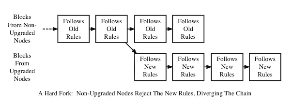
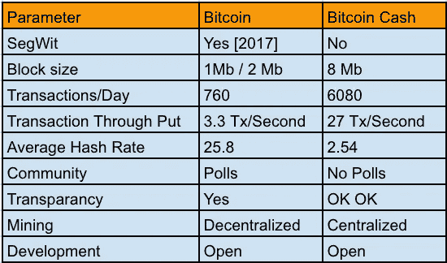

# 比特币现金智能合约

> 原文：<https://medium.com/hackernoon/bitcoin-cash-smart-contract-a2c92e8f07a1>


今天我想讲一些有趣的事情。它是关于比特币现金区块链之上的智能合约。对于不知道什么是比特币现金的人来说。比特币现金是比特币区块链的一个硬分支，其中人们谈到了可扩展性和交易费，即交易量。换句话说，就是比特币，社区决定创建一个新的区块链，它可以容纳更大尺寸的区块和更少的交易费用。除了所有的即时交易会让你大吃一惊，我的意思是几乎没有即时交易，但它真的比比特币交易速度更快。如果你不知道什么是分叉，我来帮你理解一下，硬分叉是从区块链的前一版本永久分叉，运行前一版本的节点将不再被最新版本接受。



hard fork

比特币现金有什么特别的？

比特币和比特币现金没有太大区别。它们都是为了同样的目的“点对点数字现金”而建立的。以下是一些关于比特币和比特币现金的有趣事实。



Bitcoin vs Bitcoin Cash

我们能在比特币现金上创建智能合约吗？

是啊！我们可以在比特币现金上写智能合约。好吧，让我来告诉你我们在写比特币现金智能合约时会面临什么困难。

*   致力于编写比特币现金的社区和开发者正处于早期阶段。所以，做好准备，你需要自己做好准备，目前没有多少人能帮你编写比特币现金合约。
*   我们将使用名为“Spedn”的高级语言来编写我们的智能合约。
*   Haskell 用于测试比特币现金智能合约。

让我们编写第一份比特币现金智能合约:

1.  在你的设备上安装 Haskell 工具包。

```
$ curl -sSL https://get.haskellstack.org/ | sh
```

2.创建新项目:

```
$ stack new my-project
$ cd my-project
$ stack setup
$ stack build
$ stack exec my-project-exe
```

3.要启动 run:

```
$ stack ghci
```

4.有关 Haskell 命令的列表:

```
$ stack 
```

5.克隆“Spedn”

```
$ git clone https://github.com/sriharikapu/Spedn.git 

or 

$ git clone https://bitbucket.org/o-studio/spedn.git
```

6.构建“Spedn”

```
$ cd spedn/spedn
$ stack install
```

7.为智能合同创建目录:

```
$ mkdir samplecontract
$ touch ExiringTip.spedn
$ nano ExiringTip.spedn
```

8.让我们考虑一个编写智能合同的案例:

让我们假设 Alice 想用纸钱包给服务员 Bob 小费，但是她想确保硬币不会因为 Bob 丢失纸而丢失。

这份合同锁定了一枚硬币，鲍勃可以在任何时候赎回它，但如果他在 7 天内没有赎回，那么爱丽丝可以取回它。

```
contract ExpiringTip(Ripemd160 alice, Ripemd160 bob) {

    challenge receive(Sig sig, PubKey pubKey) {
        verify hash160(pubKey) == bob;
        verify checkSig(sig, pubKey);
    }

    challenge revoke(Sig sig, PubKey pubKey) {
        verify checkSequence(7d);
        verify hash160(pubKey) == alice;
        verify checkSig(sig, pubKey);
    }
     challenge cancel(Sig Sig) {
        verify checkSequence(8b);
        verify checkSig(Sig, PubKey);
    }
}
```

9.编译您的智能合同:

```
$ spedn compile -c mycontract.spedn
```

10.已编译的合同模板:

```
<alice> <bob> 2 PICK TRUE EQUAL IF 3 PICK HASH160 OVER EQUALVERIFY (...)
```


Open source