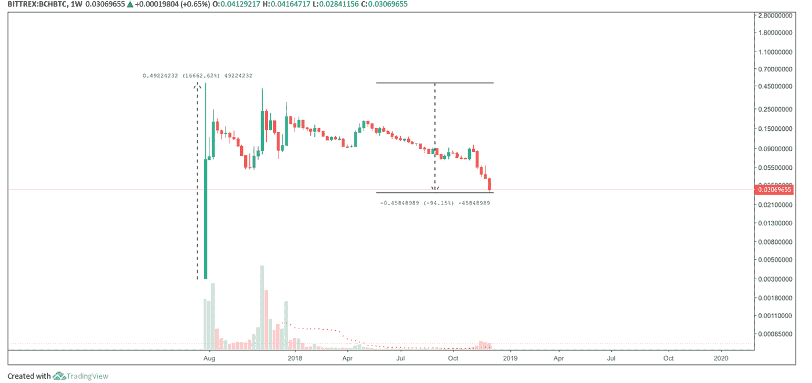
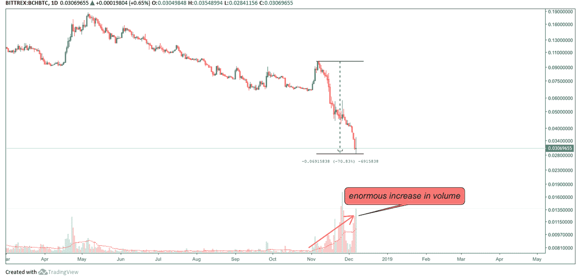
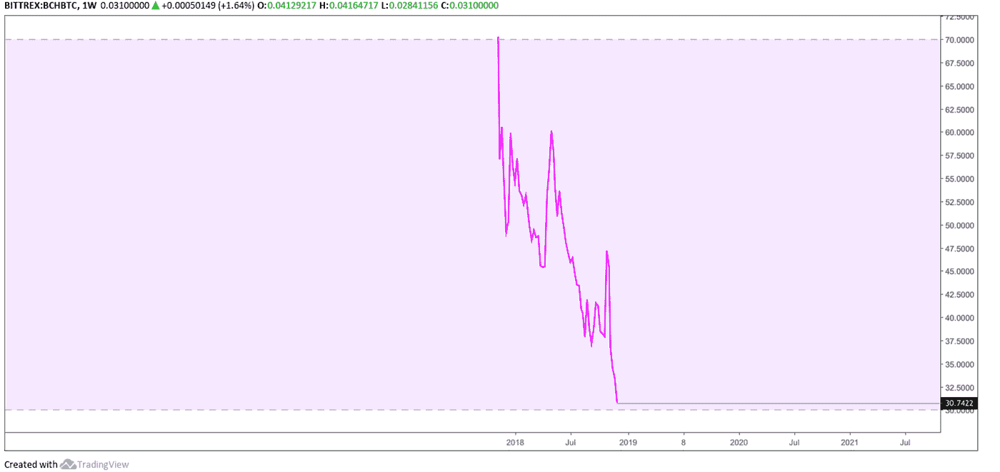
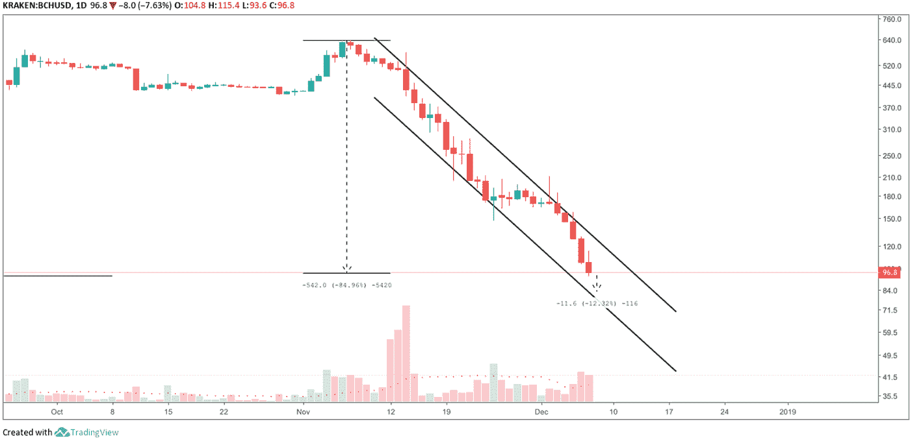
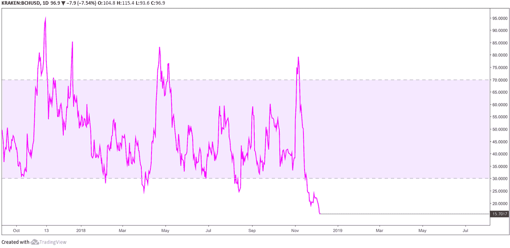
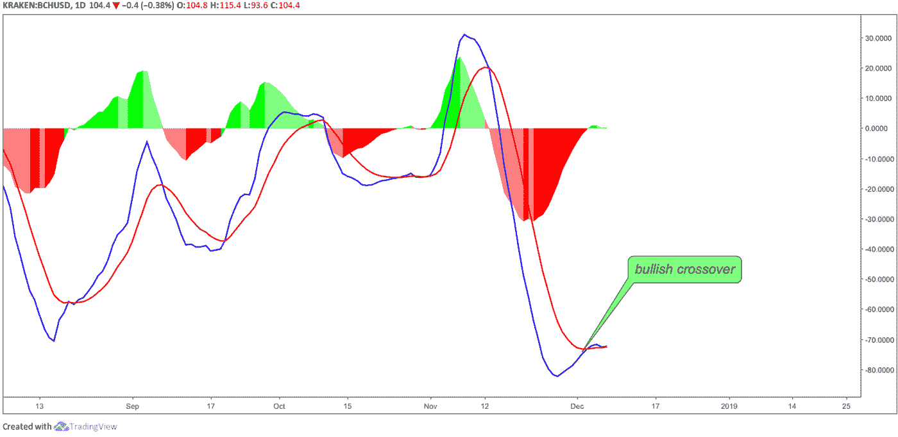
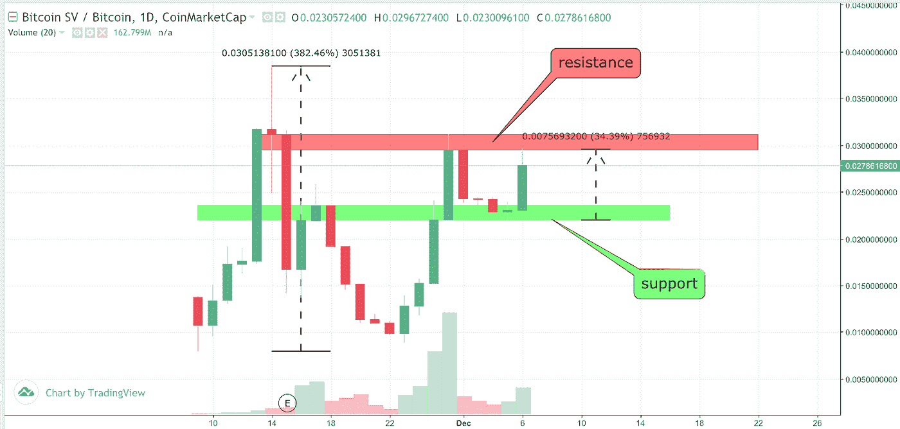

# 比特币现金技术分析

> 原文：<https://medium.com/hackernoon/bitcoin-cash-technical-analysis-c94f3aa5ea39>

## 比特币现金最近引起了轩然大波，原因是自称的 Bitcoin.com 域名所有者中本聪·克雷格·赖特和罗杰·维尔之间爆发了一场混战。11 月 15 日硬分叉之后，比特币现金还剩两条链:比特币现金 ABC 和比特币 SV。事不宜迟，让我们从技术角度看一下这两个链。

BCH/BTC 周线图

[比特币](https://hackernoon.com/tagged/bitcoin)现金在 2017 年 8 月 1 日推出的第一天达到顶峰，价值为每 1 BCH 0.48697 BTC。从那以后，比特币现金处于持续下降的螺旋中，迄今为止损失了 94.15%。

BCH/BTC 日线图

图表显示趋势没有逆转，事实上，在最近 70.83%的下跌中，交易量的巨大[增长](https://hackernoon.com/tagged/increase)是一个非常悲观的迹象，表明大量比特币现金 ABC 在短时间内被出售。

BCH/BTC 周线图

[相对强弱指数](https://www.investopedia.com/terms/r/rsi.asp)显示向上修正，距离触及超卖区仅 0.742 点。然而，这似乎是比特币现金 ABC 近期小幅上行的最后也是唯一的希望。

BCH/美元日线图

比特币现金 ABC 对美元处于熊市通道，距离其通道支持仅 12.32%。从目前的前景来看，BCH 似乎将在修正发生之前到达这一趋势线支撑。

BCH/美元日线图

RSI 低至 15.7017 BCH，处于强势超卖区域，这表明在不太遥远的未来将出现一波向上修正的浪潮。

BCH/美元日线图

此外，[移动平均线收敛发散— MACD](https://www.investopedia.com/terms/m/macd.asp) 最近强势穿越，位于非常低的区域。然而，MACD 即将再次交叉，这可能会否定之前的交叉。

BTC-SV/BTC 日线图

在交易所的第一个交易周之后，比特币现金叉 SV 飙升了令人难以置信的 382.46%。在几乎回到起点后，它再次上涨 246.09%，接近前一个高点的蜡烛线收盘，在那里它面临拒绝，下跌近 30%。然而，它在 0.022 BTC 找到了支撑，并再次上涨了 34.39%，在那里它再次面临拒绝，导致损失了 6%。话虽如此，为了延续比特币 SV 的上升趋势，它必须突破 0.295 和 0.311 BTC 之间的阻力。否则，它将再次在 0.022 BTC 找到支撑。

总而言之，比特币竞争对手的未来似乎并不太光明，至少从技术角度来看是这样。考虑到 BCH 在 2017 年 12 月 21 日的价值为 4044 美元，现在的价值为 95 美元，投资者的前景可能会令人震惊。