# 比特币核心 Bug CVE-2018–17144:分析

> 原文：<https://medium.com/hackernoon/bitcoin-core-bug-cve-2018-17144-an-analysis-f80d9d373362>

上周，[0 . 16 . 3](https://bitcoincore.org/en/2018/09/18/release-0.16.3/)向公众发布，并敦促每个人尽快升级，这让比特币世界感到惊讶。表面上的原因是在 0.14-0.16.2 中发现了一个需要修补的拒绝服务(DoS)载体。[后来](https://bitcoincore.org/en/2018/09/20/notice/)，我们发现 0.15-0.16.2 中同样的 bug 也有通货膨胀的可能。

在这篇文章中，我试图澄清发生了什么，危险是什么，它是如何被利用的，以及可能发生了什么。

# 双重消费的两种方式

在我们进入真正的 bug 之前，一些解释是必要的。我们需要首先定义重复消费，因为这个 bug 是关于重复消费的。

双重消费是指某人，比如说爱丽丝，花了几个硬币给鲍勃，又花了几个硬币给查理。爱丽丝实际上是想开两张支票，她知道其中一张会被退回。当然，当我们考虑支票时，爱丽丝有一些账户因为开了这两张支票而透支了。这很接近，但不完全符合比特币的工作原理。

比特币不支持账户，但支持 UTXOs，即未用完的交易输出。交易的输出本质上有一个地址和一个数量。一旦产出被花掉，就不能再花掉。把 UTXO 想象成寄给你的一枚硬币，可以是任何数量，比如 0.413 BTC 硬币。

双重消费意味着一枚硬币(UTXO)被消费两次。通常，这意味着 Alice 在一个事务中将她的 0.413 BTC 发送给 Bob，在另一个事务中发送给 Charlie。比特币解决这一问题的方式是，其中一项交易进入一个区块，这决定了谁实际上获得了报酬。如果两个事务以某种方式在多个块中通过，后一个块将被软件拒绝。如果两个事务都在一个块中通过，该块也会被软件拒绝。本质上，该软件检测重复花费，并且如果有重复花费，块应该被拒绝。

然而，在两个不同的事务中发送相同的 UTXO 并不是双重花费的唯一方式。还有一种更病态的情况，同一笔 UTXO 在同一笔交易中被花了两次*。在这种情况下，Alice 将一枚硬币发送给 Bob 两次。所以爱丽丝花了两次 0.413 BTC 币给鲍勃寄了 0.826 BTC。这显然不是一个有效的交易，因为只有 1 个价值 0.413 BTC 的 UTXO 被发送。这相当于爱丽丝两次付给鲍勃同样的 10 美元，而鲍勃认为他收到了 20 美元。*

# *定义 Bug*

*所以总结一下我们到目前为止所定义的，有两种类型的双重消费企图:*

1.  *使用两个或两个以上的交易花费相同的 UTXO。*
2.  *使用一个事务多次花费相同的 UTXO。*

*原来(1)是比特币核心软件正确处理的。这是我们关心的问题。任何人都可以构造一个像这样双重花费的事务，但是让节点接受这种事务是另一回事。有两种方法可以将事务放入块中。*

*A.用足够的费用将交易广播到网络上，以使矿工将交易包括在块中。*

*B.将事务作为挖掘器包含在块中。*

*(A)除了创建事务并将其广播到网络上的节点之外，不需要太多。(B)要求您找到充分的工作证明。事实证明，对于该漏洞来说，(A)不是可能的攻击媒介，因为这些事务会立即被标记为无效，并被网络上的节点拒绝。没有矿工的合作，交易就无法进入矿工的记忆池，因为他们不会得到传播。(B)是该错误出现的唯一情况。换句话说，要利用这个漏洞，你需要工作证明，或者足够的采矿设备和电力。*

*需要明确的是，有 4 种情况需要处理重复消费:*

*1A —多个内存池事务使用同一个 UTXO*

*1B —使用相同 UTXO 的多个大宗交易*

*2A —单个内存池事务多次使用同一个 UTXO*

*2B —单个块交易多次使用同一个 UTXO*

*这种缺陷有两种表现形式。在 0.14.x 中，存在拒绝服务漏洞，在 0.15.x 到 0.16.2 中，存在膨胀漏洞。我们接下来会谈到这些。*

# *拒绝服务漏洞*

*故事从 2009 年的比特币 0.1 开始，这段代码通过拒绝 1B 和 2B 的案例(检查区块没有重复花费)来强制执行共识:*

*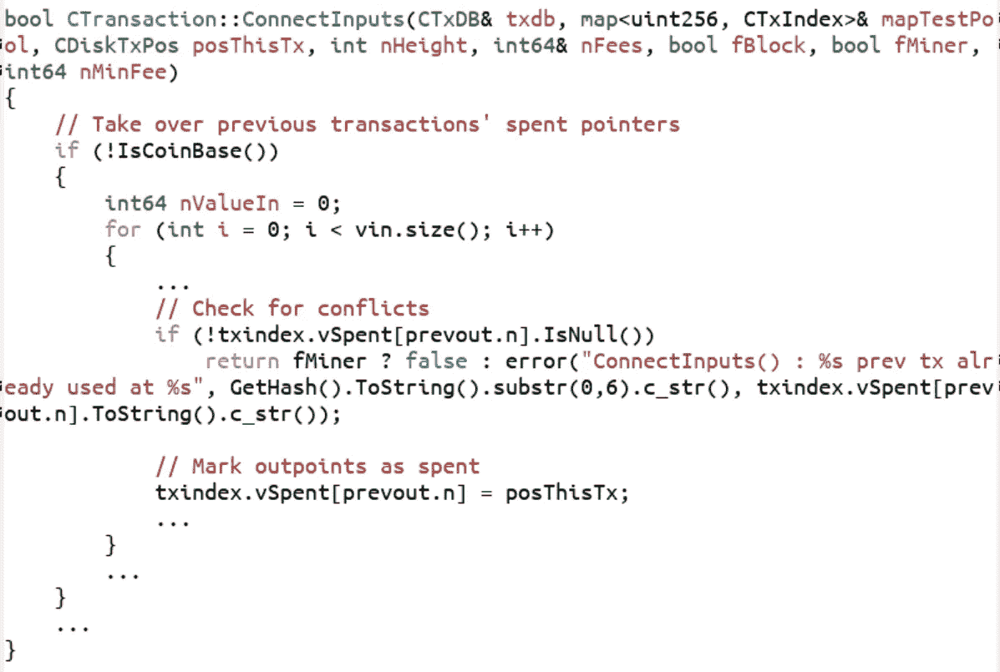*

*I’ve deleted a lot of in-between code for clarity*

*您可以看到注释“Check for conflicts ”,它检查每一个输入是否都被使用。注释“将输出点标记为失效”下面的代码将 UTXO 标记为失效。如果任何 UTXO 被多次使用，这将导致错误。*

*2011 年， [PR 443](https://github.com/bitcoin/bitcoin/pull/443) 合并。这一改变是为了处理通过内存池传输单 tx 双花费的情况(上面的 2A 情况)。这个拉取请求注释清楚地表明了目的(重点是我的):*

> *此外，没有具有重复输入的事务被放入块中…几周前有人尝试过，但 txes 从未以块结束。我假设后来某个地方有一个检查，防止他们被添加到块中，尽管我没有在这个问题上做任何挖掘。**这实际上是为了防止这种明显无效的交易被转发。***

*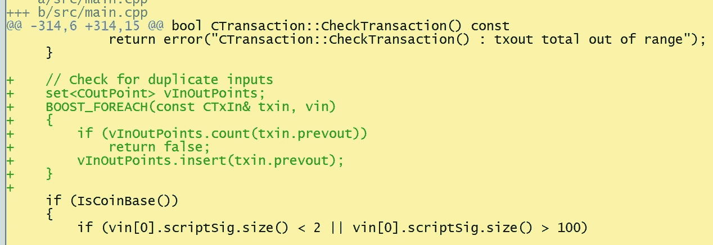*

*实际的代码更改或多或少做了与上面`ConnectInputs`中“检查冲突”注释下的代码相同的事情，但是在不同的地方。代码更改在`CheckTransaction`中，它针对上述所有 4 种情况(1A、1B、2A、2B)运行。因此，由于 1B 和 2B 的案例被检查了两次，一次在`CheckTransaction`，一次在`ConnectInputs`，我们现在在整批双重支出共识代码中有了一些冗余。*

*2013 年， [PR 2224](https://github.com/bitcoin/bitcoin/pull/2224) 合并。这一变化的目标是区分共识错误(如重复支出)和系统错误(如用完磁盘空间)，正如这一公关评论所表明的:(强调我的)*

> *它引入了 CValidationState，它存储关于正在执行的块或事务验证的元数据。**它用于区分验证错误(例如，不符合网络规则)和运行时错误(如磁盘空间不足)，因为以前这些可能会被混淆，导致块因磁盘空间用尽而被标记为无效。**此外，CValidationState 还接管了跟踪 DoS 级别的角色(因此它不需要存储在事务或块中……)。*

*实际的相关代码更改如下:*

*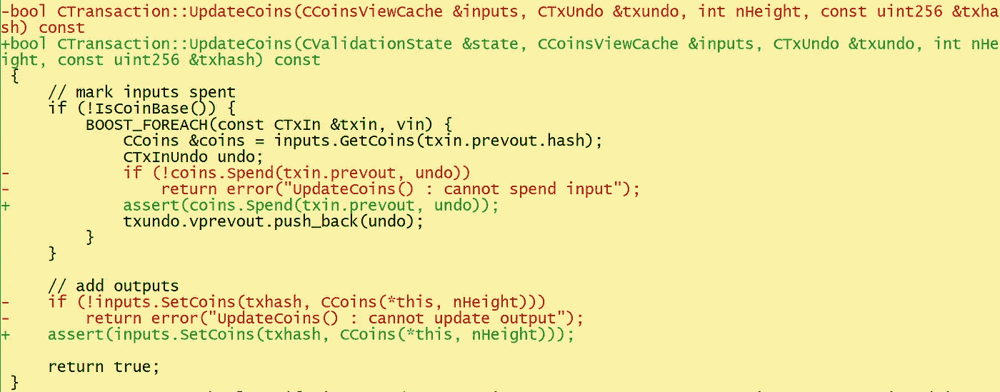*

*到这个时候，`ConnectInputs`已经被模块化成多个方法，这个函数成为检查重复花费的函数。这里的关键变化是曾经的`error`变成了`assert`。*

*C++中的`assert`是做什么的？它完全停止了程序。为什么程序员要在这里暂停程序？这就是拉请求的目的所在。这是当时相关的代码片段。*

*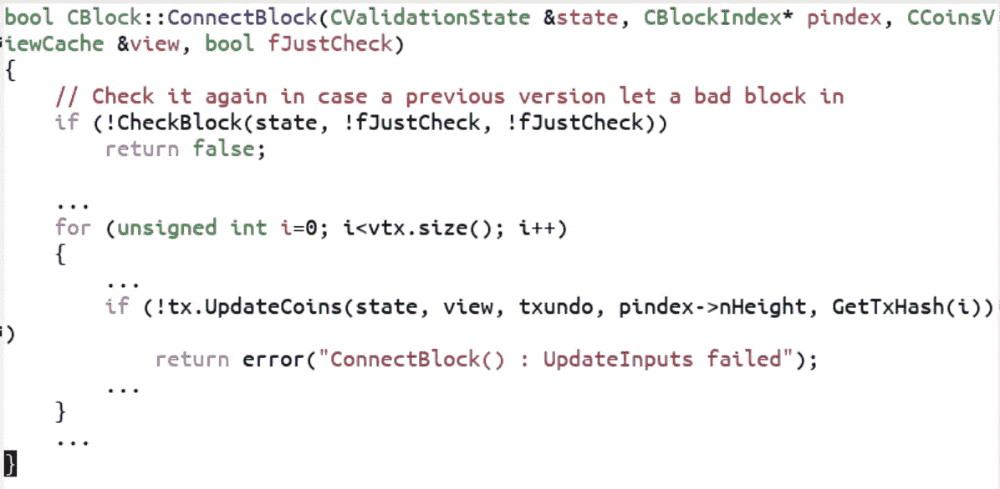*

*这是对 1B 和 2B 案件一如既往处理。函数名已从`ConnectInputs`更改为`ConnectBlock`，但检查案例 1B 和 2B 的冗余仍从 PR 443 保留。正如我们已经看到的，`UpdateCoins`做了第二个双花费检查。`CheckBlock`通过调用`CheckTransaction`进行第一次双花费检查:*

*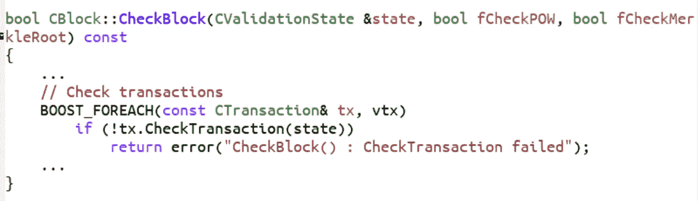**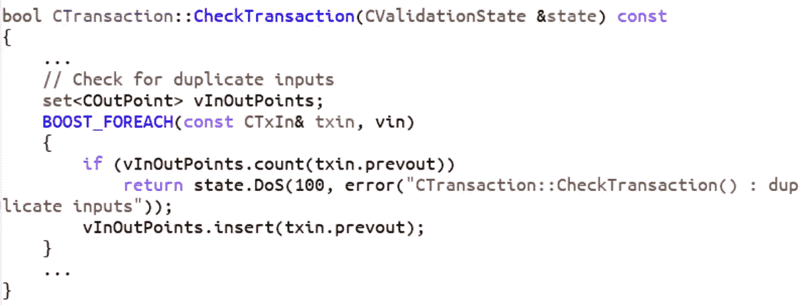*

*因为这是第二次检查同一件事，所以`UpdateCoins`中的双重花费检查失败的唯一方式是如果有某种 UTXO 数据库或内存损坏。事实上，这似乎是改为`assert`的原因。我们已经知道这些交易不是重复支出，因为 T2 通过 T3 在 T4 之前进行了检查。因此，PR 2224 正确地推测，在`UpdateCoins`达到这种状态一定是系统错误，而不是共识错误。在这种情况下，为了防止进一步的数据损坏，正确的做法是暂停程序。*

*2017 年， [PR 9049](https://github.com/bitcoin/bitcoin/pull/9049/files) 作为比特币 0.14 的一部分推出。由于 Segwit 将使块变得更大，这是加速块验证时间的许多变化之一。代码变化非常小:*

*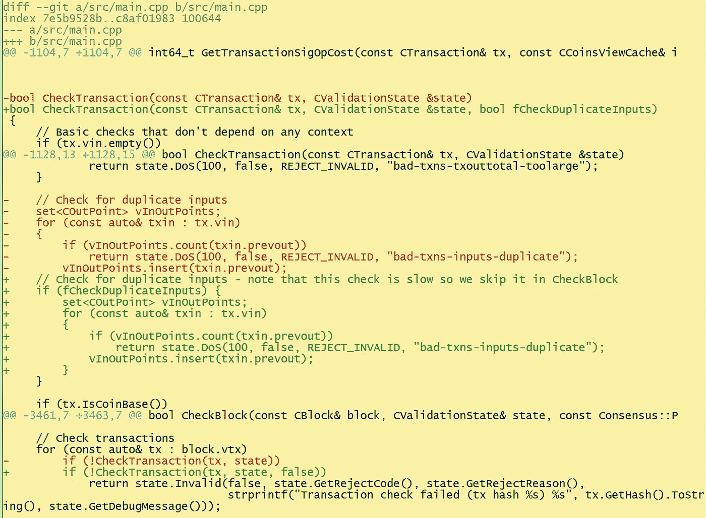*

*你可以看到布尔型`fCheckDuplicateInputs`被添加来加速块检查。正如我们将在下面看到的，这被认为是一个多余的检查。不幸的是，`UpdateCoins`中的代码在 PR 2224 中被更改为*系统损坏检查*，而不是一致性检查。到了 0.14.0，代码更加模块化，并且`assert`看起来有些不同:*

*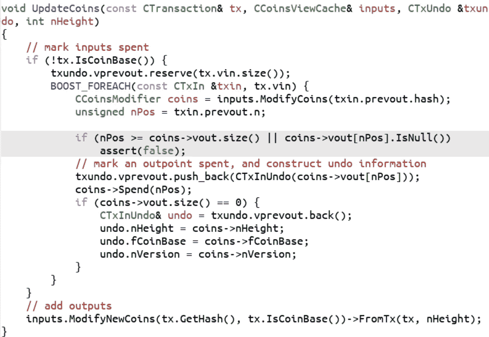*

*曾经的冗余检查现在负责块级单 tx 双花费(2B 情况)并暂停程序。这仍然在技术上强制执行共识规则，只是非常糟糕，因为它中止了程序。*

*PR 9049 是怎么打通的？Greg Maxwell 向我推荐了 IRC 上的聊天内容:*

*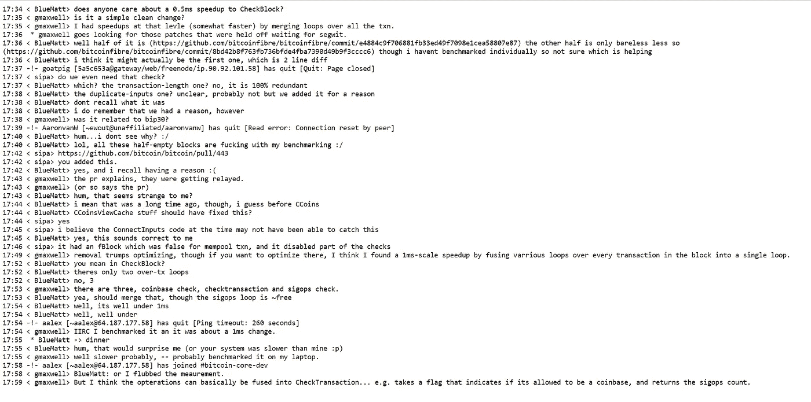*

*Major props to Greg Maxwell who helped spell out for me what happened*

*TL；DR，开发人员在讨论 PR 9049 时，倾向于认为在 PR 443 之外的地方检查了块级单 tx 双花费(案例 2B ),而没有考虑 PR 2224。这导致开发人员没有密切关注 PR 9049。*

*总而言之:*

1.  *2011 年引入 PR 443 是为了防止重复支出交易的延续(2A 案例)。这产生了一个副作用，就是为整批重复支出(1B 和 2B 的例子)创建了一个冗余的共识检查规则。*
2.  *PR 2224 是在 2013 年引入的，作为副作用，它将(1)中用于块验证的代码从冗余升级为共识关键。*
3.  *PR 9049 于 2017 年推出，并跳过了(1)中针对单 tx-double-spend-in-a-block 情况(1B 情况)的代码。开发人员错误地认为代码是多余的，因为他们没有考虑(2)。事实上，这种变化跳过了共识的关键部分。*

*公平地说，这是导致 bug 的各种事件的奇怪汇合。*

# *DoS 漏洞的严重性*

*这意味着核心 0.14.x 软件可能会崩溃给一个足够怪异的块。由于代码所处的位置，要导致崩溃，攻击者必须:*

1.  *创建一个使用同一个 UTXO 两次的事务*
2.  *将来自(1)的事务包括到具有足够工作证明的块中*
3.  *将该块广播到 0.14.x 节点*

*(1)和(3)的成本不是很高。(2)成本最低为 12.5 BTC，因为创建一个具有足够工作证明的区块所需的散列功率量与找到一个有效区块所需的能量/采矿设备量相同。*

*如果你认为从博弈论的角度来看，分裂网络并没有那么好，那么利用这个漏洞的动机就相当低。作为一名攻击者，最多只能以 12.5 BTC 的成本拿下一小部分完整节点。由于不太可能从分裂的网络中获利，这需要的不仅仅是能够随意使一些节点崩溃，因此没有太多好处，因为攻击者无法轻松收回攻击的成本。*

*如果这是唯一的漏洞，攻击者可能会给许多人带来不便，但这不是持续的不便，因为这些节点可以简单地重新启动并连接到除了向它们提供坏块的节点之外的节点。一旦有了更长的链条，这种糟糕的拦网攻击就会完全失去威力。除非攻击者继续以每块 12.5 BTC 的成本创建块，并将它们提供给网络上的 0.14.x 节点，否则攻击或多或少会就此结束。*

*换句话说，虽然脆弱性肯定存在，但 DoS 的经济激励相当低。*

# *通货膨胀错误*

*从 0.15.0 开始，引入了一个使查找和存储 UTXOs 更快的特性，并且引入了 bug 的下一次迭代。当一个具有单交易双花费的块进来时，软件没有崩溃，而是认为该块是有效的。*

*这意味着一个病态的事务(同一个 UTXO 在同一个事务或上面的 2B 中花费了多次),它使 0.14 个节点崩溃，现在在 0.15 个节点中被视为有效，实质上是凭空创建了 BTC。*

*事情是这样的。在 0.15 中引入， [PR 10195](https://github.com/bitcoin/bitcoin/pull/10195/files) 包含了很多东西，但它的主要要旨是改变了 UTXOs 的存储方式，以使它们更有效地查找。结果，出现了许多变化，包括前面的`UpdateCoins`函数:*

*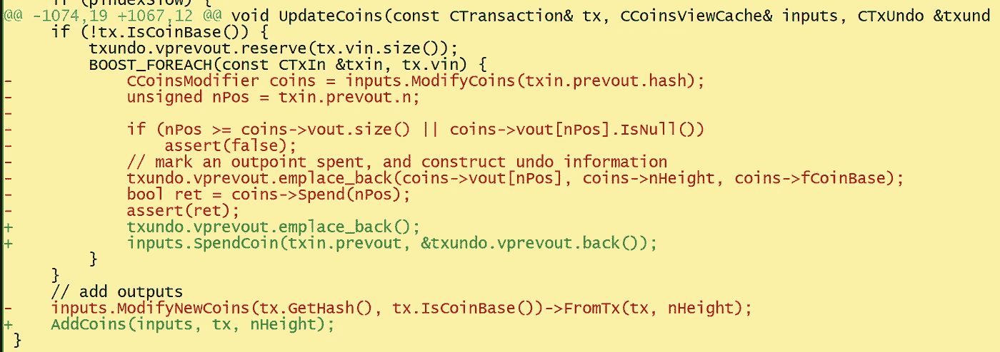*

*请注意`assert(false)`周围的代码是如何被完全删除的。注意到这一点， [PR 10537](https://github.com/bitcoin/bitcoin/pull/10537) 也在 0.15.0 中修改了代码，使得断言被放回。*

*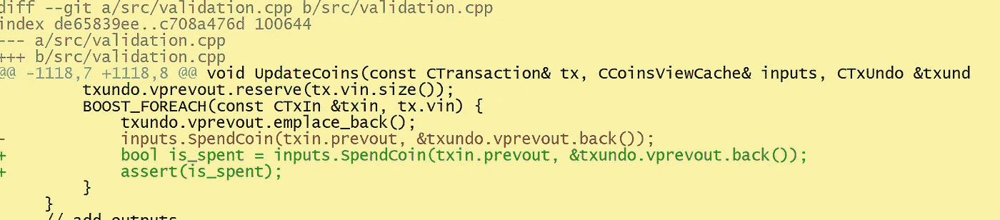*

*断言失败的条件取决于`inputs.SpendCoin`,如下所示:*

*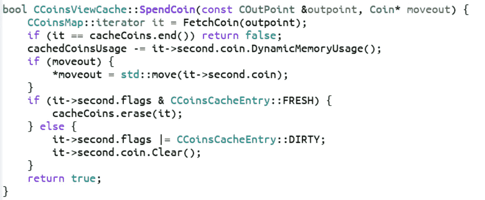*

*从本质上讲，`SpendCoin`返回 false 的唯一方式是硬币不存在于 UTXO 集合中。但是你可以看到，这要求硬币是`FRESH`而不是`DIRTY`。这些都不是显而易见的术语，但谢天谢地，核心开发者周立铭在这里解释了:*

> *所以现在的问题是，UTXOs 什么时候被标记为`FRESH`？当它们被添加到 UTXO 数据库时，它们被标记为`FRESH`。但是 UTXO 数据库仍然只存在于内存中(作为缓存)。当它被保存到磁盘时，内存中的条目不再被标记为`FRESH`。这种保存到磁盘的操作在每个数据块之后都会发生(其他时候也会发生，但这并不重要)。*

*`FRESH`硬币是进入记忆池的硬币。攻击者可以通过`UpdateCoins`中的断言语句使节点崩溃。但更糟糕的是，如果硬币是`DIRTY`(本质上是从磁盘读取的)，那么这会导致通货膨胀。*

*因此，从 0.15.0 到 0.16.2 的核心软件可能会接受一个奇怪的、无效的阻塞，从而增加供应。*

# *通货膨胀脆弱性的严重性*

*这种攻击的经济性似乎明显优于拒绝服务的情况，因为攻击者可能会凭空创建 BTC。你仍然需要采矿设备来执行攻击，但是潜在的通货膨胀可能会使这变得值得，或者看起来是这样。*

*下面是利用这个漏洞对比特币进行的幼稚攻击:*

1.  *创建一个交易块，该交易两次花费一定数量的 BTC 给自己。比如说 BTC 50 号→BTC 100 号。*
2.  *0.15/0.16 把区块播给大家*

*以下是可能发生的情况:*

*   *0.14.x 节点将会崩溃*
*   *较旧的节点和许多替代客户端会拒绝该块*
*   *许多块浏览器运行在定制软件上，而不是核心软件上，因此至少有些会拒绝该块，不会显示该块的任何事务*
*   *根据矿工运行的软件，我们可能已经结束了链分裂。*

*有可能所有的矿工都在运行比特币核心 0.15+版本，在这种情况下，非易受攻击的客户端会简单地停止运行。也有可能一名矿工正在运行其他的东西，在这种情况下，一旦他们发现一个区块，就会发生链叉。*

*由于这些不规则性，网络上的人很快就会发现这一点，可能会提醒一些开发人员，核心开发人员会修复它。如果有一个分叉，关于哪条链是正确的社会共识将开始被讨论，而产生意外通胀的链可能会失败。如果有停顿，很可能会有一个自愿的回滚来惩罚攻击者。*

*所以对于攻击者来说，这不会导致+50 BTC，但更有可能是-12.5 BTC。如果攻击者加倍花费更大的金额，比如 200 BTC，那么通货膨胀阻滞持续存在的可能性就更小，因为攻击会更加明目张胆。*

*因此，从攻击者的角度来看，这不会是一个很好的投资回报。*

*攻击者可能获利的另一种方式是做空 BTC，然后实施攻击。这也是有风险的，因为不能保证 BTC 价格会下跌，尤其是如果危机得到迅速果断的处理。此外，考虑到大多数交易所提供保证金的反洗钱/KYC，这可能会导致攻击者在相当短的时间内获得 doxxed。*

*攻击者不仅面临巨大的金钱风险，还面临身体风险。投资回报率并不真正存在，从经济角度来看，这并不是一个容易利用的利润。*

*然而，一个州级演员可能会用这种方式来吓唬比特币制造者。ROI 会更抽象，所以从理论上讲，这可以实现州级参与者的目的。*

# *结论*

*当然，这是一个相当严重的错误。尽管我和很多人有分歧，但我很感激这个人选择负责任地披露。也就是说，考虑到漏洞利用的经济博弈理论，我不认为漏洞有像他这样的人所说的那么严重。*

*即使错误在被发现之前就被坏人发现了，攻击者也不会选择利用它，因为这在经济学上并不合理。可以肯定的是，技术部分应该得到修复并变得更好，但这种利用实际上有用的人群非常少(基本上是想摧毁比特币的国家级行动者)。*

*比特币核心的教训有很多:*

1.  *任何共识的改变(即使是 9049 这样微小的改变)都需要更多人的审核。*
2.  *病理病例需要写更多的检测。*
3.  *代码库中关于哪些检查是多余的，哪些不是，以及实际代码应该做什么的更加清晰。*

*过去有 bug，将来也会有 bug。现在重要的是学习和吸收这些教训。*