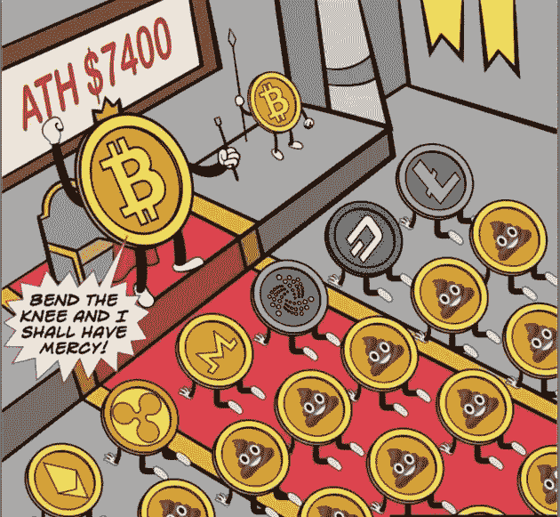
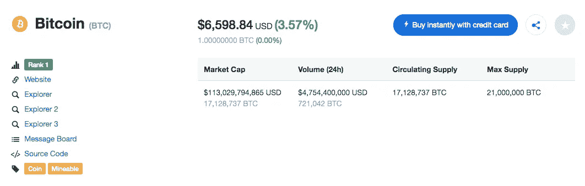
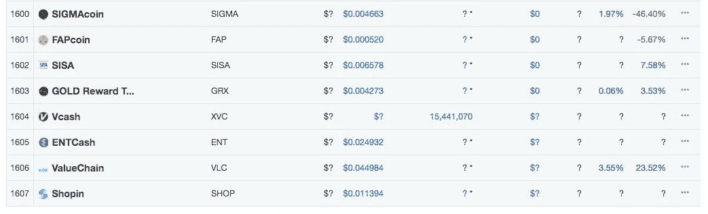
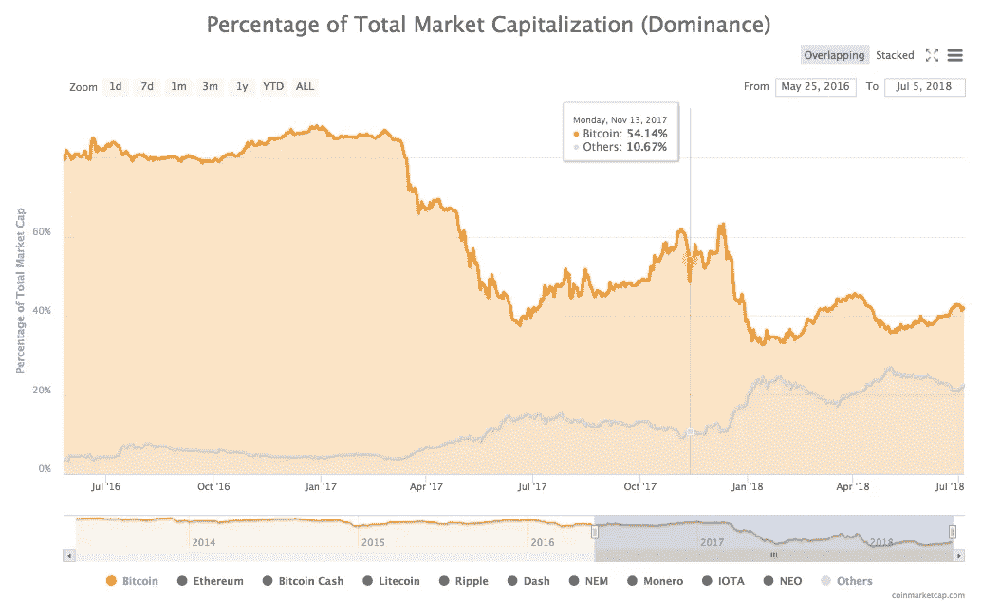

# 比特币的统治地位和“其他人”的出现

> 原文：<https://medium.com/hackernoon/bitcoin-dominance-and-the-emergence-of-others-64a7996272ad>

隐球界有两个阵营。比特币最大化主义者和 Altcoin 冠军。我第一次看到下图是在 11 月比特币 ATH 达到 7400 的时候。比特币大幅上涨，许多替代币遭到屠杀。它很好地抓住了比特币最大化主义者的情绪。

Bend the knee and I shall have mercy

# 比特币

Bitcoin Details on July 4, 2018

**比特币是什么？**

对于外行来说，比特币是第一种广泛使用的点对点电子现金。我们所说的对等是指在传输中没有可信的中间方。由各种账户/方持有的余额分类账由一组称为节点的计算机维护。由于壁架所有这些节点使用一种算法称为**工作证明**的共识。关于交易顺序的共识正在达成。这些交易的顺序至关重要，因为它确保你不能花你没有的钱。你也可以换一种说法，不花同样的钱两次，这通常被称为“T4”双重消费。

虽然很久以前就有人提到点对点电子现金，但 2009 年 1 月 3 日(比特币问世、创世纪区块开采之时)可以被视为加密货币的正式开始。对于一项只有 10 年历史的技术来说，它已经让许多人瞠目结舌，并让世界各地的许多政府和机构彻夜难眠。

**什么是 Altcoin？**

比特币之外的所有加密货币都被称为 Altcoins。在写这篇文章的时候，CoinmarketCap 上有 1607 枚硬币。事实上，您可以使用各种代币创建服务在几分钟内创建一个新的代币，这只会加剧每天出现无数硬币/代币的问题。

There are 1607 coins listed on Coin Market Cap

# 什么是比特币极大主义？

我的这条推文试图总结比特币极大主义。

比特币是加密货币的旗手，我猜测它至少在未来几年内还会如此。虽然有许多因素影响加密货币(或网络)的价值，但主要因素仍然是网络的安全性。不同的阵营认为代表网络安全性的因素不同。一些阵营将安全性归因于 POW 的数量，一些阵营将安全性归因于硬币的分配方式，一些阵营将安全性归因于既得利益方(在 DDOS 中)等。考虑到比特币的市值和敞口最高，它也受到最严格的审查。比特币网络的安全性导致其更高的市场份额，更高的市值使其更安全。因此，在奇迹发生之前，比特币仍将是最安全的加密货币网络。

# 比特币域名管理

Bitcoin Dominance since July 13

在加密货币存在的大部分时间里，比特币一直保持着超过 80%的主导地位。将比特币的主导地位视为进行任何分析的统一因素将是一种谬误。我认为现在把它分成两部分是有意义的。2017 年 3 月前和 2017 年 3 月后。尽管加密货币被称为智能货币，但它们的大多数用例只是证明了它们是愚蠢的分布式数字货币。随着以太坊显示出可编程货币和智能合约的优势，比特币的统治地位自然开始下降。我强烈地有一种感觉，比特币霸主地位再也不会跨过 80%了。如果比特币解决了其规模问题，它可能会再次回到 60%的主导地位。这也意味着，许多声称自己比比特币更好或解决比特币特定问题的比特币分支将被进一步屠杀。

随着时间的推移，比特币的主导地位将会下降，这是很自然的事情，但至少在可预见的未来(几年内是保密的)，它可能仍将是主导货币。为了让比特币保持 40%以上的优势，并达到 60%的数字，比特币网络上的第二层应用/服务应该大幅增加，但现在似乎不是这样。POET 是一个从[比特币测试网转移到比特币主网的好项目。如果更多项目选择这种方式，比特币肯定会保持其统治地位。最近发生的对各种新生网络和比特币克隆的 51%攻击只是进一步证明，在达到临界质量之前，很难保持网络安全。对于新项目来说，选择最安全的网络作为其工作流的基础是有意义的，如果在后期出现更高级的安全网络，可以考虑转移到其他网络。](https://blog.po.et/june-2018-po-et-engineering-progress-report-522b78e491fc)

# 2017 年 3 月后的优势图表

因为我们将优势图表分为 2017 年 3 月之前和之后，所以让我们看看 2017 年 3 月之后的优势图表。

Bitcoin Dominance post March 2017

从上图中可以看出，尽管以太坊在 2017 年 6 月份因围绕可编程货币、智能合约和 ico 的热潮而上升至 30%，但此后逐渐下降，并一直保持在 15%至 20%的范围内。你可以从上面的图表中观察到，比特币和以太坊的主导地位之间存在广泛的负相关关系。每当以太坊的优势增加时，比特币的优势就会减少，反之亦然。这并不奇怪，因为它们是排名前两位的加密货币。截至 2017 年 5 月，它们总共占据了 75%的市场主导地位。在 2017 年 12 月降至 46%的主导地位后，迄今为止一直保持在 50%以上。

# 2017 年 3 月后“其他人”的出现

“其他人”在 2017 年 3 月左右仅占 4%,到目前为止，这一比例有了相当大的增长。有趣的是，从 2017 年 3 月至今，“其他曲线”总体呈上升趋势。有几个日期在这个时间跨度中脱颖而出，让我们更好地了解所谓“他人”的本质。

Visit the table separately on [https://sheetsu.com/tables/f180428573](https://sheetsu.com/tables/f180428573)

上表中的数据是使用我编写的脚本从 CoinMarketCap 网站的 Highcharts 中获取的。你可以在这里了解更多信息

试着阅读上表中的数据，并看看下面的图表，以便更好地理解它。

Bitcoin Dominance post March 2017

**2017 年 3 月 10 日** —比特币:84.29，以太坊:6.96，比特币现金:0，涟漪:1.05，其他:4.1

这没什么奇怪的。我取这个样本只是为了展示比特币统治时期的情况。因此，不久前比特币占据了接近 85 %的主导地位。

**2017 年 3 月 26 日** —比特币:66.68，以太坊:20，比特币现金:0，涟漪:1.54，其他:6.11

嗯，这是一个剧烈的下降。比特币损失几乎 20%，大部分被以太坊获得。以太坊从 7%提高到 20%。

**2017 年 5 月 18 日** —比特币:48.51，以太坊:13.34，比特币现金:0，涟漪:23.83，其他:8.83

以太坊失去了一些优势。但是 Ripple 给了我们一个惊喜。涟漪上升到 28.83 %的优势。以太坊和 Ripple 一起把比特币的统治地位带到了 50%以下。

**2017 年 6 月 13 日** —比特币:40.23，以太坊:32.45，比特币现金:0，涟漪:9.05，其他:13.26

以太坊的统治地位上升到 32%左右的历史最高水平。比特币的主导地位下降到 40%左右。对可编程货币和智能合约的狂热正在高涨。ICOs 成了镇上的话题。人们开始问以太坊是否会超越比特币。

**2017 年 8 月 03 日** —比特币:44.67，以太坊:20.84，比特币现金:6.83，涟漪:6.73，其他:13.55

比特币缩放问题变得越来越热，比特币被分叉以创造比特币现金。

**2017 年 11 月 06 日** —比特币:61.64，以太坊:14.28，比特币现金:5.28，涟漪:3.92，其他:9.5

随着事情开始稳定下来，比特币慢慢恢复其市场主导地位，并重新获得高达 61%的主导地位。以太坊、比特币现金等逐渐失去统治地位。

**2017 年 11 月 12 日** —比特币:53.12，以太坊:15.08，比特币现金:10.62，涟漪:4.01，其他:10.69

随着比特币采矿变得更加有利可图，矿工们开始支持比特币现金。比特币现金将其统治地位提升至 10.62%。

**2017 年 12 月 8 日** —比特币:63.13，以太坊:10.05，比特币现金:6.36，涟漪:2.28，其他:10.81

这是比特币接近 ATH 接近 20，000 美元的时候。随着替代币被比特币价值的增长速度所屠杀，比特币重新获得了主导地位。

**2018 年 1 月 04 日** —比特币:33.34，以太坊:12.34，比特币现金:5.39，涟漪:18.99，其他:21.79

Ripple 的克里斯·拉森比谷歌的创始人更富有。电视主持人开始展示如何购买 Ripple。Ripple 被吹捧为下一个比特币。

在一个月的时间里，比特币的主导地位降至 33.34%，几乎是 12 月 8 日的一半。发布这个日期看起来比特币的统治地位可能永远不会越过 60%的大关。

**2018 年 1 月 14 日** —比特币:32.54，以太坊:18.47，比特币现金:6.2，涟漪:10.44，其他:23.91

以太坊仍然面临着规模问题。由 Tron、IOTA、EOS、Cardano 和 Stellar 组成的其他公司保持持续增长，因为它们承诺在解决扩展问题的同时支持 DAPPS 和 ICO。

**2018 年 5 月 3 日** —比特币:35.93，以太坊:16.29，比特币现金:5.79，涟漪:7.67，其他:26.98

EOS 在这个时候达到 20 美元的 ATH。其他人的 ATH 达到 26.98。其他公司似乎保持着市场主导地位。

**今日-2018 年 07 月 05 日** —比特币:41.92，以太坊:17.58，比特币现金:4.79，涟漪:7.02，其他:22.51

比特币正在慢慢重获统治地位。随着越来越多的加密货币变得稳定并发布它们的 mainnets，我认为比特币真的需要付出巨大的努力才能超过 60%的主导地位。BitcoinCash 还试图通过让它变得可用和用户友好来给它定位。随着时间的推移，比特币现金的份额可能会增加。

然而，比特币将永远拥有先发优势，即使在今天，对许多人来说，加密货币意味着比特币。因此，如果比特币解决了其规模问题，如果像“闪电网络”这样的第二层协议获得成功，比特币肯定会给许多新的加密货币带来挑战。

如果你发现了这篇文章，请不要忘记鼓掌并留下评论。我刚刚列出了我在比特币和替代币的较量中考虑的一些日期。如果你认为还有其他重要的日期，请在评论区告诉我。

The maximum you cal clap is 50 times. Click and Hold to clap multiple times.

**免责声明:**我是一名 crytpo 爱好者，分享我的观点供同行评议。请不要认为这是财务建议。

如果你喜欢这篇文章，你也可以看看

 [## “投资加密货币”入门指南

### 我开始投资加密货币已经一年多了。遵循沃伦·巴菲特的建议“永远不要…

hackernoon.com](https://hackernoon.com/beginners-guide-to-investing-in-cryptocurrencies-e2636d9c2fd9)  [## 为什么比较加密货币价格是错误的

### 价格是一个重要的指标。但在许多情况下，这也可能会产生误导。

blog.goodaudience.com](https://blog.goodaudience.com/why-comparing-cryptocurrency-prices-is-wrong-2054a9075878)  [## 跟踪您的加密货币交易和投资组合

### 我第一次听说比特币是在 2011 年，并花了一些时间阅读它。我发现它很有趣，但从来没有…

hackernoon.com](https://hackernoon.com/track-your-cryptocurrency-trades-and-portfolio-fa661b01c29)  [## 保护您的加密货币资金安全

### 在神秘世界里，你永远不会太多疑。这可能看起来有点夸张，但是问问那些失去了…

hackernoon.com](https://hackernoon.com/keep-your-cryptocurrency-funds-safe-99be545b4b40)