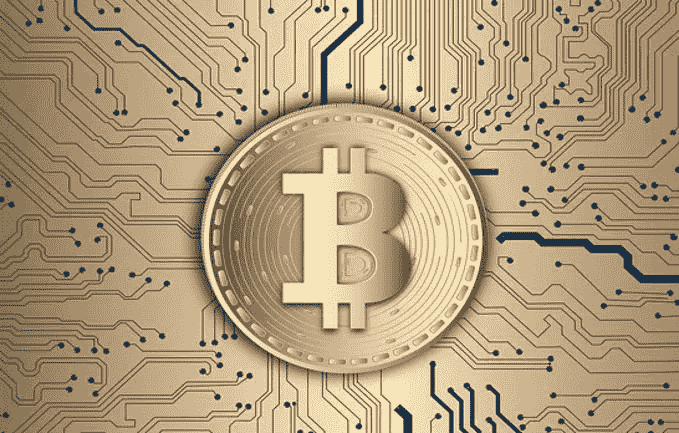

# 比特币经历了 5 年来最糟糕的一周，跌破 4000 美元，Bakkt 正在进行第二阶段

> 原文：<https://medium.com/hackernoon/bitcoin-experienced-its-worst-week-in-5-years-as-it-dropped-below-4-000-and-bakkt-is-on-track-18358f519d25>

**市场状况—2018 年 11 月 26 日** [**BTC**](https://berminal.com/coins/Bitcoin-BTC)**:3976.23 美元(+3.26%)** [**【XRP**](https://berminal.com/coins/XRP-XRP)**:0.373221 美元(+6.65%)** [**ETH**](https://berminal.com/coins/Ethereum-ETH)**:114.62 美元(+3)**

继昨天触及新低后，今天市场一片绿色。然而，在周末，比特币暴跌至 3520 美元的低点，以太坊跌至 98 美元的 18 个月低点。虽然市场今天正在经历一次健康的调整，但短期内仍然看跌。在下一轮大牛市开始之前，比特币预计将进一步下跌。

其他新闻，分叉加密货币[比特币现金 SV 在过去 24 小时内上涨了 80%](https://berminal.com/news/125588/Bitcoin-Cash-SV-Increases-by-80-in-the-Past-24-Hours)。此前，克雷格·赖特证实，他将远离目前与比特币现金的冲突，专注于发展。BCH SV 达到 118 美元的高点，而 BCH ABC 的交易价格为 183 美元。还有，[被黑的加密货币交易所 Coincheck 增加了 Ripple (XRP)和 Factom (FCT)](https://berminal.com/news/125771/Coincheck-ReEnables-XRP-and-FCT-Deposits-and-Purchases) 。在此过程中，该公司恢复了其平台上所有可交易数字货币的存款和购买服务，因为它在 1 月份禁用了这些服务。此前，黑客从交易所窃取了价值超过 5 亿美元的 NEM 代币。从那以后，Coincheck 逐渐重新推出了它的服务。

比特币经历了自 2013 年以来的最大单周跌幅，上周从 5553 美元跌至 3520 美元。比特币在短短一周内损失了近 36%的价值。此前的最大跌幅是在 2013 年 4 月，当时比特币从 165 美元暴跌至 91 美元，市值损失了 44.8%。根据 14 日相对强弱指数(RSI)，比特币目前处于超卖状态。然而，它未能产生强劲的修正反弹，表明下跌可能会继续。([阅读更多](https://berminal.com/news/125260/Bitcoin-Faced-Its-Worst-Week-Since-2013))

**2)根据最近的一份报告，机构交易平台 Bakkt 正在准备推出其比特币期货平台。最近，它将发布时间从今年推迟到了 2019 年初。然而，该平台正处于“第二阶段”，包括与微软和星巴克的合作。Bakkt 将使用微软的云解决方案来构建该平台。巴克特将与星巴克一起创建一个系统，将 crypto 转换为 fiat。此外，顾客将能够使用数字货币支付他们的咖啡。([阅读更多](https://berminal.com/news/125227/Bakkt-Is-On-Track-For-Phase-2-With-New-Partnerships))**

**3)美国俄亥俄州将成为第一个接受比特币支付税款的州。**华尔街日报(WSJ)最近报道称，当地企业将可以在 OhioCrypto.com 注册，也可以用比特币缴纳销售税和员工预扣税。俄亥俄州财政部长乔希·曼德尔(Josh Mandel)表示，该计划将帮助俄亥俄州快速采用加密货币，他曾公开表示，“我确实认为(比特币)是一种合法的货币形式。”用比特币支付的税款将由 BitPay 处理，持有的比特币将被转换成美元。美国佐治亚州、亚利桑那州和伊利诺伊州也在考虑是否接受比特币支付税款。([阅读更多](https://berminal.com/news/125370/Ohio-will-Accept-Bitcoin-Payments-for-Tax-Bills))

[***订阅百慕达简讯***](https://visitor.r20.constantcontact.com/d.jsp?llr=myyhdl6ab&p=oi&m=1131022639884&sit=9ar6aztmb&f=776989ec-8460-43a4-b86a-bcf8f2f1bca7)

[***免费下载百慕大 App***](https://berminal.app.link/medium-post)

*[***百慕大官方电报***](https://t.me/berminal)*

*[***百慕大推特***](https://twitter.com/berminalapp)*

**