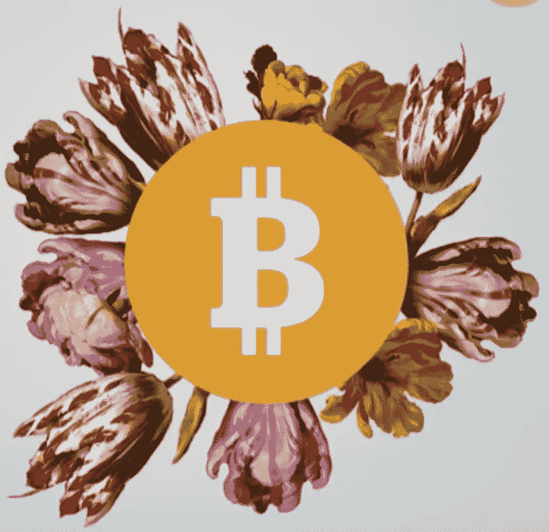
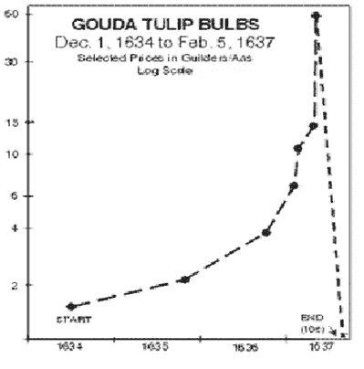
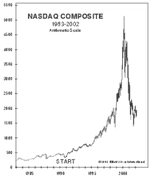
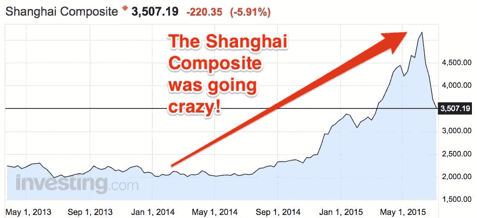
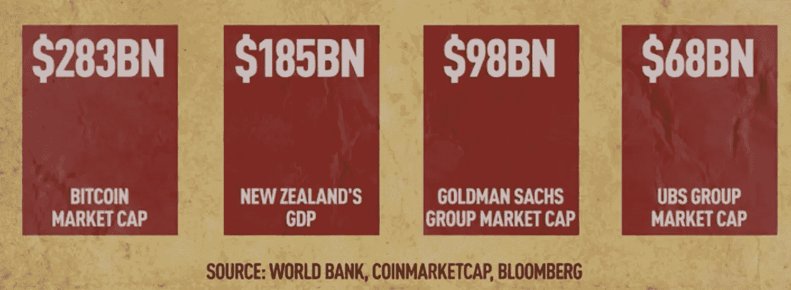
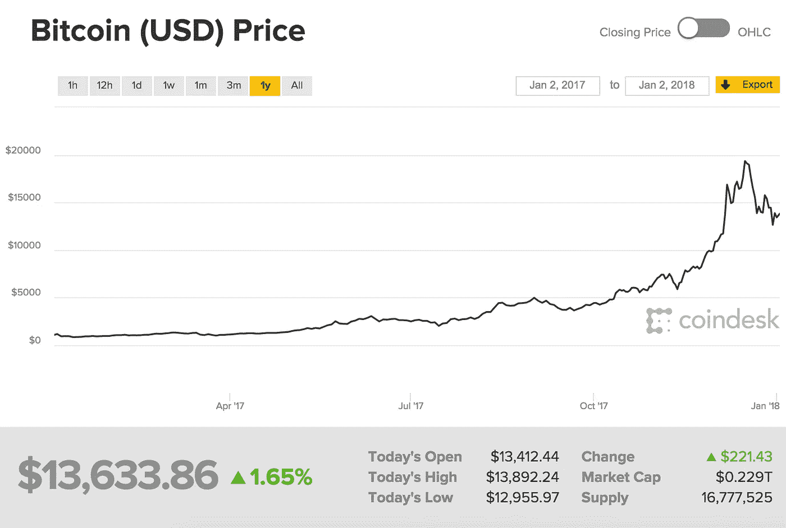

# 比特币解释:泡沫还是……大头针？

> 原文：<https://medium.com/hackernoon/bitcoin-explained-a-bubble-or-a-pin-c6988c71dd5a>

隐花树主要是从过去两年开始增长的。如今，投资加密货币是一种文化趋势。人们为了得到这些孩子，把他们的全部财产都押上了。与人们情感联系在一起的钱(比如他们的存款，或者他们的订婚戒指)正被投入到这个[比特币](https://hackernoon.com/tagged/bitcoin)的池子里。如果你相信的话，伦敦有一所教堂恰好优雅地接受比特币虚拟捐赠！

## 嘿，泡沫到底是什么？

当某种东西的价格不断上涨，然后突然暴跌。这就是所谓的泡沫。第一次出现在 17 世纪:**郁金香泡沫**或郁金香狂热。在荷兰，有一种花的需求量特别大:郁金香。郁金香被从东方航行的商船带到欧洲，这使它成为一种奇异的花。一朵郁金香可能需要几年才能开花。结果，这些花的价格开始上涨，郁金香也随之越来越受欢迎。郁金香在全国引起轰动，郁金香热由此诞生。一度，一个郁金香球茎的售价和一栋房子一样高。1635 年的 150 弗罗林大约相当于今天的 25000 美元。

> 狂热结束、泡沫破裂所需要的，只是人们集体意识到，股票价格远远超过了其价值。事情就是这样。突然需求结束了。砰！泡沫破裂，市场崩溃。比特币可以被称为 21 世纪的数字郁金香。
> 
> 当价格上涨，同时人们愿意花大价钱购买内在价值低得多的东西时，就出现了狂热。

网络热始于 20 世纪 90 年代。令人兴奋的新网站上的股票就像 17 世纪的郁金香。2000 年代，出现了房地产热。我们看到的模式是，泡沫总是会破裂。市场繁荣之后通常是萧条。

比特币被命名为各种事物，从泡沫、郁金香、魔豆工厂、骗局、庞氏骗局。几乎任何东西。一个普通的散户投资者(比如你和我)就是比特币仍在上涨的原因。我们得到了稀薄的资本。我们的音量非常高。我们不能单独推动市场到一个严重的程度，我们在这里是为了长期收益。我们所有人都同时“相信”(投入我们的资金)这个比特币池。我们不知道将会发生什么，但我们无论如何都会去做，因为我们坚信这一点。投资比特币是当今世界的一种说法。这正是 2015 年上证综指暴跌时发生的情况。在中国，有一种庞大的赌博文化。当然，这看起来是一种快速、简单且有风险的赚钱方式。这种股票的价格快速上涨，就像我们在比特币上看到的一样，直到 2015 年。突然，砰！泡沫破裂了。事件发生后一个月内，上海证券交易所的 a 股市值损失了三分之一。这是因为散户投资者突然不再“相信”这只股票。

Source: [https://www.businessinsider.in/Heres-a-simple-explanation-of-why-Chinese-stock-markets-are-in-free-fall-right-now/articleshow/47987952.cms](https://www.businessinsider.in/Heres-a-simple-explanation-of-why-Chinese-stock-markets-are-in-free-fall-right-now/articleshow/47987952.cms)

## 听起来和比特币可笑的相似？

比特币的价值已经让新西兰的 GDP 黯然失色。比波音(世界上最大的航空航天公司)更有价值，比银行业巨头 GoldmanSachs 和 UBS 加起来还大。即使比尔·盖茨和沃伦·巴菲特把他们的财富集中起来，他们也没有足够的钱来购买全世界所有的比特币。这只是因为比特币的供应是有上限的，也就是说，这个世界上的比特币数量是有限的。

没人能说比特币什么时候会占据市场首位。谁也说不准泡沫何时会真正破裂。但是，人们总能从历史中吸取教训。过去有泡沫，现在有泡沫，将来也会有泡沫。当资产价格上涨时，与之相关的风险也会增加。利润总是会自己解决，但亏损却不会。

## 问题不是泡沫什么时候会破裂，问题是什么会让泡沫破裂？

1.  2013 年，Mount Gox(当时最大的[加密货币](https://hackernoon.com/tagged/cryptocurrency)交易所)被黑了 5 亿美元。Mount Gox 控制了约 70%的总交易量。这一打击使他们申请破产。集中式交易所是黑客的主要目标。他们可以窃取价值数百万的比特币。目前，Bitfinex 是世界上最大的加密货币交易所。它控制着加密货币交易总量的 12%。和 Mt Gox 一样，Bitfinex 也被黑了 7200 万美元。
2.  比特币与丝绸之路和阿尔法湾等黑市有关联。丝绸之路恰好是一个在线黑市，也是第一个现代暗网市场，最出名的是一个出售非法药物的平台。作为黑暗网络的一部分，它是作为 Tor 隐藏服务运行的，因此在线用户能够匿名安全地浏览它，而不会受到潜在的流量监控。
3.  由于经济受到“威胁”，主权国家政府对比特币实施了禁令。在中国禁止比特币之后，由于资金突然撤出，比特币价格下跌了 40%-50%。这可能会导致泡沫破裂或崩溃。

反正不是很多人是比特币的粉丝。摩根大通首席执行官杰米·戴蒙称之为“欺诈”，耶鲁大学经济学教授、诺贝尔奖获得者罗伯特·希勒称比特币为泡沫。

也许这里没有所谓的泡沫。我们所认为的泡沫，可能是一根针。因为尽管存在所有这些问题，比特币仍在繁荣发展。比特币已经死了很多次，但它又漂亮地反弹了。其中一个原因是它的供应量有限。世界上只有 2100 万个比特币，它预测最后一个比特币将在 2028 年的某个地方被开采出来。比特币被普遍接受。这使得它成为如此方便的货币。想象一下，一切都是无现金的。没有腐败的空间，因为没有政府会运行这种货币。有消息称，由于腐败严重，委内瑞拉出现了恶性通货膨胀。然而，现在预测任何事情都为时过早。目前，像安全存储加密货币这样的基本行动是一个紧迫的问题，比特币交易也很慢，或者他们征收很高的费用，所以纳米支付还不能完成。

总体而言，有理由预计比特币在短期内将继续波动，中期内比特币价格将大幅下跌。这并不一定意味着比特币在未来将不再被使用，其价格将跌至零。随着主权债务变得更加关键，通胀风险上升，比特币等加密货币可以被视为对传统货币的押注，也可以被视为价值储存手段。

参考资料:

1.  [https://themarketmogul.com/bitcoin-bubble-burst/](https://themarketmogul.com/bitcoin-bubble-burst/)
2.  [https://www . coin desk . com/bit coin-milestones-silk-road-goes-dark-bit coin-survives-its-big-markets-diet/](https://www.coindesk.com/bitcoin-milestones-silk-road-goes-dark-bitcoin-survives-its-biggest-markets-demise/)
3.  [https://www . economist . com/blogs/buttonwood/2017/11/greater-fool-theory-0](https://www.economist.com/blogs/buttonwood/2017/11/greater-fool-theory-0)
4.  [https://www.youtube.com/watch?v=2H6zzWIu7Vk&t = 140s](https://www.youtube.com/watch?v=2H6zzWIu7Vk&t=140s)
5.  https://www.youtube.com/watch?v=ZUjEuifWIV4[t = 526s](https://www.youtube.com/watch?v=ZUjEuifWIV4&t=526s)
6.  https://www.youtube.com/watch?v=uyoABcfdyAA&t = 139s

鳍。