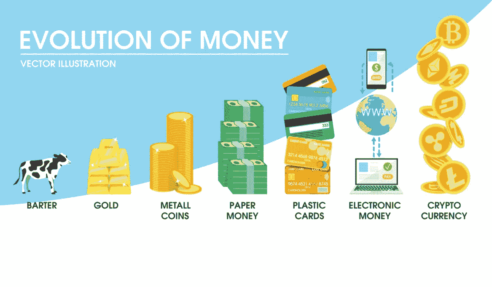

# 比特币:货币是如何进化的

> 原文：<https://medium.com/hackernoon/bitcoin-how-money-has-evolved-cf3923082975>

## 从种子和贵金属到硬币和纸张，数字现金是货币进化的下一步吗？

## **“货币”是如何诞生的。**

在发明现金货币之前，人们依赖物物交换系统，这意味着如果一个人想要某种商品，他必须用自己的商品和拥有他想要的商品的人进行交易。

例如，如果你想要棉花，你发现一个棉农愿意用棉花和你交换皮毛或小麦，你必须拥有这两种商品中的一种来交易。

但是如果你没有毛皮或小麦呢？**简单，没有交易。**

现在，如果你拥有一种稀缺、非常有用且令人向往的商品，会怎么样？你可以通过交易增加你可能拥有的物品数量，因为这个物品可以很容易地与许多不同的商品进行交易。

*截图自视频“* [*从泥土中提炼黄金:黄金泛滥与金钱史*](https://www.youtube.com/watch?index=1&list=PLEzSyUFzZRq0ugDqa6F8aZwPeCs4MBKG_&t=0s&v=QWB2cemZhyI)*”*

现在我们有了货币或金钱，一种非常有价值的交换媒介，人们愿意用它来交换许多不同的商品。它本质上是需要交换资源的人之间的**桥梁**。

货币经历了许多形式，从种子和贝壳到金属硬币和纸张。我们今天使用的货币被称为法定货币，它由绝对没有任何东西支持，但那是另一个故事了。

## 加密货币是货币进化的下一个逻辑步骤吗？

我们似乎正在走向的下一步是数字货币，许多人现在使用手机购买商品，网上商店从实体店手中夺取市场份额，网上银行比传统的实体银行更受欢迎。

所以现在你一定在想:**为什么特别是加密货币？**

嗯:

*   加密货币是无国界的(可以在任何国家访问和使用)。
*   它是不受控制的，建立在对等网络上，确保稳定性，防止任何一个团体拥有控制权(反正是好的加密货币)。这也被称为分散化。
*   交易既快又便宜，速度从加密货币恒星流明 T21 的 4 秒到比特币和以太坊的几分钟不等。
*   Cryptograghy 验证交易，控制额外单位的创建，防止重复消费(它被称为加密货币是有原因的)。

我可以写到下周，但让我们切入正题，现在大量资金正在进入加密货币，他们正在使用以太坊和恒星等区块链来建立他们的商业基础设施，并创建他们自己的加密货币。

比特币目前的功能就像一种数字黄金，例如，交易者根据比特币的价值来评估他们的投资组合，而不是比特币价值多少美元、英镑或欧元等。

如果一个交易员的投资组合的美元价值增加，但 BTC(比特币)价值没有增加，这很少被视为一种收益，因为交易员的最终目标是增加他们的比特币持有量。

## 加密货币的采用正在增长

记得有一次有人问我，加密货币还算不算“东西”。是的，它是一个你可以用来买房子的“东西”，一个你可以用来买兰博基尼的“东西”，一个你甚至可以用来购买微软办公软件或地铁三明治的“东西”。

然而，真正的价值在于加密货币的商业用途，我相信未来我们都会使用加密货币，不管我们是否意识到这一点。

以太坊(ETH)和恒星流明(XLM)等区块链将用于支持分散化应用和智能合同，并作为未来企业的软件和操作系统的主干。

一个很好的例子是软件即服务(SaaS)公司，他们开发商业软件:

*   当您登录网站并创建帐户时
*   在网上购物或付款时
*   当您将视频上传到视频共享网站时
*   当你创建一个在线博客或网站时

所有这些流程都由需要付费的软件**驱动**，该公司要么创建自己的内部解决方案，要么使用 SaaS 公司的第三方解决方案。

要获得这项服务，你要么按月付费，要么一次性付费，要么 SaaS 公司从客户平台上发生的任何货币交易中抽取一定比例的佣金。

加密货币已经做到了这一点，区块链开发者正在创建服务，用户要么支付(特定加密货币)费用来使用服务，要么必须持有或持有一定数量的本地令牌。

这些新区块链公司实施这一战略的另一种方式是以区块链本币收取交易或“汽油”费用。

如果这些服务能够被采用，那么人们将会在不知不觉中与加密货币进行互动。

## 最后的想法

比特币和加密货币似乎是人们交易和交换价值的下一步，然而我相信我们只是触及了表面，仍然没有发现加密货币的真正潜力。

## **我希望你喜欢这个故事，请随时查看下面任何有用的资源:**

你可以在世界任何地方使用[**【CEX】**](https://goo.gl/CPCJoN)购买比特币、以太坊、Ripple、比特币现金、比特币黄金、Dash、Zcash 和恒星流明

在欧洲任何地方居住，都可以从 [**BitPanda**](https://goo.gl/Su9BSR) 购买比特币、以太坊、IOTA、Komodo、Dash、比特币现金和莱特币。

如果你正在为你的企业或项目寻找网站设计师，请查看**[**Litework Design。**](https://liteworkdesign.com)**

**也可以在 [**推特**](https://twitter.com/CryptoniteTweet) **上关注我。****