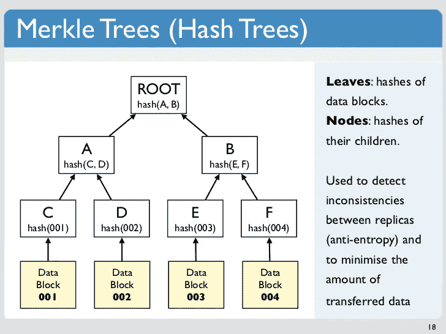

# 比特币是一种基于区块链的加密货币！但是它是如何工作的呢？

> 原文：<https://medium.com/hackernoon/bitcoin-is-a-cryptocurrency-based-on-a-blockchain-but-how-does-it-work-7dbed28dedcc>

区块链诞生于中本聪的脑海中，他是一个天才的化名的身份不明的比特币(T3)的创造者。Satoshi 可以是一个人，也可以是一群人。

中本聪在 2008 年将比特币描述为“纯粹的点对点版 [**电子现金**](https://en.wikipedia.org/wiki/Electronic_cash) ”

他创建区块链的动机是为了取代可信的第三方。

# 怎么会？

区块链是一个公开的安全数据库。这是一份记录每次进出信息的清单。这个名单还在不断增加。

它提供了在任何给定时刻谁拥有什么的证据。此外，这种分类账在许多电脑上重复，比特币的节点。《账本》在全世界公开发行

区块链的主要区别是:没有金融中间人或中央审查机构。

这意味着，在区块链的过程中没有可信的第三方。该系统的安全性由其共识机制来保证，该共识机制是网络节点的系统，当从一个人到另一个人有新的转移顺序时，这些节点工作并同意如何更新区块链。

让我们试着用比特币的例子来解释这个复杂的概念。

# 比特币是如何运作的？

谁给谁什么？

詹姆斯想给玛丽寄钱。

首先，他们都需要有比特币“钱包”。这是一个能让你进入区块链的软件。它可以比作互联网的浏览器。钱包之于比特币，就像 Mozilla Firefox 之于互联网，是一扇接入之门。

然后，詹姆斯使用他的密钥来订购交易。加密密钥将明文转换为密文，反之亦然。密钥是私有的，可以确保安全通信。这是密码运算的核心部分。

主要是，詹姆斯的钱包要求通过从他的钱包里取钱到玛丽的钱包里来改变区块链。

**他的订单在块**中加入其他订单，包含前一个块的加密哈希、时间戳和交易数据。这意味着一个块链接到其他块，不能单独修改。

# 为什么？

因为，区块链是一个去中心化的、分布式的和公共的账本。它记录了许多电脑上的交易。因此，如果你试图改变一个记录追溯，这将改变几个块和破坏整个网络。

回到我们的交易，詹姆斯正在点菜。**订单由各个节点加入网络进行分析。**他们检查账本，检查詹姆斯是否真的有他想花的比特币。

如果一切正常，称为矿工的专家节点将把詹姆斯的订单与其他类似的交易打包，以创建一个新的块。

T **这个块是标有日期的时间，它被添加到区块链并加入网络。**

**最后，玛丽收到了詹姆士的钱**

# **继续:**

1.詹姆斯想给玛丽寄钱。

2.他的订单是加入其他订单在一个街区

3.订单加入网络，由各个节点进行分析

4.该块标有时间和日期，它被添加到区块链并加入网络。

5.最后，玛丽收到了詹姆斯的钱

在此过程中，每个事务都会生成一个哈希值。该哈希值是将与其他哈希值绑定以形成块的记录。用于创建块的所有事务和散列值的模式被称为“Merkle 树”。

下面是一个比特币交易的流程。建造区块链是为了在旧街区上增加几十个新街区。区块链不会覆盖旧块，而是用新块的记录来扩展，以保证整个系统的安全。

这种操作称为采矿，主要在采矿池中进行。第一个比特币挖矿池是 [**Slush Pool**](https://slushpool.com/home/) 。这是先进的，但也是初学者的伟大游泳池。

我们看到，区块链技术允许在没有任何中央审查机构的情况下进行交易。

因此，对于被统治者来说，这可能是一个从他们的金钱中收回一些权力的好机会。

# 但是…

# 如何确定詹姆斯有他要转给玛丽的比特币？

区块链中的每条记录都是公开的，每个数据块都由加密哈希、时间戳和交易数据链接在一起。因此，詹姆斯的交易历史是公开的，可以在过程中检查。每一笔比特币交易都可以被网络中心追踪。简单来说，就是有可能知道网络上每一个比特币的每一笔交易。

# 如何确定詹姆斯只会花这些比特币一次？

区块链在设计上是安全。Merkle 树和节点的原理、块的相互依赖性以及记录的延伸(而不是覆盖)允许区块链从一开始就跟踪每一个进出的比特币。

理论上，詹姆斯似乎不可能花他的比特币两次。

# 没有可信的第三方，詹姆斯和玛丽的钱包存放在哪里？

到处都是！这些分类账是公开分发的，它们在世界各地成千上万的计算机上被复制。

这意味着你钱包里的余额不是存放在一个地方，而是存放在成千上万个地方，以确保高度的安全性。

用图片解释 blochain 概念的短片

多好的话题！写完这个故事后，我想到了很多问题…

# 区块链是任何交易的未来吗？

# 银行死了吗？

# 区块链是未来保护每笔交易匿名的方式吗？

# 区块链如何拯救或毁灭世界？

# 为什么比特币是一种愚蠢的投资？

# 为什么矿池集中度是比特币的致命弱点？

关于我们的未来和我们孩子的未来的有趣问题！

作为一个有责任感的公民，我会在这些问题上投资，我会对每一个问题给出一个诚实的有据可查的答案。

感谢您的阅读。我希望它能帮助你看透这个有争议的话题。

喜欢就分享给朋友吧。

永远鼓掌

亲切的问候。

亚历山大