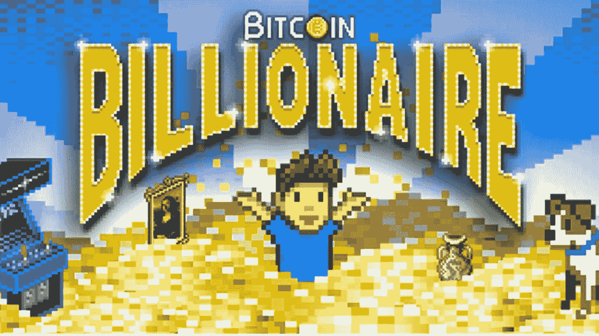

# 比特币只是一个闲置的游戏

> 原文：<https://medium.com/hackernoon/bitcoin-is-just-an-idle-game-6eb87a79b39>

> 声明:这是一个类比，而不是深入的批评。本文的观点是通过一个平易近人的类比来解释比特币挖矿。

在我开始之前，应该指出的是，你至少需要对什么是空闲游戏有一个基本的了解，所以请允许我无耻地推托并让你看我关于空闲游戏的文章[这里](/@cbwu/how-one-developer-toppled-an-empire-for-now-46e90db5b0eb)。

[*Bitcoin Billionaire*](http://www.noodlecake.com/games/bitcoin-billionaire/)*: An idle game based off of Bitcoin*

我最近深入研究了什么是闲置游戏，以及它们的经济和激励机制如何吸引玩家继续玩下去。我这样做是基于[以太网](https://ethergoo.io)，第一个[区块链](https://hackernoon.com/tagged/blockchain)闲置游戏。由此，我产生了一个挥之不去的念头。难道[比特币](https://hackernoon.com/tagged/bitcoin)不就是一个闲置的游戏吗？不是传统意义上的增量(不断膨胀的生产规模)，而是减量。为了理解这种类比，我将讨论闲置游戏的元素如何反映比特币挖掘。

**Cookie Clicker 如何工作**

要获得 cookie，只需运行 cookie clicker 网站，如果你像我一样懒，运行一个自动点击脚本([这是我最喜欢的 mac 软件](http://www.murgaa.com/auto-clicker-mac/)),然后坐在那里，等待甜蜜的 cookie 财富滚滚而来。随着你的饼干财富积累，你会想提高产量，所以让我们继续购买一些单位。从光标到奶奶，再到农场，我们现在拥有越来越高的生产能力，我们的饼干财富也在不断增长。

**比特币挖矿如何运作(简化到难以置信)**

要赚取比特币，只需运行一个程序，比如 [BFGMiner](https://github.com/luke-jr/bfgminer) ，然后坐在那里，等待甜蜜的比特币财富滚滚而来([免责声明](http://fortune.com/2018/03/16/bitcoin-mining-cost-profitability/):除非你有一个很好的设置，否则不会，但为了这个类比，我将忽略它)。随着你的比特币财富积累，你会想提高产量，所以让我们继续购买一些单位。您的挖掘将从您的 CPU(计算机中的处理器)开始，但您将希望升级到 GPU(计算机中的图形处理器)。最终，你会升级到 ASIC，这是一种为特定用途而不是像 CPU 那样的通用电路而构建的电路。现在你需要做的就是提高产量，看着你的财富增长(同样，它可能不会)。

**两者分叉的地方**

当然，一个闲置的游戏和比特币挖矿并不是一个完美的类比，但它确实揭示了到底在做什么。两者都是基于可以通过增加产量来优化的任意任务。Cookie clicker 和其他闲置游戏都是通过点击来门控的，因为你需要一些措施来防止无限生产。比特币受到任意复杂的数学问题的限制，而处理能力是用来解决这些问题的。分歧发生在三个关键领域。

*   首先，在 cookie clicker 中，你不会与其他点击者竞争来获得难以捉摸的 cookie，而在比特币挖掘中，你会与其他矿工竞争来首先解决算法。
*   第二，饼干点击器是一个增量游戏，你会赚得越来越多，直到无穷。有了比特币，随着难以解决的任意问题越来越难，你赚的越来越少。
*   第三，比特币挖矿用于确认网络上的交易，增加了一项重要功能，即如果没有矿工的工作，系统将无法运行。Cookie clicker 没有这样的功能，如果世界上的每个人都停止使用 cookie clicker，它会破坏运行游戏的系统。

但真正的主要区别是，比特币是建立在区块链之上的，它允许对所有交易进行分类，这样我们就可以为每枚比特币赋予价值。Cookies 没有赋值，因为它们的生产是无限的，并且在区块链内是不安全的。

**这告诉我们什么**

比特币挖矿当然比这里展示的更复杂，但我认为创造相似之处来帮助揭开这个空间的神秘面纱并拓宽对系统如何工作的理解是很重要的。如果你想更深入地了解比特币挖矿，bitcoinmining.com 的[是我用来帮助自己熟悉这个领域的一个来源。此外，这种类比并不是比特币独有的，而是可以应用于一般的加密挖掘。](https://www.bitcoinmining.com/)

希望这个类比可以通过将它放在许多人都玩过的游戏类型的背景中来揭示比特币挖掘是什么。希望有人会做一个饼干硬币，我们都可以通过点击来挖掘，这样我们就可以在这个过程中增加一点乐趣。所以下次有人问你有多少比特币的时候，只要回答“我有几十亿的饼干，你呢？”。