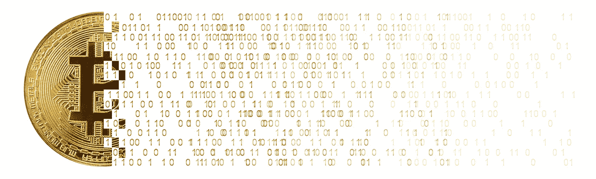

# 比特币是货币

> 原文：<https://medium.com/hackernoon/bitcoin-is-money-e559d9885a1>

*TLDR:* 货币是记录经济参与者之间交换的*价值*的工具。记录这种价值的一种方法是用数字分类账。比特币是第一个想出如何防止国家摧毁它的数字账本。比特币的通缩货币政策为国家法定货币的通胀范式提供了另一种选择。

# 钱是什么？

*金钱是艺术*金钱试图将一个人的主观体验转移到另一个人的头脑中:对某样东西的估价体验。不管多么不完美，钱让一个人回答另一个人:这对你来说值多少钱？

*金钱是真理。为某种商品付款是对我对该商品价值的声明。它不可能是伪造的，因为支付行为需要相应的价值牺牲。任何试图对产品收费的企业都明白用户的善意谎言“我重视这个”和客户通过付款证明的真实声明“我重视这个”之间的区别。*

*金钱是一种测量工具。它衡量经济参与者之间交换的价值。这种测量可以用实物来进行:石头、贝壳、珠子或硬币，每一种都作为一种记忆手段来跟踪交换的价值。或者，测量值可以写下来:石板上的划痕，羊皮纸上的墨水，或者屏幕上的像素，就数字货币而言。*

*钱就是信息。*我们的美元账户余额只是由负责我们金融基础设施的人员记录在银行数据库中的数字。这种书面财富没有物理表现。我们接受这些数字作为交换财富的有效衡量标准是一种集体幻想。这种幻想受到我们共同的经济和安全利益的激励，如果这些利益落空，就会受到国家暴力的威胁。

如果我们接受金钱可以通过志同道合者之间的交易记录来实现，那么任何群体都有能力开创自己的事业。

# 简单硬币——SMP

让我们现在就创造我们自己的钱…

# 简单硬币分类帐

> **交易 1**
> 
> 从创世纪到读者:50
> 
> **交易二**
> 
> 从创世纪到作者:50

上面我们已经记录了事务 1 和事务 2，其中我们为每个人创建了 50 个“来自创世纪”的 SMP，这意味着我们简单地将它们写入存在。我们可以这样做，只要 SMP 币的用户(你和我)同意这是一种分发我们新货币的合法方式。

让我们使用它。让我以 25 便士的价格从你这里买一些比萨饼。以下是更新后的 SMP 硬币分类账，反映了我们购买披萨后的交易历史。

# 简单硬币分类帐

> **交易 1**
> 
> 从创世纪到读者:50
> 
> **交易二**
> 
> 从创世纪到作者:50
> 
> **交易三**
> 
> 从作者到读者:25

交易 3 花了我的 25 个 SMP 币，把它们寄给你读者，虽然我还在等我的披萨…

这里要注意的一个有趣的点是，这个分类账不记录账户余额，只记录交易历史。账户余额可以从该交易历史中导出。例如，在我购买披萨后，我(作者)的账户余额是 50–25 = 25，而你(读者)的账户余额是 50 + 25 = 75。

许多人可能会觉得这个例子很无聊，但这样的记录足以维持原始货币。更严肃地说，这种基金的第一个挑战是扩大其网络。随着网络中经济参与者数量的增加，其价值也会增加。随着价值的增加，对手会变得有动机去窃取资金，试图控制其账本，或者在像美国政府这样的国家对手的情况下，关闭新贵竞争对手。

这也是之前所有尝试推出非国有数字货币(包括电子黄金和自由储备)的最终命运。许多人成功地扩大了他们的网络，足以引起美国政府的愤怒，美国政府进而关闭了管理这些账簿的公司。这些公司成功解决了营销挑战，但没有人能够克服数字货币通过国家级行为者审查所必需的安全挑战……直到比特币。

没有“一个比特币”这种东西。它在物理世界中并不存在，也没有一个或多个数字文件可以让你指着说这个文件是我的比特币。比特币实际上是“写”在数字账本中的交易历史，本质上与上面写的原始 SMP 硬币账本相同。

比特币、我的 SMP 账本和其他被美国政府消失的私人资金账本的区别在于，没有单一实体被委托维护比特币账本的安全性和有效性，因此极难阻止。这就是我们说比特币是一种去中心化货币的意思。比特币的主要创新是能够共同维护一个不可变的书面经济交易分类账，而不必信任中央权威机构来保护或验证它。

鉴于这一事实，我们听到的许多针对比特币的批评，即它比其他数字货币慢，交易费用太贵，在很大程度上是不相关的，因为这些都是有意识地做出的明确权衡，以实现比特币的主要目标:一个去中心化、不受审查的书面交易记录，甚至不受国家级对手的影响。

随着时间的推移，比特币将在其坚不可摧的安全基础上迭代解决这些弱点，而竞争对手将无法反向解决它们所基于的更弱的安全假设。

# 比特币是自由

不受任何人控制的分散的钱给了我们什么？进行通胀或通缩货币政策孰优孰劣的实验，让不同的货币制度相互竞争，看哪一种对人类最有效的能力。

没有人来管理比特币的货币政策，或滥用它。其 2100 万比特币的硬限制被编码到定义它的软件协议中。这种货币模式提供了一个自由市场，替代了伴随我们成长的政府支持的通货膨胀的法定货币。因为各州不能关闭比特币分类账，他们将不得不与之竞争，要么更好地维护他们的用户群，要么眼睁睁地看着比特币成为一种高级货币。

比特币看涨者认为，通货膨胀的货币体系阻碍储蓄，抬高资产价格，扭曲战争和无节制消费的真实成本，通货紧缩的稳健货币是答案。由于比特币的去中心化，我们终于有了一种货币，它既满足了生存所必需的营销挑战，也满足了安全挑战，并给了我们一个机会来证明他们是否正确。

*原载于 2018 年 11 月 13 日*[*cryptograf . io*](https://cryptograf.io/blog/2018/11/13/bitcoin-is-money/)*。*