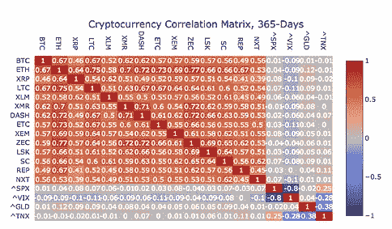
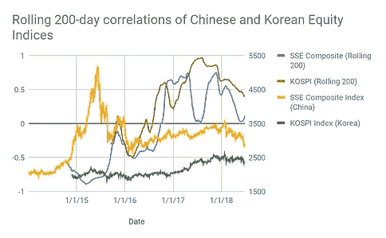

# 比特币不再是一种不相关的资产

> 原文：<https://medium.com/hackernoon/bitcoin-is-no-longer-an-uncorrelated-asset-a1bf38f10376>

加密货币被宣传为一种不相关的资产类别，应该被拥有以抵消传统投资桶中的潜在下跌。到目前为止，通过展示[比特币](https://hackernoon.com/tagged/bitcoin)相对于股票和固定收益，以及黄金、房地产和其他商品，已经证明了缺乏相关性。尽管这种分析在技术上是正确的，但这种分析是错误的。比特币只存在于 2009 年，当时全球市场触底，开始了新的周期；持续了九年多的牛市。此外，比特币是这一资产类别中唯一有足够数据开始衡量的资产。可测量的数据是针对今天市值只有 1000 亿美元、日交易量约为 3B 美元的资产(最好的猜测，因为大部分交易量是场外交易)。就在 18 个月前，该公司市值仅为 150 亿美元，日成交量为 2 亿美元。这没有足够的统计意义来衡量传统的投资组合。至于整个加密货币市场，它只有 2500 亿美元的市值。在这一资产类别中有一组完全不同的数字资产，从数字货币到网络燃气，到公用事业代币(与奖励积分没有区别)，到资产支持代币，甚至代表风险投资所有权的代币。​

我一直认为，比特币和其他数字资产最终会变得与传统市场更加相关。只需要具备三样东西:

1.  市值和流动性的增长
2.  散户投资者采用
3.  实用工具令牌的实际使用案例

仅在去年，这三个问题就变得很明显。随后，相关性开始变得明显。

从下面的图表中可以看出，大多数分析师只是将比特币和其他数字资产与美国股票、债券和黄金进行比较。

*图表由 Sifr Data 提供*

然而，也有其他市场显示出与比特币更高的相关性。韩国和中国都是数字资产的早期采用者。韩国 KOSPI 和比特币之间的强相关性在 2016 年开始出现，此后不久又出现了上证综指(SSE)之间的相关性。由于韩国市场表现优于大多数全球股市，这种相关性在 2017 年全年都与韩国综合指数保持一致。韩国以及其他发达市场的贸易风险促进了数字资产市场的强劲发展。如果你将比特币与上证综指相比，这种相关性在 2016 年出现，并在 2018 年 6 月 30 日变得更强。2018 年年初至今，上交所市场和比特币之间的关联度为 72%，因为表现不佳的中国经济在本地股票和数字资产中创造了避险交易。

由于加密货币在中国的早期应用，以及由于购买美元的能力有限，观察到的从人民币到 BTC 的多元化趋势，BTC 和中国市场之间的整体关系可能是相关的。最重要的是，BTC 的很大一部分是在中国赚取的，因为中国的采矿业务占据主导地位，这导致了中国比特币交易量的巨大。

**中国市场及其对比特币的影响**

上证综指是 2018 年上半年表现最差的国家指数，主要是由于美中贸易政策的紧张局势。两国之间的关税进一步升级存在不确定性，这可能会推低指数，或潜在地将市场保持在底部。PBOC 在 6 月 28 日会议后发表的温和声明有助于平息市场，并推动上证指数在 6 月 29 日上涨 2%。与此同时，加密市场也获得了支持，从 6 月 29 日开始持续到 7 月 2 日，价格上涨了 5-10%。

大多数发达国家 10 年的低利率对新兴市场产生了负面影响，新兴市场已经出现了通胀和汇率波动，尤其是在大宗商品生产国。中国的通胀率保持稳定，目前在 2%左右，尽管其他新兴市场出现波动，如巴西，该国在 2015 年和 2016 年经历了 9%的通胀，在过去 18 个月里稳定在 3.5%的年化率。

鉴于中国已经处于熊市，加上美国利率上升的可能性、进一步的贸易紧张局势和全球通胀风险，中国有可能经历国内股市的进一步回调。如果相关性成立，这些条件可能会成为比特币和数字货币市场在重新进入牛市之前需要克服的障碍。

*免责声明:本评论仅作为一般信息提供，绝不作为投资建议、投资研究、研究报告或建议。对本评论中讨论的证券进行投资或采取任何其他行动的任何决定可能涉及本文未讨论的风险，此类决定不应仅基于本文包含的信息。*

*本信息中的陈述可能包括前瞻性信息和/或可能基于各种假设。此处表达的前瞻性陈述和其他观点或意见是在本出版物发布之日做出的。实际的未来结果或事件可能与预期的有很大不同，并且不能保证任何特定的结果会发生。本文中的陈述可能会随时更改。Theseus Capital 不承担更新或修改此处表述的任何声明或观点的任何义务。*

*在考虑本注释中包含的任何绩效信息时，应注意过去的绩效并不能保证将来的结果，也不能保证将来的结果会实现。此处提供的部分或全部信息可能是或基于观点陈述。此外，此处提供的某些信息可能基于第三方来源，这些信息虽然被认为是准确的，但尚未经过独立验证。Theseus Capital 和/或其某些关联公司和/或客户持有，并且将来可能持有与本评论中讨论的证券相同或基本相似的证券的财务权益。对于此类金融权益的盈利能力，无论是现在、过去还是将来，都不做任何声明，Theseus Capital 和/或其客户可以随时出售此类金融权益。此处提供的信息无意也不应被解释为出售或购买任何证券的要约。本注释未经任何监管机构审核或批准，且在编制时未考虑可能收到本注释的个人的财务状况或目标。特定投资或策略的适当性将取决于投资者的个人情况和目标。*