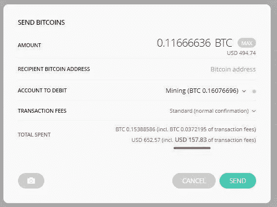

# 比特币是过时的技术。这三种选择应该引起你的注意。

> 原文：<https://medium.com/hackernoon/bitcoin-is-outdated-tech-these-3-alternatives-should-be-on-your-radar-57cf806d34df>

先行者和快速跟随者——哪个更有优势？当比特币在 2008 年首次被提出时，它是革命性的。人们第一次可以信任一种没有银行或政府支持的货币。

快进到 2018 年，比特币已经远远超过每枚 1 万美元。[超过 87%的人听说过比特币。](https://steemit.com/bitcoin/@jrcornel/how-many-americans-have-heard-of-bitcoin-check-out-this-survey-to-find-out) *我们已经跨越了鸿沟。*

The first iPhone was released shortly before bitcoin was proposed.

**但是比特币已经有将近十年的历史了。**当比特币诞生时，应用商店才刚刚起步，便携式 DVD 播放器仍被用于长途汽车旅行。2018 年的技术比十年前有了长足的进步。加密技术也不例外。

现在有超过 1500 种比比特币新的加密货币。这些硬币效率更高，速度更快，并提供了比特币所缺乏的功能。在过去的一个月里，比特币的市场份额从 56%下降到 33%。

Chart from [https://coinmarketcap.com/charts/](https://coinmarketcap.com/charts/) show bitcoin’s decline in dominance over the past month.

这不是第一次先行者受到新技术的威胁。Altavista 让位给了谷歌。Myspace 落到了脸书手里。**先行者输给创新型快速追随者的历史由来已久。**

[研究表明，某个领域的先行者失败的可能性是紧随其后的企业的 6 倍。](https://www.forbes.com/sites/avaseave/2014/10/14/fast-followers-not-first-movers-are-the-real-winners/#63cd95a314cc)

比特币已经完成了艰难的开拓工作，现在闸门为一系列现代竞争者打开了。

那么，如果比特币只是加密货币的开始，接下来会发生什么？为了理解什么技术可以超越比特币，我们需要理解它目前的不足之处。

# 比特币及其区块链存在严重缺陷

1.  **交易速度**

比特币网络一段只能处理 7 笔交易。这意味着全球每秒钟只有 7 个人可以使用比特币进行买卖。相比之下，visa 每秒处理 24000 笔交易。低交易速度限制了比特币作为货币的有效性。这也伤害了那些将比特币视为价值储存手段的人。当太多人购买或出售比特币时，交易所会关闭，基金会在等待数小时(甚至数天)后被套牢。

[网络拥堵导致费用异常高昂。12 月底，每笔交易的费用是 37 美元，比电汇的费用还要高。](http://www.businessinsider.com/bitcoin-payment-mining-fees-hit-new-high-2017-12)

**2。缺乏隐私**

你对全世界都知道你银行账户的价值感到放心吗？如果全世界都知道你把资金送到哪里，从谁那里收到资金，那该怎么办？比特币钱包与地址哈希(随机的字母序列)绑定在一起。一旦钱包的主人被确认，任何下载比特币账户的人都可以看到他们之前的所有交易和未来的所有交易。此历史记录不能删除或更改。

**3。可编程性**

比特币被设计成一种数字货币。这项技术只允许基本的编程。这阻止了比特币在更复杂的情况下使用，如智能自动执行合同。你可以把它想象成一台计算器，而不是一台电脑。可编程区块链(以太坊是最广为人知的例子)有可能大规模破坏一系列领域。

# 新硬币正在引入令人惊叹的新技术

*这些硬币中的许多都远远超过了比特币目前的能力。*以下是一些最令人印象深刻的竞争者:

**恒星流明(XLM)
优点:**可伸缩性惊人。伟大的伙伴关系。清晰的用例。

你可能听说过一月初的 Ripple amazing 集会。恒星流明是较新的，100%分散的纹波版本。Ripple 的首席执行官创建了 Stellar Lumens，以解决他在 Ripple 中看到的缺陷。它可以毫不费力地每秒处理 1000 笔交易，只需几便士就可以转移数百万美元。它的投资者不是别人，正是 Y-Combinator 的首席执行官山姆·奥特曼和 Stripe 的首席执行官。

**RaiBlocks (XRB)
优点:**可伸缩性惊人。即时交易。零费用。

Raiblocks 是一种更新的硬币——最近几个月才出现。它使用了一种基于有向无环图的新架构，只有少数加密货币采用了这种架构。这使得它比区块链应用程序具有无限的可伸缩性。他们的发展方法是“做好一件事”。在这种情况下，他们的目标是成为比特币的本来面目:在全球范围内即时、零费用地发送货币。

**EOS
优点:**可扩展和可编程。黑仔以太坊

EOS 被戏称为“类固醇上的以太坊”。EOS 背后的开发者声称，EOS 区块链是完全可编程的，将消除交易费用，并有能力处理每秒数百万笔交易。他们的区块链将于 4 月上市。

# 比特币将不得不大幅加快发展速度，否则就会被超越。

由于缺乏社区支持，比特币原定于 11 月进行的最后一次重大更新被取消。11 月份的更新旨在引入 Segwit2x，这是一种增加每个块上可以记录的交易数量的方法。没有 Segwit2x，比特币的网络发展越来越慢。

闪电网络——比特币对规模扩张的神话般回应，在实现之前面临许多未知。在它可以预见地解决比特币的一些缺点之前，更多的测试是必要的。

与此同时，像 EOS、XLM 和 XRB 这样的后起之秀已经准备好在速度和功能上胜过比特币。我们还得看看这些后起之秀是否会占领市场。我们唯一可以确定的是，整个加密货币空间正在快速迭代。最终胜出的加密货币可能还没有被创造出来。

## 喜欢这篇文章吗？我们现在有电报信号组了！

我们发布**简单有效的交易信号**。所以你可以花更少的时间做技术分析，花更多的时间**得到结果。**
👉[https://t.me/coinandcrypto](http://telegram.coinandcrypto.com/medium)

