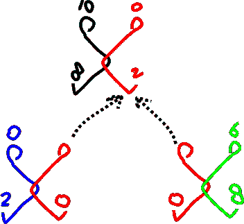

# 比特币大材小用了

> 原文：<https://medium.com/hackernoon/bitcoin-is-overkill-ffe2f433a450>

## 两个相互冲突的决定如何让比特币的设计失衡

比特币设计背后的两个决定——事实上，所有基于区块链的加密货币——朝着相反的方向发展。一方面，我们希望进行分发，另一方面，我们需要访问所有事务。这造成了一种内部压力，需要相当多的技术创造力来克服，才能让比特币成为或多或少实用的解决方案。

# 钱就是记账

我们知道钱是硬币和钞票。但是现存的大部分钱是摸不到的，也没有重量。想想你的银行账户。当你把一笔钱转给别人时，基本上银行会从代表你拥有的钱的数字中减去这笔钱(*借记*你的账户)，然后把它加到代表收款人的钱的数字中(*贷记*他的账户)。

这样的钱叫做*经钱**。你的账户叫做*活期存款*(你的钱可以随时支取)。在所谓的*交易*中，贷记和借记操作一起执行，保持平衡。*

*在一个理想的世界里，每个人都会非常诚实，每个人都会记录自己的突变。一份简单的费用和收入清单就可以了。或者，更好的是，一个带有本地管理的应用程序。当 A 向 B 支付 x 美元时，他们通过应用程序相互联系，程序进行计算，更新记录。*

*实际上是银行来管理。我们只是彼此不够信任！而且有本地管理的应用很容易被黑。*

> *[【1】](#_ftnref1)不要和*法定货币*混淆。后者指的是没有内在价值的货币(例如，相对于金币)；前者(即圣经的钱)是指其形式:现金，或只存在于书籍。*

# *交易顺序*

*每个突变(借方或贷方)都必须基于前一个突变的结果来执行。从数学上讲，这不是任何突变集合的要求(6+3–1 与 3–1+6 的结果相同)。然而，随着交易随着时间的推移而流入，一个人的账户在某个时间点可能会有负值(在系列 0–1+3+6 中，最终结果仍然是 8，但在第一步之后我们有-1)。*

*根据银行和账户持有人之间的协议，负值在一定程度上是允许的(并且是有代价的！).此外，银行可能会执行一次接一次的快速交易，绕过或忽略负值。这当然相当于一些重新排序。*

# *n 对 n 通信*

*任何账户持有人都可以向任何其他账户持有人汇款或收款。银行必须为其账户持有人提供一种方式，以便他们相互汇款。*

*当为 n 个参与者建立一个信息基础设施时，原则上每个人都可以与其他人通信，原则上必须创建 n * n-1 个通道。这已经很多了。我们可以通过创建一个带有鸽子洞的中央空间来节省工作。任何想传递信息的人，都要在正确的信箱里留一张便条。n 个鸽子洞而不是 n * n-1 个频道！*

**

*Pigeon holes are a honeypot for the unscrupulous.*

*这正是数据库的含义。必须交换的信息的中心存储。*

*数据库是一个了不起的解决方案，但也有自己的问题。*

1.  *这样的信息收集对于那些利己心大于顾忌的人来说是很有吸引力的；*
2.  *没有额外的规定，每个人都可以阅读任何东西。整个科学已经建立，以确保收集到的东西，再次分开，每个人都整齐！*
3.  *信息的集中存储使一个组织变得脆弱，因为所有相关人员都可能受到一次黑客攻击。*
4.  *通过迫使来自许多方面的交流进入同一个结构性的紧身衣，*的意思是*经常被妥协。*

# *中央权力机构*

*作为中央解决方案，数据库通常由中央机构部署。在圣经货币的情况下，这给了银行机会(和义务！)来强制执行*

*   *交易的正确排序(例如，拒绝超过账户金额的提款)*
*   *突变只在正确的交易中进行，因此平衡得以保持。*

# *比特币*

*Satoshi Nakomoto 非常正确地指出，关于通过互联网进行的资金转移，信任的粒度太大，尤其是这种信任太昂贵。20 到 30 美分的交易费是不可能实现微支付的！虽然当代互联网上的密集合作和交流确实需要小额支付。*

*他将这种情况的原因归结于银行的垄断和支付并非不可逆的事实。银行该走了！他著名的比特币就是其成果。*

*移除中央权威的一个直接后果是，没有人允许帐户具有负值。这使得对交易进行排序以使每个结果总是积极的要求成为必要。*

*在理想的情况下，我们可以完全分散记账。其实这就是我们用现金做的事情！在某种程度上，如果你给我一张 10 美元的钞票(它没有内在价值:它只是*代表*价值)，当你借记你的钱包时，我贷记我的钱包。*

*然而，从广义上讲，Nakomoto 保留了解决 n 对 n 通信问题的数据库解决方案。他的解决方案是*分散数据库*(而不是分布式)，这意味着它的副本可以在互联网上的任何地方。每个持有副本的节点将执行一项类似于银行以前所做的任务。显然，这需要某种形式的同步。*

# *交易顺序*

*让多个节点复制相同的工作会使排序问题变得更大。事务可能以不同的顺序到达不同的节点。节点会因此对世界的状态有不同的看法，使得同步更加困难[**【2】**](#_ftn1)。*

*时间戳事务不会解决这个问题。当一个事务到达时，您如何知道另一个事务是否会晚一点到达，但时间戳会更早？Nakomoto 通过连锁交易解决了这个问题。每个事务至少需要两个以前的事务(每个突变一个)。先前的交易代表处于某一状态(具有某一值)的账户。*

*实际上，这相当于创造了一枚硬币——尤其是结合账户不能有负值[**【3】**](#_ftn2)的要求。链式交易为“硬币”提供了一条路径。*

> *分歧还会有其他原因，但这与此无关。*
> 
> *[【3】](#_ftnref2)人们可能想问的一个有趣的问题是:曾经有过负值的硬币吗？你可以用这种硬币来转移价值:你不会收到一枚价值为正的硬币，而是会送出一枚价值为负的硬币。乍一看，人们可能会认为这是行不通的。没有一个头脑正常的人会想保留这样一枚硬币！失去他们是变得更富有的一个简单方法。*

# *双重支出*

**

*By hanging **two** transactions off another, red spends the same coin twice.*

*唉，有了虚拟货币，花两次的可能性就出现了。在这种情况下，如果一个人可以在一个单一来源交易[**【4】**](#_ftn1)上建立一个以上的交易，就会发生双重支出。*

*一个即将参与交易的人必须确保他的合伙人参与的交易实际上以前从未被使用过。这其中明显的问题是:如果不信任自己的伴侣，你怎么知道呢？实际上，不可能咨询所有其他账户持有人！*

> *[【4】](#_ftnref1)假设 Red 使用了之前的交易 X，这使得他的账户的值为 2。他花掉这 2 个比特币(转蓝)，然后他的账户就是 0。如果他可以再次使用交易 X*来消费(例如，将它们转移到格林)，就好像他的账户*再次*的起始值为 2！**

# **封闭世界的假设来拯救！**

**Nakomoto 一定已经意识到，通过假设*曾经进行的所有交易都在数据库*中，这个问题就可以解决*。*数据库科学(和人工智能)称之为**封闭世界假设** (Reiter，1978)。现实中所有相关的东西都可以作为信息获得。因此，如果一个东西没有被描述，它就不可能在现实中存在(或者不重要)。没有证据就是不存在的证据！**

**比特币区块链代码应用了 CWA，因此可以很容易地确定交易 T 还没有继任者:如果在 T 上构建的区块中没有交易，则 T 可供使用。**

**有人可能会问:为什么要相信比特币数据库真的保存了所有交易？嗯，确保这种情况发生符合接收方的利益。没有交付硬币的交易的注册，这些硬币可能就不存在了。**

# **比特币大材小用了**

**比特币的实施确实防止了双重支出，但其力度远远超出了需要。因此，处理事务的每个节点都必须能够访问整个数据库！为了缓解这个问题，一些巧妙的解决方案被应用，如 Merkle 树和光节点。然而，这些并不是通过使用 CWA 引入的需求的基本解决方案。**

**我们看到比特币是如何被两个互不相容设计决策撕裂的:一是去中心化；第二，获取所有信息。**

# **由此产生的比特币弱点**

**比特币继承了数据库的问题。上面提到的前三个问题都适用。**

**首先:比特币数据库应该对那些希望窃取比特币的人有巨大的吸引力。Nakomoto 对这个问题的独特解决方案是比特币和区块链最初出名的原因。**

**第二:在没有额外条款的情况下，每个用户都可以访问彼此的财务信息。基于区块链的匿名加密货币空间的魅力就是由这个问题引起的。**

**第三个问题仍然存在。一次成功的黑客攻击(或任何其他问题)可能会影响整个社区。**

**第四个问题，(意义)不适用，因为现实的代表部分(金钱)是普遍理解的。**

# **比特币有缺陷，不是区块链**

**重要的是要认识到反对权力下放的力量是 CWA。例如，并不是以太坊上的所有应用都需要 CWA。因此，它们不受本文所讨论问题的影响。**

# **超越比特币**

**但是肯定会有更好的解决方案？**

**纳科莫托在分权中寻找解决方案。然而，具有讽刺意味的是，他没有探索超越数据库层次的去中心化的想法。但是数据库是 n 对 n 通信问题的集中解决方案！对重复支出问题的分析应该超越封闭世界假设的数据库层面。**

**我们为什么要使用数据库呢？**

**重新考虑 CWA:现实中所有相关的东西都可以作为信息获得。所有的交易都很重要，但不是任何时候对每个人都重要。具有两个先前交易 X 和 Y 的交易的参与者只对 X 和 Y 的可能继任者感兴趣。如果他们可以访问链接到 X 或 Y 的的*所有* *交易，则可以防止重复支出。***

**任何能准确保证这一点的技术，在双重消费方面都会像比特币一样安全，没有缺点。**

# **对未来的展望**

**要想知道这种技术会是什么样子，我们必须重新考虑使用数据库解决的原始问题:为 n 个参与者之间的通信创建一个信息基础设施。尽管理论上每个人都想和其他人交流，但实际上这不会发生，当然也不会同时发生。**

**作为一个相当保守地探索可能性的例子:Iota 缠结可以理解为 CWA 的概率方法。没有一个节点会看到所有的事务，但是双重支出检查的结果通常应该与它们看到的结果相同。他们的方法反映了这样一种观点，即共享数据库并不是真正必要的，但仍然依赖于从 CWA 的角度来考虑。**

**另一个更有希望的想法——也与目前的讨论更相关——是国家频道，因为它侧重于有限的政党团体之间的交流。**

**在以后的文章中，我们将深入探讨超出这个范围的想法。**