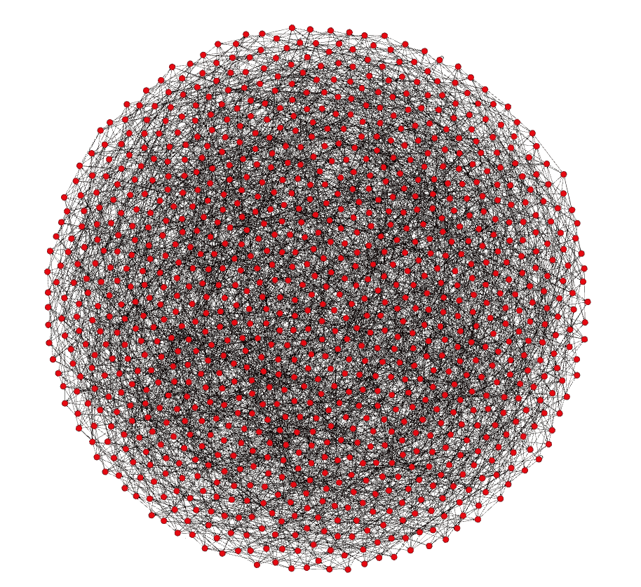
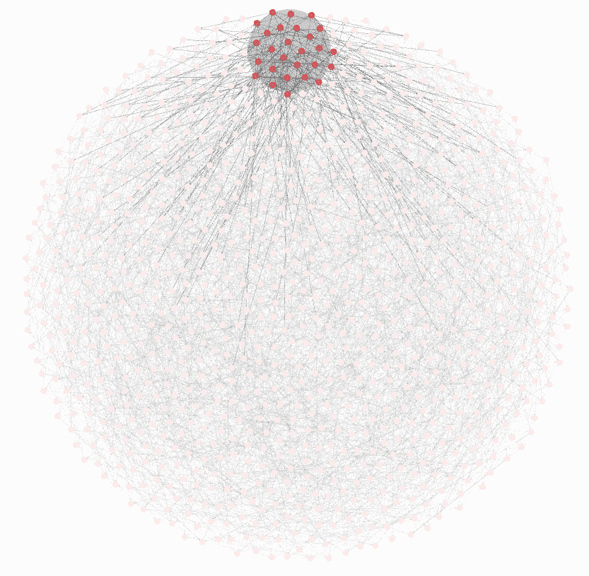
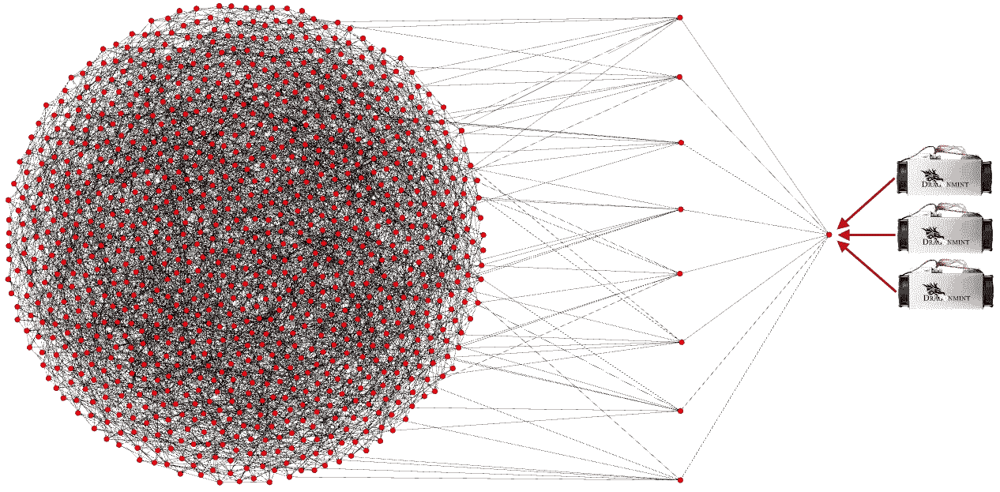
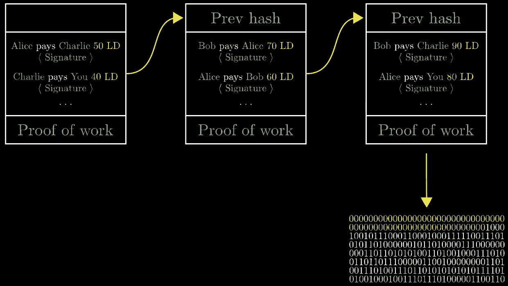
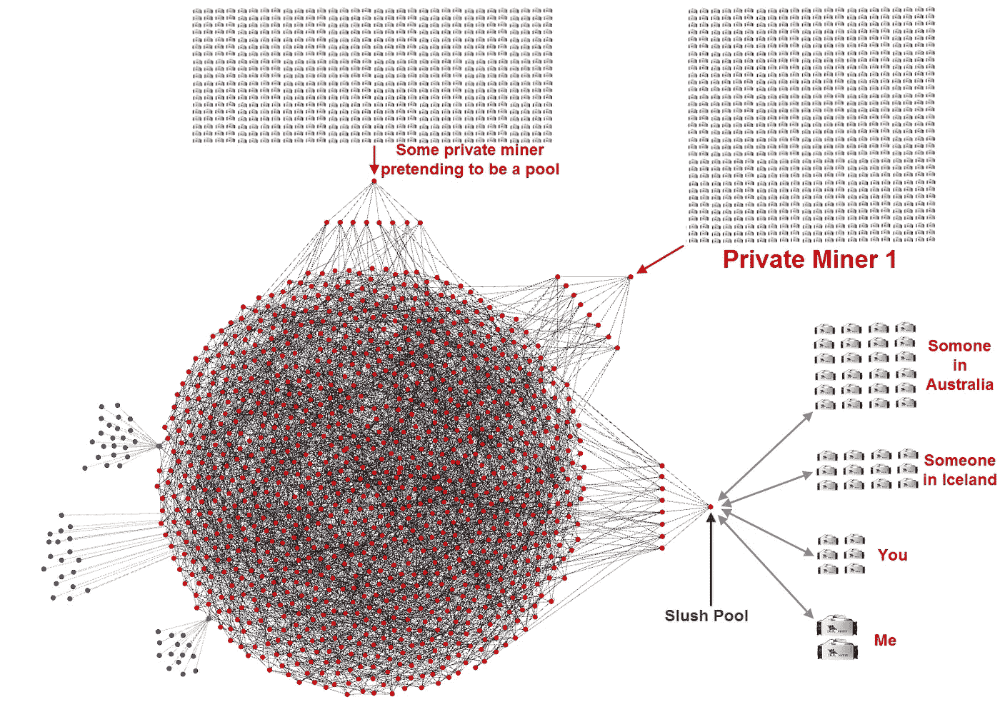
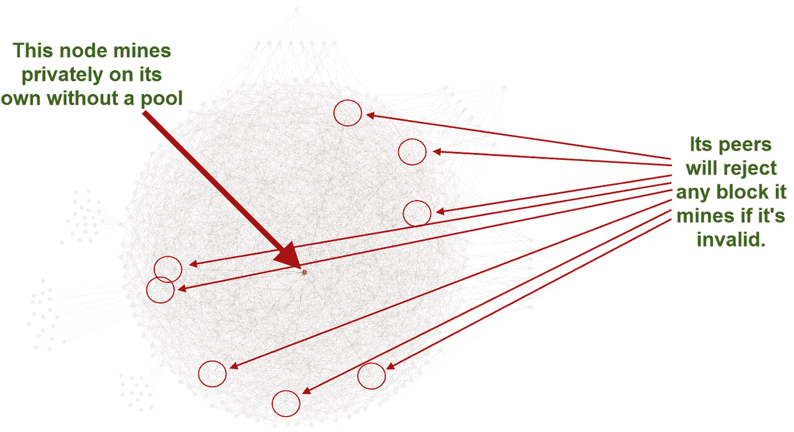
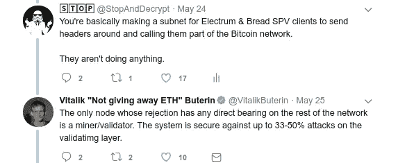
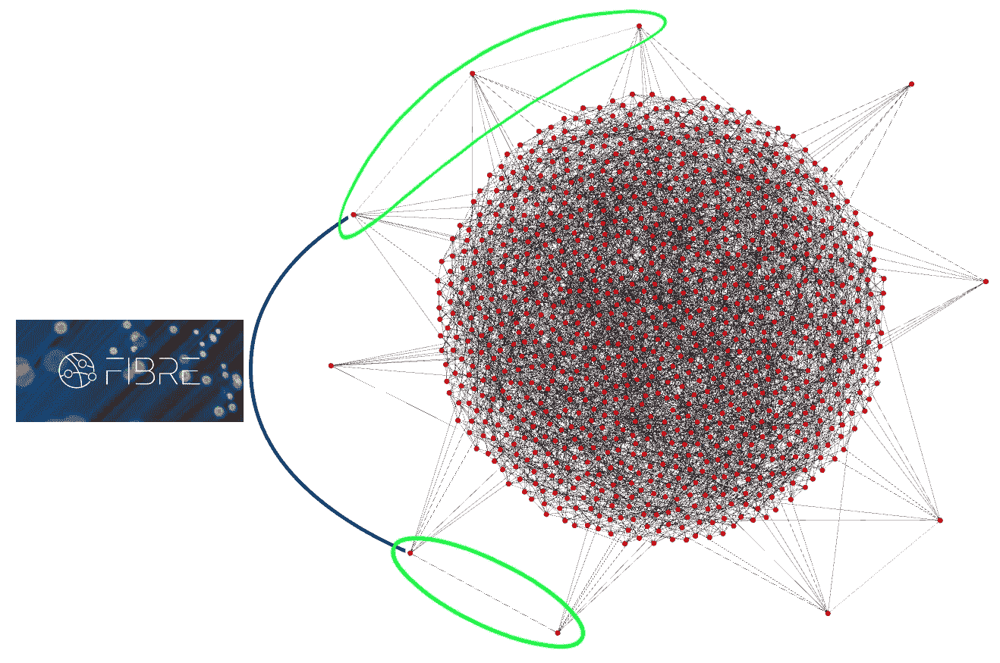

# 比特币矿工请注意:无效区块不需要申请

> 原文：<https://medium.com/hackernoon/bitcoin-miners-beware-invalid-blocks-need-not-apply-51c293ee278b>

## 比特币是一座坚不可摧的验证堡垒。

*像我的* [*摩尔定律文章*](https://hackernoon.com/moores-observation-35f7b25e5773) *，这是摘自一篇* [*大得多的文章*](https://hackernoon.com/sharding-centralizes-ethereum-by-selling-you-scaling-in-disguised-as-scaling-out-266c136fc55d) *。它作为一个独立的作品已经足够好了，因为这个旨在消除的误解是一个常见的问题，它变得令人讨厌地重复。*

# 不用数学理解比特币网络。

比特币不仅仅是一个区块链。我想帮助你理解比特币的区块链网络是如何设计的，因为当你开始在这个领域获得更多知识时，它会帮助你填补一些空白。我说*区块链*网络是因为比特币也有一个*支付渠道*网络*(闪电)*层叠在它上面，不会影响区块链网络的结构。不过，我不会在本文中讨论比特币的闪电网络，因为它与我要说的观点没有太大关系。

下面是一个缩小到 1000 个完全验证节点的比特币网络的粗略例子*(目前实际上有 115，000 个)*。这里的每个节点都有 8 个到其他节点的连接，因为这是客户端在不做任何更改的情况下建立的默认连接数。我的节点在这里的某个地方，如果你在运行一个，它也在那里。比特币基地的节点在那里，比特大陆的节点在那里，如果聪还在，聪的节点也在那里。

*请注意，这只是一个示意图，真实的网络拓扑可能(很可能)与此不同。一些节点拥有超过默认数量的连接，而其他节点可能选择连接到有限数量的节点，或者只留在一个其他节点之后。没有办法知道它实际上看起来像什么，因为* ***它是在考虑隐私的情况下设计的*** *(尽管一些监控公司肯定会试图获得非常接近的近似值)，并且节点可以定期改变它们的对等点。*

我从那个图开始，因为我想让你明白这些节点没有区别，因为**它们都完全有效。**这意味着他们都检查整个链，以确保每一个交易和块都遵守规则。这将被证明是重要的，我会进一步解释。

里面的和外面的没有什么不同，它们都有相同数量的连接。当您启动一个全新的节点时，它会找到对等节点并成为蜂巢中的一员。在这个图中，从这些节点中的任何一个到另一个的最长距离*是 6。在现实生活中，这个距离会有一些偏差，因为[寻找新的对等点](https://en.bitcoin.it/wiki/Satoshi_Client_Node_Discovery)并不是一个完全自动化的过程，可以均匀地分配每个人，但一般来说，向网络中添加更多的节点不会改变这一点。有 6 度凯文·贝肯，在 6 跳中我的交易在*【差不多】*每一个节点，**是否有效。***

我将从该组中选择“my”节点并将其拖出来，这样我就可以演示当我创建一个事务并将其公布给网络时会发生什么。下面你会看到我的节点一直到最右边，然后你会看到我的节点连接的其他 8 个节点*(对等)*。

当我创建一个事务并“将其发送给全世界”时，它实际上只发送给这 8 个对等体。由于比特币从一开始就被设计成使每个节点都是完全有效的节点，当这 8 个节点接收到我的交易时，它们会检查交易是否有效，然后再将其发送给它们的 8 个对等节点。**如果我的交易无效，它将永远不会破坏网络的“表面”。**我的同行绝不会把那笔烂交易发给他们的同行。他们实际上甚至不知道我创造了那个交易。他们没有办法分辨，他们对所有数据一视同仁，但是如果我继续向我的 8 个同事中的任何一个发送无效的事务，他们最终都会阻止我。这是他们自动做的，以防止我向他们发送垃圾邮件。不管你是谁，也不管你的公司有多大，**如果你的交易无效，它就不会传播。**

现在，假设您没有运行全节点，但是您使用了一个[轻型客户端](https://en.bitcoin.it/wiki/Thin_Client_Security)。各种各样的轻型客户端存在于桌面和手机上。其中一些是银金矿，军械库，面包，和 Samourai 钱包。轻型客户端绑定到特定的节点。有些可以被设置来随着时间改变他们所连接的人，但是他们最终还是被束缚住了。这就是网络共享的样子:

我想让你注意，这只是一个图表，很容易使用一个节点来演示网络共享，这个节点*碰巧*在边缘上，但是没有*真正的*边缘，网络共享就是网络共享，这个节点恰好在这个图表内的任何地方。我用黄色突出显示了这个。被连接的节点是绿色的，蓝点是轻型客户端。所有去往或来自轻型客户端的信息都要通过它们所连接的节点。它们依赖于那个节点。他们不是网络的一部分。它们不是节点。

这就是有趣的地方，也是其他人试图歪曲网络实际工作方式的地方:**如果我想开始采矿呢？**

*开采*一个区块就是*创造*一个区块的行为。与您想要发送的事务非常相似，您必须创建该块并将其通告给网络。任何节点都可以宣告一个新块，这个过程没有什么特别的，*你只需要一个新块*。挖掘变得越来越困难，但如果你愿意，你可以购买专门的硬件，并将其连接到你的个人节点。

还记得关于无效事务的那一点吗？对于块也是一样，但是你需要了解一些关于块是如何被创建的非常具体的东西。

先看这个视频。我跳过了关于散列的重要部分，使用 nonces *(随机值)*并向链添加新的块头**:**

**Please watch the entire thing if you have time. It’s personally my favorite video explaining how mining works.**

**当您看到视频中应用了标签“Prev hash”的以下部分时，这些是块头:**

****

**这个视频中没有提到的是，即使块内的所有事务都是无效的，你也可以创建有效的块头**。它仍然需要与挖掘具有有效事务的块相同的时间来挖掘具有无效事务的块。花费所有时间和精力创建这样一个区块的动机，将是推动一项用不属于你的比特币回报你的交易。这就是为什么所有节点不仅检查块头**而且检查事务**是很重要的。这是阻止矿工花费时间的原因。因为**所有**节点都检查过，**没有**矿工可以欺骗系统。如果所有节点都没有检查，你就必须依赖那些*检查的节点。这将把节点分成“类型”，唯一重要的类型将是检查的类型。*****

**加入矿池又如何？你可能会这样做，因为采矿对你一个人来说太难了，或者如果你是一个稍微大一点的实体，你可能更喜欢稳定的收入，而不是零星的收入。许多矿工都这样做，他们使用一种完全不同的协议将他们的专用硬件直接连接到采矿池，这种协议称为[地层采矿协议](https://en.bitcoin.it/wiki/Stratum_mining_protocol)。就像用你的非节点手机创建一个交易一样，**你不必运行一个节点来将你的硬件连接到一个矿池。**不跑节点也能挖矿，很多矿工正是这么做的。这是下面蓝色部分的样子。我在这个例子中使用了 Slush Pool:**

****

**请记住，出于演示目的，我将这些池运行节点拖出了图表。就像任何其他节点一样，这些池运行节点需要对等体。他们需要对等体来接收事务和块，并且他们需要对等体来宣布他们创建的块。请允许我再次重申:**所有节点验证所有块和所有事务。****

**如果这些池中的任何一个宣布一个无效块，它们的对等体将知道**，因为它们完全验证**，并且它们不会将它发送到其他节点。就像事务一样，**无效块不进入网络。****

**这里有另一种方式来看待这个问题，而不需要从图中拉出这些节点。下面是一个不想被人知道的私人矿工，它有 8 个随机的同行，并且**那些同行中没有一个知道它是矿工**。再次强调，这是出于隐私原因而精心设计的。网络中的任何节点都无法知道它们接收到的块是由它们的对等体*创建的*，还是由它们的对等体*中继的*。他们只知道它是否有效，如果有效，他们就发送出去，如果无效，他们就不发送。**

****

**希望你已经明白了，我不相信我用了任何复杂的数学或方程式来达到这一步。我想继续，因为我觉得这是完整的覆盖面，但还有最后一件事我想解决，因为这是最后一个方面是用来混淆那些不完全理解我刚才解释的一切的人。它被如此肆无忌惮地使用，我需要解决它。**

****

**[https://twitter.com/VitalikButerin/status/1000232465540136960](https://twitter.com/VitalikButerin/status/1000232465540136960)**

**我最初的评论是关于轻客户端，也称为 SPV 客户端，以及它们如何不属于网络的一部分。我在上面用蓝色系住的点演示了这一点。他的后续评论试图暗示我的节点是唯一被拒绝的节点。*请记住:节点无法知道哪些其他节点挖掘了一个块，以及谁中继了一个块，* ***这是有意设计的。*****

**现在是最后一张图，这样我可以试着解释当人们说“只有挖掘节点才重要”时使用的逻辑。一些挖掘者直接连接到其他挖掘者，使得在他们与网络的对等列表之外，他们中的一些也是其他挖掘者。**不是所有矿工都这样做**。一些直接连接的矿工也使用*可选的*中继网络，如比特币核心开发者[马特·科拉洛](https://twitter.com/TheBlueMatt)正在设计的光纤网络[，但即使是这个边网也不是矿工专有的，任何人都可以加入，包括你和我，它只是帮助阻止整个网络的中继。无论哪种方式，人们都试图争辩说“挖掘节点”的这种互连性*(无论是否使用类似光纤的东西)*意味着它们是唯一重要的，这是荒谬的:](http://bluematt.bitcoin.ninja/2016/07/07/relay-networks/)**

****

**在这个例子中，我将节点的对等体留在了图中。你现在应该明白了。他们拒绝无效的块。绿色圆圈内的那组节点绝对不是这个网络中唯一重要的节点。**