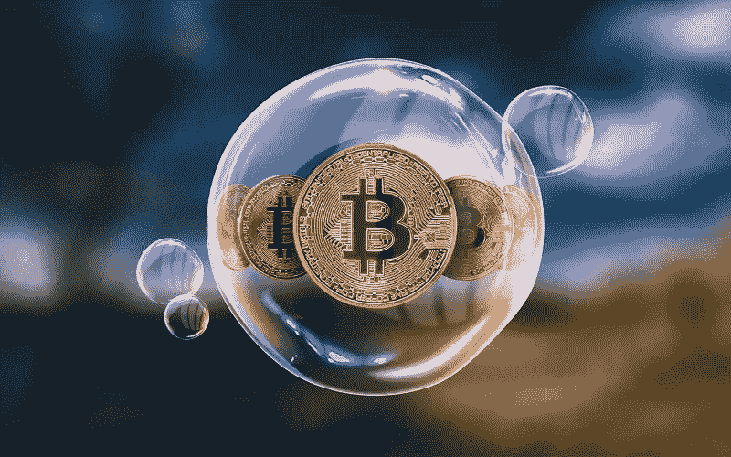

# 比特币:一种新的生活形式？

> 原文：<https://medium.com/hackernoon/bitcoin-new-form-of-life-d7a6ee0985f4>

# [Ralph Merkle](https://en.wikipedia.org/wiki/Ralph_Merkle) ，Merkle tree 的创始人&一个密码学传说[引用](http://merkle.com/papers/DAOdemocracyDraft.pdf):

**“比特币是一种新生活形式的第一个例子。”**

“它生活和呼吸在互联网上。它活着是因为它可以付钱给人让它活着。它之所以存在，是因为它提供了有用的服务，人们会付钱给它。它之所以存在，是因为任何人、任何地方都可以运行它的代码副本。它之所以存在，是因为所有正在运行的副本都在不断地相互通信。它之所以存在，是因为如果任何一个副本被破坏，它就会被迅速丢弃，没有任何大惊小怪或混乱。它之所以存在，是因为它是完全透明的:任何人都可以看到它的代码，知道它到底在做什么。”

# 他是正确的吗？

如果我们看看生命，生物学家很难定义什么是生物&什么是非生物。

你如何定义:这是生活，而这不是，对一个人来说这是超级容易的，但你如何用适当的规则来定义它——这是一个真正的困难。

但是一般来说，人们会把自己的生活分成几种不同的*:*

*1)第一种启发是**生命形式是利用能量来保存自身信息的物质结构**。即使我们看看自己的身体，每个细胞都有 DNA，我们正在吃食物，我们身体正在做的主要事情是消化食物，并将其转化为细胞，从而保存我们的 DNA。*

*即使是最简单的细菌也在做同样的事情，吃食物/能量，利用能量并保存自己 DNA 中的信息——所以这是生命的特征，即生命总是寻求以 DNA 的形式保存一些信息。*

**当我们看到比特币时，如果我们想到它，它是一种物质配置，即利用电力(能量)来保存信息的采矿机，即比特币核心代码库和比特币区块链，所以比特币完全符合这一点。**

*2)生命的第二个特征是**活生物体有一种变异的自我复制方法，它们经历自然选择**——一个细菌分裂成两个子细胞，它们与亲代细胞略有不同，然后这两个细胞将在环境中生存并进一步分裂，一个细胞系比另一个更成功。*

*这是达尔文的想法，**我们复制&我们将信息复制到其他配置中，然后自然选择创造了适者生存。***

*奇怪的是，比特币完全遵循了这一点。*

**在比特币中，矿机正在消耗能量来保存信息&它们分裂成比特币核心&比特币现金，就像一个细菌分裂成两个。比特币核心&比特币现金有不同的 DNA(块大小是不同的)，核心代码基础是不同的&一旦这些网络分裂，它们就会经历自然选择。这两个会互相竞争，一个会比另一个赢得多，所以有分裂，复制，变异和自然选择的概念，所以加密网络遵循* [*达尔文的进化论*](https://www.darwins-theory-of-evolution.com/) *:完全！**

*3)第三件事是，**生命形式可以有一个目标函数**，就像在细菌中一样，目标函数是生存和复制。从我们年轻的时候起，我们的身体就在优化我们的生存，我们通过生产孩子来复制。从这个意义上说，我们背后有一个目标。*

*今天的加密网络没有客观功能——比特币作为一个网络没有任何目标，拥有比特币的人有一个目标——他希望看到比特币的价格上涨，但整个网络没有任何目标——它只是“存在”！*

**正在发生的最奇怪的事情是，智能合约允许我们建立具有目标功能的加密网络:想象一下，以太坊上有一个协议，比如以太坊上的分散式交换，并且有一个内部智能合约，其目标功能是最大化系统正在处理的订单数量，如果人类(开发人员)贡献代码来改进其功能，即允许其处理更多订单，则该智能合约愿意向他们支付金钱。智能合约衡量通过系统的订单总数，开发人员向系统提交代码，智能合约计算出，由于某个开发人员提交了某些代码，订单数量随着用户体验的改善而增加，因此让我们用乙醚奖励该开发人员。**

*我们可以在每个加密网络的中心建立一个类似人工智能的代理，它将向开发者支付传播系统的费用。我们现在还没有，但是我们可以，然后这个加密网络将会是一个活的网络——它将会有一个目标去完成某件事，然后复制。*

*我们越想越觉得 Ralph Merkle 是对的——50 年后我们会想到新的数字生命形式，这是意料之外的，因为作为技术专家，我们一直认为人工生命会有一个和我们一样的物理形式，但错误的是，我们甚至没有意识到，Satoshi 已经以比特币的形式创造了第一个数字生命，甚至他都没有想到这样做。*

**注:以上片段灵感来源于我对区块链空间最佳播客联合主持人***【惊人迈赫罗伊】* [*央*](https://epicenter.tv/) *！***

**加入我们的 telegram 社区，讨论核心区块链项目:[https://t.me/inchained](https://t.me/inchained)**