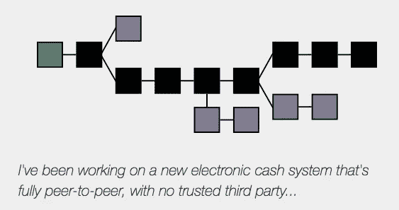
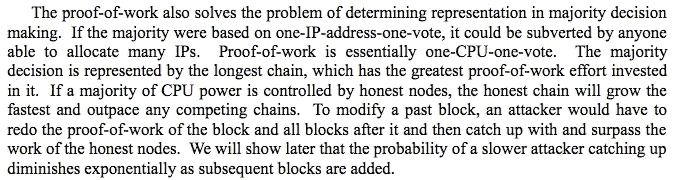
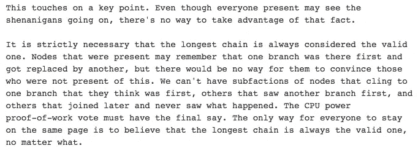
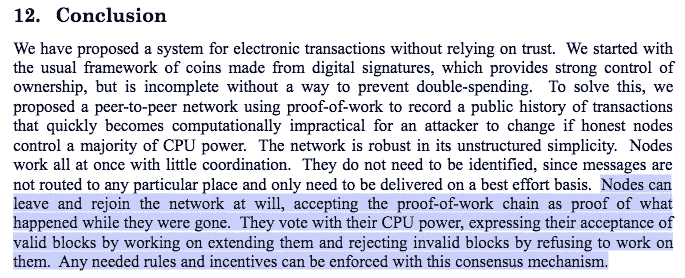
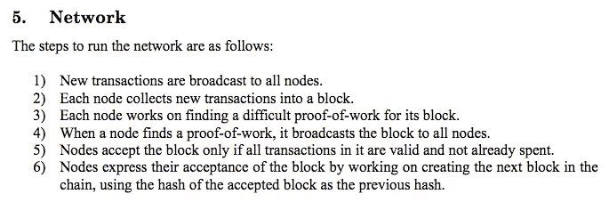

# 比特币:过去和未来

> 原文：<https://medium.com/hackernoon/bitcoin-past-and-future-f2feba1f419d>

由[穆拉德·马赫穆多夫](https://twitter.com/muststopmurad)和[亚当·塔奇](https://twitter.com/adam_tache)拍摄。

# 序

这是《T4:比特币的多面性》的续篇，该书讨论了比特币的四种思想流派。本文将通过讨论权衡、社区内的哲学分歧以及所提议系统的预期行为来分析这些观点。

## 索引

*   作为货币的比特币
*   比特币和比特币现金中完整节点和矿工的角色
*   解决“聪的原始愿景”
*   SPV 的角色
*   隔离证人
*   比特币最大化
*   上层系统和另类硬币

# 作为货币的比特币

比特币为我们提供了一个重塑黄金的机会，甚至是重新思考数字未来的货币。许多经济学家建议，根据物品的经济价值来评估可能更合适。按照这种思路，不是说某样东西要么是钱要么不是钱；相反，许多项目可以发挥货币作用，有些项目可以比其他项目更有效地发挥这一作用。从很多方面来看，比特币具有很高的金钱价值。它们比黄金和政府法定货币更易携带、更耐用、更易分割、更稀缺。

时至今日，比特币最能被描述为具有货币属性的数字商品。根据货币历史的比特币最大列表[解释](https://twitter.com/NickSzabo4/status/954225789129469952)，一种新的稀缺货币形式可能会大致沿着以下路线演变:

1.  可收集的
2.  +价值储存
3.  +交换媒介
4.  +记账单位。

比特币作为数字现金的支持者认为，效用应该首先优先于价值储存，并通过尽可能降低支付成本，优先于价值储存实现交换媒介的角色。

那些认为比特币将成为未来全球货币标准的人将当前的波动归因于比特币正在经历货币化过程，以及全球认知转变正在缓慢发生。在他们看来，尽管波动很大，但价格的长期抛物线上升证明了越来越多的人相信比特币将被广泛使用的未来世界。

自认为是 T2 罗斯巴德人的奥地利人，比如作者 T4，相信比特币的反通胀特性和供应上限使其成为有史以来最可靠的货币。他们认为，货币供应量固定的比特币是唯一公平的货币形式，也是允许个人进行最有效的资本配置和整个市场发出最有效的价格信号的货币形式。

这个群体中的许多人反对部分准备金银行的想法，认为这是欺诈行为。他们认为部分储备银行系统不太可能出现在比特币之上，因为比特币缺乏黄金的物理中心化，这迫使结算和清算必须通过中心化的瓶颈，让政府能够完全控制货币供应、传输和整个货币制度。政府拥有如此大的控制权，以至于他们能够摆脱金本位制(这是几个世纪以来由市场有机选择的),并引入自己的法定标准，而不受任何商品的支持。

这些人认为，从长期来看，部分储备体系在没有最后贷款人的情况下是不可持续的，而最后贷款人并不存在于比特币中，人们也不会愿意接受比特币的替代品。

奥地利学派的“[自由银行](https://www.alt-m.org/2015/07/18/hayek-and-free-banking/)”派，如[乔治·塞尔金](https://www.hillsdale.edu/wp-content/uploads/2016/02/FMF-2014-Bitcoin-Problems-and-Prospects.pdf)和[劳伦斯·怀特](https://soundcloud.com/cryptovoices/show-40-lawrence-white-money-banking-bitcoin)认为，比特币严格固定的供应和缺乏最后贷款人，在技术上并不妨碍部分准备金银行和实体的竞争性体系在比特币上产生，或者在比特币是事实上的货币标准的经济中产生。

很明显，比特币至少有可能成为一种波动性较低的数字商品，一种类似于数字黄金的价值储存手段。然而，人们仍然怀疑，它能否超越原始价值储存手段的角色，实现足够低的波动性，成为一种全球交易媒介和记账单位。

一些人认为，由于其严格的无弹性供应，比特币的购买力不太可能很快稳定下来，如果有的话，人们更喜欢日常货币的购买力稳定。这些人对加密货币的出现表示兴奋，加密货币内置了更加灵活和自我监管的货币政策。例如， [stablecoins](http://juliankohtx.com/stablecoins-and-the-story-of-money/) 的目标是利用一种算法中央银行，将其市场价值与另一种价值形式挂钩，如美元或一篮子商品。

其他人[认为](/@rextar4444/a-neo-gold-standard-bitcoins-optimal-use-case-62d7fbb2f76f)尽管比特币的供给严格来说缺乏弹性，但比特币是对[约翰·纳西](https://en.wikipedia.org/wiki/John_Forbes_Nash_Jr.)的[理想货币](http://personal.psu.edu/gjb6/nash/money.pdf)提案的完美解决方案，他为此工作了 50 多年。诺贝尔经济学奖得主纳什提出，各国央行可以根据一个非政治性的指数来设定货币的通胀目标，以实现所有国家货币的国际关系稳定。为了应对对比特币日益增长的需求，一些人认为，银行将根据比特币对其货币进行估值，以此作为货币价值标准化的基础。

## 通货紧缩死亡螺旋

主流、凯恩斯主义和货币主义经济学家都对比特币的固定供给表示担忧。他们担心，如果比特币通过被称为超级比特币化的过程成为主导货币，可能会产生严重的通缩压力。

他们担心无法扩大货币供应将导致比特币的购买力每年增长 2%—3 %,与全球经济产出增长率大致相当。一些人表示担心，通缩经济学可能会减少当前和近期的总需求，导致过度储蓄和囤积资金，并减少个人消费、投资和创业风险。

奥地利经济学家认为，与通货紧缩形式的货币相关的担忧被夸大了，而且“通货紧缩螺旋”是一个神话。奥地利学派反驳了凯恩斯主义者和货币主义者的担忧，即支出的延迟不会永久持续，他们提醒人们，这种支出只是被延迟到了未来。现在，人们的时间偏好会降低，他们不会用“烫手山芋”贬值的钱去买“无用”的东西，而是会把注意力转向长期生产力。

他们还认为，企业利润率不会受到影响，因为不仅产品价格会下降，企业成本也会以同样的速度下降，从而保持利润率不变。奥地利学派认为通货紧缩是绝对正常的，没有中央对货币供应的控制，资本主义和技术都是自然的通货紧缩现象。这可以在监管较少的电子行业中看到，那里增加的存储/内存/计算容量每年都变得越来越便宜。

根据奥地利学派的说法，是*中央银行通货膨胀法定印钞*加剧了衰退和商业周期，因为永久贬值的货币嵌入了公民持续的焦虑和压力，导致不充分的投资和支出，统称为“不当投资”。这些不当投资通常是低效的资本配置，不太可能带来个人收益、社会收益、生产率或资本存量。

# 比特币和比特币现金中完整节点和矿工的角色

## 缩放辩论

关于如何扩大比特币规模的辩论非常两极分化，而且是关于扩大吞吐量，也称为每秒交易量(TPS)。主要的争论是运行一个[完整节点](https://bitcoin.org/en/full-node)应该花费多少，以及完整节点和矿工在系统中应该扮演什么角色。

2010 年 7 月，比特币的创始人中本聪[据说](https://www.reddit.com/r/Bitcoin/comments/3giend/citation_needed_satoshis_reason_for_blocksize/ctygzmi/)增加了 1 MB 的最大块大小限制，作为反 DoS(拒绝服务)预防机制。这一 1 MB 的块大小限制一直存在，直到 2017 年交易量大幅增加，这些块从未接近满容量。当引入这一限制时，1 MB 是普通块大小的几百倍。

2017 年 8 月，一个名为 Segregated wit(简称 SegWit，见下面的专用部分)的更新被激活，它将一个块中可以存储的数据量增加到 1 MB 以上。令许多人感到惊讶的是，大约在同一时间，8 月 1 日，一个名为比特币现金(BCH)的比特币(BTC)分支诞生了，其用户对 BTC 开发商的扩展路线图和强调比特币是数字黄金感到不满。这个分支的开发人员很快实现了 32 MB 块，并计划进一步提高这一限制，这将允许每个块有更多的链上事务，费用更低，但运行一个完整节点的成本更高。

影响运行完整节点的成本的因素包括所需的带宽、UTXO 集的大小(如果您不熟悉 UTXO 概念，请参见[这本关于比特币交易的](https://www.safaribooksonline.com/library/view/mastering-bitcoin/9781491902639/ch05.html)初级读本)，以及所需的 CPU、RAM 和磁盘空间，这些都受到块大小的影响。

那些支持小区块的人认为，通过允许任何用户使用完整节点进行验证，他们对于保持系统的去中心化是必不可少的，并且发展[费用市场](/@jimmysong/the-fee-market-explained-76b294947b42)，以便在区块报酬减少时保证矿工的补偿。

比特币现金的支持者“大区块”(big blockers)将区块大小限制视为一种人为限制，通过共识规则形式的集中规划机制来维持。许多人倾向于矿商根据市场状况选择他们愿意开采的区块大小。还有其他[区块链](https://hackernoon.com/tagged/blockchain)项目就是这种情况，比如以太坊，矿工可以[投票](https://www.etherchain.org/tools/gasLimitVoting)调整气体限制，这类似于比特币中的区块大小，每个区块都有一定的系数。

***“小拦截者”(比特币项目)的视角***

> 全节点中继事务和块，并对它们中继到(全节点)网络的其他成员的数据进行全面验证，实施共识规则，并充当防范潜在恶意矿工的警惕眼睛。
> 
> 比特币的价值源于该系统消除了对第三方的信任，对国家层面的攻击具有弹性，以及其抵制审查的性质。所有能够运行完整节点的用户对于保持这些特征至关重要。
> 
> 随着运行一个完整节点的成本增加，越来越少的用户能够负担得起验证和执行共识规则，越来越多的用户被迫以可信的方式使用比特币，依赖他人的诚实，而不是整个系统的稳健性。
> 
> 巨大的块最终将导致完整的节点只驻留在数据中心，这通过将共识放在有限数量的实体手中来增加集中化，使比特币面临更大的被关闭风险，并通过要求用户连接到其他节点来降低隐私性。
> 
> SPV(简单支付验证)客户端是轻量级客户端，可以证明交易包含在块中，而无需下载整个区块链，SPV 客户端不能进行无信任和完全验证。

此时，即使是低端计算设备，如[树莓派](https://www.renewable-energy-now.org/2017/07/raspberry-pi-bitcoin-full-node-english/)也可以作为一个功能完整的节点。许多人渴望未来智能手机也能充当完整的节点。

为了让一个完整的节点执行验证，它必须传播通过处理整个链而获得的整个 UTXO 集。UTXO 集可以通过用户和公司合并输出来缩小，但是[已经证明](http://statoshi.info/dashboard/db/unspent-transaction-output-set)它会随着时间的推移而稳步增长，并且可以无限增长。

通过主要使用区块链作为离线交易的结算层，并通过技术改进优化空间效率，UTXO 集的管理效率大大提高，数据块传播延迟和初始区块链同步时间减少，运行完整节点所需的带宽、CPU 能力、RAM 和磁盘空间也降至最低。

链外支付渠道(如[闪电网络](https://lightning.network/lightning-network-summary.pdf))正在开发中，这将能够在比特币区块链上结算成千上万笔交易。

虽然矿工是唯一能够产生新的候选区块的实体，但是经济全节点运营商通过拒绝无效区块来发出信号并激励矿工创建有效区块。如果挖掘者要产生无效的块，例如具有与网络其余部分定义的规则不同的共识规则的块(例如，篡改新比特币的发行率或改变比特币的最大数量)，则完整节点将自动忽略它，即使大多数散列功率接受该块为有效的。

完整节点拒绝无效块和无信任地验证交易的能力导致了“不要信任，验证”的说法，这就是为什么完整节点被视为矿工被付费服务的网络。

这并不是说矿工根本没有任何控制权。尽管角色不同，但全节点操作员和矿工都为系统的各个方面提供动力。采矿者可以选择他们在区块中包括哪些交易(利润最大化的采矿者可能包括收费较高的交易)并创建新的区块，而商人和其他完全节点运营商(包括采矿池节点运营商)确定区块和交易的有效性，实施共识规则。

2017 年的一次用户激活软分叉(UASF) [事件](http://www.uasf.co/)表明，操作完整节点的用户能够推动矿工激活 SegWit，尽管最初只有少数矿工表示他们赞成更新。

***“大拦截者”(比特币现金项目)的视角***

比特币现金的支持者希望向无限的块大小扩展，并且不相信所有节点运行起来很便宜的重要性。他们声称比特币的最佳版本是由中本聪在他最初的白皮书、博客帖子和电子邮件中概述的。他们认为，Satoshi 只认为矿工是网络，共识应该纯粹通过散列权力来处理。

一些大的阻止者认为简单交易的用户从不需要运行完整节点，但其他人建议根据带宽的尼尔森定律增加块的大小，以允许拥有“合理”计算机和互联网连接的用户继续运行完整节点。

> 通过利润最大化和博弈论的市场激励，矿商被追究责任。矿商永远不会勾结，因为他们彼此直接竞争，寻找新的区块，并获得比特币作为奖励。
> 
> SPV 的安全模型对终端用户来说已经足够好了，而所有节点对采矿网络都是无能为力的、被动的观察者。只有支付处理商等公司需要全节点来为 SPV 客户提供 0 确认交易和 merkle-branch 证明等服务。
> 
> 非货币比特币共识规则没有什么神圣可言，应该允许这些规则通过市场过程出现。

来自[马克·威尔科克斯](http://markwilcox.com/articles/03/):

> “工作证明游戏的要点在于节点不可信。我们唯一能相信的是解决问题的难度，以及每个参与其中的人的经济利益。这意味着，非常关键的是，“每个人都有责任”不同于“每个人都必须做每件事”。我们需要共同保护网络。但奖励贡献 hashpower 的节点的全部意义在于，让其他人不必担心货币政策受到攻击或服务被拒绝。”

BCH 的支持者将去中心化等同于竞争和矿工的网络拓扑，而不是完全节点成本。他们拒绝了 SegWit，比特币现金是他们的回应。他们鼓励链上应用，如社交网络备忘录，小拦截者可能会将其视为垃圾邮件，并鼓励在上层系统上开发。

# 解决“聪的原始愿景”

***“小拦截者”(比特币项目)的视角***

BTC 的支持者认为，诉诸于聪的话是诉诸于权威的逻辑谬误，而聪应该不再重要。

> “若见佛或佛，杀之。”

他们通常将 BCH 的支持者称为白皮书中的“宗教原教旨主义者”，他们无法接受比特币自诞生以来的有机进化。他们认为 BTC 是一个比 BCH 更优越、更分散的系统，因为它有能力让所有节点充当 p2p 网络治理机制( [**不是**民主](/@beautyon_/democracy-has-nothing-to-do-with-the-way-bitcoin-works-it-is-a-political-system-where-a-group-of-efb37a627415))。

许多人认为 BCH 是一个欺诈性的项目，其领导者试图接管比特币品牌，并建立一个由矿工控制的中央集权系统，该系统需要对第三方的信任。

BTC 的支持者还提到，Satoshi 通过高频交易支付渠道的设计为闪电网络奠定了基础。他们还认为，如果没有 SPV 欺诈证据，Satoshi 的原始设计被证明是不可能的，下面的 SPV 部分对此进行了描述。

Satoshi 关于块大小的最后一句话写于 2010 年 12 月，在一次关于 BitDNS 的[讨论](https://bitcointalk.org/index.php?topic=1790.msg28917#msg28917)中，一项使用比特币进行域名发行的提议导致了一个名为 [Namecoin](https://www.namecoin.org/) 的合并开采的区块链的诞生。

> “由于需要相对较少的域名注册商，比特币用户可能会完全自由地添加任何大型数据功能，而比特币用户可能会越来越专制地限制链的大小，以便大量用户和小型设备可以轻松使用。”

在这里，Satoshi 提到了关于缩放比例的争论，并建议限制区块链的大小可能会获得共识。

根据用户激活的软分叉、市值和散列率，比特币现金没有获得被称为比特币的社会共识。相反，比特币现金很难创造一个新的网络，而隔离见证是对原始比特币网络的更新，旧软件仍在其中运行。

***《大拦截者》(比特币现金项目)的视角***

BCH 的支持者宣称“比特币现金就是比特币”，因为他们认为比特币被设计成在链上扩展，而没有“非挖掘完整节点”限制系统的吞吐量。相反，他们认为矿工的节点是真正的完整节点，并注意到 Satoshi 在他的著作中将矿工称为“节点”。

来自中本聪:

> “只有试图创造新硬币的人才需要运行网络节点。起初，大多数用户会运行网络节点，但随着网络增长超过某一点，就会越来越多地留给拥有专用硬件服务器群的专家。”
> 
> “当前系统中的每个用户都是一个网络节点，这不是大规模的预期配置。这就像每个新闻组用户运行他们自己的 NNTP 服务器。设计支持让用户只是用户。运行一个节点的负担越重，节点就会越少。这几个节点将成为大型服务器场。”

BCH 的支持者认为，当区块已满时，小型区块利用比特币项目创建一个支付高额连锁费用的结算网络。一些人认为核心开发者成功地改变了人们对工作证明(PoW)博弈论的理解，因为他们[将](https://www.reddit.com/r/btc/comments/5zawlw/satoshi_whitepapers_longest_chain_is_bitcoin_rule/dewpjza/) Satoshi 对 PoW 的描述解释为挖掘是预期的共识机制。

BTC 的支持者强烈反对矿工曾经控制共识规则的观点。他们指出，即使在[最初的](https://github.com/trottier/original-bitcoin)节点软件中，最长 PoW 链规则也只适用于解决使用相同共识规则的多个链之间的争端，节点可以选择生成硬币或不生成硬币。

# SPV 的角色

与完整节点相反，轻量级比特币客户端的软件类型是 SPV(简单支付验证)。SPV 客户端允许用户连接到一个或多个节点(即从智能手机)，确定具有最长 PoW 链的最新块，并从节点请求[块头](https://bitcoin.org/en/developer-reference#block-headers)(每个 80 字节)。

如白皮书第 8 部分所述，用户可以获得 merkle 分支，该分支通过有效的块头和工作证明来确认他们的事务位于块内。进一步的确认(在另一个模块之上的新模块)表明进一步的工作已经完成。

SPV 客户端本身无法验证块或共识规则，因此它们必须信任它们所连接的节点的验证。

Satoshi 在白皮书中提出了一种增强 SPV 安全性的技术，允许节点在检测到无效块时向 SPV 客户端发出警报。理论上的[欺诈证明](http://www.truthcoin.info/blog/fraud-proofs/)可以用最少的资源证明无效块的存在，但是还没有发现一个可行的实施方案可以抵抗 DoS。

虽然欺诈证明在今天还没有实现，但 SegWit 使它们能够通过[软叉](https://en.bitcoin.it/wiki/Softfork)集成到比特币中，这是一种向后兼容旧客户端并收紧或添加新规则的变化。

# 隔离证人

2017 年，一个名为“隔离见证”( SegWit)的 BTC 软叉被激活，这是多年来规模辩论的结果。它主要是对涉及事务可伸缩性问题的一个 bug 修复，但也为事务增加了更多空间，并通过软分叉使未来的更新和扩展变得更加容易。

## 什么是延展性？

在 SegWit 之前，事务有可延展的(可变的)部分。例如，中继事务的节点或将其包含在块中的挖掘器可以向事务的[签名](https://bitcoin.org/en/developer-guide#term-signature)添加额外的字节。这将更改 ID，ID 是整个事务的加密哈希，包括签名。

虽然在其他计算机软件中存在延展性，但在比特币的情况下，在交易传播到网络后更改交易 ID 会阻止钱包软件通过 ID 跟踪交易，阻止用户执行某些类型的交易，并阻止开发人员创建某些类型的智能合同。

例如，一个有效的事务可以将一个未确认的输出(尚未包含在一个块中)作为同一块中另一个事务的输入。如果未确认输出的事务 ID 被扩展，第一个事务将被确认为仍然有效，但是第二个事务将无效，因为事务数据将包括一个无效*先前 tx* 属性。

矿工、完整节点和用户可以选择使用或不使用 SegWit，因为它是一个软分叉。截至 2018 年 5 月，SegWit 输入的交易约占交易的 [35%](https://transactionfee.info/charts/payments/segwit) ，SegWit 节点约占 [95%](https://luke.dashjr.org/programs/bitcoin/files/charts/segwit.html) 的分布。

这一节的其余部分是相当技术性的，所以如果你是初学者，请随意浏览或跳到“比特币最大化”一节。

见证数据是指签名和解锁脚本。使用 SegWit，挖掘器通过将见证数据放在一个称为见证 merkle 树的单独 merkle 树(保存事务的块中的数据结构)中来“隔离见证”,这是事务树的镜像。见证根哈希存储在 coinbase 事务中，这是矿工用来支付自己新铸造的比特币的事务。因此，SegWit 事务的签名仍然包含在块中，因为 coinbase 事务影响存储在块的块头中的 merkle 根散列。

如果矿工选择不更新到 SegWit，那么他们就不能使用 SegWit 输入开采区块，因为对他们来说这些是非标准交易。在见证结构被剥离的情况下，它们仍然可以接收 SegWit 事务。

**seg wit 更新**(更多详情参见 [SegWit 优势](https://bitcoincore.org/en/2016/01/26/segwit-benefits/) ) **:**

*   逐步减少块大小，增加块重量。目前，块最多可以有 400 万个重量单位(吴)。原始块结构中的一个字节重 4 WU，而见证结构中的一个字节仅重 1 WU。更多信息，请参见“[了解 Segwit 块大小](/@jimmysong/understanding-segwit-block-size-fd901b87c9d4)”
*   将 SegWit 事务的 UTXO 大小减少见证的大小，大约是数据的 60–75%。引入见证结构的重量单位折扣是为了通过降低费用来激励 UTXO 集更负责任的增长。
*   随着 SegWit 事务百分比的增加，增加可以存储在块中的数据量。我们[见过的最大块](https://www.smartbit.com.au/block/0000000000000000001bbb529c64ddf55edec8f4ebc0a0ccf1d3bb21c278bfa7)是 2.1MB
*   允许支付渠道，如闪电网络，利用可延展性修复。
*   修复 Sighash 操作的二次缩放。
*   启用校验和 [Bech32](https://www.youtube.com/watch?v=NqiN9VFE4CU) 地址格式。
*   引入脚本版本控制，以便在未来为 SPV 欺诈证明、 [Schnorr 签名和签名聚合](https://bitcointechtalk.com/scaling-bitcoin-schnorr-signatures-abe3b5c275d1)和 [MAST](https://bitcointechtalk.com/what-is-a-bitcoin-merklized-abstract-syntax-tree-mast-33fdf2da5e2f) 等功能提供更简单的软分叉，这些功能可压缩数据并进一步帮助链上扩展，以及[机密事务](https://www.elementsproject.org/elements/confidential-transactions/investigation.html)。
*   使隐蔽的 [ASICBoost](https://blog.bitmex.com/an-overview-of-the-covert-asicboost-allegation-2/) 无效(尽管[有些](http://www.truthcoin.info/blog/asicboost-worthless/)首先质疑 ASICBoost 的相关性)。

以下是反对 SegWit 的论点

*   [一些](http://thebitcoin.foundation/)用户更希望比特币开发者尽可能少地改变 Satoshi 的代码库。
*   SegWit 和 Lightning Network 并没有解决扩展的争论，因为用户总是会对运行一个完整节点的成本有分歧。
*   SegWit 在技术上使用了一个强制扩展块，使其成为“[邪恶分叉](http://www.truthcoin.info/blog/forks-and-splits/)或“[强制分叉](https://petertodd.org/2016/forced-soft-forks#radical-changes)”
*   在一场[反 UASF](http://www.truthcoin.info/blog/uasf-contradiction/) 运动中，通过不包括任何涉及 SegWit 投入的交易，矿商审查 SegWit 交易在技术上是可能的。
*   最大的矿业专用集成电路制造商的首席执行官吴称，由于证人数据的折扣，SegWit 的交易“不公平地便宜”。

# 比特币最大化

比特币最大主义者有不同的风格，但他们都认为比特币是最好最安全的区块链，具有最强的网络效应，最可取的货币政策，以及为未来发展而构建的高性能脚本语言。

比特币创造者普遍认为“代币经济”的想法揭示了对整个货币体系的深刻误解，并将代币视为蛇油。他们强烈反对未来的 10，000 种货币的世界，认为这与物物交换没有什么不同——这正是货币应该消除的问题。他们认为，持有的货币(不一定是交易的货币)会产生价值，而“代币”的长尾将受到极高速度的影响，使它们很少或没有价值，即使远离最终用户，也会产生不必要的摩擦。

# 上层系统和另类硬币

许多比特币创造者将替代币视为测试特性的场所，如果用户需要，这些特性最终可能会集成到比特币中。

从理论上来说，复制几乎任何一个区块链，甚至是一个巨型块，并把它放在一个比特币侧链上是可能的。Paul Sztorc 的 [Drivechain](http://www.drivechain.info/) 项目目前正在开发中，将允许这些区块链继承比特币的采矿安全性，尽管它需要一个软分叉，并正在等待更广泛的同行审查。

有三大类变化(可能)永远不会整合到比特币的基础层中。

*   替代中本聪共识的**共识机制**，如利益证明 [(Tendermint](https://tendermint.readthedocs.io/en/master/introduction.html#what-is-tendermint) ，以太坊的 [Casper，](https://arxiv.org/pdf/1710.09437.pdf) DFINITY 的[门限中继](https://dfinity.org/pdf-viewer/pdfs/viewer?file=../library/threshold-relay-blockchain-stanford.pdf)，Chia 的[空间证明](https://eprint.iacr.org/2017/893.pdf)，EOS 的[委托利益证明](http://bytemaster.github.io/bitshares/2015/01/04/Delegated-Proof-of-Stake-vs-Proof-of-Work/)，Algorand 的[加权利益证明](https://eprint.iacr.org/2018/377.pdf)，或者 Ripple 和 Stellar 的[拜占庭联邦协议](https://www.stellar.org/blog/stellar-consensus-protocol-proof-code/)
*   替代数据结构来代替区块链，比如 Coda 的简洁区块链，DAGlabs 和 HashGraph 的 DAG，或者 Nano 的块格。
*   替代性的**治理机制**来替代全节点 p2p 网络治理，如[decorded](https://voting.decred.org/)或[Tezos](https://tezos.com/)on-chain 治理，DFINITY 的[区块链神经系统](/dfinity/the-dfinity-blockchain-nervous-system-a5dd1783288e) AI 治理，或比特币无限的[矿工投票](https://www.bitcoinunlimited.info/solutions/miners)。

比特铸币者通常采用[问题](https://download.wpsoftware.net/bitcoin/pos.pdf)和利害关系证明(PoS ),其中验证者提议并表决块，而不是解决能量密集型密码难题。他们认为比特币软件应该得到与核反应堆软件一样的对待[，并且由于其“主观”性质，这意味着参与网络需要像社会信息这样的主观信息。这与 PoW 客观性形成对比，在 PoW 客观性中，节点必须通过观察最重的 PoW 链来达到当前状态。](/@hugonguyen/proof-of-stake-the-wrong-engineering-mindset-15e641ab65a2)

许多人将 PoS 视为法定货币系统的数字版本，与采矿相比，PoS 验证是反竞争的，并且与现实世界的价值(能源)没有任何联系。

与此同时，PoS 的拥护者们“[学会了热爱“微弱的主观性”](https://blog.ethereum.org/2014/11/25/proof-stake-learned-love-weak-subjectivity/)，并试图通过对验证者的经济处罚威胁(通过拿走存款来打击不诚实的行为者)来模拟 PoW 的安全性，而不是消耗体力。他们认为 power 是一种能源浪费，并认为有可能设计一种更安全、更分散、提供更快阻塞时间、比 power 更灵活的 PoS 协议，power 受物理“限制”。

在分布式系统术语中，Nakamoto Consensus 更喜欢活性(可用性)而不是安全性(一致性),并实现了随着新块数量的增加而增加的事务的概率终结性。

例如，目前，对于 Casper 的 PoS，一旦验证器完全提交给一个块，就要实现经济终结性，这是以牺牲一些可用性为代价的。因为终结性需要一些上限同步[假设](/@Vlad_Zamfir/the-history-of-casper-chapter-3-70fefb1182fc)，非常事件理论上可以划分网络的一个重要部分，或者关闭整个网络超过上限验证器响应时间。

这可能导致一些分区缺少达成一致所需的多数票，或者当分区或关闭结束时，网络缺少选择规范链的能力。这可能会导致需要人工操作的活动或安全故障，而使用 PoW，网络分区会创建临时分支，一旦分区得到解决，就必须通过最重的链来解决这些分支。

绝大多数人一致认为，不应该对基础 BTC 层进行试验，并且尽可能少地进行更改，支付通道和侧链不应该削弱基础层的安全性。一些用户对上层系统进一步提升比特币效用的潜力充满热情。

主要理念是拥有一个高度分散、高度安全的基础层，用于为顶层上稍微不安全的协议引导安全性。

**闪电网**

闪电网络的支持者认为这是目前比特币可扩展性问题最可行的解决方案，允许人们使用点对点支付渠道和智能合约进行几乎无限制的交易，同时使用*主*比特币链进行偶尔的结算。

尽管仅在三年前被概念化，并且仅处于测试阶段几个月，闪电网络已经看到了一波创新，如[双资助频道](https://github.com/lightningnetwork/lightning-rfc/pull/184)、[海底互换](https://submarineswaps.org/)、频道拼接和工厂、了望塔、 [Eltoo](https://blockstream.com/2018/04/30/eltoo-next-lightning.html) 、原子互换，以及更多都涵盖在这里的[。](https://bitcoinmagazine.com/articles/future-bitcoin-what-lightning-could-look/)

对第二层解决方案的一个普遍担忧是，它们会通过将更多交易带离链而对矿商的收入产生负面影响。最初的[研究](https://arxiv.org/pdf/1712.10222.pdf)，[在 2017 年的“缩放比特币”上展示](https://scalingbitcoin.org/stanford2017/Day2/HowToChargeLightning_ScalingBitcoin.pdf)，估计在 2000 万用户使用闪电网络后，矿工的收入可能会增加，尽管会低于该阈值。

需要注意的是，闪电网络是一个全新的、未经验证的、不成熟的系统。然而，许多开发人员认为，它将大大提高比特币的可扩展性，实现廉价的微交易，为比特币潜在用作有效的交易媒介和真正的全球货币铺平道路。

最起码闪电网占据了一个小众，这本身就有价值。我们甚至还没有触及闪电网络的优势、潜力和能力的表面，例如第三层项目。

# 结论

比特币是原始的、持续时间最长的加密货币，具有最高水平的哈希能力、网络效应、流动性、市值，也可以说是最高数量的“最后的霍德尔”这篇文章试图概述所谓的“小阻碍者”和“大阻碍者”对比特币过去和近期最显著的变化、里程碑和争论的立场。

这些数字货币形式的开源性、全球性和分散性使得这些系统的管理变得复杂，即使是微小的变化也会引起争议。进入历史近 10 年后，比特币和其他加密货币作为一种资产类别，开始挑战货币金属作为未来价值资产的事实存储，并挑战现有的全球支付轨道和机制。我们相信比特币及其精神同胞的未来是光明的。

[3E3EX3kwgXq4j84RELfSaNewAYwUUY3uQ1](https://blockchain.info/address/3E3EX3kwgXq4j84RELfSaNewAYwUUY3uQ1)