# 比特币价格分析——八月展望

> 原文：<https://medium.com/hackernoon/bitcoin-price-analysis-august-month-outlook-b19f39618bfc>

首先让我说，这些仅仅是我自己的研究和观察。我的研究不是财务建议，只是用来指导和休闲。

# 关键价格——6800 美元

# 价格预测

7 月份的表现几乎完全符合预期。

 [## 比特币价格分析——7 月展望

### 让我首先说，这些仅仅是我自己的研究和观察。我的研究不是财务建议，只是…

hackernoon.com](https://hackernoon.com/bitcoin-price-analysis-july-month-outlook-a27d9e71cd08) 

8 月底**:**

**如果多头力量强大——**$ 8500 到$ 9800****

**如果空头很强——**$5，900 到$ 5，000****

**正如我在 7 月份的文章一样，我将尝试从看涨和看跌两个角度进行陈述，以尽可能保持中立。**

> **看涨=偏向价格升值或上涨**
> 
> **看跌=偏向价格贬值或下跌**

## **— — — — — — — — — — — — — — — — — — — — — — — — — — — — — — —**

# **比特币分析**

***截至 2018 年 8 月 5 日***

**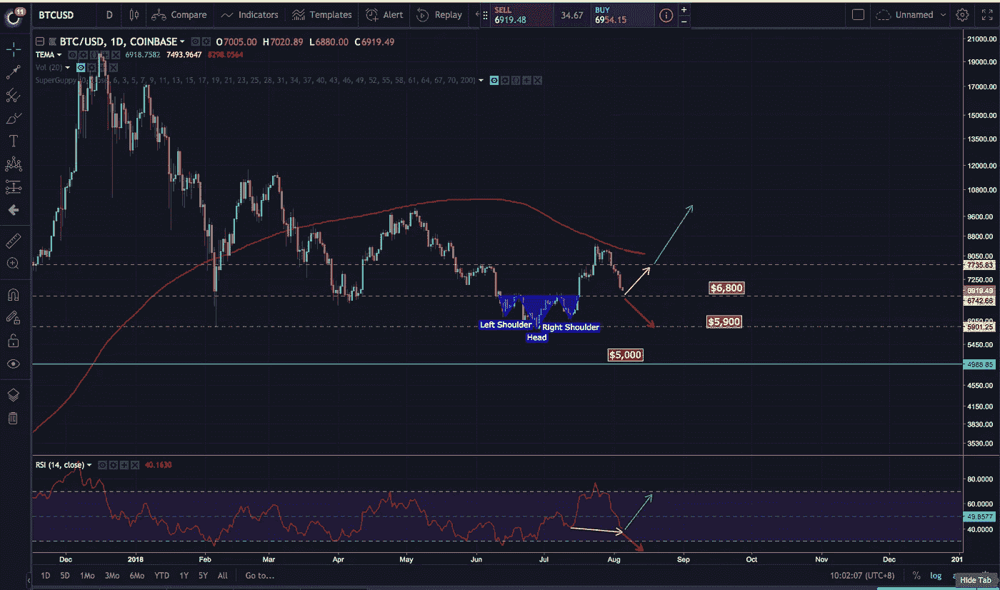**

**As of 5th August 2018**

***突破前的先有形态* : **反头&肩** *关键支撑*:6800 美元*关键阻力:***7700 美元****

** [## 头肩底(反转)[图表学校]

### 形成头肩顶和头肩底形态的价格行为大致相同…

stockcharts.com](https://stockcharts.com/school/doku.php?id=chart_school:chart_analysis:chart_patterns:head_and_shoulders_bottom_reversal) 

# 看涨的观点

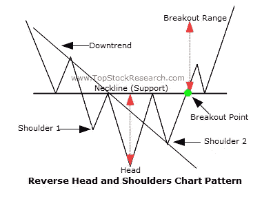

[http://tutorials.topstockresearch.com/ChartPatterns/ReverseHeadAndShoulder/TutorialsOnReverseHeadAndShoulderChartPattern.html](http://tutorials.topstockresearch.com/ChartPatterns/ReverseHeadAndShoulder/TutorialsOnReverseHeadAndShoulderChartPattern.html)

逆(或反转)头肩底形态是下跌趋势后形成的强大反转形态。自今年年初以来，比特币一直处于下降趋势，在接近 6000 美元的强劲水平支撑处形成这一倒 H & S 可以被视为一个巨大的看涨信号。

关键支撑点将是 6800 美元，这一反 H & S 才能成功结束。和所有主要形态一样，强烈建议进行突破测试，以延续看涨情绪。然而，如果比特币未能在 6800 美元找到支撑，情况将会大不相同。

**关键阻力**可在 7700 美元附近找到，与日线 200 毫安重合。如果价格能够收于 7700 美元以上，这可以被视为一个巨大的看涨信号，表明我们已经走出了下跌趋势。

**相对强弱指数**潜在形成**隐藏多头背离。它还没有形成，所以我只是基于推测。如果 6800 美元成功守住，隐藏的多头背离将形成，多头将把这视为推动价格上涨的强烈信号。**

## — — — — — — — — — — — — — — — — — — — — — — — — — — — — — — —

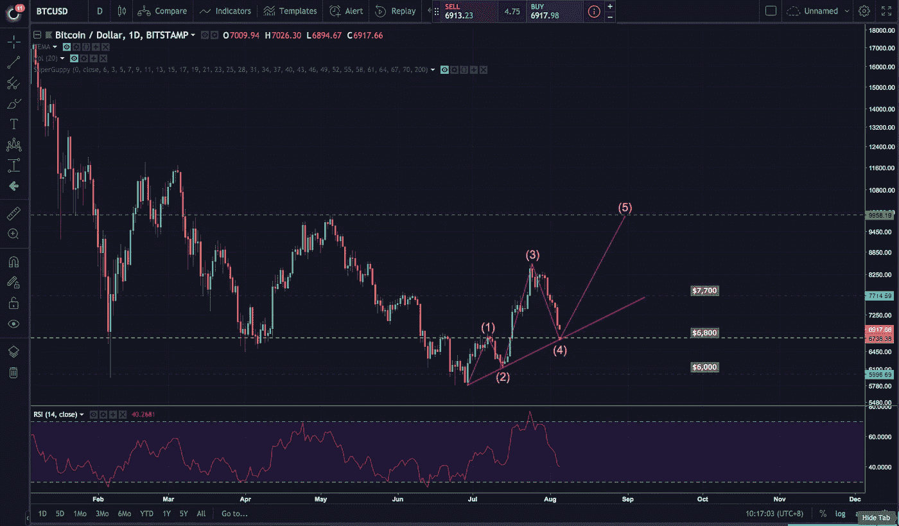

*优势格局* : **艾略特波浪理论** *关键支撑*:*关键阻力:***【8500】$ 10000**

 [## 艾略特波浪基础[查特学校]

### 艾略特波浪理论是由 R.N .艾略特提出的，并由罗伯特·普雷希特推广。这个理论断言人群…

stockcharts.com](https://stockcharts.com/school/doku.php?id=chart_school:market_analysis:elliott_wave_theory) 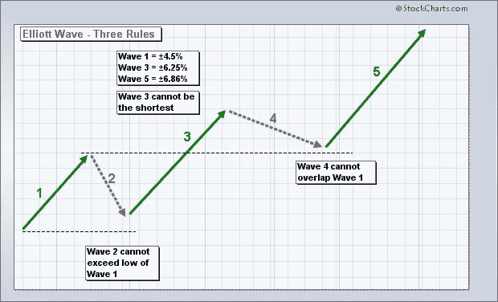

**艾略特波浪理论的三个规则—**

**规则 1** :波 2 不能回撤超过波 1 的 100%
**规则 2** :波 3 永远不能是三个脉冲波中最短的
**规则 3** :波 4 永远不能重叠波 1。

有了比特币，我们成功地遵守了第一条和第二条规则。现在我们必须看看比特币是否会跌破 6800 美元，这将使这一理论变得无用。

让我们分析每一个波—

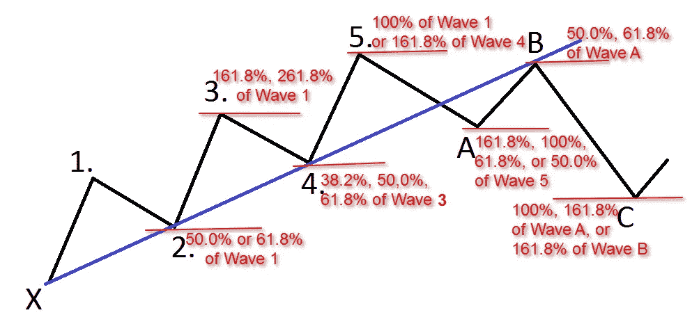

# ✅第二波—

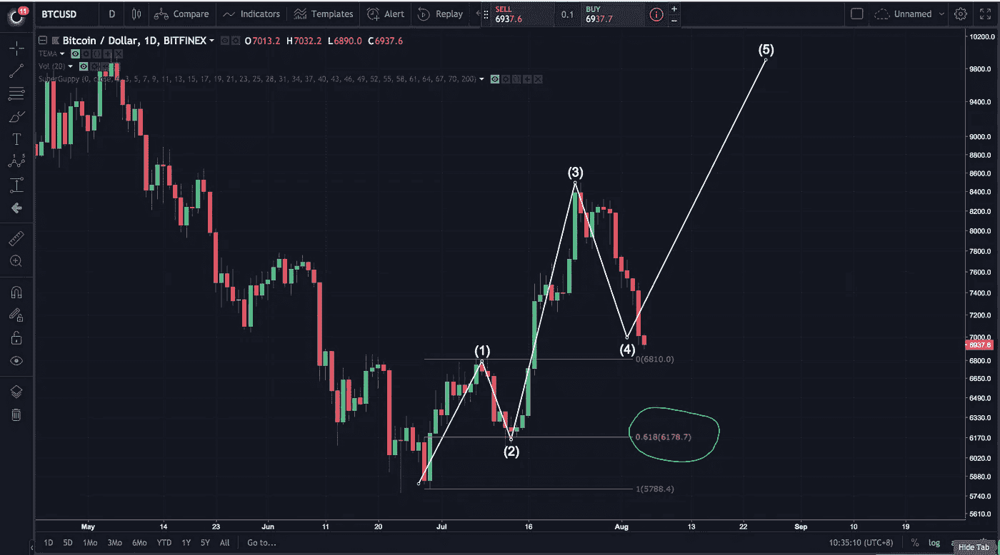

假设波浪 1 已经形成，使用上面的指南，波浪 2 可以达到的最低值是波浪 1 的 61.8%。而这里我们可以看到 **Wave 2 完美的落在了 0.618 fib** 上。

# ✅第三波—

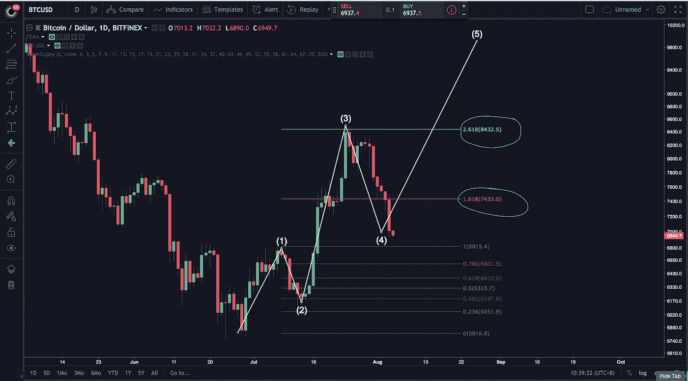

第三波不可能是最小的波，它就在这里。使用上面的指南，第三波将是第一波的 161.8%或 261.8%。**斐波那契工具表明，我们已经成功实现了这一点。我们在 161.8%遇到了某种形式的阻力，但几天后它继续直线上升至 261.8%。**

# ⚠️第四波—

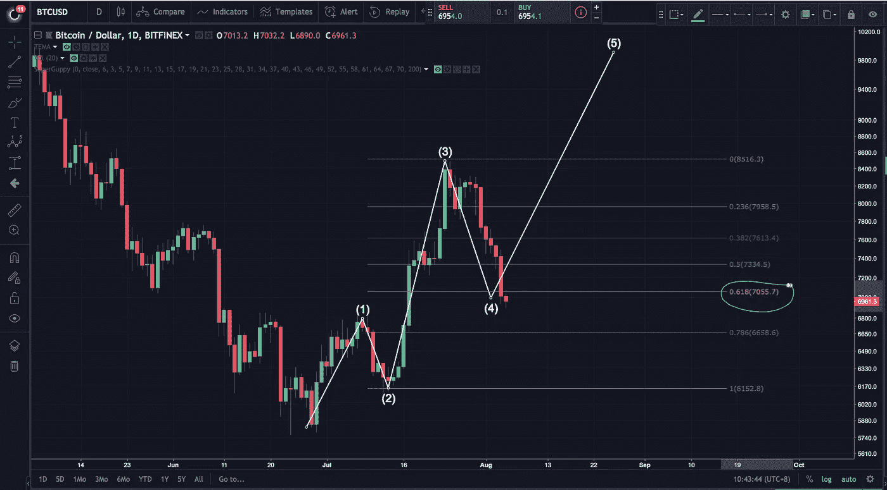

第四波被视为艾略特波浪理论中的一个谜。有几个学校如果低于 0.5 fib 水平就不算 wave 4。有的学校确实算到了 0.618 fib 水平。但是艾略特波浪理论的主要规则是，**第 4 波*不能低于第 1 波的顶部。****【6800 美元是持有*的关键价格，如果我们成功从这个价格起飞，我们可以预计比特币将遭遇新的阻力。

# ⚠️第五波—

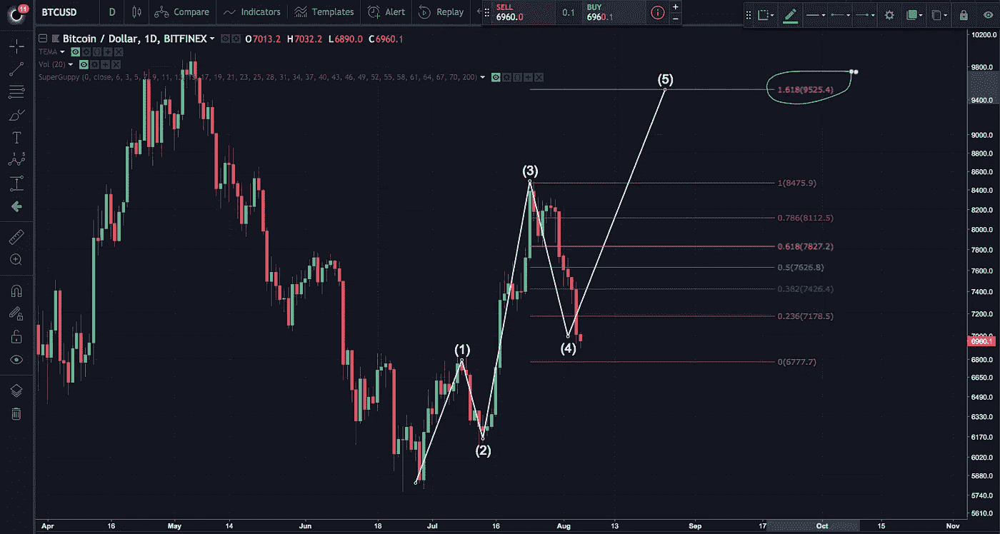

第五波还没有结束，所以我们猜测。如果 Wave 4 成功反弹到 wave 1 上方，我们可以预计比特币至少会达到 7700 美元。浪 5 能带我们走的最高是下一个 10000 美元的摆动高阻力。第五波被认为是最后一波冲量，通常，散户会把这波冲量印在图上。

# ✅第一波—

为什么我只在这里开始谈论第一波？第一波是最难发现的，因为它出现在雷达之下。随着第二波和第三波出现在图表上，我们可以假设第一波已经发生。第一波代表有关于“某些东西”的信息的早起鸟、机构或交易者。在这种情况下，这是比特币交易所交易基金的消息。

# 校正波 ABC —

我的推测是，这次埃利奥特波运动的校正波将在 9 月出现，所以我们将在下个月访问它们。

## — — — — — — — — — — — — — — — — — — — — — — — — — — — — — — —

多头交易者预计在 6800 美元准备买入。让我们希望公牛队是强大的。

这些分析来自牛市的观点。

让我们从熊的角度来看一下…

## — — — — — — — — — — — — — — — — — — — — — — — — — — — — — — —

# 看跌的观点

*截至 2018 年 8 月 5 日*

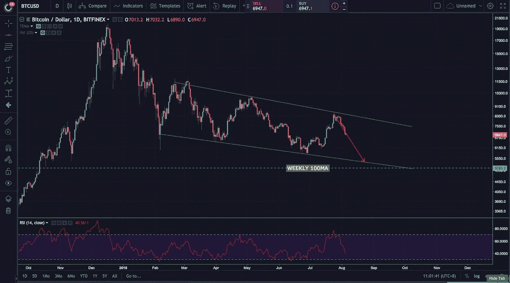

DAILY CHART — BEARISH CHANNEL

*主导格局* : **看跌通道** *关键支撑位*:**6800 美元 5800 美元 5000 美元** *关键阻力:***【8500 美元**

 [## 价格通道(续)[图表学校]

### 价格通道是向上或向下倾斜的连续图形，由上下趋势线限定。的…

stockcharts.com](https://stockcharts.com/school/doku.php?id=chart_school:chart_analysis:chart_patterns:price_channel_continuation) 

由于我们还在熊市中，比特币正在形成明显的熊市通道。自 6 月底以来的上涨只是下跌趋势中的一次修正。

**需要注意的关键价格**:
**6800 美元是反转 H &的爆发点，对多头来说至关重要。跌破这个价格当然可以将比特币拉低至 5800 美元，并最终在 9 月份达到 5000 美元。**

**仅从上面的图表来看，空头交易者将目标锁定在通道底部。如果比特币跌破 6800 美元，我们可以预计会有大量空头交易者进入，导致比特币进一步暴跌。**

**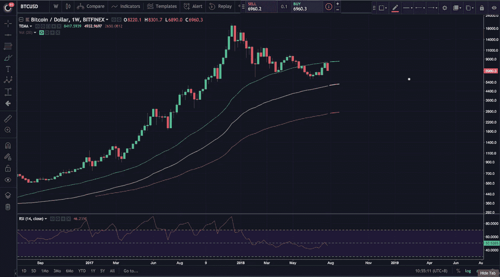**

**WEEKLY CHART — MOVING AVERAGES**

**在周线图上，我们可以清楚地看到周线 50MA 的大规模拒绝。拒绝可能会将比特币的价格拉低至 100 毫安，目前为 5000 美元。**

**RSI 未能突破(并保持)50 以上，这意味着卖方在控制。**

**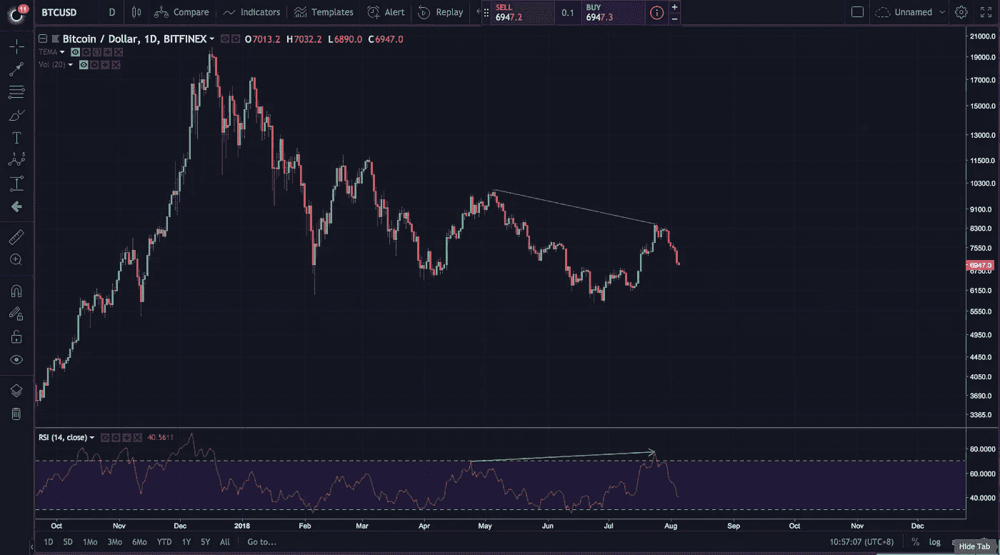**

**DAILY CHART — HIDDEN BEARISH DIVERGENCE**

**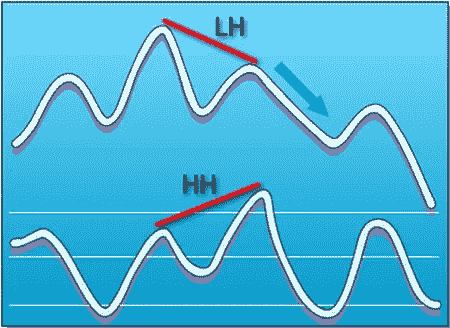**

**Hidden Bearish Divergence Example**

**在日线 RSI 上可以看到巨大的看跌信号。一个隐藏的看跌分歧已经形成，它可能会将比特币拉低至**6800 美元****

****—————****

# **结论和个人想法**

****(再次)价格预测****

**如果多头很强，价格在 8500 美元到 9800 美元之间**

**如果空头很强——5900 美元到 5000 美元**

**我是偏牛的。**

***—————***

**个人感觉比特币会反弹 6800 美元，看完成冲动艾略特波浪运动。这将导致比特币从熊市通道中挣脱出来，我们因此可以找到更绿色的牧场。**

**瓦内克对****比特币交易所交易基金**的决定承载了加密领域投资者的所有希望和梦想。如果获得批准，我们肯定可以看到第五波了。如果遭到拒绝，看跌的情景将会上演。我们必须等待，看看会发生什么。****

**** [## 文克莱沃斯比特币 ETF 被拒，但瓦内克 ETF 有机会获批| NewsBTC

### 继美国证券交易委员会(SEC)决定拒绝文克莱沃斯的比特币 ETF 申请后…

www.newsbtc.com](https://www.newsbtc.com/2018/07/27/winklevoss-bitcoin-etf-was-rejected-but-vaneck-etf-has-a-chance-to-be-approved/) 

每天都有大量的看涨消息出现，但价格却显示出相反的情况。操纵的说法越来越多，但技术分析不会说谎，我们可以看到比特币价格下跌的原因。

 [## 一位投资者表示，星巴克的加密举措可能有助于将比特币存入你的退休账户

### 星巴克全押在加密货币上是“比特币今年最大的新闻”——因为它为一个…

www.cnbc.com](https://www.cnbc.com/2018/08/04/brian-kelly-bitcoin-could-come-to-your-401k-with-starbucks-bakkt.html)  [## 尽管纽约证交所发布了比特币“年度最大新闻”，但加密市场一眨眼就暴跌了

### 今天，8 月 4 日，加密市场经历了令人眩晕的暴跌，比特币(BTC)在 6 个小时内损失了近 500 美元…

cointelegraph.com](https://cointelegraph.com/news/despite-nyses-biggest-news-of-the-year-for-bitcoin-crypto-markets-plummet-in-a-blink) 

我们将在未来几个月内知道比特币的结果，这只是时间问题。正如 7 月份的分析中提到的那样，这个领域现在发展得更快了，我预计我们将在 2018 年剩下的时间里看到更多的工作。

你个人对 8 月份的比特币有什么预测？

下面让我知道你的想法！:)

— — — — — — — — — — — — — — — — — — — — — — — — — — — — — — —

在 [Medium](/@iliyazaki) 上关注我，以获得我即将发表的文章的即时更新，在这些文章中，我讨论了围绕加密货币、一般投资和技术分析的主题。

也请在其他社交媒体平台关注我:
[推特](https://twitter.com/IZCrypto)
[Youtube](https://www.youtube.com/channel/UCrq04Mv5pAhKCilZROQ2jjg?)

— — — — — — — — — — — — — — — — — — — — — — — — — — — — — — —

— — — — — — — — — — — — — — — — — — — — — — — — — — — — — — —

Iliya Zaki 是 Moonwhale Ventures 的营销和社区经理。

Moonwhale Ventures 是一家咨询公司，为公司、中小企业或上市公司的[区块链](https://hackernoon.com/tagged/blockchain)应用提供咨询，以提高价值链的效率，并通过 ICCO STO(令牌化)为业务扩张提供新的创新融资方式。

*   更多信息请访问我们的网站—[http://moonwhale.io/](http://moonwhale.io/)
*   在我们的各种社交媒体平台上关注我们。—
    [insta gram](https://www.instagram.com/moonwhalebv/)
    [Twitter](https://twitter.com/MoonwhaleBV)
    [LinkedIn](https://www.linkedin.com/company/moonwhalebv)
*   加入我们的电报全球集团—【https://t.me/moonwhaler】******