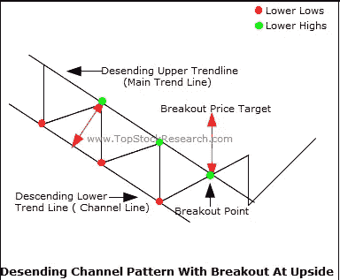

# 比特币价格分析——7 月展望

> 原文：<https://medium.com/hackernoon/bitcoin-price-analysis-july-month-outlook-a27d9e71cd08>

首先让我说，这些仅仅是我自己的研究和观察。我的研究不是财务建议，只是用来指导和休闲。

# **价格预测**

7 月可能会变得非常有趣，并可能为更大的价格波动奠定基础。

截至 7 月底:

如果多头很强——**$ 7500 到$ 8100**

如果空头很强——**$5，900 到$ 5，000**

有各种方法来剖析比特币图表提供的价格走势数据。在这里，我将尝试从看涨和看跌两个角度进行陈述，以尽可能保持中立。

> 看涨=偏向价格升值或上涨
> 
> 看跌=偏向价格贬值或下跌

让我们来看看为什么我会这样想..

*—————*

**但首先..**

**线性与对数标度**
请阅读本文，以了解线性标度和对数标度之间的区别:

 [## 对数价格标度和线性价格标度有什么区别？

### 不同的交易者对股价图的解读会有所不同，这取决于他们在…

www.investopedia.com](https://www.investopedia.com/ask/answers/05/logvslinear.asp) 

或者可以参考这篇解释使用比特币的 Medium 文章:

 [## 线性与对数标度图表

### 请提前阅读这篇文章:http://www.investopedia.com/ask/answers/05/logvslinear.asp

medium.com](/@bullofcrypto/linear-vs-log-scale-charts-52973cfc35ef) 

由于加密货币的波动性，价格行为可能涉及巨大的波动，因此考察线性和对数标度至关重要，因为它们可能会显示不同的数据。

## — — — — — — — — — — — — — — — — — — — — — — — — — — — — — — —

# 线性尺度下的比特币分析

*截至 2018 年 7 月 3 日*

BTC / USD on Linear Scale (*As of 3rd July 2018)*

*突破前的前期形态* : **落楔** *关键支撑*:**6100 美元 5900 美元 5000 美元** *关键阻力:***【6800 美元 7700 美元**

 [## 下降楔形(逆转)[沙特学校]

### 下降的楔形也可以归入延续范畴。作为延续形态，下降的楔形仍然会…

stockcharts.com](http://stockcharts.com/school/doku.php?id=chart_school:chart_analysis:chart_patterns:falling_wedge_reversal) 

# 看涨的观点

From dailypriceaction.com

下跌的楔形形态主要是看涨的盘整形态。我的图表分析是基于上图描绘的常见价格变动，在之前的波动高点可以找到阻力。

**关键支撑点**将是 6100 美元和 5900 美元，因此我们可以预计比特币将在短期内跌至这些水平，然后才会出现更大幅度的上涨。

关键阻力可以在 6800 美元附近找到，因为它曾经是一个强有力的支撑区，此前在 4 月份被多头占据。在上涨之前，多头必须聚集在一起，突破这个价格区域，并在此之上收盘

相对强弱指数(RSI)显示出**看涨背离**，预示着可能的趋势反转。该指标进一步强调了可能的上涨趋势。

BTC / USD Weekly — Bullish Perspective (*As of 3rd July 2018)*

在周线图上，我们可以看到在大约 5800 美元到 6000 美元的区域有强有力的支撑，之前多头曾两次持有该区域:11 月 17 日和 4 月 18 日。多头可以假设他们已经成功防守了支撑区，并开始向周破 50MA(8100 美元以上)反弹。

不幸的是，周 RSI 低于 50，这意味着潜在的下跌空间仍然存在。然而，如图所示，它向上弯曲并准备再次停留在 50。如果多头能够将其推至 50 以上，这将是趋势反转成功的信号。

## — — — — — — — — — — — — — — — — — — — — — — — — — — — — — — —

# 对数尺度的比特币分析

*截至 2018 年 7 月 3 日*

BTC / USD on the Log Scale (*As of 3rd July 2018)*

*突破前的前期形态* : **下降通道** *关键支撑*:**6400 美元 5900 美元 5000 美元** *关键阻力:***【6800 美元 7700 美元**

 [## 价格通道(续)[图表学校]

### 价格通道是向上或向下倾斜的连续图形，由上下趋势线限定。的…

stockcharts.com](http://stockcharts.com/school/doku.php?id=chart_school:chart_analysis:chart_patterns:price_channel_continuation) 

[http://tutorials.topstockresearch.com/ChartPatterns/Channel/DescendingChannel/TutorialOnDescendingChannelPatterns.html](http://tutorials.topstockresearch.com/ChartPatterns/Channel/DescendingChannel/TutorialOnDescendingChannelPatterns.html)

下降通道主要是一种熊市延续形态。然而，比特币显然已经突破了通道，并正在寻求重新测试突破的阻力线。

目前，比特币位于 6400 美元(截至 7 月 3 日)的**关键支撑位，因为它正在重新测试该通道的破阻力线，它可能会从这里走高，并在未来几天再次测试 6800 美元。多头成功反弹后，我们将看到比特币走向下一个高点 7700 美元。**

BTC / USD Target for Bulls (*As of 3rd July 2018)*

相对强弱指数(RSI)显示出**看涨背离**，预示着可能的趋势反转。该指标进一步强调了可能的上涨趋势。

这些分析来自牛市的观点。

让我们从熊的角度来看一下…

# — — — — — — — — — — — — — — — — — — — — — — — —

# 看跌的观点

*截至 2018 年 7 月 3 日*

BTC / USD on both Log Scale and Linear Scale(*As of 3rd July 2018)*

下面是空头会在图表上看到的东西，来支持他们的主张和预测。

BTC / USD — Bearish perspective (*As of 3rd July 2018)*

使用日均线(50，100，200)，很明显我们处于熊市。有句话叫“永远不要逆着主导趋势交易”。我们可以假设交易者会在每一次反弹和每一次阻力时卖出。由于比特币未能突破 6800 美元，在多头的另一次防守任务之前，比特币有可能再次向 5900 美元下跌。

在 5900 美元，将会有另一场空头和多头之战。如果空头获胜，我们可以预计比特币将跌至 5000 美元。

BTC / USD WEEKLY CHART — Bearish perspective (*As of 3rd July 2018)*

在周线图上，我们可以清楚的看到比特币重新测试了 4 月的破位支撑。周 50MA 也明显被打破，因此，比特币进一步跌至 100MA 的可能性相对较高。目前，100MA 价格为 4700 美元，7 月底将向 5000 美元迈进。

周 RSI 明显低于 50，距离超卖还有很长的路要走，这意味着进一步的下跌空间很大。然而，如图所示，它正在向上弯曲，并准备再次测试 50。如果空头成功击退了多头的努力，RSI 将继续向下。

BTC / USD — Hidden Bearish Divergence (*As of 3rd July 2018)*

Example of a **Hidden Bearish Divergence**

然而，日线 RSI 显示出**隐藏的看跌背离**的迹象，这可能会导致比特币在下一次移动之前向下一个支撑线 5900 美元下跌。

如果空头成功利用这种隐藏的熊市背离，我们可能会看到进一步下跌到 5000 美元。

**——————**

# 结论和个人想法

**价格预测(再次)**

如果牛市强劲，7 月底将达到 7500 美元到 8100 美元

如果熊市强劲，7 月底将达到 5900 美元至 5000 美元

*—————*

从分析中你可以看出，有许多“如果”和“当”。技术分析和图表使用历史或“价格记忆”来决定结果的概率。**它不是水晶球。**所有图表和技术分析所能提供的数据都是用来在管理你的投资组合时制定策略的。

尽管我为多头提供了一个看似更强有力的理由，但这并不意味着事情会这样发展。作为一名投资者，请记住，我对多头有潜在的偏见是很自然的。

比特币和大多数替代币开始在图表上显示出市场情绪的转变，从看跌转为看涨。但全世界都在等待一个清晰的信号开始涌入。

 [## 面向机构投资者的“比特币基地托管”现在“正式开业”

### 美国主要的加密交换和钱包提供商比特币基地今天推出了其数字资产托管解决方案，用于…

cointelegraph.com](https://cointelegraph.com/news/coinbase-custody-targeting-institutional-investors-now-officially-open-for-business) 

整个密码社区都在等待他们到来时来自机构的任何暗示。比特币基地的拘留提供了一个巨大的迹象，这很可能比我们预期的要快。

 [## SEC 开放 ETF 市场，加密货币机遇敲门？

### 在提议简化推出交易所交易基金(ETF)的流程后，美国的证券和…

cryptoslate.com](https://cryptoslate.com/sec-opens-up-the-etf-market-opportunity-knocks-for-cryptocurrency/) 

在监管方面，目前仍不清楚当局将加密货币放在哪里。[区块链](https://hackernoon.com/tagged/blockchain)技术及其衍生实体:加密货币吸引了世界各界的关注，特别是自最近 12 月 17 日/1 月 18 日的价格爆炸以来。**期待太空比往年进展更快**。只有当不同国家的政府提供了监管透明度，我们才会经历该领域的下一轮牛市，尽管在我看来，这是一轮缓慢而稳定的牛市。

请记住**的秘密领域非常容易受到 FUD 和坏消息的影响。**此外，目前的趋势是看跌，因此，应该始终牢记进一步下跌的可能性。一个简单的交易所被黑可能导致价格进一步下跌。如下文所示:

 [## 币安可能被黑 4500 万美元，宣布计划外维护

### 黑客状态:未经证实-没有来自币安团队的细节更新#1:币安宣布计划外的系统维护…

stocksgazette.com](https://stocksgazette.com/2018/07/03/binance-potentially-hacked-for-45-million-announces-unplanned-maintenance/) 

就像图表和技术分析一样，同时从空头和多头的角度看总是明智的。只有这样，我们才能为自己的投资组合制定最佳策略。

你个人对 7 月份的比特币有什么预测？

下面让我知道你的想法！:)

— — — — — — — — — — — — — — — — — — — — — — — — — — — — — — —

在 [Medium](/@iliyazaki) 上关注我，以获得我即将发表的文章的即时更新，在这些文章中，我讨论了围绕加密货币、投资和技术分析的话题。

也请在其他社交媒体平台上关注我:
[Twitter](https://twitter.com/IZCrypto)
[Youtube](https://www.youtube.com/channel/UCrq04Mv5pAhKCilZROQ2jjg?)

— — — — — — — — — — — — — — — — — — — — — — — — — — — — — — —

伊利亚·扎基是 Chainfund 的社区经理。

Chainfund 成立于 2017 年，提供**一键式投资体验**，旨在*对所有人*开放*并*可访问。Chainfund 用他们的理念证实了他们雄心勃勃的本质——投资于具有长期价值和增长的高潜力加密资产。

*   阅读更多有关我们无缝平台的信息，该平台目前包括中等@[【https://goo.gl/rArrRp】T21](https://goo.gl/rArrRp)的动态、极端和 ICO 投资组合
*   注册@[http://chain fund . ch](https://chainfund.ch/)独家接收报告，体验一键投资。投资从 1000 美元开始。
*   加入我们的电报全球集团—[**https://t.me/chainfund**](https://t.me/chainfund)