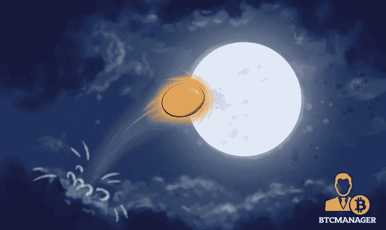

# 比特币私人(本周最佳照片！)

> 原文：<https://medium.com/hackernoon/bitcoin-private-the-moonshot-of-the-week-ada0235af378>

*在这里* *阅读我们 Moonshot 系列* [*的第八部，其中重点介绍了斯诺维奥。*](https://btcmanager.com/moonshot-week-8-snov-marketplace-launching-mar-31-2018-or-earlier/)

每周 BTC 经理和 JaketheCryptoKing 都要探索一个新的机会。这个登月实验已经进行到第九周了！市场刚刚经历了一次大的调整，这为打折购物提供了绝佳的机会。3 月 26 日开始的一周的月亮照；[**BTCP**](https://coinmarketcap.com/currencies/bitcoin-private/)**(比特币私人)。**

# 比特币私人(BTCP)

主要[加密货币](https://hackernoon.com/tagged/cryptocurrencies)的分叉已经成为 2018 年的最新热潮。2017 年见证了 ICO 市场的兴衰，主要监管机构参与了大规模 ICO 收购美国投资者和可能具有欺诈性的小规模 ICO。不应该担心监管机构的介入，因为这将允许机构资金涌入该领域。然而，自从 ico 受到越来越多的审查后，主要的开发团队已经将他们的注意力转移到硬币的新创造上；一把叉子。

有两种类型的叉子(软叉子和硬叉子)。在一个实例中，底层代码被更新，并且仅存在一个密码。在另一种情况下，基础代码被更新，硬币“分裂”并且新的硬币被提供有更新的代码，而旧的硬币保留；这导致最初的硬币持有者收到第二个“分叉”硬币。2017-2018 年从[比特币](https://hackernoon.com/tagged/bitcoin)上帝到比特币黄金的过多分叉表明了开发团队对创建分叉硬币的兴趣。比特币私人是披着比特币名字的比特币的最新分支之一，但 [zk-SNARKs](https://z.cash/technology/zksnarks.html) 隐私功能 [ZClassic](https://coinmarketcap.com/currencies/zclassic/) 。光是这个名字就足以让 BTCP 看到大规模采用，但通过结合目前 BTC 缺失的隐私技术，BTCP 比其他 BTC 福克斯有优势。

[比特币现金](https://coinmarketcap.com/currencies/bitcoin-cash/) (BCC)是 BTC 迄今为止最昂贵的叉子，价格为 923 美元，市值超过 155 亿美元。BCC 只是加快了 BTC 的交易速度，并降低了交易成本。然而，BTCP 做了同样的事情(更快的交易速度，更便宜的交易)，但也纳入了许多投资者喜欢的隐私功能。与 BTC 的其他分支相比，这使得 BTCP 能够在更高的水平上竞争。这个名字将使 BTCP 能够以非常高的竞争力与其他隐私硬币竞争，同时也比 BTC 福克斯更有效地工作。

每 BTCP 26.50 美元，市值不到 5 亿美元，BTCP 在定价与 BCC 竞争之前可以升值 3000%。BTC 与 ZCL 通往 BTCP 的共同岔路发生在 2018 年 3 月 1 日。几天后，这枚硬币开始交易，并于 3 月 12 日达到 88 美元以上的峰值。自 3 月 12 日以来，BTCP 已经修正了 70%以上，允许以 14 天前交易价格的一小部分购买。市场上充斥着来自 BTC 的 BTCP 和 ZCL 的霍尔德收到他们的 BTCP，并希望卸载。既然许多卖家已经抛售了手中的股票，BTCP 应该会在整个加密货币市场上表现良好。

BTCP 全国各地都有许多激动人心的聚会和活动。在分叉之后，通常是开发团队享受了一个不错的兑现，而项目被留下来等死。BTCP 是非常不同的，因为开发团队和创始人仍然在举行会议，并积极改善分叉硬币的效用和市场采用。当与许多其他分叉硬币相比时，非常明显的是，BTCP 拥有更好的团队，并将继续增加市场采用，同时团队传播关于 BTCP 的存在，如何开采它，如何参与等的消息。接下来的几个月，BTCP 应该会再次接近两周前的高点，涨幅可能超过 200%。如果 BTCP 接近 BCC 市值的 20 %,收益将超过 600%。

# 结论:叉子是所有分叉的热潮

BTCP 超过了大多数叉形硬币失败的地方。他们有一个长期致力于这个项目的开发团队，他们有品牌和备受追捧的隐私功能。当某样东西的价值确定后，品牌总是会增加显著的价值。BTCP 有这个名字和商标。它们还具有隐私功能，为那些试图恶意使用加密货币的人增加了价值。最后一个方面是团队，团队致力于硬币的长期发展，同时继续传播其意识，他们确保 BTCP 不会被遗忘，而是在短期和长期内保持相关性。

在过去的几个月里，整个市场急剧下跌。在这段巨大的调整时期，BTCP 经历了分叉和启动。当即将到来的反弹开始时，BTCP 将是最大的受益者之一。这枚硬币在没有添加任何主要平台的情况下，有很高的可能性登月。当一家大型交易所宣布 BTCP 交易时，火箭发动机将被点燃，为 BTCP 的登月做准备。这可能在一周或一个月内发生；交易所增加采用新硬币的时间框架永远无法保证。

随着 BTCP 的交易量仅为 14 天前的一小部分，如果你相信一个[比特币](https://btcmanager.com/news/bitcoin/)品牌的隐私币的名称品牌、隐私功能、可能加入一个主要交易所、团队和长期前景，这是一个积累的绝佳机会。2018 年可能是狗年，但在加密货币市场，这将是牛年。当任何主要的催化剂在那个方向提供一个推力时，期待 BTCP 开始它的趋势北。

要看本周行情分析或者 BTCP 的进一步分析查看原文这里:[**https://BTC manager . com/moon shot-week-9-btcp-比特币-private-a-forking-craze/**](https://btcmanager.com/moonshot-week-9-btcp-bitcoin-private-a-forking-craze/)

***阅读国王之前的文章，了解他目前推荐哪些 ICO，或者直接与国王取得联系，可以在 Twitter (@JbtheCryptoKing)或者***[***Reddit***](https://redd.it/81hj5q)***(ICO 更新和每日报道)。***

*要阅读整个 Moonshot 系列，点击* [*这里*](https://btcmanager.com/guide/moonshot/) *。*