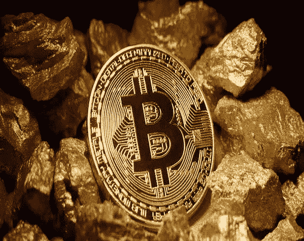

# 在下周的硬分叉之前，比特币反弹至 6615 美元，比特币现金泵

> 原文：<https://medium.com/hackernoon/bitcoin-rallies-to-6-615-and-bitcoin-cash-pumps-before-next-weeks-hard-fork-3f50f716cd21>

**市场状况—2018 年 11 月 7 日** [**BTC**](https://berminal.com/coins/Bitcoin-BTC)**:$ 6528.88(+1.32%)** [**ETH**](https://berminal.com/coins/Ethereum-ETH)**:$ 218.08(+1.60%)** [**【XRP**](https://berminal.com/coins/XRP-(Ripple)-XRP)**:$ 0.5338(+0.96**

加密货币市场保持着昨天的涨幅，比特币在昨天达到 6615 美元的高点后，现在的交易价格略高于 6500 美元。以太币出乎投资者的意料，反弹至 225 美元，目前交易价格超过 215 美元。XRP 也继续上涨，现在交易在 0.50 美元以上。目前，总市值为 2190 亿美元。

其他新闻方面，[随着 11 月 15 日硬分叉的临近，比特币现金(BCH)飙升至 600 美元以上，](https://berminal.com/news/113695/Bitcoin-Cash-BCH-Surges-Above-600)区块链透明研究所(block chain Transparency Institute)的一份报告发现，加密货币交易所继续“大幅扩大交易量”，并利用小盘币。

据报道，在美国对伊朗伊斯兰共和国实施更严厉的经济制裁后，一些加密货币交易所切断了与伊朗的联系。这些措施将使伊朗人更难跨境交易加密货币，币安和 Bittrex 等交易所将不再向伊朗公民提供服务。有报道称，特朗普政府在 7 月实施了第一轮制裁，美国政府据称没收了伊朗拥有的价值近 600 万美元的 BTC。据报道，德黑兰正在开发一种国家加密货币，以弥补经济紧缩。([阅读更多](https://berminal.com/news/113514/Global-Cryptocurrency-Exchanges-Cut-Ties-With-Iran-After-New-US-Sanctions))

美国金融当局将从 Deltec 银行没收 12 亿美元，用于帮助委内瑞拉总统尼古拉斯·马杜罗洗钱。在经历了数周对 USDT 未来的不确定性后，Deltec 最近被披露为 Tether 的官方银行合作伙伴。委内瑞拉石油公司(Petroleos de Venezuela，S.A .)前财务首席执行官亚伯拉罕·埃德加多·奥尔特加(Abraham Edgardo Ortega)在与美国政府达成认罪协议后透露了细节。虽然在一些交易所，Tether 的价格回到了 1.00 美元，但 Deltec 的问题可能会再次影响价格。([阅读更多](https://berminal.com/news/113784/Tethers-New-Bank-Is-In-Trouble-For-Laundering-12-Billion))

**3)为了兑现在每个月的第一个星期二添加新加密货币支持的承诺，Ledger 在 Ledger Nano S 上添加了 6 种新加密货币，在 Ledger Blue 上添加了 4 种新加密货币。** Lisk，Factom，MIX，音乐币，GameCredits 和 EtherGem 将被添加到 Ledger Nano S，而只有最后 4 个将被添加到 Ledger Blue。新的加密货币由各自的社区部署，使今年第三方开发的应用数量达到 32 个。就在上周，Ledger 还增加了对 IOTA 的支持。([阅读更多](https://berminal.com/news/113747/Ledger-Adds-Support-For-6-New-Cryptocurrencies-On-Its-Hardware-Wallet))

[***订阅百慕达简讯***](https://visitor.r20.constantcontact.com/d.jsp?llr=myyhdl6ab&p=oi&m=1131022639884&sit=9ar6aztmb&f=776989ec-8460-43a4-b86a-bcf8f2f1bca7)

[***免费下载百慕大 App***](https://berminal.app.link/medium-post)

*[***百慕大官方电报***](https://t.me/berminal)*

*[***百慕大推特***](https://twitter.com/berminalapp)*

**