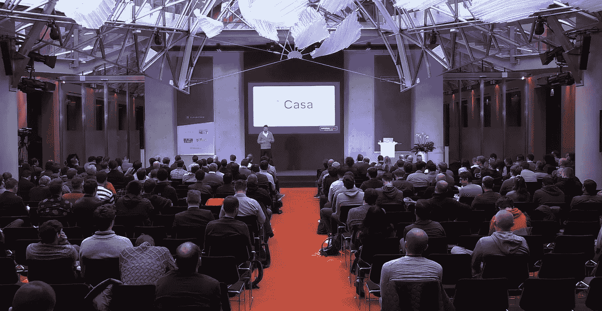
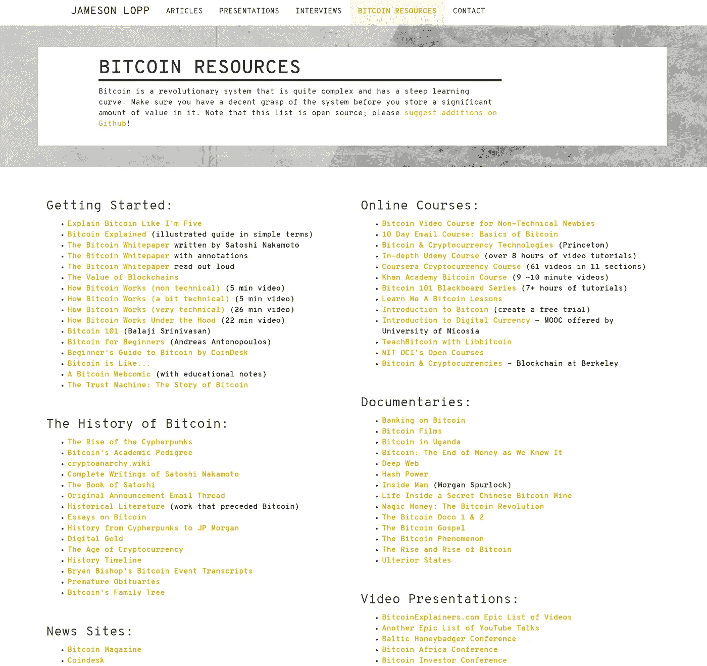
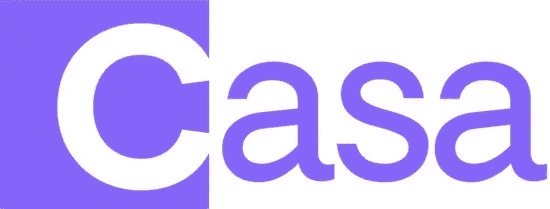
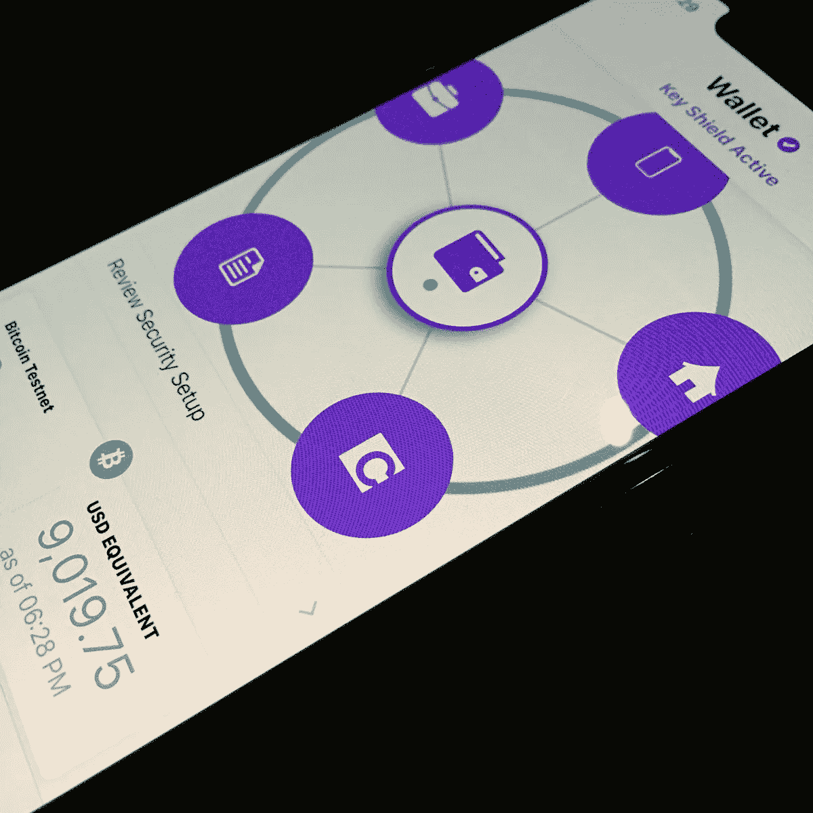
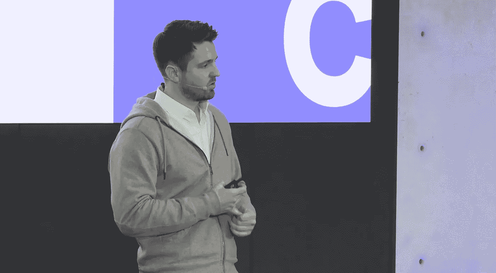
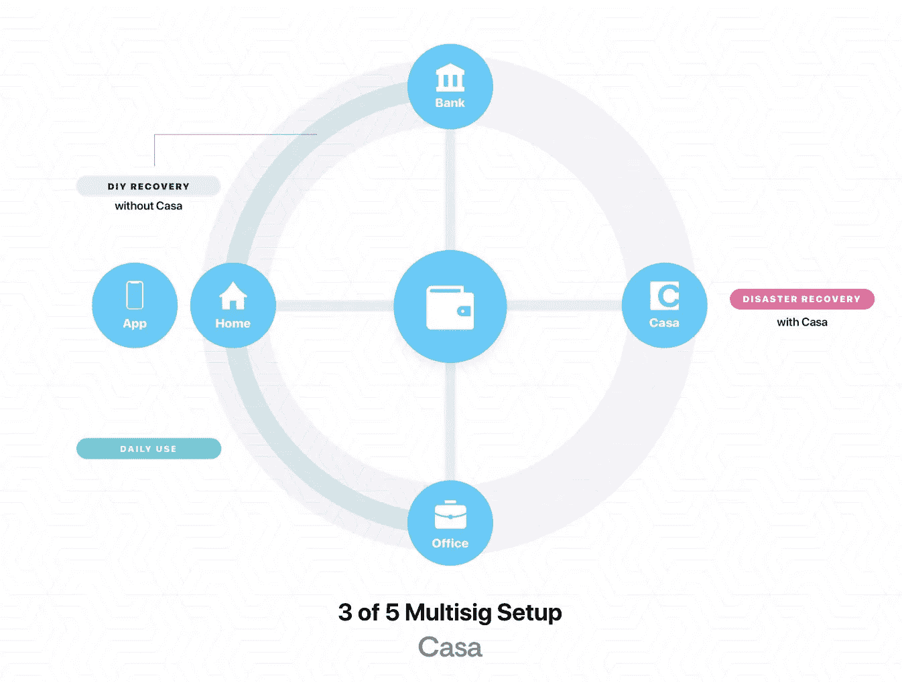
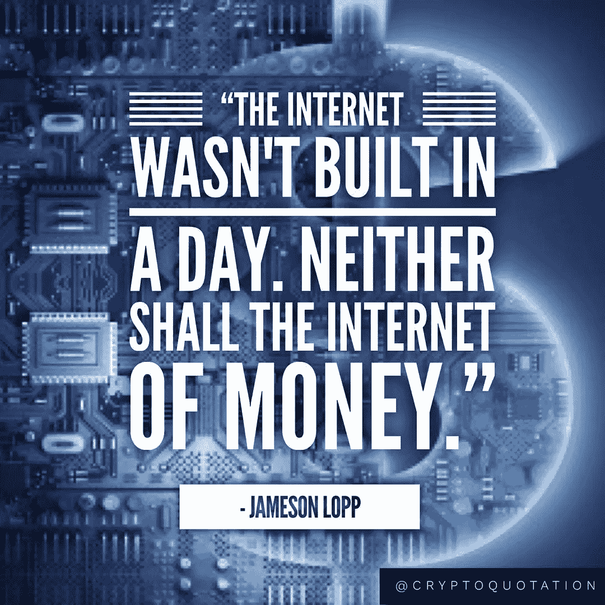
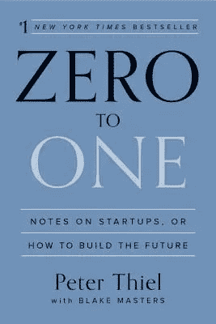
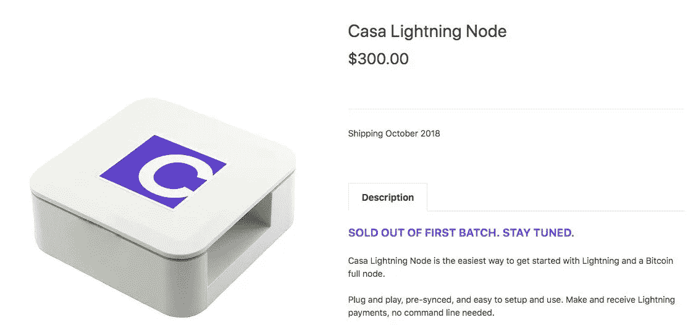

# 比特币安全锁定:采访 Casa 创始人杰里米·韦尔奇

> 原文：<https://medium.com/hackernoon/bitcoin-security-lockdown-interview-with-jeremy-welch-founder-of-casa-128b25bf0159>

Jeremy doing a presentation at Blockstack Berlin 2018

拥有比特币最具挑战性的一个方面是保护它，以免丢失或被盗。这个游戏没有第二次机会，人无完人。一个愚蠢的举动可能导致灾难。

随着时间的推移，一些人积累了大量的比特币，这些年来比特币的价值大幅上升。在家里或办公室的硬件钱包中持有大量比特币可能是一个可怕的提议，并让你面临许多潜在的债务。

在 [Casa](https://keys.casa/) 于 2017 年推出后不久，我就对其产生了兴趣。他们自诩为“高级 HODL 软件”，为你的比特币提供多重签名保护。这立刻引起了我的注意，从那以后我一直在观察它们的进化。

[Casa](https://keys.casa/) 向 Casa Premium 提供他们的多签名比特币存储解决方案，该解决方案围绕他们的“Casa Key Shield”构建，旨在保护大量比特币。他们最近还推出了 Casa Node，这是一种即插即用的闪电节点，一经推出就销售一空。

我想更深入地了解 Casa，并联系了创始人兼首席执行官杰里米·韦尔奇，以更多地了解他和他们正在开发的产品。杰里米是一个非常有趣的人，在产品发布的前几个月，我们设法安排了这次采访。

**在线身份:**

推特: [@jeremyrwelch](https://twitter.com/jeremyrwelch) 在推特上

**RJ:(真实工作)**

Casa 的创始人兼首席执行官，这是世界上最好的个人钥匙系统。

**在$BTC 游戏中的岁月:**

在 HODL 是一个术语

人们如何认识你？

Casa，这个星球上最好的个人钥匙系统。

今天的高级 multisig。闪电节点。更多详情:)

你的背景、教育或正规培训是什么？

我在 IT 和编程行业长大，然后在杜克大学学习政治哲学。大三的时候，我退学了，在金融危机期间搬到了纽约，加入了一家初创公司，并学到了很多关于建立在广告基础上的互联网的知识。我们把它卖给了谷歌，然后我回到杜克大学完成了我的学位。

**你是什么时候对比特币和加密产生兴趣的？**

我一直对哲学和系统感兴趣。后来我开始学习术语控制论，因为我对设计和思考最感兴趣。

所以我一直对货币体系和资本主义感兴趣。金融危机和我在谷歌的那段时间过后，我对全球资本体系是如何运作的有很多疑问。所以我回到杜克去完成。我大部分时间都在做独立的研究，花时间和研究生以及教授在一起，遵循我自己的探索路线。那段时间我发现了比特币。

你在这个领域最美好的经历是什么？

没有单一经历。路径和过程是它自己的奖励，包括挑战和重大胜利。

**告诉我们你最大的比特币或加密失败。**

哈，这里没有失败的专业。

嗯，不买更多。但是每个人都这么说。

**你个人从哪里获得比特币或加密新闻？**

当然是加密推特。

我一般尽量限制自己的新闻投入，看书多过随机新闻。

当你在隐蔽处之外的时候，你会做些什么来取乐。

写作、健身、电影和家庭时间。还有音乐。很多音乐。我和几个谷歌的朋友在一个金属乐队里演奏，我们的专辑还在网上流传。我最终想在另一个乐队演奏。

[Jameson Lopp’s site has a ton of great Bitcoin learning resources.](https://lopp.net/bitcoin.html)

**你能给刚接触比特币世界的人的最佳建议？**

耐心点，做长远打算。

点击这里阅读 Lopp 的介绍:

[https://lopp.net/bitcoin.html](https://lopp.net/bitcoin.html)

**你们来自哪里？**

我们到处都有基地。美国东西海岸，现在还有欧洲。我现在经常在路上，为客户和合作伙伴提供支持。

**是什么激励你推出 Casa？**

个人需求+对朋友家人的关心。我认识被袭击的人。我也看到许多公司集中服务，我们不能让这种情况发生。

如果我们处在一个集中的比特币世界，我认为这是一个失败。

但是，如果我们最终进入一个去中心化的比特币世界，你不能走在街上或与人交谈，因为害怕受到攻击，这也是一个失败。

我们正在解决。

**你是怎么想出这个名字的？**

它是从 Blockstack 上的一个应用程序的早期版本演变而来的。

在构建该应用时，我们清楚地了解了基于比特币的新计算堆栈的架构和权衡。我们知道节点和密钥管理对这个世界至关重要，所以我们放弃了这个应用程序，全力以赴。

而家是计算史，尤其是个人计算史的一个明确部分。

所以 Casa 是个人电脑的下一次进化。数字家庭。安全。法律上和逻辑上受到保护。

**向非技术人员解释 Casa 提供哪些服务？**

Casa 是一家财富安全公司。

我们的使命是“最大化个人主权和安全。”

Casa 帮助您保护您的财富(金钱和数据)。

A peek into the Casa wallet.

什么是关键管理，为什么你认为自己在这方面比任何人都强？

比特币和其他加密货币使用密钥来管理对资金的访问。

因此，管理你的钱就是跟踪你的钥匙。

像 Square Cash 这样的公司为你管理这些密钥。但是要真正控制你的资金，自己管理钥匙是很重要的。

不是你的钥匙，不是你的比特币。

Casa 是这个星球上最好的个人钥匙系统，因为我们为您提供其他钥匙系统无法提供的保护和功能。

多签名、多位置、易于使用，并有一个 24/7 的客户服务组为系统提供支持。我们也可以比任何人更好地处理继承问题。

**与现有的硬件钱包或其他冷藏选择相比，您的服务有何优势？**

我们在系统中使用 Trezor 和 Ledger 现有的硬件钱包。他们是伟大的产品和公司。

Casa 比这些系统更进了一步，它使我们的客户能够用多个设备而不是一个设备进行签名(这就是多重签名)。这意味着发送交易需要多个签名。在我们的例子中，总共需要五把钥匙中的三把。

现有的硬件钱包可以保护你免受一系列在线攻击，但它们可能会让你遭受人身攻击，甚至意外丢失。

Casa 更进一步，保护您免受物理攻击和意外丢失钥匙。此外，我们还可以帮助客户继承遗产。

很少有冷藏选项能给你带来同样的实用性和保护性。

Jeremy spends a lot of his time on the road supporting customers and clients.

**一万英镑的订阅费似乎有点高。为什么看起来你只关注精英？**

如果你需要 100 万美元以上的资金，1 万美元并不贵。

我们一直很清楚，我们不仅仅关注精英。

我们从最富有的霍德勒夫妇开始，因为他们有最大的需求。他们是受到攻击最多的人。

但我们的目标始终是将我们为 5 个客户中的 3 个开发的新技术推广到更广泛的领域。

卡萨闪电节点就是一个很好的例子。我们最初为我们的高级客户构建了这个节点，但是向每个人开放了购买权限。

今年我们将推出更多产品，这将使我们更容易理解这一点。

**你觉得监管挑战会阻碍比特币的应用吗？**

绝对的。我们正在做的所有工作将使更多的人接受比特币，并将使新的计算体验得以建立。

**除了比特币，你们的服务还支持哪些币？**

比特币是唯一支持多重签名的东西。

我们也有以太坊支持，但它是单一签名，因为现有的以太坊多重签名选项不够安全。

**您的服务被黑客攻击或某人的私钥被暴露的风险有多大？**

我们的服务可能会被黑，但攻击者不会得到太多。

Casa 安全模型的优势在于 3/5 设置，其中 Casa 仅持有一把钥匙。这意味着 Casa 或任何攻击 Casa 的人永远无法获得客户资金。

我们有几条公司原则，其中一条是“不能作恶”我相信 Blockstack 的 Muneeb 是这个术语的创始人，是谷歌“不作恶”原则(谷歌现在已经放弃了)的对立面。)

这一原则的要点是，我们始终在评估如何将依赖 Casa 的风险降至最低。

如果 Casa 认为他们的客户受到了恶意攻击，并要求 Casa 签署交易，该怎么办？

我不能说得太详细，但是在评估 Casa 签署的交易时，我们有一个相当广泛的安全程序。这包括如果客户被胁迫的协议。

(对于那些不知道的人，Casa 持有 multisig 设置中五把钥匙中的一把，以便我们可以在紧急情况下提供帮助)。

**如果客户被法律宣布为精神不健全怎么办？**

我们还没有遇到过被宣布为精神不健全的客户，但是我们有处理这种具有挑战性的法律情况的程序。

Casa 也在系统中内置了继承协议。委托人和遗嘱执行人在这里掌控一切。

**如果卡萨倒闭了怎么办？**

我们还致力于缓解这一问题。

我们已经有了“主权回收”功能，可以在客户创建 multisig KeyShield 时自动向他们发送所有必需的信息，这样他们就可以在没有我们的情况下回收资金。

任何这些恢复都将比使用 Casa 工具花费更长的时间，但重要的一点是，我们设计的系统使客户端始终处于完全控制中。

**你对闪电网有什么想法？**

前途无量。

我们期待看到闪电网络的大量构建。

我们最近发布了 Casa Lightning Node，这是运行 Lightning 最简单的方法。我们很高兴支持该网络，让人们更容易访问。

Jameson Lopp shows why he is the wrong Cypherpunk to mess with.

**詹姆森·洛普与卡萨有什么瓜葛？**

詹姆森是我们的首席工程师之一，负责基础设施建设。

**和大胡子老兵 cypherpunk 合作是什么感觉？**

传奇。你所期望的一切。

他基本上是个普通人，但他也有一些遥远未来的闪光点。我真的很喜欢和他一起学习和建设。

**他有没有启发你留起赛弗朋克胡子，这是在 Casa 工作的一项工作要求吗？**

是的。我们都有 ZZ 顶胡子

有什么你想讨论的很酷的东西吗？

太多了。目前还不能透露任何信息，但预计 Casa Node 会做得更多，并且还会看看 Casa 的其他价格点和关键方案。

这将是非常有趣的一年。

**除了比特币，你对其他币有什么想法？**

等等，除了比特币还有其他币？！？

**如何看待密码圈内的各种币政？**

什么硬币政治！？！对我来说一切都是文明和平的哈哈。

**你认为比特币社区足够文明、太文明还是不够文明？**

从整体来看是民事的。总有一天，比特币政策会引发战争。相比之下，今天的社区是和平的。

**在这段旅程中，你有没有想过放弃，是什么阻止了你？**

没有。从来没有。

唯一的出路是通过。

对有抱负的开发人员有什么建议吗？

就拿 [Jimmy Song 的](https://twitter.com/jimmysong)课程[编程区块链](https://programmingblockchain.com/)来说。

不要为狗屎硬币工作。

做肮脏的工作，赢得你的位置。

你对其他创业者有什么建议？

没有。我不喜欢提建议。

每段旅程都是独一无二的。如果这个任务足够重要，你会想出办法来完成它。

[**Zero to One**](https://www.amazon.com/Zero-One-Notes-Startups-Future/dp/0804139296/ref=sr_1_1?ie=UTF8&qid=1539795145&sr=8-1&keywords=zero+to+one&dpID=4137OkbPQ4L&preST=_SY344_BO1,204,203,200_QL70_&dpSrc=srch)

**有什么书可以推荐给有抱负的开发者和创始人？**

零比一。

零比一。

零比一。

主权个人。

创业者在工作。

关于困难的困难

零比一。这真的是我对创业公司的首要建议。

哪些人给了你灵感？

去会议上找我，我会告诉你的。

灵感是个人的。你不应该指望我觉得鼓舞人心的人。你也不应该从别人身上寻找灵感。

在自己身上寻找灵感。你解决问题的能力。首先是小问题，然后是越来越大的问题。以此为基础。我们的能力远远超过我们意识到的。

**是什么让你最近推出了 Casa 闪电节点？**

我们一直鼓励我们的客户运行他们自己的完整节点。我们看了市场上的其他产品，也听到了一些对 Lightning 的兴趣，所以决定将一个完整的产品放在一起，它既是比特币 fullnode，也是 Lightning node。随着时间的推移，我们希望将越来越多的 Casa 工具和功能转移到 Casa 节点上使用。

[Casa Lightning Node’s 3rd batch are back in stock.](https://store.casa/lightning-node/)

**人为什么需要一个闪电节点？**

出于同样的原因，他们应该有一个比特币全节点。完全掌控自己的财务和未来。

反响如何？

太神奇了。比我们预期的要大得多，我们对销售额和广泛的社区支持感到兴奋。团队非常努力地将这些整合在一起，每个人都为强烈的需求而兴奋。当你拥有如此出色的顾客和客户时，所有的努力都是值得的！！

你还会推出其他节点吗？

现在不能说太多细节，但简而言之是的。

将始终被称为 Casa Node，但它已经被构建为能够运行其他链。Casa Node 的第一个 alpha 版本建于 2017 年，我们运行了 Blockstack、比特币、莱特币等。所以我们已经有了运行其他链的经验和代码，正在搭建这个产品 Casa Node 设备的底层架构，及时处理其他。

敬请关注…

**任何你想扔出去喊的人**

卡萨团队！！

实际上是这个星球上最聪明、最努力、最好的团队。很荣幸能和我们团队的每一个人一起工作。这是这份工作最棒的部分，花时间向这些了不起的人学习。

**有遗言吗？**

买一个 [Casa 闪电节点](https://store.casa/)或者

申请 [Casa Premium Multisig](https://keys.casa) 服务！！
现在，您还可以使用我们的[免费安全检查表产品](http://app.keys.casa)评估您的个人安全。

*如果你喜欢这个采访，可以看看我的其他一些文章和采访*[*hacker noon/@ piratebachbum*](https://hackernoon.com/@piratebeachbum)*或者在 twitter 上找我*[*@ piratebachbum*](https://twitter.com/piratebeachbum)*或者* [*@ coin _ strategy*](https://twitter.com/coin_strategy)*或者*[*coin strategy . io*](https://www.coinstrategy.io/)