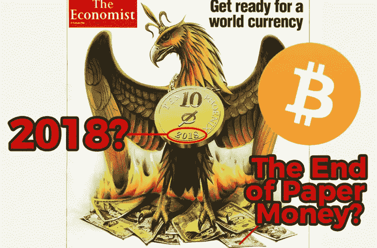

# 比特币——分离货币和国家

> 原文：<https://medium.com/hackernoon/bitcoin-separating-money-and-state-c382cf3ea733>

2008 年金融危机期间，我在去大学的路上，渴望学习金融，了解我们经济的基本机制。然而，正是通过观察金融危机的发展，我开始了解货币和央行是如何运作的。金融危机的后果表明，人们确实需要非国有资金。有时，许多人甚至没有意识到，在过去 150 年左右的时间里，法定货币只是政府控制的一种支付形式。对自由市场形式的货币的需求是真实的，就像个人在不确定时期转向黄金或对冲通胀一样。比特币可以满足这一需求。在解释加密货币的必要性时，我从选择宗教的自由和选择金钱的自由之间的类比中得出结论。简单来说，比特币就是国家和货币的分离。

# 政教分离

在学校长大的我们都知道几百年前发生的政教分离。我们被教导为什么人类可以生活在这样的社会中是如此重要，在这样的社会中，他们的宗教，对他们个人来说非常珍贵的东西，离开政府的管理是不道德的。回顾今天的这种社会，这种分离似乎是如此明显和清晰地存在。在未来，同样的哲学应该也将会被应用到个人对金钱的自由选择上。

# **钱政分离**

今天，人们可以说，金钱和国家的分离可能比宗教自由更重要，如果不是更重要的话。金钱和宗教一样是我们生活的基础，因为它几乎影响到你生活的方方面面。你对自己的财务状况做出的选择会影响你和你周围的人的生活，所以让钱由一个中央实体控制是滑稽的。

自由市场的理念在美国仍然有些流行，但这一逻辑似乎从来不适用于货币。尽管许多共和党人经常支持自由市场，但他们中没有人将这一理念应用于竞争性货币。然而，比特币可能会造成一种局面，即那些政客在这件事上没有选择。

允许货币竞争就像我们允许宗教竞争一样荒谬吗？我们允许多个教会存在。我们不能用钱来做吗？总有一天，我们的孩子会回过头来，意识到这种转变是多么明显。

比特币已经在与委内瑞拉玻利瓦尔、阿根廷比索或整个非洲饱受恶性通货膨胀困扰的国家法币激烈竞争。随着时间的推移，我们当前的金融体系显然存在一些需要解决的真正不足，而比特币提供了这种现实世界的解决方案。然而，在挑战美元或欧元之前，比特币还有很长的路要走，但全球经济革命已经开始。

**要了解更多信息，请访问我的网站:**

www.MasiDigitalVentures.com