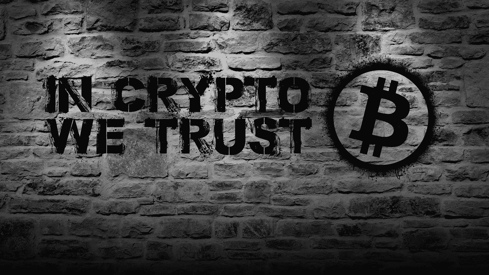

# 比特币智能合约为令牌化不动产奠定了基础

> 原文：<https://medium.com/hackernoon/bitcoin-smart-contracts-lay-the-foundation-for-tokenized-real-property-b5ae994420c5>

对于活跃在房地产行业的人来说，新的流行语似乎每天都在出现。很多人都听说过“[区块链](https://hackernoon.com/tagged/blockchain)这个词。更多的人可能听说过“标记房地产”、“智能合同”或“细分房地产”。

这些流行语和流行语被用来描绘一幅令人兴奋的未来图景——一个非洲农民可以使用智能手机在东京购买一块商业地产的未来，一个智能家居自动支付自己的水电费的未来，或者至少是一个我们不必等那么久才能等待物业管理公司回复我们关于漏水水龙头的电子邮件的未来。

这场竞赛正在努力打造能让这一未来成为现实的产品和服务。但这场竞赛中很少有人解决阻碍他们前进的根本问题:整个行业仍在纸面上运行。

到目前为止，互联网革命还没有真正影响这个行业的运作方式。在世界各地，契约继续写在纸上并存放在文件柜中，签名仍然用墨水笔手写。如果所有的底层系统和程序仍然依赖于纸面，您如何能够“标记化”房地产呢？

在做任何事情之前，我们首先要解决“房地产数字化”这个难题。这并不意味着像今天许多网站已经做的那样，通过网络浏览器提供对现有数据库的访问。数字化房地产意味着我们存储所有重要的文件，如契约，保险，税收等。以不可更改的电子格式。

我们要赋予电子文档的属性叫做“不变性”。不可变的电子文档比纸质文档更容易访问和共享，它们不会在火灾中丢失，也不会在战争撕裂土地登记处所在的地区后被修改。

有了不可改变的电子文档，用流行词汇描述的可能性世界就展现出来了。买卖房产的过程会变得更有效率。我们可以使用[比特币](https://hackernoon.com/tagged/bitcoin)来做到这一点。

有了比特币智能合约，交易可以在远处完成，甚至可以自动化。向现有财产记录添加更多细节也将变得容易得多。土地注册办公室通常使用街道地址、街道编号、邮政编码以及经度和纬度来识别地契文件上的房产。为了进一步消除对文件所指的财产的疑问，可以添加对该土地的三维计算机模型和该土地上的改进的参考。所有这些额外的数据可以帮助提高所有权的质量，并进一步帮助我们可视化权利持有人和财产之间的无形联系。

这一切在实践中是如何运作的？瑞士的 Elea Labs 正在进行一项实施，如果成功，它将成为我们购买、销售、管理、租赁、保险、开发和居住房地产的新的全球标准。

从根本上来说，房地产就是合同。而 Elea Labs 正计划通过使用比特币让这些合同变得“智能”；不仅作为一种运输和支付手段，而且作为一种为重要文件加盖时间戳的工具。Elea Labs 项目是一个点对点网络，用户可以控制他们拥有、管理和居住的房地产的数据。没有“代币”可买；用户下载免费软件，并开始像使用会计或财产管理软件一样使用它。

这款软件的功能非常强大:只需将你的房产标记为“待售”，同行就能发现它。财产所有者和管理者的身份通过公证的数字签名得到保护，以防止欺诈，甚至涉及多方和复杂条件的交易也可以使用比特币智能合约在世界任何地方完成。每个同行拥有的数据对保险公司和银行也很有价值，因为这将帮助他们制定更准确的保险单和抵押贷款，甚至以程序化“智能”合同的形式提供这些服务。

随着这个项目和其他项目正在进行中，我们越来越接近拥有一个坚实的基础，实现显着改善房地产业。我们通常不得不处理的房屋关闭和成本，我们为确定公平价格而承担的巨大成本，以及许多其他与房地产相关的痛点，希望很快成为过去的遗迹。

关于作者——贾斯汀·史密斯(首席技术官，电子实验室)

贾斯汀·史密斯是瑞士楚格 Elea Labs AG 公司的首席技术官。Elea Labs 专注于房地产行业和更广泛的金融行业(如证券发行和交易)背景下的加密金融系统的研究和开发。贾斯汀也是 X 钱包项目的创始人兼首席执行官。X Wallet 是一个 iOS 钱包接口，用于关注隐私的加密货币 Monero。