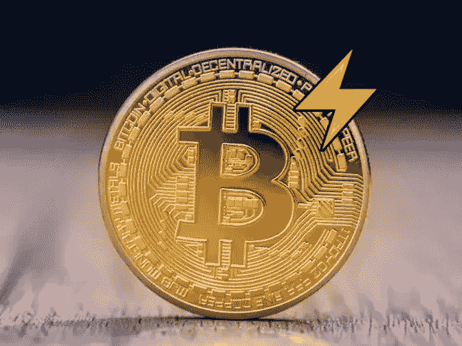
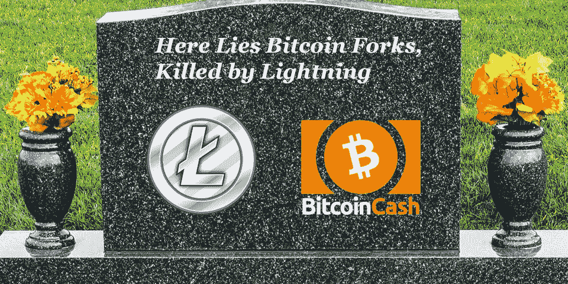

# 比特币很烂，但不要小看比特币 2.0(闪电网)

> 原文：<https://medium.com/hackernoon/bitcoin-sucks-but-dont-underestimate-bitcoin-2-0-lightning-network-580d07c1dbfe>

Lightning on top of Bitcoin will change the payments game

作为一个软件产品，我不是比特币的狂热粉丝。费用很高，确认时间很慢。匿名和隐私可能更好。智能合约能力基本不存在。在某些功能上，甚至在整体上，像以太坊、莱特币、Monero 或其他比特币叉子这样的竞争产品只是更好地向用户提供效用。

# 低垂的果实被竞争者摘走

有一些快速解决方案(并非没有权衡)可能会让比特币在短期内变得更有用。这些是通过 Litecoin 和 Bitcoin Cash 等竞争对手实现的，包括增加块大小、SegWit2x 和减少块确认时间等变化。看起来好像比特币开发者无所事事，而其他人收拾残局，让价值流向这些分叉。

# 闪电⚡来了

闪电网络是一个建立在比特币基础上的拟议系统，它可以让人们即时发送/接收支付，并通过使他们远离主网络来降低交易费用。这有助于比特币作为日常货币变得更加有用。

A video explaining how lightning works

我预计矿业财团将反对闪电，因为它减少了主要网络的费用和拥堵，这是他们赚钱的方式。然而，关于闪电最好的部分是它不依赖于矿工的支持。运行闪电节点是一个纯粹的软件游戏，只需要“下注”比特币形式的资本来帮助促进交易。闪电节点可以为此收费。因此，我们可以预期，矿池之外的新参与者将为这一网络层贡献资本和提供服务。可以说，这有助于从矿商手中夺走权力，是比特币的分散力量，这是一个积极的副作用。如果矿工不喜欢它，他们可以尝试脱离并创建一种新的加密货币，但他们可能会输给一个像闪电一样提供改进的网络。

# 比特币分叉，你的日子屈指可数了…

照明系统在技术上可以适应任何加密货币，因为它只是建立在区块链上的一层。然而，如果闪电最终兑现了它的承诺，那么莱特币和比特币现金的目的是什么？即使这些分支实现了自己的闪电网络，比特币也拥有最多的用户和资金，可以将这些生态系统吸收回来。

[***莱特币创始人查理·李曾这样评价闪电***](https://segwit.org/my-vision-for-segwit-and-lightning-networks-on-litecoin-and-bitcoin-cf95a7ab656b) :

"B *ut 有人说比特币上的 LN【闪电网】会扼杀任何使用莱特币的理由。如果人们可以在比特币上进行即时交易，他们为什么会使用莱特币？我的直觉是事实并非如此。即使有了 LN，比特币仍然无法服务于世界上的每一个人。我认为计算的结果是，在 1MB 的块中，比特币上的 LN 和 SegWit 可以服务 5 亿用户。LN 节点将对通过它们的 LN txns 收取费用，该费用将与比特币网络费用相关。所以比特币 LN txns 会比莱特币 LN txns 贵。对于 LN txn 来说，通过莱特币并返回比特币以获得最便宜的利率可能具有经济意义。Lightning 使这成为可能，因为它允许两个 LN 互操作。我不知道这个用例是否经济，但在两个 LNs 都建成并运行之前，我们不会知道。”*

从近期来看，查理自己的结论并不是一个好兆头。他对 LN 服务 5 亿人的肯定听起来就像莱特币将一文不值，直到网络容量达到极限，规模再次成为问题。记住查理也把 [***卖掉他所有的莱特币***](https://www.reddit.com/r/litecoin/comments/7kzw6q/litecoin_price_tweets_and_conflict_of_interest/) 作为解决个人利益冲突的事情。我认为查理的意图是好的，但当一个创始人不再被他们产品的成功所激励时，这就有点令人担忧了。我怀疑查理对闪电及其即将部署的了解，加上最近莱特币的价格飙升，可能影响了他出售的决定。

# 结论

闪电的部署将是比特币有史以来最大的变化。如果成功的话，它将使比特币重新成为一种可用的日常货币，不受交易停滞和高额费用的影响。这对于加密货币的采用来说是令人兴奋的，因为它将作为菲亚特的替代品回到正轨。Lightning 仍处于测试阶段，没有明确的截止日期，但预计将在 2018 年准备就绪。我的预测是:莱特币和比特币现金可能会经历艰难时期。