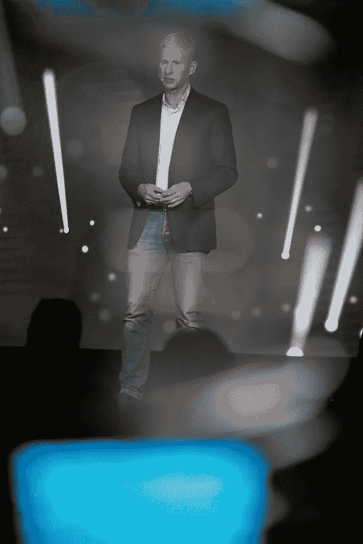

# 在 2018 年加密金融会议上，领导人表示，比特币将达到 25 万美元(到 2022 年)

> 原文：<https://medium.com/hackernoon/bitcoin-to-reach-250k-by-2022-say-leaders-at-the-2018-crypto-finance-conference-5a237179746f>

Left: Chris Larsen (Executive Chairman, Ripple). Right: Brian Forde (Former Senior White House Advisor for Obama Administration)

*前言:我很荣幸被邀请参加美国版的* [*2018 年加密金融大会*](https://www.crypto-finance-conference.com/en/all-events/cfc-us-at-the-ritz-carlton-hotel) *，这是一个为期三天的活动，其对手首先在瑞士的日内瓦和圣莫里茨举行。*

2018 年加密金融大会(CFC)汇聚了这一领域的创始人、投资者和社会影响力领袖，是对最初瑞士会议的高度期待的美国回应。180 名精选嘉宾出席，门票在第一天就销售一空。

**呼吁美国政府采取行动**

布莱恩·福尔德呼吁国会中更多的技术人员采取行动。作为奥巴马总统的前白宫高级顾问，福尔德在 2014 年撰写了第一份关于比特币的备忘录。目前，令人担忧的是，4%的国会议员拥有技术背景。如果我们真的要成为一个在加密货币等话题上有文化的国家，这也需要在该国的立法者中得到反映。虽然我们看到这种[现象](https://www.cnbc.com/2018/09/12/top-schools-like-wharton-seeing-demand-for-bitcoin-blockchain-classes.html?__source=sharebar%7Cfacebook&par=sharebar)在全国各地的顶级学校(如沃顿商学院、康奈尔大学和加州大学伯克利分校)展现出来，加密货币和比特币课程的注册人数创下历史新高，但尚不清楚这些学生是否有兴趣或接受过参与国家政策和治理的培训。

**比特币和加密的行业预测**

DFJ 德雷珀联合公司(Draper Associates)和德雷珀大学的创始人蒂姆·德雷珀(Tim Draper)公开宣布，他认为比特币到 2022 年将达到 25 万美元。德雷珀投资了 50 多家密码公司，包括比特币基地、莱杰和泰佐斯。

Ripple 的执行主席克里斯·拉森(T21)也做了主题演讲，称区块链为“价值互联网”和“全球化的完成”他以 Ripple 的 XRP 令牌为例，该令牌通过区块链为国际银行支付提供便利。他总结道，“区块链、数字资产和互操作性技术将等同于价值互联网，并从根本上使这个世界变得更加高效。”

**越来越多的女性进入秘密行业**

在半月湾的 CFC 中，从事科技，特别是加密和比特币的女性人数众多。在主题演讲中，来自欧洲议会的伊娃·盖里呼吁欧洲对比特币的监管和扩张进行更多改革。

Cointelegraph 的 Catherine Ross 在她的主题演讲和小组讨论中也预测了一波关注社会影响的比特币项目。女性主导的基金托管人和专注于加密的风险资本家也出席了会议，包括第一天风险投资公司的[玛莎·德罗科娃](https://www.linkedin.com/in/mashadrokova/)和加密女王(世界上最大的加密女性社区)的[阿努·巴德瓦吉](https://www.linkedin.com/in/anu-bhardwaj-1726b41b/)。女性加密创始人，如公共市场的 KJ Erickson ，这是一个面向市场电子商务的开放数据协议。他们和其他与会者都希望利用加密技术来真正改变消费者和企业利用加密技术的方式。*【敬请关注我对 crypto 中女性的深度剖析！】*

[*Nancy Wang*](https://www.linkedin.com/in/wangnancy/)*是*[*Rubrik*](http://www.rubrik.com)*的全职 B2B 产品经理，并通过她的国际非政府组织* [*推进产品中的女性*](http://www.advancingwomeninproduct.org) *(AWIP)积极倡导女性参与企业技术领导层。作为 AWIP 的首席执行官和创始人，她领导着项目和高管导师计划，以解决女性在科技高层中代表性不足的问题。*[*CFC*](https://www.crypto-finance-conference.com/en/)*将于 2019 年 1 月在瑞士圣莫里茨原址举行 2019 年大会。*