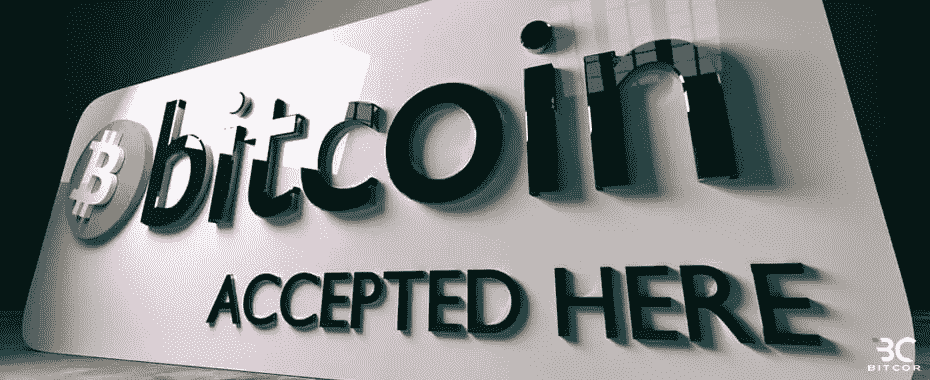
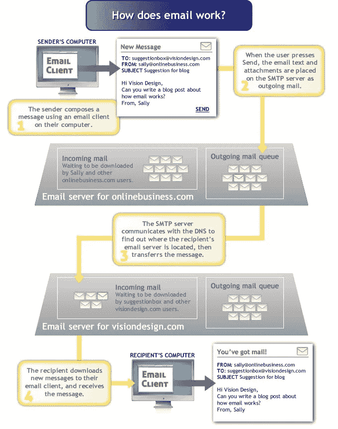
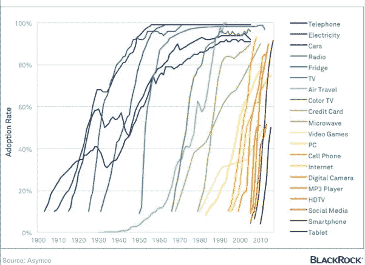
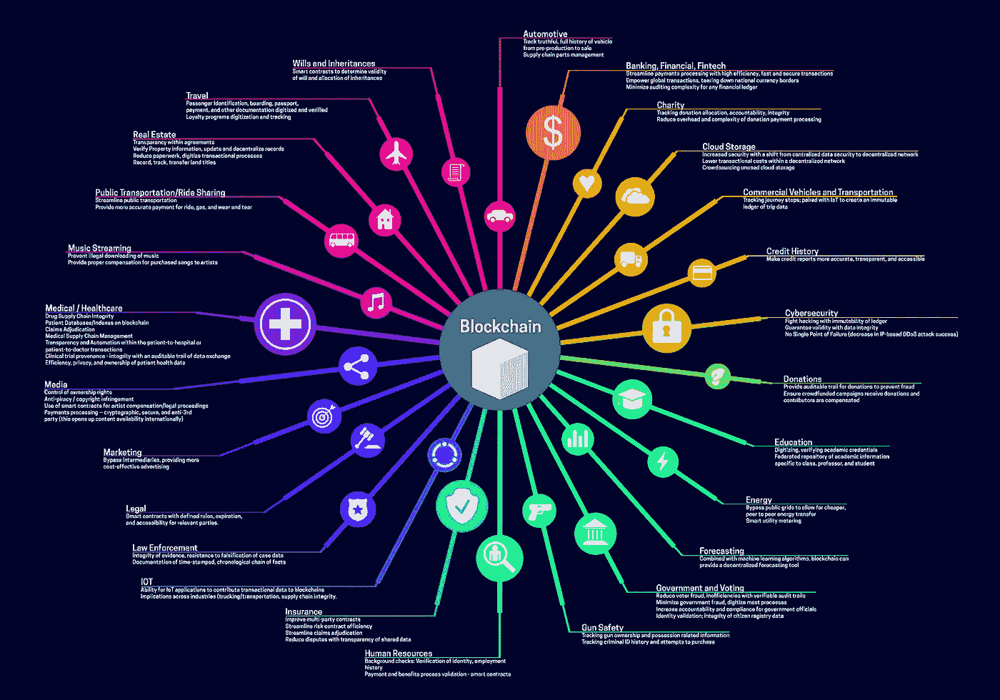

# 比特币将成为一种基本的公用事业，就像电子邮件一样

> 原文：<https://medium.com/hackernoon/bitcoin-will-become-a-basic-utility-just-like-email-51766a67b00>

[**电子邮件**是一种协议(简单邮件传输协议)](https://en.wikipedia.org/wiki/Simple_Mail_Transfer_Protocol)，然而我们发送电子*邮件*就好像它们是信件一样。它们到底是不是字母？它们读起来像信，除了它们是数字的。是的，你可以把它打印出来，但是这能让它比以数字形式存在时更“真实”吗？从本质上讲，它只是一堆 1 和 0。这会让它比一封真正的信更不真实吗？

# 你知道电子邮件是如何工作的吗？

你可能会回答“是的。你写一封信，你寄出去，你就完事了！”

不，不是这样的。这就是你发邮件的方式。 ***这个*** 就是这么回事。

That looks damn complicated! Why would anyone want to use this? You mean I need an expensive computer?! (Image from Visiondesign.com)

看起来很复杂，对吧？想象一下，试图把这教给一个从未接触过电脑的人。在这里，让我们跳回到 1984 年，看看他们当时是如何解释电子邮件的。

直到 20 世纪 90 年代，网络浏览器让任何人都可以轻松拥有电子邮件账户和地址，所有这些东西对人们来说就像比特币和区块链技术对今天的主流用户一样陌生。

我仍然记得当电子邮件突然变得人人都可以使用的时候。这不仅仅是因为网络浏览器。是不起眼的 ***网吧*** 让主流用户廉价而轻松地使用电子邮件。在菲律宾，我们为此每小时支付 2 美元，他们使用拨号 56K 调制解调器。以今天的标准来看，它是不可用的，但我仍然记得当我在 mIRC 上随机聊天的那个人告诉我她来自美国时，我敬畏地坐在那里。之后我们开始互通邮件。太令人兴奋了。

电脑非常昂贵，只有富人才有自己的电脑，而且家庭互联网连接又慢又笨。你必须确保没有人打你家里的电话，否则你就会断线。因此，网吧成了通向“网络空间”的门户，在这里，人们可以与其他人聊天，当然，还可以发送电子邮件。每个角落都有一个网吧，这是一个巨大的生意。

创建一个电子邮件帐户变得如此容易，但是你被建议永远不要使用你的真实姓名。对于极客来说，这只是一个花哨的玩具，而互联网，或一般的“网络空间”被认为是危险的。电子邮件甚至不被认为是一种官方的交流方式。每个人都使用某种假名，你的收件箱被限制在一定数量，否则电子邮件有被退回给发件人的风险。

人们使用奇怪的电子邮件地址，比如 HotLips69xoxo@hotmail.com。商业交易仍然必须通过传真或印刷纸张或电话来完成。这是一个完全不同的世界。

今天，我们从一台微型超级计算机上用手指轻轻一划就可以发送一封电子邮件，这台计算机包含大约价值[3200 万美元的 1984 年的独立设备](https://www.webpagefx.com/data/how-much-did-the-stuff-on-your-smartphone-cost-30-years-ago/)，在云端无限存储，机器学习帮助我们自动回复。

我们使用电子邮件时没有考虑它是如何工作的，因为它已经成为一种基本的实用工具。*这很管用。*

# 现在是比特币的 1984 年

**比特币**是一种协议([比特币](https://hackernoon.com/tagged/bitcoin))，然而我们发送比特币就好像它是钱一样。到底是不是钱？它像钱一样交易，除了它是数字化的。是的，你可以把它打印出来，但是这能让它比以数字形式存在时更“真实”吗？从本质上讲，它只是一堆 1 和 0。这是否使它比实际的实物货币更不真实？

# 你知道比特币是怎么运作的吗？

你可能会回答“是的。用比特币钱包，你发了，就完事了！”

不，不是这样的。比特币就是这么发的。**这个**就是它的工作原理。

感觉很熟悉，对吧？

## 技术采用的 S 曲线

If we add Bitcoin in this image, it would be at way below 1%

今天解释比特币和区块链技术感觉是一样的，因为它**是**一样的。

有了比特币和区块链技术，我们与 1984 年的电子邮件视频没有什么不同——我们仍然需要五分钟的视频来解释它是如何工作的。人们仍然害怕比特币，认为它很危险，只被暗网中的犯罪分子使用。对于普通互联网用户来说，这些应用程序本身仍然笨重且过于复杂。比特币和加密货币交易所经常遭到黑客攻击，行业内诈骗比比皆是。这项技术在全球范围内的采用率还不到 1%，所以在看到这种转变之前，我们还有很长的路要走。

它会慢慢发生，然后突然发生。

[我们在菲律宾的比特币初创公司提供的服务很像 20 世纪 90 年代的网吧。](http://sci.ph)我们为用户提供了一种访问比特币网络的简单方式，并使用它来转移和存储资金、支付账单、将其用作价值储存手段，以及几乎任何类型的银行金融服务。就像去网吧一样，你仍然需要一些如何使用电脑的基本知识，使用我们的平台需要对网站、支付应用程序和智能手机的工作原理有基本的了解。它允许用户在友好和安全的环境中体验该技术。我们还定期开展教育活动，教育那些想了解其工作原理以及如何从中受益的人。

今天有数百种服务和应用在做同样的事情，目标是让人们舒适地使用这项技术。

在不久的将来，我们将使用比特币协议互相汇款，只需动动手指，无需理解其工作原理。那时解释比特币和区块链技术将和今天解释电子邮件一样没有必要。它就是有效。

比特币是一种协议。它只是一个软件，运行在一组需要遵守的规则上，以便参与网络。试图向每个人解释它的具体细节将是令人沮丧的，因为不是每个人都能够或想要理解所有的技术内容，然而我们还是这样做了，因为即使一百个人中只有一个人会好奇并想了解更多，这也使所有的努力都是值得的。

比特币之所以是货币，是因为软件让它看起来是这样，但事实是，它只是纯粹的信息。你使用的软件使它像钱一样发挥作用，就像 SMTP 使电子邮件像信件一样发挥作用，作为人与人之间的通信，在某种程度上可靠地确定消息被安全地传输并且是有效的。

唯一的区别是，比特币“消息”即交易的有效性的确定性是不可否认的、抗审查的和不可改变的。

# 不仅仅是钱

Image from [https://www.linkedin.com/pulse/blockchain-2018-beyond-growing-list-use-cases-filipowski-1/?trackingId=R6J17arzemU1VIY2vtVhIQ%3D%3D](https://www.linkedin.com/pulse/blockchain-2018-beyond-growing-list-use-cases-filipowski-1/?trackingId=R6J17arzemU1VIY2vtVhIQ%3D%3D)

其他区块链应用也将成为无数用途的基本工具，包括智能合同、市场、治理、出处以及任何在不信任环境中需要协议的服务。

在我们知道之前，世界将像我们今天使用电子邮件一样使用比特币协议——作为传输信息的基本工具，但在这种情况下，信息将具有*价值*。