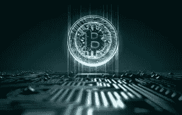
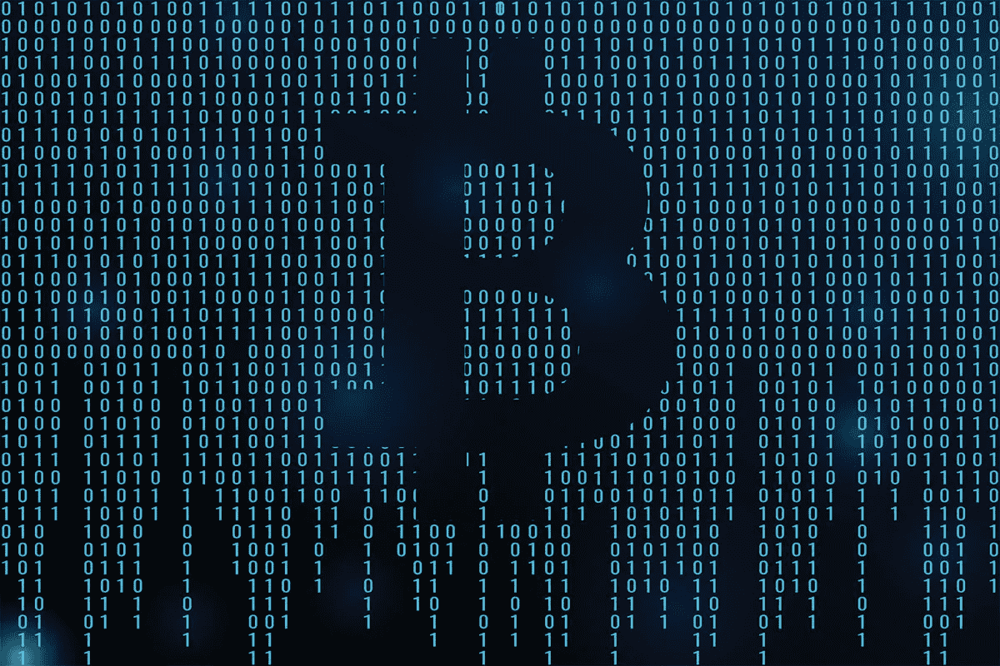

# 如果没有暗网，比特币将一无是处

> 原文：<https://medium.com/hackernoon/bitcoin-would-be-nothing-if-it-werent-for-the-dark-web-6d49b583df42>

据一些人说，几年前，比特币的价格已经“见顶”,约为 279 美元。

这是在 2013 年丝绸之路关闭后不久。当时的一个大问题是，如果没有非法电子商务的根本支持，这种数字现象是否能够生存。

要理解这是为什么，重要的是要正确看待这种非法活动对比特币的效用和目的有多大贡献。

> (六个毒品市场的)日交易总额达到 65 万美元。研究人员表示，总收入通常稳定在每天 30 万至 50 万美元之间。

与此同时，合法的支付处理器 Bitpay 将比特币购买转化为菲亚特，允许普通消费者用这种数字货币支付在线商品和服务，就像他们使用信用卡一样。

它最大的商家每天的营业额不到 50 万美元。算算吧！

事实证明， [**丝绸之路**](https://darkwebnews.com/darknet-markets/possible-third-corrupt-agent-in-silkroad-investigation/) 只是九头蛇中的一个头，黑暗的网络经济不会有任何发展。

美国消费者新闻与商业频道《快钱》的著名嘉宾杰夫·麦基在节目的一集中傲慢地宣称，“比特币已死！”随后是赞同小组成员的陈腐做作的笑声。

快进到 2018 年，虚拟货币从那天起上涨了近 1000%。

尽管如此，这并没有阻止无数评论员、记者、专家和商人匆忙假设比特币的末日——这是一种伪金融工具，并不完全符合传统的金融分析模型。

平心而论，评估一种实际上虚无缥缈、与实体经济脱钩、并受到地下非法活动或投机严重支撑的东西的价格行为，其难度不容低估。

很公平！然而，重要的是要考虑到从来没有任何东西真正像比特币一样，因此试图将其融入任何模型或其他模型就像是将苹果比作纳米技术。

***比特币真的是唯一没有失败的成功加密货币。*** *(撇开 ETH。)*

那么比特币到底是什么呢？在从零到无穷大的价格轨迹上，我们做了足够多的工作来培育价值的可持续增长吗？实现价格持续上涨的最佳方式是问自己，“这最终会被主流接受吗？”就目前而言，答案最多是“也许”。

为了理解为什么，让我们把它分解成一些关键的积极和消极因素。

## 好的，坏的，丑陋的。

比特币主流采用的最强用例是它允许的相对较小的价值转移成本(例如，与通过西联汇款或速汇金汇款相比)。

这是一种去中心化的支付结算方式，也就是说，一旦转账，就不能像信用卡那样被退回，也不能被伪造。

绝对重要的是，不要低估这些东西的巨大经济效益，而是要在实体经济中真正感受到这些效益。

似乎有一些很大的障碍还没有得到令人满意的克服:使用困难、波动性、采用的监管障碍以及软件核心开发者制定的形成性政策。

从上述因素来看，最后一个因素可能会严重限制比特币的长期增长。这是因为最重要的“核心”开发者决定了比特币的未来。

Form 倾向于向基本上为区块链基础设施供电的矿商提供费用密集型补偿模式。

这通过高能耗的计算机处理器支撑着数字货币——给你简单明了的解释，而不涉及丑陋的技术问题。

因此，趋势将是价值转移能力成本不断上升。

为了更好地理解这在事务级别上是如何转化的，请考虑以下内容。

费用非常低的交易在某些情况下需要一个多星期才能确认(我曾经等了 4 天。)，优先级交易可能会花费 5%或更多(是的，我也遇到过这种情况)。

我这里说的不是交换交易。号码

*顺便说一句，你知道当你的硬币在交易所交易时，你并不拥有它们吗？*

仅此一点就足以让某人说，“不，谢谢，我要用我的信用卡。”长篇大论、晦涩难懂的博士论文没有必要去认识一个简单的事实，即如果通过比特币转移资金的成本与替代方案相比变得过高。

如果在不支付高额费用的情况下进行转让的时间太长，那么支持采用这种方式的最大论据就不复存在了。

最终，为了大规模采用，必须保持一个非常——我是说非常——令人信服的理由。

前进的最佳方式是商业界、监管机构和核心开发商尽可能地参与进来。

数字货币的好处是费用低，监管负担轻，购买和发送比特币更容易。

否则，它最终会停滞在进化的低潮中；或者，换句话说，它将仍然局限于特殊使用案例——其中大部分是通过黑暗网络的非法交易。

**黑暗网络的经济发电站是比特币价值的最后一道防线。**

在某种程度上，黑暗网络在保护区块链技术的生存和延续方面一直扮演着不可或缺的角色，这为未来社会的改善带来了巨大的希望。

> 单凭人类的耐心和好奇心不足以让数字货币流通。

只有一件事保持不变:

-有些人仍然需要购买比特币来获取可卡因。

## 干杯，感谢您的阅读。

对于你进入密码市场的第一步的终极资源，加上你在**的第一笔投资**，以及**如何投资**，以及**投资什么**，请查看我的指南

 [## 如何通过交易和投资加密货币赚钱？

### 比特币！莱特币！以太坊！—激动！不知所措！还有什么不可以。

medium.com](/@shauryamalwa/how-to-almost-make-millions-by-trading-cryptocurrency-2f7bd5c1cedd) 

这些步骤让我在几个月内从 1000 美元变成了 30000 美元。

让它变大的唯一方法是自己学习如何抓鳟鱼。另一边见。干杯！

****************************************************************

鼓掌 1 次或 50 次。它帮助我获得曝光率。谢谢大家！

_

阐述我多年来的想法，并超级热衷于写区块链、交易、加密货币和生活。

我的目标是以一种精致、易懂的方式将加密货币带给大众。复杂无助于任何人，有偏见的媒体也是如此。

是的，我认为这个系统是一个巨大的谎言，是时候改变它了。

_

#longlivecrypto。

***************************************************************