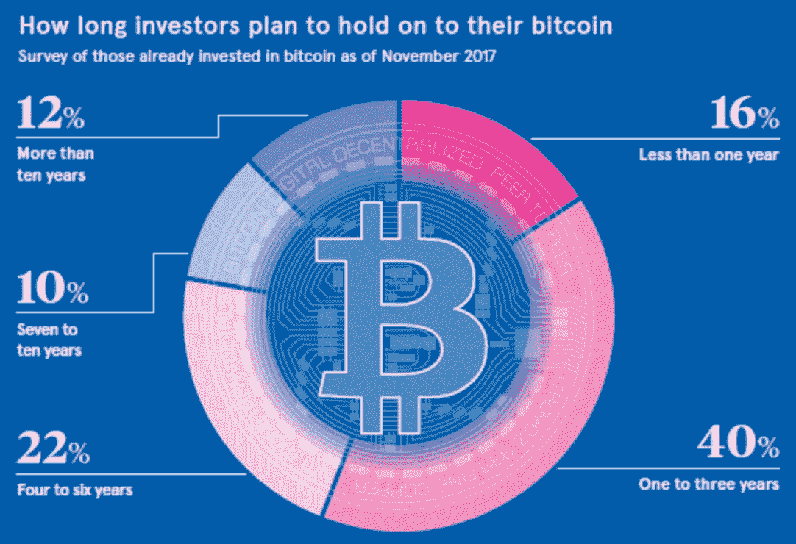

# 比特币的 ETF 是一把双刃剑

> 原文：<https://medium.com/hackernoon/bitcoins-etf-is-a-double-edged-sword-86a445e7314d>

目前的监管逆风表明，比特币的 ETF 将成为一个获得批准的资产类别，并将很快上线。这肯定会推动人民币价格飙升。然而，这是聪为自己的创作所设想的吗？

聪的梦想和我们当前的现实陷入僵局。Satoshi 希望比特币成为世界上占主导地位的电子货币，按照我们现在的速度，这个梦想很有可能需要克服一些传统挑战。

**让我们先来了解一些基础知识。**

《T4 比特币 T5》白皮书的第一行写得很清楚，比特币 T7 将被用作一种交易媒介，对某些人来说也是一种价值储存手段。

> 电子现金的纯点对点版本将允许在线支付直接从一方发送到另一方，而无需通过金融机构。— Satoshi

也就是说，Satoshi 处理了我们都会遇到的同样的问题，即“缺失变量问题”。

缺失的变量要么是我们没有想到的事情，要么是我们不得不留给命运来决定的事情。在 Satoshi 的案例中，我认为他不可能一开始就给比特币的成功赋予如此高的概率，更不用说它被大型金融机构最终商品化了。

# [比特币](https://www.kryptoloop.com/ProfileCompany/1182) ETF 会带来什么？

交易所交易基金是大生意，截至去年，其市场规模为 3 万亿美元。它们的成功主要体现在易用性、低交易费用以及对厌倦纳税的投资者有利。

热衷于加密的人对 ETF 的兴趣在很大程度上可以归因于贪婪。我不是说你贪婪，但前提是 ETF 将对 BTC 的价格产生重大影响，并将无意中使其成为价值储存手段，而不是其最初的愿景，即交易媒介。

## [**BTC ETF**](https://www.kryptoloop.com/ProfileCompany/1182) **将把价格推向月球**

[KryptoLoop.com](http://www.kryptoloop.com) (Shameless plug for a crowd sourced prediction engine.)

[比特币](https://www.kryptoloop.com/ProfileCompany/1182)的总发行量上限为 2100 万枚。现在有 1720 万枚开采出来的硬币。随着[400 万 BTC 失去](https://www.kryptoloop.com/ProfileCompany/1182)或休眠，我们真的只有 1320 万可交易。另一个问题是霍德勒夫妇。

[最近的一项调查](http://www.visualcapitalist.com/investors-hold-onto-bitcoin-sentiment/)显示，截至 2017 年 11 月，已经投资比特币的人中，40%的人打算在 1 至 3 年内投资，而 44%的人计划投资 4 年以上。

由于供应已经很低，而需求正在上升，任何经济学家都可以预测 BTC 的价格将会飞涨。是的，我知道这对大多数霍德勒夫妇来说是件好事，但很难想象 BTC 会被用作交换媒介。

## 比特币 ETF 对 Satoshi 愿景的影响

**ETF 不是比特币:**

我们已经缺乏比特币供应(考虑到丢失的代币和被拍卖的代币。

我已经提到，制作 [BTC ETF](https://www.kryptoloop.com/ProfileCompany/1182) 将推动价格上涨，虽然我不会对这种想法感到不安(因为我准备增加我的加密投资组合)，但我可以说，这将对比特币成为交易媒介产生影响。

## **首先是基础知识**

当你购买 ETF 时，你实际上是在购买一个投资组合的股票，该投资组合旨在跟踪其基准指数的收益率和回报。在这种情况下，投资组合公司将收购比特币，并向你出售他们总持有量的百分之一。

换句话说，你并不拥有真正的比特币，因此不能花你没有的钱。这只是购买 BTC 交易所交易基金的风险之一。

在你购买一些 [BTC](https://www.kryptoloop.com/ProfileCompany/1182) 交易所交易基金，而不是按照预期的方式花费比特币之前，还有另外两个风险需要简单解释一下(很抱歉这么刻薄)。

*   **交易对手风险** —如果参与计划的一方(即，为投资组合经理采购比特币)未能交付，ETF 将失去平衡，与市场利率不一致。换句话说，你依赖于管理能力、资金结构、监管链、运营完整性、监管监督和交付协议。
*   **摇摇欲坠的** [**比特币**](https://www.kryptoloop.com/ProfileCompany/1182) **生态系统** —托管人和子托管人，通常是银行，负责采购和存储与 BTC ETF 相关的实物比特币。问题是，托管银行能被信任 1)只要比特币在它们的金库里，它们就能存在多久，2)能充分保护它们的资产吗？

**有什么追索权**

[BTC](https://www.kryptoloop.com/ProfileCompany/1182) 将毫无疑问地分叉，否则我们将不得不依赖比特币现金作为交易媒介，因为如果 BTC 供应被锁定在机构账户和整个霍德勒，我们如何建立一个由加密驱动的经济。

## **忠告的话**

请在买入炒作之前考虑以上几点。虽然比特币的价格会飙升，但它并不完全像人们所说的那样，问问你自己，这种轨迹是否会让 Satoshi 的愿景更接近现实，或者比特币是否会变成 Satoshi 今天无法识别的东西？而且，如果你不在乎哪种方式，**至少要买真正的** [**比特币**](https://www.kryptoloop.com/ProfileCompany/1182) **。**

我爱你，

免疫球蛋白超基因族

在推特上用 [@iggsloop](https://twitter.com/IggsLoop) 找到我

伊戈尔是一个情人，也是一个斗士。他碰巧喜欢在加密推特上发帖，和朋友喝啤酒。他的最新冒险试图通过一个名为[**KryptoLoop**](http://www.kryptoLoop.com)的**人群驱动价格预测平台来帮助交易者提高他们的投资回报率。他们使用的群体智慧模型减轻了大多数交易者的偏见，并把他们的集体知识浓缩成一个单一的价格预测。这是秘密交易者能够找到的最好的情绪指标，他们的预测与实际价格相差很小。**

我的其他几篇文章已经获得了成千上万的阅读量，你可以看看:

## 蒂姆·德雷珀对 BTC 25 万美元的预测有什么特别之处？

## 预测市场现在很热门。