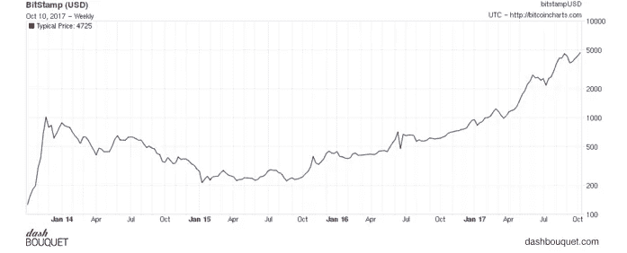
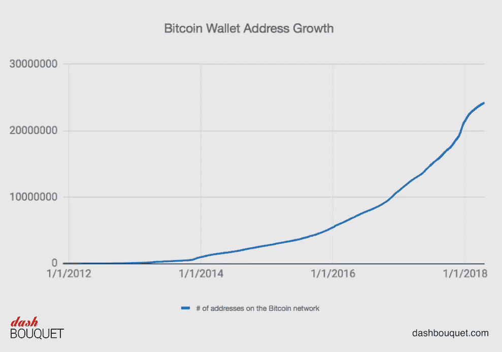
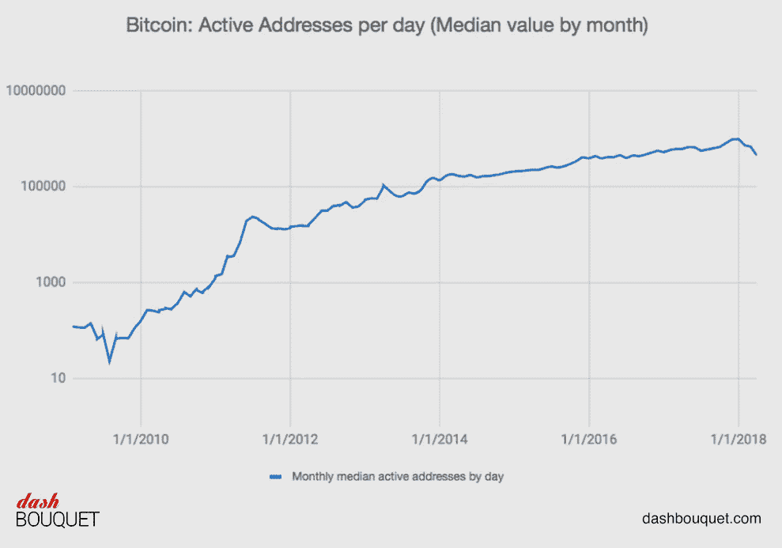
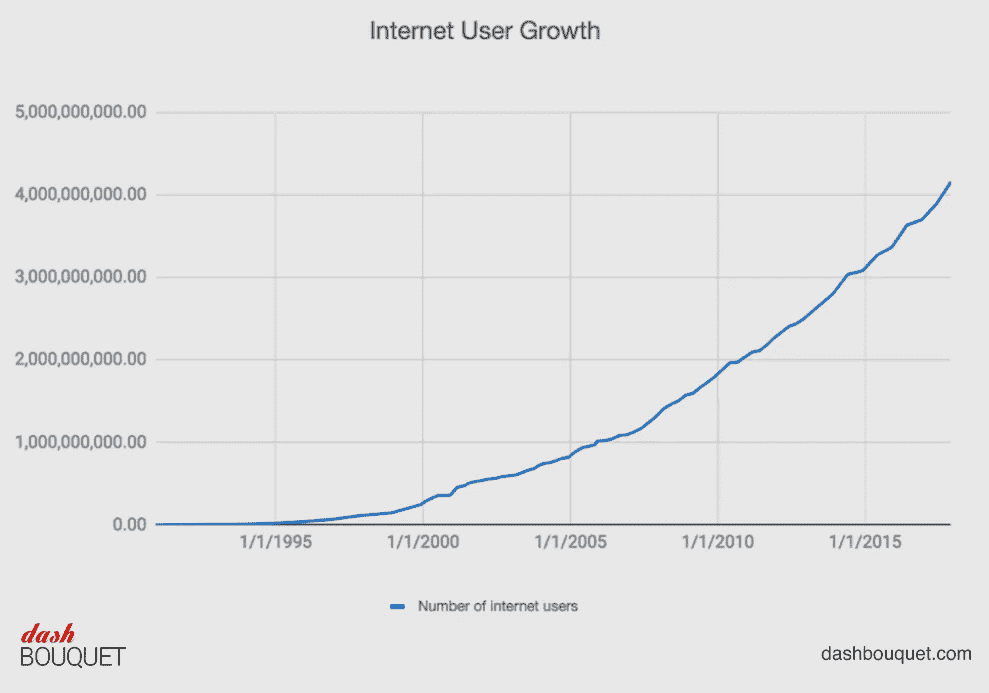
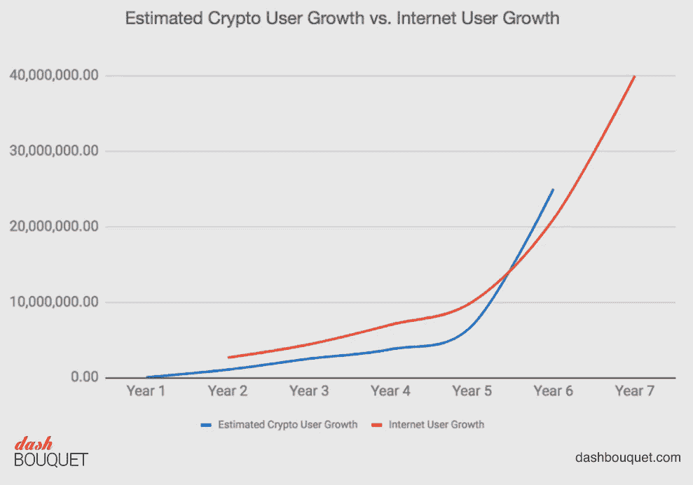

# 比特币自诞生以来的发展及其对加密货币市场的影响

> 原文：<https://medium.com/hackernoon/bitcoins-growth-since-inception-and-how-it-affected-the-cryptocurrency-market-at-large-a132da4ec2b9>

2009 年，中本聪在 2008 年发表的论文变成了一个实际的项目。第一个比特币客户端于 1 月 9 日发布，由 SourceForge 托管。1 月 12 日，首批采用者之一哈尔·芬尼(Hal Finney)参与了世界首例点对点交易。他收到了中本聪的 10 个比特币。

从那以后，它就不再是过山车了。比特币有好的、坏的和丑陋的时代。比特币最好的时期之一无疑是 2017 年；当价格在 12 个月内从 1000 美元暴涨到 20000 美元时。但除此之外，人民币也经历了几次高点和低点。

这篇文章的目的是回顾过去，带你经历比特币和加密市场的不同阶段，看看一种货币是如何扰乱整个金融机构的。

# 2010

在此期间，大约有 100 万个比特币被开采出来，比特币的官方价值是比特币基金会成员讨论的话题。比特币基金会是负责比特币的社区。当时，大约 10，000 BTC 被用来从棒约翰购买 2 个比萨饼。

8 月，协议中发现了一个严重的漏洞，导致交易无法得到正确验证。这导致了 1.84 亿比特币的产生。但很快，资金被送往的地址被发现，错误被逆转。

# 2011

到目前为止，比特币仍然是唯一值得注意的加密货币，但这一立场并没有持续很久。不久之后，新的加入者到来了。Namecoin、GeistGeld、iXcoin、SolidCoin 以及其他一些名字被创造出来。截至 10 月，共有 9 种货币。

# 2012

2012 年，许多平台接受了人民币。根据 BitPay 的数据，超过 1000 家商家接受比特币，其中包括 WordPress 和维基解密等热门平台。

# 2013

这是人们开始认真对待“新货币”的一年。受欢迎的基于比特币的支付处理器比特币基地报告称，他们在一个月内卖出了价值超过 100 万美元的比特币。当时，一枚比特币的售价仅为 22 美元。这一成功也带来了一些见不得人的交易，美国当局查封了与 Mt. Gox 有关的账户。美国缉毒署也在此期间查获了约 11.02 个比特币。

到 2013 年 12 月，加密货币的数量飙升至 197 种，仅在 12 月就有 38 种新硬币出现。

# 2014

2014 年又是一个密码爆炸的年份。越来越多的人开始对比特币感兴趣。微软接受了 Xbox 游戏和 Windows 软件的比特币支付。其他公司，如戴尔，新蛋，甚至赌场也接受货币。虽然 1 BTC 的价格在 340 到 450 英镑之间，但它甚至导致了其他货币的出现。

到年底，市场上共有 646 种新货币。尽管只有少数这些货币仍在流通，但它们加入加密市场预示着繁荣和坚定的信念。

# 2015

当时有超过 100，000 家商户接受比特币支付。今年早些时候，作为 C 轮融资的一部分，比特币基地又筹集了 7500 万美元。毫无疑问，总体而言，这是加密货币非常好的一年，尽管新硬币的数量没有证明这一事实。事实上，加密货币的数量没有超过 800 种。

# 2016

如今，加密货币逐渐成为支付和跨境交易的主流形式。价格徘徊在 600 美元到 780 美元之间，但这是我们拥有大约 1000 种现有加密货币的时期。此时，以太坊也正在成为加密领域中不可忽视的一股力量，智能合约平台也在迅速发展。

# 2017

一些人记得这一时期是 cryptos 崛起的一年。比特币的价值增加了近 200%，从 1 月份的 1000 美元增加到 12 月份的 20000 美元。截至 12 月，市场上官方加密货币的数量共计 1341 种。尽管还有其他几种货币没有被认可。这个时代见证了许多早期投资者成为亿万富翁，还出现了几个新的亿万富翁。

# 2018

我们还在里面，对吧？所以有可能我们经历了一个奇迹。但就目前情况来看，比特币已经崩溃，数月来仅达到 11000 美元的峰值。这种货币的平均价值接近 6000 美元，专家表示，对未来没有确定的预测。截至 2018 年 4 月 10 日，有超过 1565 种货币，并且仍在增长。我们只能静观来年如何发展。

# 比特币和加密货币如何改变了景观- ICOs

ICO 或初始硬币发行是一种通过加密货币筹集资金的方法，尤其是对与区块链相关的初创公司而言。这种方法类似于 IPO(首次公开募股),将特定公司的股票出售给投资者。在 ICO 中，公司提供公众可以购买的代币。如果企业成功了，代币的所有者将享受代币的增值。

像 Grid+和以太坊这样的公司通过代币销售筹集了大量资金，并且在这个技术世界中越来越受欢迎。虽然使用 cryptos 的同样缺点也会影响 ICOs 它们不受监管。因此，投资者总是被建议谨慎投资。

# 包装它

如果我们将比特币的增长与互联网相比，我们可以说有希望。考虑到比特币大约在 9 年前刚刚出现，而互联网已经存在了几十年，我们有理由认为[加密市场](https://dashbouquet.com/blog/blockchain/top-5-cryptocurrencies-that-are-not-bitcoins)可以在更好的时间里复制这种表现。但是，请记住，市场波动很大！这使得准确预测它将如何发展变得非常困难。请记住，你不是把这作为财务建议。

[作者:德米特里·布德科](https://www.linkedin.com/in/dmitrybudko/%5C)