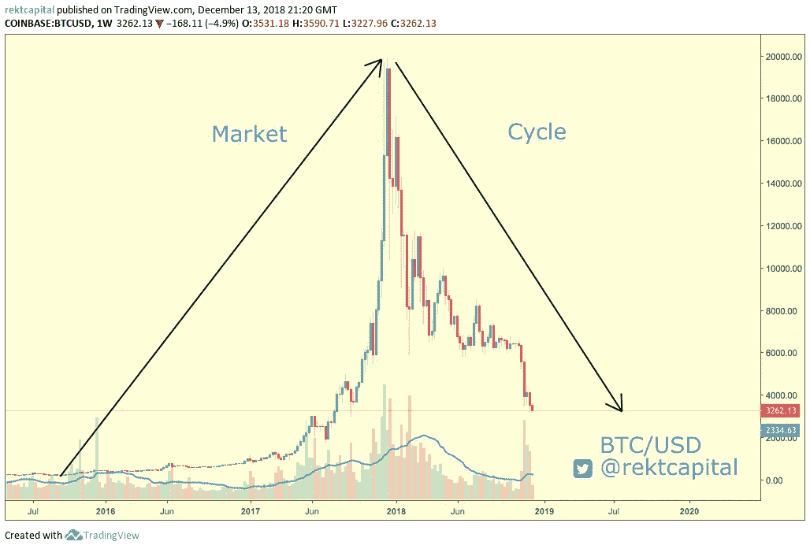

# 比特币的市场周期——你需要知道的一切

> 原文：<https://medium.com/hackernoon/bitcoins-market-cycles-everything-you-need-to-know-d7a804b05c93>

八年来，比特币经历了四次繁荣和萧条。

令人印象深刻的规律性，但绝不是巧合。

任何市场——加密货币或传统货币——都受市场周期的支配。

简单地说，一个市场周期是价格上升的地方(即上升趋势；牛市)然后价格下跌(即下跌趋势；熊市)。

Bitcoin’s most recent market cycle (2015–present)

为什么叫市场*周期*？

首先，价格会上下波动。

但更重要的是，每个周期都是由人类情感支撑的。

也就是说，它从恐惧、不确定和怀疑循环到贪婪、过度繁荣和兴奋。

自从 1 比特币价值 2 万美元时的贪婪和兴奋以来，比特币的市场周期出现了显著的低迷，1 比特币价值近 3000 美元，恐惧和怀疑显而易见。

偶尔，循环会重复。比特币的价格历史表明了这一点。

下面是我的一条推文，显示了自 2011 年以来比特币上涨和下跌的长度。

Length of historical uptrends & downtrends for Bitcoin (2011–2018)

这些统计数据揭示了比特币价格历史的一些有趣特征。

首先，他们表明**上升趋势(即牛市)的持续时间与之前的下降趋势(即熊市)相比，历史上往往更长。**

其次，它显示了比特币在其历史下跌过程中的价值损失百分比。

这些下跌趋势(即*修正*)修正了市场参与者在 2017 年 12 月比特币达到 20，000 美元时迷失在所有牛市狂热中时的过度乐观和过度繁荣的思维。

这些下跌趋势被称为熊市。

**最长的比特币熊市长达 58 周**(即 2013/2014)。当时比特币回撤了 86%。

目前的加密货币熊市刚刚开始第 51 周，比特币迄今已回撤 84.5%。

事实上，比特币的总体平均修正率为 84.5%。

这意味着比特币的市场估值下降并不反常，与你在媒体上听到的相反。

# 比特币目前的市场周期“一般”

在即将到来的一年里，比特币经历了 2017 年 12 月指数上涨的长期后遗症，当时比特币创下了 20，000 美元的历史新高(ATH)。

但正如我们前面提到的，就比特币经历的前三次修正而言，加密市场正在经历一次历史平均回撤(这次修正是第四次)。

出于同样的原因，与之前的市场周期相比，当前的比特币市场周期也经历了一次漂亮的**标准上涨**，尽管已经取得了令人印象深刻的指数收益。

以下是比特币在整个市场周期中的%收益，最近的上涨趋势以粗体显示，达到 20，000 美元。

> 2011-2012 年:增长 312 000%
> 
> 2012-2013 年:增长 13，000%
> 
> 2013 年:增长 2200%
> 
> 2015–2017:**11000%增长**

虽然最近的牛市让比特币获得了 11000%的涨幅，但这仅仅是比特币在其短暂但肯定传奇的历史中经历的**第三好的指数增长**。

比特币目前的市场周期没有什么极端之处。

事实上——从整体价格历史的大格局来看，它相当普通。

# 利用以前市场周期的数据预测未来趋势

人们倾向于使用历史市场数据来推断趋势，并将数据推断为潜在的未来趋势。

尽管历史价格波动有助于预测未来的趋势逆转，但没有哪个市场周期会是复制粘贴版的。

每个市场周期现在和将来都是不同的。每一次上涨趋势都会产生不同的收益；每一次修正的严重程度都会有所不同。

然而，根据比特币的历史回撤数据，人们可以推测比特币在这次宏观下跌中的修正程度。

**比特币的历史回撤:**

> 2011 年至 2012 年:-93%回撤
> 
> 2012 年至 2013 年:-80%回撤
> 
> 2013 年:-86%回撤
> 
> 2018 年:-迄今为止 84.5%的回撤

## 如果比特币回撤 86%…

在当前的市场周期中，比特币已经回撤了 84.5%。

86%的回撤意味着比特币将修正至 2800 美元。

在撰写本文时，1 比特币的价格为 3250 美元。

要让比特币达到 2013 年至 2014 年 86%的回撤，它必须从当前价格再下跌 13%左右。

这将构成从 ATH 测量的额外 1.5%的下降(20，000 美元；即 84.5%+1.5% = 86%)

## 如果比特币回撤 93%…

另一方面，从 ATH 93%的回撤意味着比特币将回撤至大约 1400 美元。

为了让比特币达到迄今为止的最大回撤(即 2012 年的 93%)，它必须从当前价格再下跌 57%(即从 ATH 再下跌 8.5%；84.5%+8.5% = 93%).

从比特币的价格历史来看，这种回撤将是我们可以预期的比特币“最糟糕”的情景之一。然而与此同时，从概率上讲，93%的回撤是比特币最不可能的价格情景。

话虽如此，仅根据之前的市场周期数据，人们可以推断出比特币在当前市场周期中的底部区间为 1400 美元至 2800 美元。

# 可以预见，人类是不理性的

比特币的市场周期数据可以让我们对其价格走向有所了解。

历史往往会重演，但总是略有曲折。

永远不变的是支撑市场周期的人类心理的根本变化。

市场的周期与人类情绪的周期相同。

从恐惧到贪婪，从贪婪到恐惧。

可以预见，人类是非理性的。比特币价格历史的周期性证明了这一点。

市场将永远是非理性的。

人群心理和人的情绪永远不会变。

在某个时候，逢低买入者将开始涉足加密货币市场，以低价购买比特币和其他替代货币(即替代货币)。

这将促使又一轮加密货币牛市的开始。

人们会开始感到贪婪& FOMO。

因此，新的周期将继续…

感谢您的阅读。