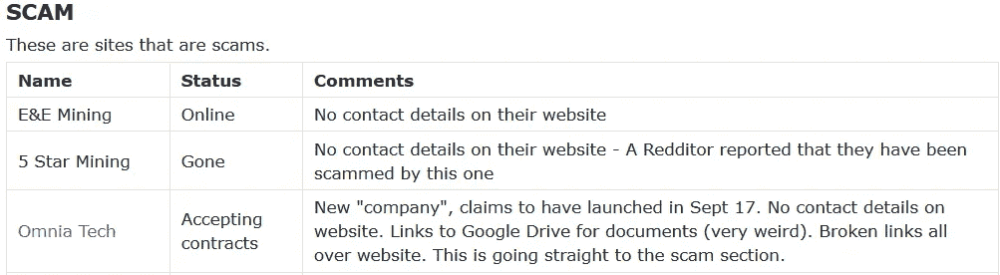

# 比特币和金字塔

> 原文：<https://medium.com/hackernoon/bitcoins-pyramids-e7a32463fd1a>

## 有钱的时候，骗局比比皆是

For once, this guy might be factually correct

这是一个美丽、温暖、阳光明媚的日子；在荷兰四月是罕见的。一边喝着冰咖啡，一边兴高采烈地和一个新朋友谈论黑客商店。当我们旁边的桌子要求做介绍时。这并不罕见，尤其是在空间紧张的阿姆斯特丹。如果你在一家咖啡馆吃饭，而你的餐桌上有多余的座位，很多时候你会期望分享这个位置。阳光明媚的日子里，陌生人交谈是很常见的。

我们将我们的两个“MLM”销售人员称为德鲁塞拉和马丁。

**介绍**

“介意我们问一下你们两个是做什么的吗？”她用完美的英语说。我总是对荷兰人在多种语言间的流畅交流印象深刻。“你的谈话听起来很有趣”

作为两种重视隐私的黑客类型。我们回答说我们是安全研究员。这比…容易。说“那个”字吓唬人:**黑客**。

“我是德鲁塞拉，我们为一家科技公司工作。我们和区块链打交道。马丁。”指着桌子上她的搭档，“你为什么不告诉他们你是做什么的？”

**提案**

“我们在整个欧洲都有服务器。我们使用最新的硬件。其他公司试图向您销售不再适用的旧系统。我们使用最新的专用集成电路。你知道它们是什么吗？”马丁问。

“是的”，然后我这个书呆子开始描述为什么随着硬币池变小，新的 ASICs 变得重要。

马丁开始摆弄他的手机，而德鲁塞拉开始用荷兰语和我的同伴交谈。她对他有了更多的了解。

“啊，这是我们在瑞士的一个数据中心的照片。我们在冰岛也有机器，那里的电力更便宜。你按月付费，我们保证你会赚回你的钱，甚至更多。”马丁穿着光滑的西装，自信地靠在椅背上，对自己推销的开始很满意。

“马丁是钻石级的！”德鲁塞拉说你也可以！"她兴奋地对我的同伴说，她是亚裔荷兰人. "如果你和你的社区里的人交谈。和你签约的人越多，你能赚的钱就越多。"

Different levels, people signing up under you to make money: “MLM”

在我的脑海里，华而不实的套装、等级、歌颂你手下的人、讨论利用一个人的种族群体。警报响了。

“那么，这是一种交钥匙解决方案吗？”全面询问澄清的方法。

“哦，是的，你不必了解任何技术。我们是专家。您只需支付月费，我们会照顾好一切。你在自己的网络中加入的人越多，你就能赚到越多的钱。”然后，马丁开始描述一个听起来完全像传销的多层次营销计划。

多层次市场和金字塔 **的最大区别是什么？**

[It takes research to avoid getting scammed](https://www.ftc.gov/tips-advice/business-center/guidance/multilevel-marketing)

据美国[美国联邦贸易委员会](https://en.wikipedia.org/wiki/Federal_Trade_Commission)合法的传销与传销不同:

***有真货卖*** 。”[【9】](https://en.wikipedia.org/wiki/Pyramid_scheme#cite_note-PS_USA_1998-9)“不是所有的传销计划都是合法的。如果你赚的钱是基于你对公众的销售，这可能是一个合法的多层次营销计划。如果你赚的钱是基于你招聘的人数和你对他们的销售，那很可能不是。可能是传销。”[【10】](https://en.wikipedia.org/wiki/Pyramid_scheme#cite_note-MLM_USA-10)

1.  MLM 制造东西或提供服务，而金字塔不是。马丁和德鲁塞拉推动的公司不生产任何东西，也不拥有任何东西。他们被认为是 Genesis Mining 服务的中间人，但没有被列入任何与 Genesis 有合法联系的名单。
2.  Genesis Mining 被要求对此事发表评论，并迅速作出回应:*“OMNIA 是 Genesis Mining 的客户。他们从我们这里购买 hashpower。除此之外，* ***我们与他们没有任何其他官方的合作或联系，因此我们不对他们的运营负责。”* —查理兹，**创世纪矿业客服****
3.  任何人都可以直接报名参加创世纪矿业，没有 MLM/金字塔/中间人是必需的。你不需要和一个吹嘘自己是**“创世纪矿业的 OMNIA 骄傲伙伴”**的公司签约。如果你付钱给一家 MLM 公司使用 Genesis mining，没有任何保证，他们不会在不开采任何硬币的情况下保留你的钱。
4.  **“创世纪矿业的 OMNIA 骄傲合作伙伴”** MLM 公司在终止时没有回购计划。一个重要的区别是因为 ***它们不制造任何东西。***
5.  **“创世纪矿业的骄傲伙伴”**中的等级是建立在直接推荐的基础上的，等级变得更高不可攀但也更奢华。有左右两条腿，每条腿也称为强壮腿和虚弱腿。必须满足一定的标准才能升级。较弱的腿是挖掘和推荐较少的腿。

Left leg is Sam & right leg is Jane, looks like a pyramid eh?

**二合一系统**

传销的标志是双倍或 2-UP 转介。使用来自[的金字塔计划的数学例子——骗局解释](http://www.mathmotivation.com/money/pyramid-scheme.html)

在 2 up 系统中，你招募的前两个人的“销售收入”归招募你的人所有。你从第三次和以后的每一次招募中获得的销售收入归你所有，连同你每一次招募的头两次“销售”，如下所示，一个系统的每次销售价格为 1000 美元。这个系统非常受欢迎，因为处于顶层的人的收入水平可以成倍增长。此外，你的每个新员工都有巨大的动力去追求第三次销售，因为这是一次有潜力创造大量收入的销售。”

[2-UP pyramid scheme](http://www.mathmotivation.com/money/pyramid-scheme.html)

**关卡**

对于**“创世纪矿业**的 OMNIA 骄傲合作伙伴”级别。他们开始时规模很小，但很快就变成了看起来像是 2 人金字塔计划的变体。

[Begin the “MLM” doubling because it’s not a pyramid scheme…](https://www.slideshare.net/AntonioLoh/omnia-official-presentation-slides-httpbitly2wiwoyv)

每一关都有最低限额。我强调，这是最低限度。

1.  1 级青铜高管:左右两边各有 1 名推荐人，两条腿各有至少 500 美元的采矿费= 2 名推荐人，共 2 人。青铜高管= **2** 。
2.  2 级银级主管:2 名铜级主管，左右两边各 1 名，两条腿中较强壮的腿的采矿费用至少为 5000 美元，较虚弱的腿的采矿费用至少为 2500 美元= 4 次推荐。白银高管=**4**(2 *青铜)。
3.  3 级黄金主管:2 名白银主管，左右两边各一名，在两条腿中最强壮的一条腿上采矿至少 15000 美元，在较虚弱的一条腿上采矿至少 7500 美元。金牌执行官=**8**(2 *银牌)
4.  4 级白金:2 名黄金管理人员，左右两边各 1 名，在较强壮的两条腿中至少开采 30000 美元，在较虚弱的腿中至少开采 1500 美元。铂金=**16**(2 *金)
5.  5 级蓝宝石:3 级白金，最少 1 级在弱腿，60K 在强腿和 30K 在弱腿。蓝宝石=**48**(3 *白金)
6.  6 级红宝石:3 级蓝宝石，弱腿最少 1 级，强腿 12 万美元，弱腿 8 万美元。红宝石=**144**(3 *蓝宝石)
7.  7 级钻石:总共 4 颗红宝石，每条腿至少 2 颗，强腿 40 万美元，弱腿 20 万美元。钻石=**576**(4 *红宝石)
8.  8 级蓝钻:5 颗钻石，弱腿最少 2 颗，强腿 200 万美元，弱腿 400 万美元(可能是幻灯片上的打印错误)。蓝钻=**2880**(5 *钻石)
9.  9 级黑钻:6 颗蓝钻，每边 3 颗，600 万强腿，400 万弱腿。黑钻=**17280**(6 *蓝钻)
10.  10 级皇冠钻石:7 颗黑钻，弱腿最少 3 颗，强腿 1000 万，弱腿 800 万。皇冠钻石=**120960**(7 *黑钻)

[Upper levels of the “MLM” 2-UP looking pyramid scheme](https://www.slideshare.net/AntonioLoh/omnia-official-presentation-slides-httpbitly2wiwoyv)

**OMNIA Limited 是谁？**

该公司的网站列出了四个地址，第一个是一家名为 **OMNIA Limited** 的注册公司，地址为**13/1 Line Wall Road
Gibraltar，GX11 1AA，United Kingdom** 。与网站上列出的信息相反，在这个地址上没有一家名为 **OMNIA Limited 的公司。然而，说来也巧。英国的每一家公司都可以很容易地免费查找和研究。来自直布罗陀的 OMNIA 有限公司滥用了一家同名的合法英国企业。**real OMNIA Limited**位于[英国普利茅斯，注册于 2004 年](https://beta.companieshouse.gov.uk/company/05015153)。**

All companies in Gibraltar are registered in the United Kingdom

Will the real [**OMNIA Limited**](https://beta.companieshouse.gov.uk/company/05015153) please stand up

Reddit 用户已经将 OMNIA Tech 公司和 OMNIA Limited 一样列为骗局。来自 [Reddit/r/Cloudmining](https://www.reddit.com/r/cloudmining/comments/7ptu30/real_or_scam/) 的网址与**假 OMNIA Limited** 相同。“马丁”给我的名片上使用了创世纪矿业的名称和标志。

Yep, looks like I’m not the only one who thinks this is a scam

**骗局双降**

假冒的 OMNIA 有限公司不知何故能够拍到照片，度过一天，并与亚美尼亚前总统谢尔日·萨尔基相和他们的两名公司官员共进晚餐。不开玩笑。在“这个巨大的设施能够容纳超过 120，000 名矿工，并将成为世界上最大的采矿场”的幌子下在亚美尼亚。

各位，首先听到的是爆炸性新闻:*世界上最大的单个采矿农场正在亚美尼亚开业。*

*这看起来可能是一个 MLM 骗局，一个 MLM 骗局，一个 MLM 骗局。首席执行官米兰·索马兹被列为来自其他传销，最后一个 [FG Xpress，另一个可能的骗局](https://www.lazymanandmoney.com/fg-xpress-scam/)。这家公司与另一个可能的 MLM 骗局 ACN T3 有关。然而根据 ACN 新闻(归 ACN 所有)的文章[什么是传销骗局](http://www.teamrevolutioninc.com/what-is-a-pyramid-scheme-a-scam/)。ACN 不是一个骗局，所以只要相信他们…是的…当然。ACN 曾经付给唐纳德·特朗普 40 万美元来支持他们，肯定是合法的。ACN 是如此受欢迎，该公司被列入计划警报！上[PyramidSchemeAlert.org](https://pyramidschemealert.org/acn-red-flags-and-news-items-of-interest/)。*

**

*Scammer level = [Armenian President](https://omniatek.com/president-of-armenia-visits-omnias-newest-mining-farm/)*

**

*How much did they pay for endorsement & access?*

***结论***

**

*If you’re turning your friends into a sales opportunity, it won’t end well*

*“MLM”公司在 Linked-in 上发布帖子，为众多付费营销前沿的“新闻”网站撰写“新闻稿”。然而，数学似乎表明这个“MLM”是一个金字塔。该公司看起来有点合法，但专注于某些种族、宗教团体和不熟悉数字货币挖掘或相关技术的人。可悲的是，圆滑的“德鲁塞拉”和“马丁”放弃了我。我很高兴，不是他们想要的简单标记。*

*那个推销词是不是好得令人难以置信？ 特别是加上豪华度假，混淆数学和多级。 ***做点研究*** *。**

****对比特币和数字货币技术不熟悉但想学习？无论你投资什么，都要研究并做好亏损的准备。这包括所有高风险投资，无论它们是什么。是的，你可以赚钱，但是如果你对自己的血汗钱投资没有基本的了解，即使是银行也会敲诈你。当涉及到你的钱的时候，只有你心里有你的最佳利益。当然，除非你认为你能招到 120，960 人。****

**

*Parody account [Tweet](https://twitter.com/Armenia_Pres), the real Serzh Sargsyan [resigned](https://www.cbsnews.com/news/armenian-leader-serzh-sargsyan-resigns-unexpectedly-2018-04-23/) amid controversy April 2018*

*留个鼓掌(或者 **50+** )和 a 请随意评论。*