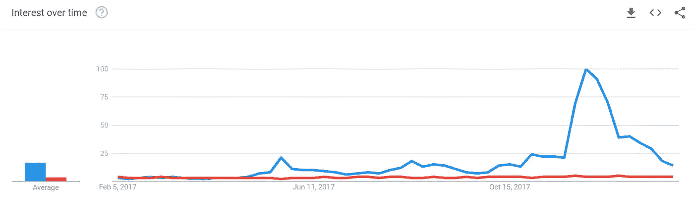
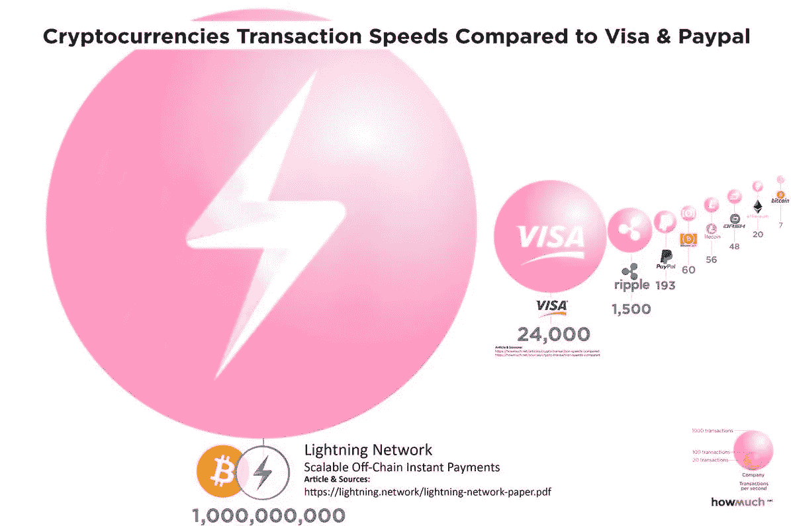

# 比特币迈向 10 万美元的实质性和技术性之路

> 原文：<https://medium.com/hackernoon/bitcoins-substantive-technical-road-to-100k-2637b899ffc5>

本文的目的是研究每枚比特币价格达到 10 万美元的基本路径。

这是我度过的最激动人心的 14 个月，充满了痛苦、快乐和不眠之夜，全都在键盘后面度过。花了十个多月的痴迷学习，积累了在观众面前自信地演讲的知识，接受了当地新闻频道的采访，并就这一有趣的主题公开写作。

通过我的研究，我发现我们当前以债务为基础的社会没有能力偿还政府的[巨额债务](/@KeratiChop/introduction-to-bitcoin-money-our-debt-based-society-2b74ec0f56c7)——量化宽松和部分准备金银行不起作用。因此，比特币的神秘起源是[密码朋克](https://en.wikipedia.org/wiki/Cypherpunk)运动的直接结果，该运动通过[建立最安全和不可阻挡的点对点网络](https://hackernoon.com/a-new-asset-class-blockchain-technology-cryptocurrency-73abd75f8109)以互联网速度进行价值交换，对抗腐败的银行老板。比特币代表了一种投机选择，与过去任何形式的货币都有着独特的不同，在地缘政治领域有着广泛的影响。讨论了许多情景，包括对比特币网络的协同攻击、短期泡沫破裂和/或政府彻底禁止比特币。许多人声称比特币没有任何东西支持，他们不知道计算机协议实际上是由大约 39 亿美元的物理硬件支持的。比特币的技术突破已经催生了多个价值百万美元的交易平台，并在微软、IBM 和摩根大通等公司创造了数万个新工作岗位。

本文是我关于比特币、区块链和加密货币现象的系列研究和分析的第五篇。

## //离岸银行账户&第一项不可分割的资产

合法拥有自己的钱的奇迹再也没有比 11 名沙特阿拉伯王室成员在政府镇压中被捕并冻结银行账户更诱人的了，尤其是阿尔瓦利德·本·塔拉尔王子，据估计他一人就拥有 190 亿美元的资产。

不同司法管辖区的离岸银行账户是限制政府控制范围的一种真正方式。它也是一个避税的避风港，因为丑闻不断的巴拿马文件揭露了超级富豪、高端政府官员和强大的跨国公司秘密储存财富的方法。在巴拿马文件之前，前首席经济学家[詹姆斯·亨利预测离岸账户总额为 21 到 32 万亿美元](https://www.reuters.com/article/us-offshore-wealth/super-rich-hold-32-trillion-in-offshore-havens-idUSBRE86L03U20120722)。巴拿马文件保守估计，全球国内生产总值(GDP)的 10%隐藏在这些离岸银行账户中。根据[世界银行的数据](http://databank.worldbank.org/data/download/GDP.pdf)，全球国内生产总值达到 75.6 万亿美元，其中 10%相当于 7.56 万亿美元，这是私人离岸银行的一个非常保守的估计，编织在一个由拥有不同实体的实体组成的错综复杂的网络中。其他法律领域的服务提供商打着资产保护的标签，对他们的业务照常收取高额费用。

通过将财富储存在比特币中获益最大的或许不是普通公民，而是富裕的个人。作为一种分散的价值储存手段，没有任何人或任何团体对网络拥有绝对控制权，比特币赋予每个人对其资金的完全自主权，没有任何服务费或被扣押的机会。假设这些富人并不愚蠢和/或笨拙地使用他们的私人密钥，简单地记住从英语字典中随机生成的 12 或 24 个单词的种子短语就可以让他们在地球上任何地方通过 SMS、笔记本电脑或台式机使用移动设备完全访问他们的资金，一天 24 小时没有任何限制或约束。

假设离岸银行账户中隐藏着 13.5 万亿美元，如果这些财富的 2%被重新分配给比特币，那么每 BTC 的价格将为 16038.43 美元。

## //黄金市场份额和分散的价值储存

据世界黄金协会估计，大约有 [187，200](https://www.gold.org/about-gold/gold-supply/gold-mining/how-much-gold-has-been-mined) [吨](https://www.gold.org/about-gold/gold-supply/gold-mining/how-much-gold-has-been-mined)的地上黄金储量。一公吨等于 35，274 盎司。黄金按盎司定价，今天的现货价格相当于每盎司 1348.10 美元。在打字时，有 16，835，BTCs 在流通。如果比特币不做任何其他事情，只占黄金 8.9 万亿美元全球市值的 5%，我们看到的是每 BTC 26，439.35 美元。

黄金已经并将永远是作为储备资产储存价值的安全形式，主要是因为它的特性，部分是因为几千年来建立起来的大众心理。元素周期表中的 AU79 是一种稀缺的不可改变的元素，它对自然腐蚀非常耐用，通常很难伪造，可以很容易地分成更小的单元，同时还保持致密，有延展性。

比特币与 21 世纪最伟大的发明家中本聪构建的黄金有着惊人的相似性。比特币可以被分割到小数点后第八位或一亿次。比特币超级耐用，拥有 [100%计算最安全的网络，比排名前 500 的超级计算机](https://hackernoon.com/a-new-asset-class-blockchain-technology-cryptocurrency-73abd75f8109)加起来还要耐用。比特币也不可能被伪造，因为每个人都可以下载一份账本，这是自 2009 年 1 月 3 日以来每笔比特币交易的永久记录。比特币还没有大众心理学，但是大量的比特币比大量的黄金更容易携带。你可以以目前平均 5.70 美元的价格向任何地点发送任何金额的比特币，与运输大额资金的传统部门相比，这是一笔微不足道的费用。运输价值 100 万美元的比特币比运输价值 100 万美元的黄金更容易、更便宜。最重要的是，比特币完全模拟了黄金的稀缺性，其资产释放是可预测的，而且是逐渐减少的。真正的经济学家会说让市场来决定，目前在出版之日，市场认为一个比特币的价值是一盎司黄金的四倍。婴儿潮一代拥有房地产和社会保障，X 一代拥有互联网和股市繁荣，千禧一代拥有比特币和加密货币。比特币更高效，完全透明，是有史以来发明的最好的全球处理支付方式。珠宝是实物黄金能做而数字黄金不能做的少数事情之一。在我看来，在我们的数字时代，比特币占据 5%的黄金市场份额是一个合理的假设。

Worldwide searches courtesy of Google Trends | Blue is “how to buy bitcoin” versus red “how to buy gold”

## //借记卡、信用卡和闪电网络

对于传统主义者来说，从现金到比特币是一个巨大的飞跃。从信用卡到比特币的变化并不严重，对大多数人来说，两者都只是网页上的数字。全球最大的借记卡和信用卡网络有 Visa、MasterCard、UnionPay、Discover 和 American Express。这些集中的第三方中介处理了超过 2270 亿笔交易，占借记卡和信用卡支付的[25.718 万亿美元](https://www.nilsonreport.com/publication_special_feature_article.php)。使用借记卡或信用卡时，您不直接向商家付款，而是向商家收取手续费，最低 [1.43%，最高](https://www.valuepenguin.com/what-credit-card-processing-fees-costs)3.5%。这就是为什么如果你决定用卡支付，一些餐馆要求最低消费 10 美元或 15 美元的部分原因。

可伸缩性和交易费用是人们最关心的问题之一。隔离见证(SegWit)的缓慢激活很好地证明了没有人能绝对控制比特币协议。SegWit 允许在不变的区块链之上构建第二层解决方案，第二层的进步之一是[闪电网络(LN)](https://lightning.network/lightning-network-paper.pdf) 。闪电网络在过去的两年里一直在大力发展，拥有计算机编程和软件工程方面最聪明的头脑。LN 允许几乎即时的交易和几乎为零的费用，大约 10 satoshis，不到百分之一美分。消费者可以随时开辟自己的 LN 支付通道，装载小额、可消费的比特币，将大部分留在冷库中。商家可以开设一个 LN hub，并且只需要这样做一次就可以开始收款。与塑料卡支付网络不同，商家不支付闪电网络上的交易费用。事实上，很少有商家接受比特币作为一种支付方式。由于成本大幅降低，这在经济上对大小企业都很有吸引力，尤其是因为商家可以在销售点清算回菲亚特。如果比特币协议能够占据全球支付处理市场 1.55%的份额(不包括现金)，那么我们将获得每 BTC 23，679.20 美元的收入。

Courtesy of: [https://lightning.network/lightning-network-paper.pdf](https://lightning.network/lightning-network-paper.pdf)

金融第三方中介在非常非常长的时间里第一次受到技术创新的威胁。随着今年早些时候闪电网络的部署，几乎同时，[包括美洲银行、摩根大通和花旗集团在内的主要信用卡发行商](http://fortune.com/2018/02/04/banks-ban-buying-bitcoin-credit-card/)禁止购买加密货币。占全球所有购买交易量最大的借记卡/信用卡网络处理器 Visa，[放弃了加密货币卡](http://www.independent.co.uk/news/uk/home-news/bitcoin-visa-cards-cryptocurrency-lock-prepaid-latest-a8144706.html)，并给出了一份口头声明说明原因。我不确定这些金融机构是否非常担心美国人民无法偿还他们的债务，他们的年利息率可能会达到 17.49%到 24.49%。在我看来，我们正处于大银行和信用卡网络的报复阶段。

通往 100，000.00 美元的道路并不平坦。

相互竞争的加密货币阵营认为，LN 将因为商业中心、支付渠道或热点而产生集中化。这肯定不是事实，因为 LN 对计算机程序的方向或发展没有控制权；LN 中心对链上编码没有任何权力——如果你有足够的天赋，比特币的程序开发是一个开放的精英体系。它只是一个第二层解决方案或*应用*建立在分散的和不可变的分类帐之上；LN 集线器对其他第 2 层应用程序没有任何技术控制。值得注意的是，闪电网络对用户来说完全是*自愿的*，如果他们愿意，可以选择开放多个支付渠道；[比特币持有者](https://bitcointalk.org/index.php?topic=375643.0)不需要使用 LN，如果他们本来就不想这么做的话。另类硬币还断言，LN 是一个借据系统，因为交易是离线结算的。这也是一种误解，因为你不能花你没有的比特币。您最多可以消费的 BTC 是您 LN 支付渠道中的最大可用金额。一旦 BTC 被转移到目的地，它们就留在那里，直到交易被记录在链上；没有欺诈性的退款或借据。尽可能清楚地说明，闪电网络允许每秒超过数百万的外链交易，几乎没有成本，随后被记录在链上，你不能花任何你没有的 BTC。比特币不是基于信用或债务的。

## //全球汇款、股票市场、流通中的美元和股票智能合约

全球汇款主要被美国的移民工人用来给家里寄钱。总市值达到了 5740 亿美元。与美国普通居民相比，这些人中的大多数从事着低工资的高要求劳动工作。全球范围内，这些家庭平均承受 7.4%的发送/接收费用。[我们已经知道委内瑞拉国家支持的货币的恶性通货膨胀情况，那里的人民依靠比特币生存。比特币、第二层解决方案和闪电网络可能对这些人最有用。](https://learningenglish.voanews.com/a/venezuelans-survive-on-bitcoin/4163819.html)

股市最近一直在狂飙，打破了新世纪开始以来的所有历史高点。这部分是由于[有争议的股票期权回购方法](https://www.forbes.com/sites/aalsin/2017/02/28/shareholders-should-be-required-to-vote-on-stock-buybacks/#2391d0bf6b1e)，公司用资金购买自己的股票，减少销售供应，提高价格。这些资金完全来自商业收入和中央银行印刷的法币。平均而言，公司花在回购股票上的钱比花在研发上的钱还多。市盈率(P/E 比率)是潜在高估股票的一个有力指标，根据公司相对于其收益的价值来衡量。市盈率再次处于类似于互联网泡沫和 1929 年大萧条的危险水平。[股票市场总市值达到 66.8 万亿美元。](https://i.imgur.com/ht1u5Dz.png)

国际商品和交易通常以美元定价。加密货币市场在 BTC 定价。公平地说，我们不会使用 83.6 万亿美元的 M1 和 M2 货币供应量，而是使用 1.5 万亿美元的流通供应量。全球汇款、股票市场和流通中的美元总额为 67.374 万亿美元。将这个数字除以 BTC 的可用供应量，然后用 0.8%的除法得出每 BTC 32，729.80 美元。

[根茎智能合约平台(RSK)](http://www.the-blockchain.com/docs/Rootstock-WhitePaper-Overview.pdf) 即将成为比特币协议的侧链、第二层应用，其特点是从基础不可变层进行合并挖掘，以及从 BTC 到智能比特币的双向挂钩(SBTC)。除了闪电网络，RSK 是最受广泛期待的比特币升级版本之一。智能合约平台是猜测最多的加密货币资产之一，由以太坊(ETH)、NEO 和 Icon (ICX)展示。智能合约平台有望进一步消除对第三方的需求。

我认为，由于 RSK 和 SBTC 的原因，在总数上增加 1，113.22 美元是公平的，使每个 BTC 的价格达到 100，000.00 美元。

## //结论

比特币和加密货币市场具有极大的投机性、金融风险和疯狂的非理性。

这篇文章的目的是概述比特币协议作为一种货币形式的效用。我相信，一旦 BTC 有足够的至少 2 万亿美元的流动性，我们将开始看到价格的波动性减少，稳定性提高。过去 8 个月，比特币软件开发的基础和技术进步非常突出，但其价格仍是投机性的。

在发布时，美国财政部认为比特币和其他加密货币是现金。美国商品期货交易委员会(CFTC)将[比特币定义为一种商品](http://www.cftc.gov/PressRoom/PressReleases/pr7654-17)。美国证券交易委员会(SEC)将[加密货币视为一种证券](https://www.sec.gov/news/public-statement/statement-clayton-2017-12-11)。最后，美国国税局(IRS)将新的资产类别归类为财产，特别指出“[虚拟货币被视为财产](https://www.irs.gov/pub/irs-drop/n-14-21.pdf)”。

传统资产经常处于一个政府机构的监管之下，有时是两个，很少是三个，绝对不是四个或更多。

明天东部标准时间上午 10:00，2 月 6 日星期二(T9)，SEC 和 CFTC 将与参议院银行委员会开会，明确讨论虚拟货币。如果参议院银行委员会的成员有在公司部门财大气粗的朋友，我不会感到惊讶。话虽如此，我还是有点乐观地认为，有大量现金在场外等待美国政府的绿灯，为灰色地带提供透明度。这是美利坚合众国的一次机会，让它走上正轨，再次成为下一次科技繁荣的领导者。过多的监管会扼杀创新。

从历史的角度来看，过去四年左右的整体市场下滑是准确的，这可以从互联网上的图表中看出。结合 FUD 的竞选活动，从字面上看，来自主流媒体的假新闻愚蠢地和/或故意曲解信息，以造成恐惧，不确定性和怀疑。或许我是一头妄想狂，但保守地说，我相信 BTC 将在 2023 年 2 月 5 日达到 10 万美元。然而，如果比特币价格跌至 0 美元，我就要和这艘船一起沉了。

感谢您的阅读。

*————*

[*1.1 —比特币简介:钱&我们的债基社会*](/@KeratiChop/introduction-to-bitcoin-money-our-debt-based-society-2b74ec0f56c7)[*1.2—比特币的安全模型:比特币挖矿是如何进行的？*](/hackernoon/a-new-asset-class-blockchain-technology-cryptocurrency-73abd75f8109)[*1.3—什么是道 Hack:以太坊、不变性、共识——规则&Forks*](/social-club/down-the-rabbit-hole-ethereum-immutability-consensus-rule-forks-e9fa8faa9e07) [*1.4—地缘政治与比特币:如果比特币被禁，会发生什么？*](/hackernoon/geopolitics-cryptoeconomics-2018-and-beyond-b91f4ea3a3c9)

[*2.1 —简介:群龙无首的秘密运动将与等级森严的政府分庭抗礼*](https://hackernoon.com/introduction-leaderless-crypto-movement-will-rival-hierarchical-governments-1c93afec3066)[*2.2—BIP—148 年 UASF 一周年:新的统治体系*](https://hackernoon.com/bip-148-uasf-first-year-anniversary-a-new-system-of-governance-223907ec298b)

*编辑帮助:
我的
BT
RL*