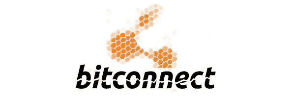
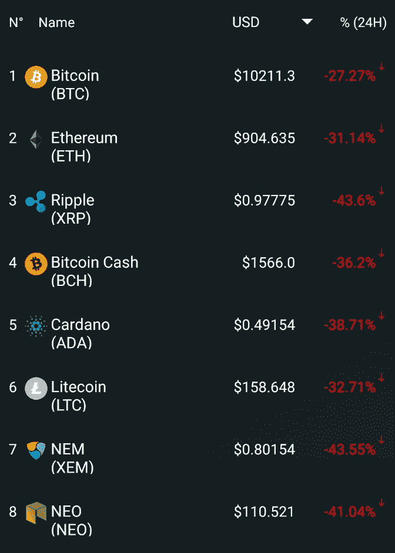
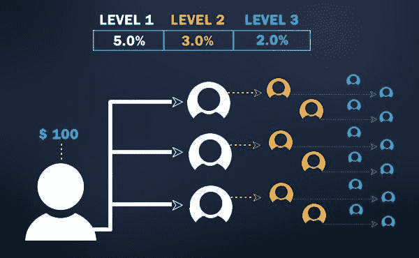
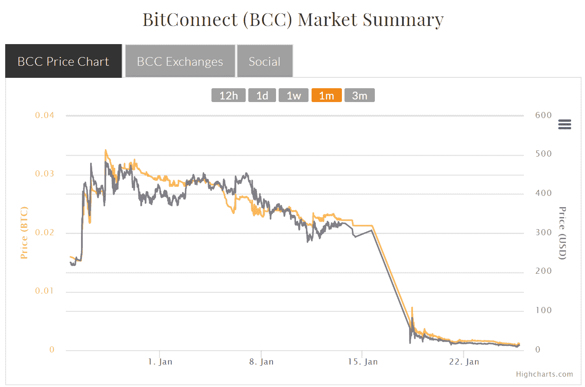
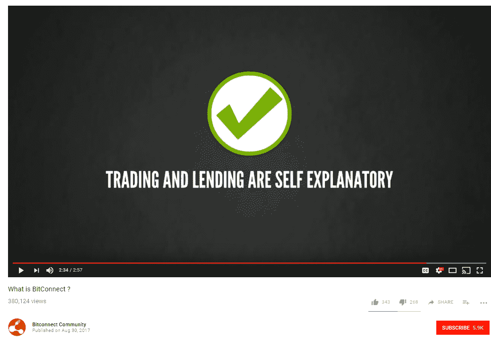
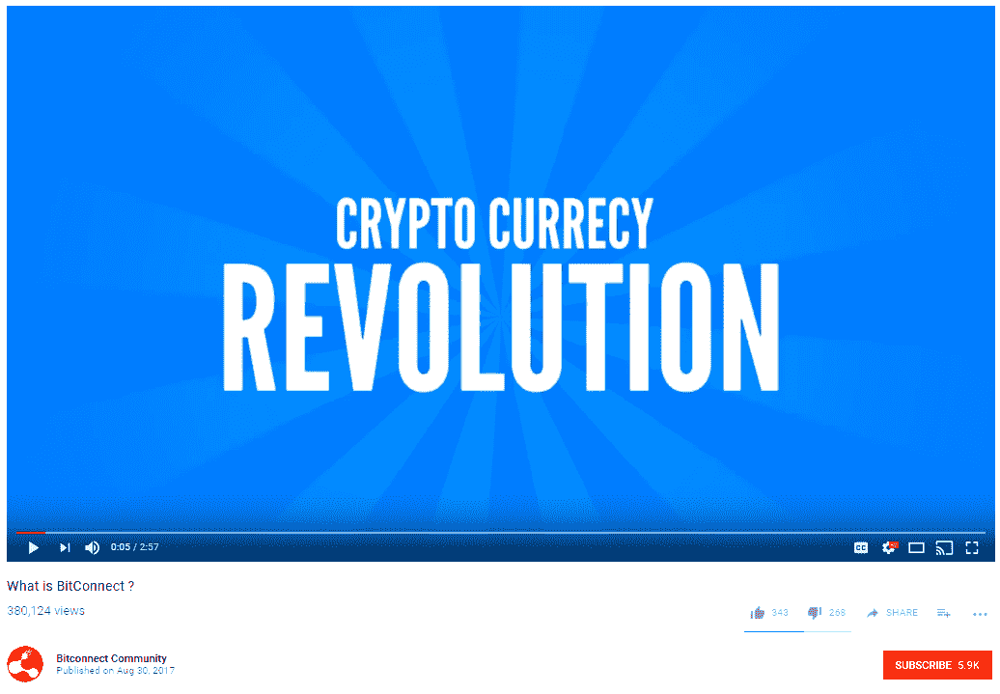

# bit connect——骗局剖析

> 原文：<https://medium.com/hackernoon/bitconnect-anatomy-of-a-scam-61e9a395f9ed>

Before reading this article please read our disclaimer at the bottom of the article or [here.](https://thebestoficos.com/disclaimer.html)

## 在一个包中加密的所有错误

# 介绍

上周的 1 月 16 日星期二，我们经历了加密货币世界近年来最大的崩溃之一，由于价格持续下跌，加密货币市值损失了数百亿美元。欢迎使用加密货币。

今年的泡沫是由两个主要因素造成的，一个是韩国可能会对加密货币的买卖进行管制的消息。韩国政府很快对这种情况做出评论，称用户将被允许交易，[，但前提是不能匿名。](https://www.reuters.com/article/us-southkorea-bitcoin/south-korea-to-ban-cryptocurrency-traders-from-using-anonymous-bank-accounts-idUSKBN1FC069)

更邪恶的东西也导致了崩溃。一家印度尼西亚公司——bit connect 停止运营，并透露这很可能是一个庞氏骗局。成千上万的人失去了一切。

那么 BitConnect 是什么，当初人们为什么会信任它，又是什么原因导致他们关门大吉？

Image Caption: The image we woke up to, Tuesday January 16th via Crypto Market Cap for Android.

# 历史

BitConnect 是一个公司，一个交易所，一个开源的基于比特币的加密货币。它于 2016 年 2 月推出，截至 2018 年初，它已成为最成功的加密货币之一，上个月创下了每令牌 463 美元的历史新高(目前约为 12 美元)，市值约为 27 亿美元。

该公司上个月变得非常臭名昭著，因为 Youtube 上出现了他们泰国会议的视频，显示嘉宾卡洛斯·马托斯的行为极其怪异。在该交易所崩溃后，该视频已被多家其他 Youtubers 网站选中。

## 它是如何工作的

用户通过他们的交易所交易比特币以换取 BitConnect 令牌，该交易所以股息的形式向用户提供每日利润。利润百分比取决于用户邀请多少其他人加入 BitConnect，以及用户拥有多少令牌。该公司声称，每天大约可以获得初始投资的 1%，或每年大约 3780%的利润。

此外，他们声称利润是通过他们创造的投资算法产生的。该算法在比特币价格低的时候投资，在价格高的时候卖出。极其奇怪的是，该公司没有提供关于这种算法的任何细节，例如它是如何工作的，它寻找的变量，甚至是随着投资池的不断增长，它将如何做出预测。

自从 BitConnect 的资金池几乎达到了$3B 市值以来，这种做法成为了社区的一个巨大担忧，拥有一种交易如此大量的算法将有效地导致投资下滑。这意味着当你买卖的数量越大，你的买卖行为就会影响资产本身的价格，因为你在总交易中所占的比例越来越大。该公司还将以美元而非比特币分享利润，这引起了进一步的批评。

更糟糕的是，BitConnect 使用了一个“推荐奖金”系统，该系统被多个 YouTube 加密人士大肆宣传，这些人现在因他们的推荐而面临法律指控。YouTubers 会因为推荐更多的人而获得越来越高的投资利润。事实上，BitConnect 平台的建立是为了招募他人，并为推荐他人加入网络的用户提供更高的奖励。

Caption: BitConnect News [website](https://bitconnect.co/system-news/87/changes-being-made-to-the-affiliate-program-the-removal-of-bitcoin-cash-and-bcc-is-added-to-hitbtc).

在达到他们的历史最高价格后不久，该公司收到了来自德克萨斯州和北卡罗来纳州的安全监管机构的停止和终止。作为回应，该公司决定关闭该交易所，这使得人们无法从他们的交易所取钱，并导致加密货币的价格暴跌，加密货币只能在其他 4 个交易所以密件抄送的形式交易。

Image from BitConnect’s website

# ICOs

为了使 ICO(或任何公司)长期成功，公司应该尽可能透明、合理地向投资者描述他们的计划。一个公司想要持续很长一段时间，让他们的投资者变得富有，他们会试图在很长一段时间内做到这一点，而不是试图尽快赚钱。

为了实现这一目标，创始人必须确保他们的加密货币经过深思熟虑。这意味着他们明白为什么要使用加密货币，并且能够将其传达给投资者和他们的团队。这是为了确保你的投资者明白他们投资的是什么，也是为了让他们明白你在做什么。

成功的 ICO 需要具备的一些要素包括:

*   一份完整的白皮书
*   透明的商业模式
*   商品和服务的描述
*   良好的社区管理
*   由第三方衡量的奖金或良好软件实践
*   没有利润承诺或保证
*   向您的客户提供对令牌的完全访问权限
*   位置和注册
*   资金用途
*   牵引和法律文件，如公司注册和股东协议

BitConnect 没有这些，他们的网站严重模糊了关于他们产品如何工作和做什么的信息。为了避免别人问问题。对用户来说，最大的问题是他们如何从贷款中赚钱？他们在 YouTube 上的视频在这一点上是如此的狡猾，他们对此说的唯一一句话是“交易和借贷是不言自明的”。

这令人不安的原因是，除非我们理解这种“交易和贷款”的条款和条件，否则很难判断这是不是一个好主意，甚至很难判断随着规模的扩大，这种做法持续盈利是否有意义。

Image Caption: From the BitConnect “What is BitConnect?” video on their [website](https://bitconnect.co).

# 庞氏骗局

庞氏骗局的定义是

> “…一种投资欺诈，向客户承诺以很小甚至零风险获得高额利润。参与庞氏骗局的公司将所有精力集中在吸引新客户投资上。这种新的收入被用来支付原始投资者的回报，标记为合法交易的利润。庞氏骗局依靠源源不断的新投资来继续为老投资者提供回报。当这个流量耗尽时，这个骗局就从
> ——Investopedia 的[庞氏骗局](https://www.investopedia.com/terms/p/ponzischeme.asp#ixzz55DQ9PrVV)中瓦解了

庞氏骗局有以下特点

1.  低风险高回报的保证承诺
2.  不管市场状况如何，始终如一的回报
3.  未在美国证券交易委员会(SEC)注册的投资
4.  属于秘密或被描述为过于复杂的投资策略
5.  不允许客户查看他们投资的官方文件
6.  面临取款困难的客户

BitConnect 不仅跟踪列表中的所有项目，而且以大多数庞氏骗局闻所未闻的规模和速度做到了这一点。

# 集体诉讼

截至 2018 年 1 月 25 日，针对 BitConnect 的多项集体诉讼正在准备中。[拥有数千名成员的脸书](https://www.facebook.com/groups/246758192530391/)组织也已经成立，以个人名义起诉 BitConnect 的每一名成员，以及向公众推荐和提及加密货币的名人推广者。

# 结论

Image caption: Image from BitConects YouTube Channel found [here](https://www.youtube.com/watch?time_continue=4&v=Gu126dXUSh4)

关于加密货币的可怕现实是，市场目前极其动荡，不仅表现在价格上，还表现在多个国家的证券委员会严重缺乏监管和答案，以及模糊的税收法规。

更糟糕的是，加密货币热潮已经导致许多人赚了几百万，而其他人却失去了一切。然而，变得富有的人比成千上万没有通过加密货币赚钱的人拥有更多的受众，这无助于认知。像 BitConnect 这样的令牌激励其他人告诉他们的朋友加入，只会使问题变得更大，它们是当前 ICO 领域的所有错误。

## 接下来的步骤

故事还没有结束，2 周前，BitConnect 的创造者推出了一种名为 BitConnectx 的新货币，并正在通过 ICO。自描述令牌执行以下操作:

> “BitConnect X (BCCX)是一种开源的、基于区块链的、去中心化的加密货币，能够以最低的交易费用向任何人进行即时支付。”
> ——基于 Bitconnextx [网站](https://bitconnectx.co/)。

该网站还提到，它将使用户能够交易加密货币作为交换。同样，他们几乎没有提供任何信息，也没有白皮书，他们没有解释他们与众多区块链“即时”支付方法有何不同，当然，他们已经有了一段黑暗的历史。

如果某样东西承诺了难以置信的回报，而且风险非常低，并且没有努力解释它是如何工作的，或者为什么会工作，那么用户应该非常怀疑。多人向 BitConnect 捐款的事实让他们在扩大影响力的同时获利。更糟糕的是，他们似乎还没有吸取教训。

想帮忙吗？
在 Bountey 上支持我们！[https://www.bountey.com/bestoficos](https://www.bountey.com/bestoficos)

想在 ICOs 中保持最新？
在[https://thebestoficos.com](https://thebestoficos.com)拜访我们

有一个有趣的故事？给我们在 info@bestoficos.com 写信

# 放弃

本网站及其包含的信息无意成为投资、金融、技术、税务或法律建议的来源。本网站不能代替专业建议和独立的事实验证。在没有首先评估你自己的个人财务状况，也没有咨询财务专家的情况下，千万不要使用这个网站上的想法和策略。本网站的所有内容仅供参考，按“原样”提供，不保证完整性、准确性、及时性或使用本网站所获得的结果。这只是一个存根，您对本网站的访问和使用取决于您是否接受并遵守[全部免责声明。](https://thebestoficos.com/disclaimer.html)免责声明适用于所有希望访问或使用本网站的访问者、用户和其他人。

Image Caption: Spelling mistake from the first 5 seconds of the BitConnect explanation video