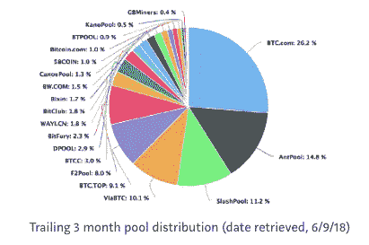

# 比特大陆给华尔街的信息是——忽视比特币太难了

> 原文：<https://medium.com/hackernoon/bitmains-message-to-wall-street-too-hard-to-ignore-bitcoin-a64c8873f040>

感谢那些转发和分享全球硬币研究的人，我们真的很感激，我们希望你喜欢本周的焦点话题。我收到了读者对各种话题的兴趣，许多人渴望了解更多关于比特大陆的信息，因为该公司上周宣布了他们的 IPO 计划。这是我尝试做一个简单的 KPI 分析来衡量业务的实力，并提供一些对公司的估值思路。

*注意:我在这里可能有偏见，但当我在研究比特大陆时，我意识到这家公司被掩盖得如此之少，尽管它在加密货币领域扮演着如此重要的角色。这里有一个例子。当我谷歌“比特大陆收入”时，今年 2 月的前两篇文章***都声称比特大陆比英伟达赚得更多。据称，比特大陆在 2017 年的营业利润为 30 亿至 40 亿美元，而成立于 24 年前的英伟达同期的营业利润约为 30 亿美元但从最近的***对吴的直接采访来看，2017 年收入为 25 亿美元。一个指标是营业利润，另一个是收入，这是一个巨大的差距。所以现在，我相信彭博的号码，除非你听到一个新的号码，请让我知道😂*。****

*对于那些不熟悉的人来说，比特大陆是由吴和 Micree Zhan 在 2013 年创立的，公司目前的总部设在北京。该公司是世界上最大的加密货币采矿芯片生产商，即 ASICs。此外，按 BTC.com 计算，比特大陆的蚂蚁池和 BTC.com 集体控制了超过 40%的世界比特币开采权。*

**

*基于我收集的数据点和一些相当保守的假设，我估计比特大陆每位员工的收入在 200 万美元左右，如果不是更多的话。这高于 [谷歌和脸书](http://www.businessinsider.com/tech-companies-revenue-employee-2017-8) **分别在 180 万美元和 160 万美元左右。***

*我之前在过去的新闻简报中报道过，第二大比特币矿业公司迦南创意也在寻求 IPO，他们在 2017 年的平均员工收入为 500 万元人民币，约合 70 万美元。2017 年总收入为 17 亿元人民币，拥有 243 名员工。当我最初了解这些指标时，我对该公司的销售效率印象深刻。作为参考，中国最大的科技公司腾讯(Tencent)根据其 2017 年底的数据，员工人均收入约为 75.5 万美元，阿里巴巴的销售效率甚至更低。*

*彭博的采访文章发表后，当我看着比特大陆时，我差点从椅子上跳起来。比特大陆的人均收入几乎是迦南的 3 倍。很可能是 200 万美元或者更多。*

*这是我的简单数学。Quartz 在 2017 年 8 月对公司做了一个[详细报道，当时提到比特大陆当时有大约 700 名员工。现在，我们假设该公司在 2017 年剩余时间内的员工人数将会大幅增长，在这种情况下，比特大陆的员工人数将从 8 月的 700 人增加到 12 月的 1400 人(我甚至不确定在 4 个月内雇佣 700 人是否现实可行，或者历史上任何科技公司都这样做过，但如果加密公司设定了这一先例，我不会感到惊讶)。2017 年，比特大陆的年收入为 25 亿美元，所以简单的计算就会告诉你，这相当于每名员工约 180 万美元。鉴于我积极的员工增长假设，这可能是一个保守的数字，所以我将其四舍五入至 200 万美元。所以请注意，这是非凡的销售效率。](https://qz.com/1053799/chinas-bitmain-dominates-bitcoin-mining-now-it-wants-to-cash-in-on-artificial-intelligence/)*

**注意:虽然我认识到只看一个指标并不能表明业务的整体健康状况，并会导致我做出许多错误的假设，但我确实认为销售效率是一个易于理解的 KPI，它代表了公司的核心。考虑到在比特大陆真正提交申请之前，我们并没有太多关于它的信息，这种数学允许一个简单的练习来方便地比较公司。**

*在成本方面，比特大陆受益于市场主导地位和规模经济。它可能已经享有与迦南相当的利润，如果不是更好的话。例如，成为第二大矿商可能需要迦南公司在营销上花更多的钱，与供应商的谈判能力更低。一旦迦南公司的申请文件可以获得，并且公司最早于下个月上市，我们将能够对比特大陆的利润率有一个大致的了解。*

**注意:与此同时，如果你有兴趣做一个有根据的猜测。我会让你去听硬件专家的意见。* [*宋*](https://twitter.com/jimmysong?ref_src=twsrc%5Egoogle%7Ctwcamp%5Eserp%7Ctwgr%5Eauthor) *曾试图计算出***是如何盈利的。他评估了比特大陆一些主要业务流的利润率。具体来说，他估计最受欢迎和最具代表性的 miner rig (S9)的生产成本约为 500 美元。S9 的零售价约为 1200 美元，这意味着 60%的毛利润。他还估计比特大陆的采矿成本约为每 BTC 430 美元。假设一个比特币的价格为 7036 美元，这是我做分析的时候，95%的收益将直接进入底线。***

***现在，很难更精确地计算业务的利润率，因为我们不知道收入是如何按业务线划分的。比特大陆的主要业务是 1)销售比特大陆的采矿机器，2)出租其采矿设备，3)开采比特币。假设总成本最高的业务是生产比特大陆的采矿钻机，那么我们应该预计毛利率大于 60%，假设吉米的上述估计和假设是正确的。从 SG & A 的角度来看，我认为研发将会占收入的很大一部分。如果销售和营销占收入的 10%或更少，我不会感到惊讶，因为比特大陆的品牌已经得到了市场的认可。***

**关于估值。一旦迦南上市，我们将能够有一个比特大陆估值倍数的基准。我真的很高兴看到并监控市场会给迦南多少倍数，因为这是一个很好的起点，可以了解机构投资者对加密货币的长期信任程度。对比特大陆来说更是如此。比特大陆的 IPO 规模将至少是迦南的 10 倍，机构投资者将更难忽视它。那些本来不想*了解比特币和加密货币的投资者将不得不*了解比特币和加密货币，以评估比特大陆的估值。此外，比特大陆将于今年年底开始销售其人工智能芯片，我非常乐观地认为这是该公司新的稳定的收入来源和增长动力(你可以在 [Quartz 文章](https://qz.com/1053799/chinas-bitmain-dominates-bitcoin-mining-now-it-wants-to-cash-in-on-artificial-intelligence/)中阅读更多关于人工智能芯片的信息)。**

***注:我看好比特大陆的人工智能芯片。一些人最初对他们嗤之以鼻，认为英伟达或英特尔将吃掉这些家伙的午餐。然而，我想强调的是，中国最近的贸易政策对比特大陆非常有利。在中美之间的中兴贸易战不和之后，中国政府一直在越来越多地推动中国自己开发的芯片***s。我确信比特大陆将从中受益。****

**所以总体来说，我对比特大陆的未来非常乐观。它的首次公开募股可能会是一次成功而非凡的。它在芯片和硬件行业日益增长的规模和相关性将使一些剩余的怀疑者无法忽视比特币和加密货币。**