# Bittrex 交易所评论—初学者指南

> 原文：<https://medium.com/hackernoon/bittrex-exchange-review-beginners-guide-218057b92be2>

Bittrex 是最大的知名加密交易所之一，日交易量超过 1.6 亿美元。Bittrex exchange 由比尔·希哈拉(Bill Shihara)创建，他曾在亚马逊和黑莓担任安全工程师，并特别强调可靠性和防止安全漏洞。Bittrex 的总部设在美国，这在加密交易所中很少见。迄今为止，Bittrex 持有近 300 种加密货币，具有快速存款和取款功能，并有可靠的客户支持。

# 如何注册 Bittrex(注册、验证和存款基金)

在 Bittrex 上注册是一个相对简单的过程。首先，你需要提供一个电子邮件和一个安全的密码来注册。

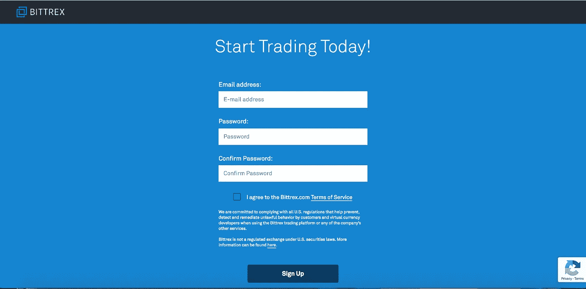

接下来，您需要验证您的电子邮件地址。

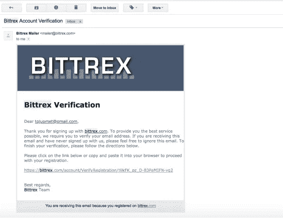

注册后，我们将建议您使用 Google authenticator 应用程序通过双因素身份验证(2FA)来保护您的新帐户。

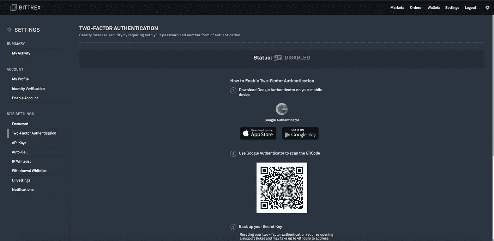

Bittrex 确实要求用户验证身份才能取款。然而，为了避免复杂化，他们强烈建议在验证过程完全完成之前不要存入任何资金。

要验证您的身份，请单击顶部菜单上的“设置”选项卡。

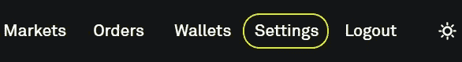

请记住，如果你从一个新的 IP 地址登录，Bittrex 还会经常要求你重新确认你的电子邮件(在通常的登录和 2FA 之上)。

接下来，选择“我的个人资料”开始注册过程。

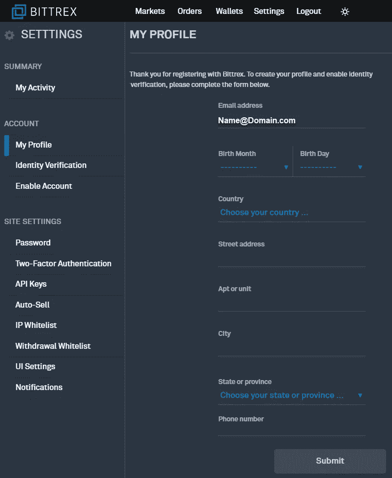

完成所有字段后，单击“身份验证”选项卡，然后单击“开始验证”。

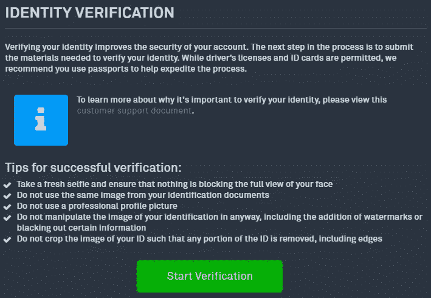

该过程将要求您使用官方签发的政府身份证和/或护照来验证您的身份。

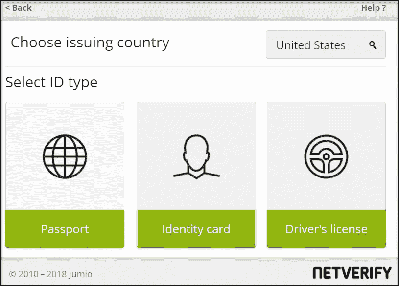

提交所有信息后，系统应该只需要几分钟时间来处理您的信息、身份证和照片。验证后，您将在身份验证页面上收到一封确认电子邮件和一则通知。

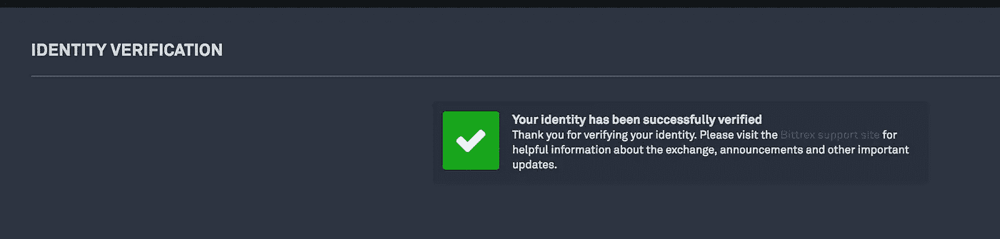

现在您已经准备好存款了，恭喜您。
要存入硬币，请从右上角菜单进入“钱包”选项卡。

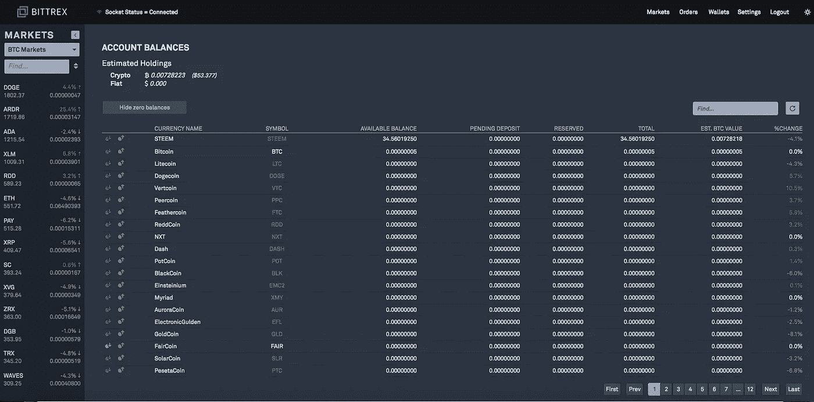

在这里，您可以看到您的帐户余额，以及上列出的各种代币。
如果你点击每枚硬币旁边的绿色圆圈箭头图标，就会弹出一个窗口，要求你生成一个新的钱包地址。点击“新地址”。

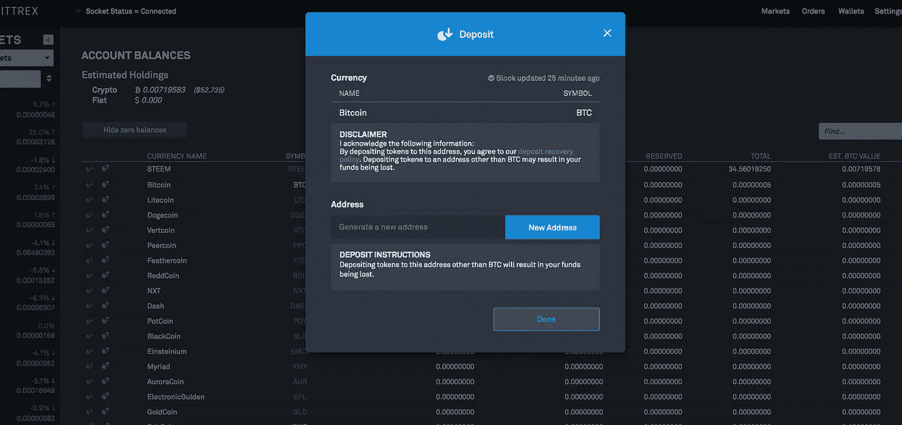

创建地址后，将其复制并从您的数字钱包中发送所需金额，以便存入 Bittrex。仔细检查您是否将正确的硬币放入相应的钱包中。否则，可能会导致您的硬币全部丢失。

在您的交易按照 Bittrex 要求的确认次数得到确认后，您的账户将被记入贷方，您可以开始交易了。

# 如何在 Bittrex 交易所交易

在主页(或“市场”)页面上，您可以搜索您想要的交易对。主页显示了特色交易对及其统计数据。

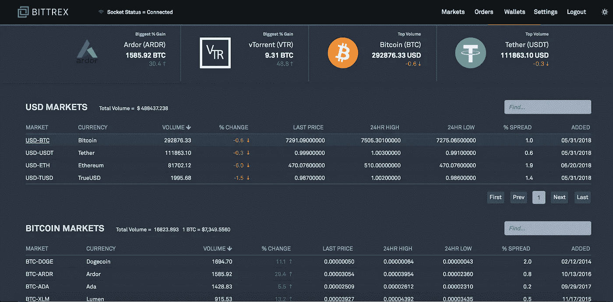

一旦你点击一个特定的交易对，你将被引导到市场页面。页面顶部显示图表，可以通过时间框架、图表样式(条形、彩色条形、线条等)、指标(ADX/DMS、鳄鱼、Awesome 振荡器等)和选择工具(十字线、线段、连续线等)进行调整。价格实时调整，存款/取款可以直接在该对的页面上进行。

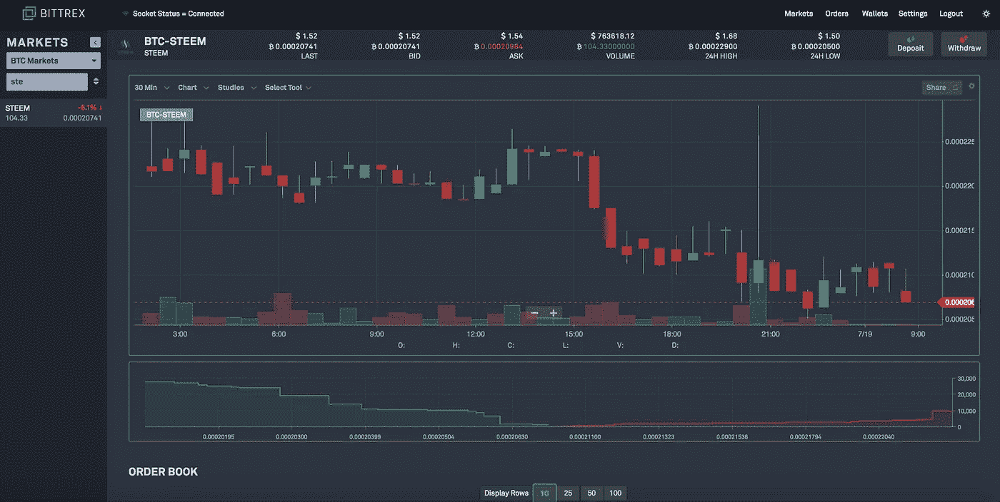

一旦你再向下滚动一点，你就会看到订单簿。在这里，您可以查看所有买卖订单(或“出价和要价”)。Sum 表示累计到特定订单簿行的基础资产总额。

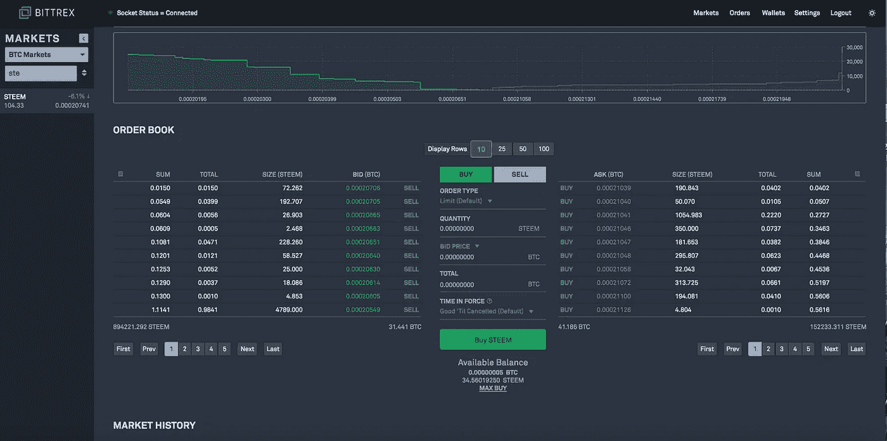

在中间的框中，为新创建的订单选择您想要的价格和数量。在“订单类型”下，您可以选择“限额(默认)”或“有条件”。限价订单是以特定价格(或更低价格，如果有的话)买入或卖出的订单。“买入”限价单以指定限价或更低价格执行，而“卖出”限价单以指定限价或更高价格执行。限价单帮助你获得最好的买卖交易(不像 T2 的分散交易)。

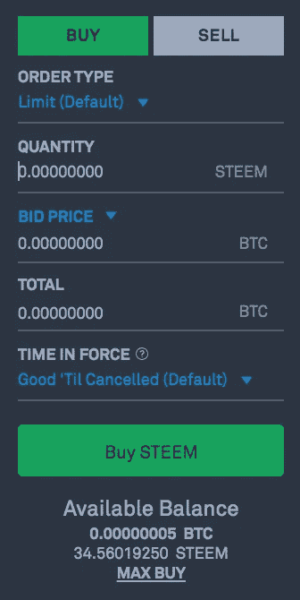

也可以在 Bittrex 上设置止损指令。止损是当你设定一个价格，你希望卖出一枚硬币，以限制你的损失。如果你买一枚硬币时预期它会涨价，这是一个最小化风险的好方法，但相反，它会下跌，你会赔钱。止损可以使用条件订单功能来设置。

条件订单是更高级的交易订单，如果满足指定的标准，就会自动提交或取消。
点击“有条件订单”时，用户可以将条件设置为“高于或等于”或“低于或等于”目标价格。

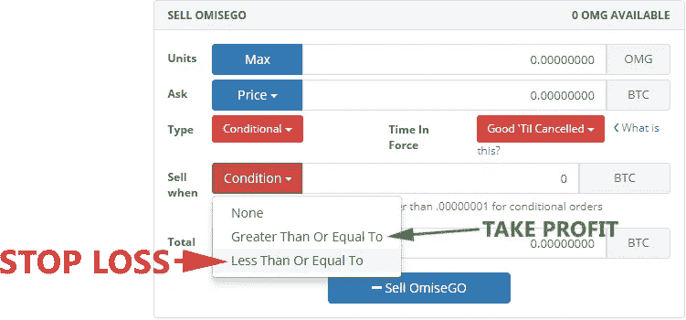

他们还可以设置“生效时间”，这提供了两个选项；“直到取消订单”或“立即或取消订单”。

有效直至取消(GTC)订单是一种买卖股票的订单，持续到订单完成、到期或取消。任何订单的最长有效期为 28 天。

立即或取消(IOC)指令是指必须立即执行的股票买卖指令。国际奥委会订单中任何不能立即完成的部分都将被取消。

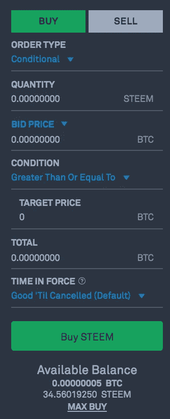

订单完成后，您可以在同一页面的底部查看您的未结订单和订单历史记录(您也可以在“订单页面”上查看相同的信息)。

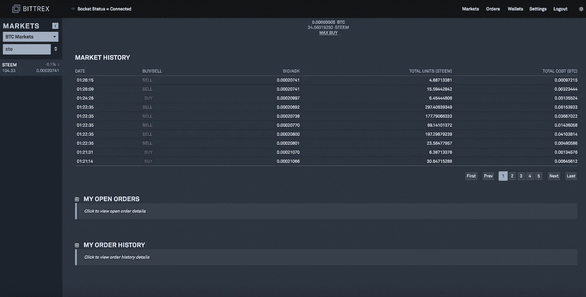

# Bittrex 费用

Bittrex 对所有交易收取 0.25%的费用。这略高于其他普通交易所，如币安(0.10%)。Bittrex 不收取存款费用，但收取取款费用，以补偿通常内置于不同硬币中的网络转账费用。

# 支持的资产

Bittrex 目前支持大约 300 种硬币。该名单包括 ERC-20 代币，基于 DAG 的硬币和其他区块链硬币，如尼奥和卡尔达诺。

# Bittrex 客户支持

像最受欢迎的交易所一样，Bittrex 处理大量的请求和支持票。然而，该平台通常会快速回应问题，并通过社交媒体保持沟通渠道畅通。他们还有一个专门的支持页面，详细描述了如何使用网站上的所有功能，并提供了常见问题的答案。当我们寄出支持票后，仅两天就收到了回复。

# Bittrex 安全吗？

该交易所非常重视安全性，要求您每次从新的 IP 地址登录时进行双重身份认证、身份验证和电子邮件确认。到目前为止，过去三年中没有发生重大的 Bittrex 黑客攻击事件，尽管用户应该始终警惕来自**钓鱼电子邮件**或类似 Bittrex 官方网站地址的网站 URL 的个人黑客攻击企图。

# Bittrex API

Bittrex 确实允许交易机器人使用它们的 API 密钥链接到账户。这些机器人可以下达限价买卖订单。

# 站点状态

Bittrex 试图尽可能透明地展示其系统的运行状况。在站点状态页面上，用户可以查看 Bittrex 热门钱包和市场的状态信息，每 5 分钟更新一次。
页面显示交易所上市的每枚硬币的状态、块高和连接。

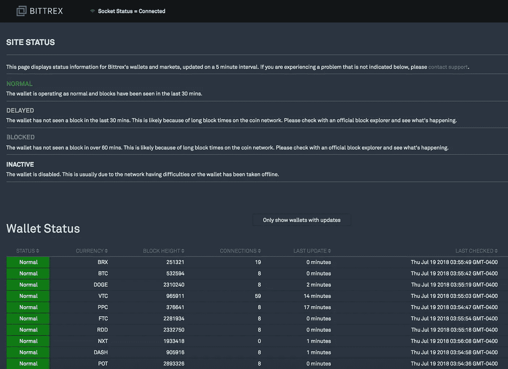

# 赞成的意见

*   高度安全、卓越的用户体验和设计
*   网站状态报告显示，用户体验始终是重中之重
*   复杂的支持
*   基于美国

# 骗局

一些用户[向](https://cointelegraph.com/news/bittrex-exchange-breaks-silence-on-banned-accounts-questions-remain)抱怨称，他们的账户在审查完成前被暂时冻结。这些用户在网上表达了他们的不满，但往往没有收到回复。作为一家总部位于美国的交易所，该公司被迫遵守 KYC 和反洗钱流程，这可能会导致其对其认为可疑的活动反应过度。

# 结论

总的来说，Bittrex 是典型加密交易者的必备工具。该交易所提供了数百种高知名度的硬币，加上为高级交易者和开发者提供的一整套功能，让每个技能水平的交易者都满意。他们还通过他们的支持页面强调安全性和可用性。如果你刚刚开始交易，或者对探索替代交易所感到好奇，Bittrex 应该是一个可以考虑的平台。

*原载于 2018 年 7 月 26 日*[*cryptopotato.com*](https://cryptopotato.com/bittrex-exchange-review-beginners-guide/)*。*