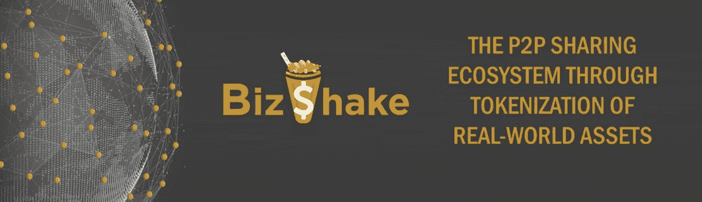
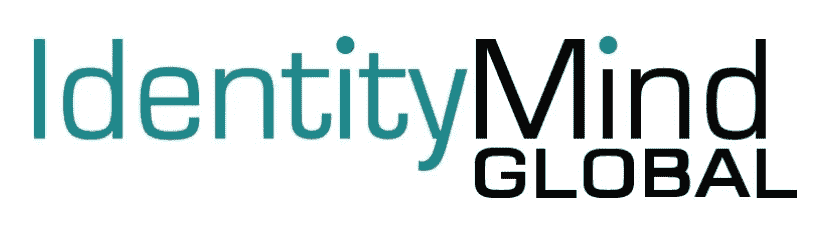

# STO 商业评论第四部分:战略伙伴关系

> 原文：<https://medium.com/hackernoon/bizshake-sto-review-part-4-strategic-partnerships-cbff8709bf00>

**[**BizShake**](https://bizshake.io/)**项目旨在通过一对名为 SmartRent 和 SmartPawn 的 DApps 创建第一个分散的典当和租赁生态系统。****

****这个由 5 部分组成的系列将讲述是什么让 BizShake 在 sto 进入 cryptosphere 的浪潮中脱颖而出。****

****如果你还没有读过，你可以在这里找到关于 BizShake 的其他文章:****

*   ****[**第一部分:成为 NEP-5 令牌的荣誉**](/@blockchainauthor/bizshake-sto-review-part-1-the-honor-of-becoming-a-nep-5-token-c683925973f9)****
*   ****[**第二部分:团队&网站**](/@blockchainauthor/bizshake-sto-review-part-2-team-website-a65a3d72f59d)****
*   ****[**第三部分:记号组学**](/@blockchainauthor/bizshake-sto-review-part-3-tokenomics-d1a32d4d9ce6)****

****BizShake 能抓住一些进入加密世界的新的安全令牌业务吗？让我们来看看…但首先，我想确保我们在同一页上…****

********免责声明*** *:这不是投资或理财建议。无论如何我都不是金融专家。本文中的大部分信息都是推测性的，仅仅是我个人的观点。在参与任何创业项目之前，一定要进行自己的研究。*****

****永远记住，你用你的资金做什么是你自己的决定。如果这个决定对你一个人来说太难了，向金融专家寻求指导。****

****我可能会也可能不会收到创建此内容的少量令牌分配。也就是说，我会尽我所能保持公正和公平。我尽量避开所有的 FOMO 和 FUD，也绝不希望把这些情绪传染给我的秘密首脑伙伴们。****

******:某些国家被排除在 BizShake 即将举办的 STO 之外。别忘了查看(精彩！)条款和条件页面。如果你的国家被列入黑名单，你不必担心；你只需要等到交易所推出 BZS 代币。******

# *****扩展团队*****

*****与你所在行业的关键人物合作是好企业转变为伟大企业的途径。BizShake 已经开始了保护他们的进程，这是令人鼓舞的，因为他们的 STO 还有几个月的时间。*****

*****该团队已经选择了一些合作伙伴，包括 BountyOx 和 Diacron，更多的合作伙伴必将出现。*****

*****我们不会在这里涵盖所有的合作关系，但是有三个值得注意的项目绝对值得一提…*****

**********

*****Keeping it in the NEP-5 family*****

# *****一个 ID 可以统治所有人*****

*****用户的真实身份是 BizShake 生态系统的支柱。如果用户不能信任他们在和谁打交道，网络就会停止运转。*****

*****用户资产是另一个重要的组成部分。BizShake 需要大容量才能茁壮成长。此外，调解假冒商品的名声也不会太好。*****

*****BizShake 选择本体来解决这两个重要问题。在本体项目的应用程序中，用户可以创建一个 ONT ID。*****

*****ONT 身份证是一种基于区块链的个人身份识别机制。简而言之，这是一种在 BizShake 平台上集中您的身份和资产的方式。*****

*****现在，这种伙伴关系服务于许多目的:*****

*   *****BizShake 用户的 ONT id 将与他们在该平台上所做的一切联系在一起。*****

*****无论是买卖、借贷，你在 BizShake 网络上的每一次互动和每一笔资产都与一个 ONT ID 相关联。*****

*****对于资产来说，这有两个主要好处:澄清*你拥有什么*，以及证明你确实拥有它。*****

*****在金钱方面，网络使交易变得容易。*****

*****你看，本体的应用程序也是一个钱包，目前存储 ONTO 本体网络的原生令牌。就像 NEO/GAS 一样，如果你把 ONT 藏在你的钱包里，你会得到网络燃料的奖励:ONG。*****

*****这里的主要好处是简化了 BizShake DApps 的使用。没有必要为创建单独的帐户而烦恼。因为说实话，谁会需要另一个密码呢？没人，就是他。*****

*   *******ONT IDs 遵循国际 W3C 标准。*******

*****英特尔非常重视“数字身份”的概念。W3C 是一个致力于建立互联网活动标准的国际组织。*****

*****至少现在，他们的标准是可接受实践的基准。团队本体确保他们的数据收集过程符合 W3C 规范。*****

*****通过坚持这些标准，BizShake DApps 拥有了内在的信任度。如果你知道内情——你现在知道了！——并且了解 W3C 是怎么回事，你会觉得在网络上互动非常安全。*****

*****如你所见，BizShake 决定与新区块链最受欢迎的 NEP-5 代币合作是明智之举。*****

**********

*****Putting IoT on the blockchain*****

# *****智能跟踪*****

*****BizShake 的 SmartCertify 计划面向高端资产。任何付费的 BizShake 用户都可以拥有由第三方进行专业评估和认证的资产。*****

*****进入 SmartCertify 计划的资产将记录在区块链上，并与上述 ONT ID 相关联。在评估过程中，资产评估员将使用跟踪设备。*****

*****现在，这些物联网设备及其相关软件都是由 Dotando 制造的。当 BizShake 用户分享一项资产时，他们都会扫描 Dotando 的跟踪设备，使用 Dotando 的应用程序来完成这一操作。*****

*****扫描标签揭示了 BizShake 平台上资产的相关信息和历史。这种透明的保证让每个人在交换资产时都放心。*****

**********

*****Automating KYC and ICO compliance*****

# *****了解所有的顾客*****

*****为了降低平台贡献者的风险，BizShake 的目标是获得美国 SEC REG A+资格。*****

*****许多新的加密创业公司根本不理会美国，但在某些情况下，经认可的鲸鱼被允许进入池中。*****

*****BizShake 采取了一种更加自律的方式。意识到美国是一个不容忽视的巨大市场，他们的 A+申请将给予普通公众参与的权利。*****

*****法律要求是一个充满繁文缛节的雷区。尽早开始这一过程符合 BizShake 的最大利益。*****

*****为了加快这个过程，BizShake 使用了 IdentityMindGlobal 的服务。KYC 和反洗钱对任何 STO 来说都是不可避免的。我认为让专家来处理这些细节是一个很好的选择。*****

*****有些事情最好留给其他人去做，我欣赏那些投入一些资金来解决任务的项目，他们知道其他人可以做得更好。*****

# *****最后的想法…*****

*****BizShake 项目越来越多的合作伙伴正在很好地塑造生态系统的功能。该团队选择了与他们试图实现的目标完全一致的公司。*****

*****通过解决法律、法规和平台功能的要素，BizShake 正在为积极的结果做准备。具体的、预先思考过的计划在加密创业领域是一个受欢迎的景象。*****

*****没有指名道姓，但有几个人创建了一个应用程序或 DAapp，然后向社区寻求如何使用它的想法。*****

*****相比之下，BizShake 确切地知道他们想要做什么，团队正在采取积极的措施来完成工作。*****

*****虽然这些最初的合作很好，但我觉得还会有更多。如果该项目选择涉足人工智能来改进平台，他们已经有几个 NEP-5 候选人可供选择。*****

*****即使团队认为他们的合作伙伴聚会已经完成，我仍然对 BizShake 想要完成的事情感到兴奋。主要是因为这是少数几个我会实际使用的区块链项目之一。*****

*****我不想交易我打算放在钱包里的 BZS 代币。不，我宁愿让它们在 BizShake 网络中流动。*****

*****访问 [**BizShake 网站**](https://bizshake.io) 了解更多关于该项目和即将到来的 STO 的信息。*****

*****为了方便起见，这里有更多的 BizShake 项目资源:*****

> *****[脸书](https://www.facebook.com/bizshake)[LinkedInT5**T7**](https://www.linkedin.com/company/bizshake/)**[中型](https://medium.com/bizshake)****Reddit*******
> 
> *******[电报](https://t.me/bizshake) [推特](https://twitter.com/BizShake_ico) [白皮书](https://bizshake.io/sites/default/files/BizShake_Whitepaper_1.2_ENG.pdf)YouTube*******

## *******顺便说一下…*******

*******如果你喜欢你在这里看到的，并且需要帮助把你的加密信息传递给大众，我很想听听你的项目。*******

*******请随时联系我:blockchainauthor 作者在 Gmail*******