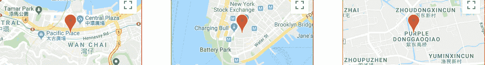
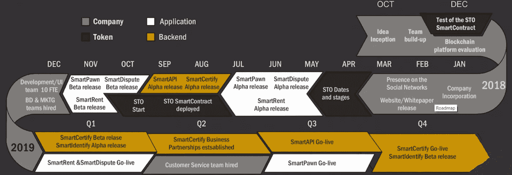
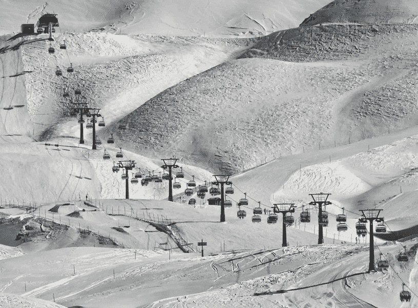

# BizShake STO 评论第 5 部分:项目路线图

> 原文：<https://medium.com/hackernoon/bizshake-sto-review-part-5-project-roadmap-1caf44a8c8b0>

在对等的基础上交换日常用品正在区块链兴起。而且都是去中介化的成本节约效率。

**[**BizShake**](https://bizshake.io/)**项目正在通过一对名为 SmartRent 和 SmartPawn 的 DApps 建立第一个去中心化的 P2P 租赁和典当生态系统。****

****今天的文章是关于 BizShake 的 5 部分系列的最后一部分。如果你错过了前四篇博文，你可以在这里找到它们:****

*   ****[**第一部分:成为 NEP-5 令牌的荣誉**](/@blockchainauthor/bizshake-sto-review-part-1-the-honor-of-becoming-a-nep-5-token-c683925973f9)****
*   ****[**第二部分:团队&网站**](/@blockchainauthor/bizshake-sto-review-part-2-team-website-a65a3d72f59d)****
*   ****[**第三部分:记号组学**](/@blockchainauthor/bizshake-sto-review-part-3-tokenomics-d1a32d4d9ce6)****
*   ****[**第四部分:战略伙伴关系**](https://hackernoon.com/bizshake-sto-review-part-4-strategic-partnerships-cbff8709bf00)****

****该项目能够驾驭涌向加密领域的安全令牌海啸吗？****

****我们会一起找出答案的。但首先，让我们确保我们说的是同一种语言…****

*******免责声明*** *:这不是投资或理财建议。无论如何我都不是金融专家。本文中的大部分信息都是推测性的，仅仅是个人观点。在参与任何创业项目之前，一定要进行自己的研究。*****

****永远记住，你用你的资金做什么是你自己的决定。如果这个决定对你一个人来说太难了，向金融专家寻求指导。****

*****我可能会也可能不会收到创建此内容的少量令牌分配。也就是说，我尽最大努力保持公正和公平。我尽量避开所有的 FOMO 和 FUD，也绝不希望把这些情绪传染给我的秘密首脑伙伴们。*****

******:某些国家被排除在 BizShake 即将举办的 STO 之外。别忘了查看(精彩！)条款和条件页面。如果你的国家被列入黑名单，你不必担心；你只需要等到交易所推出 BZS 代币。******

**********

# *****凝固在时间里*****

*****在我们进入 BizShake 路线图的具体细节之前，让我们先讨论一下这些文档的一般理论。*****

*****无论是否在区块链，路线图在任何项目的开始阶段都是必不可少的。团队需要清楚地定义它想去哪里，然后精确地计划如何到达那里。*****

*****但这是加密的——空间以极快的速度移动。评估、调整、适应——测试、测试、再测试——的团队可以在竞争中领先几步。*****

*****关键是，不要把一家区块链初创公司的路线图视为一个静态的、不屈不挠的目标。相反，将它们视为未来的框架，在第一款产品上市时，很可能需要演变成完全不同的东西。*****

*****一个典型的例子——尽管当前的路线图另有规定，但在等待美国公民获得 SEC 批准的同时，BizShake STO 正式延期。一个单一的发展可以对整个地图产生多米诺骨牌效应。*****

*****也就是说，路线图仍然是必要的和高度相关的。潜在的贡献者需要确保项目团队对他们试图完成的目标有一个清晰的愿景。*****

*****没有一个，很难评估一个团队认为他们有能力实现什么。任何创业公司都是团队的杰作——他们必须赢得局外人的信任。*****

**********

*****We’re nearing the half-way mark of BizShake’s 2-year forecast*****

# *****周年快乐*****

*****10 月标志着 BizShake 项目整整一年的进展。当团队花了整整 12 个月的时间进行编码、测试、部署和制定战略时，我会很感激。*****

*****[**BizShake Alpha**](https://alpha.bizshake.io/) 现已上线——尽管选择还有很大的扩展空间，但还是可以去看看遍布欧洲的有用物品。*****

*****让我们以目前的滑雪围兜为例，说明这个平台的成本效益如何。作为一个不得不在最后一刻手忙脚乱地为孩子寻找滑雪装备的家长，我在这里说的是第一手经验。*****

**********

*****Snow days can get expensive*****

*****在雪国度假并不便宜。在结冰的道路上运输，在山间小屋住宿，高价格但低质量的度假食品，以及所有专门的装备之间，雪地游戏会很快耗尽你的钱包。*****

*****让孩子们参与这些冬季活动会增加一笔全新的开支。租木板很容易。滑雪商店不缺它们。但是滑雪围兜或者滑雪板裤呢？不像租来的那么好找。*****

*****另外，有 99.99%的可能性，你的小家伙长大了，不管你今年把他们放在哪里。不像我们成年人，他们不能忍受连续几年穿着同一件夹克。*****

*****这就把我们带到了 BizShake 的要点——有些东西，尤其是度假时，租比买要好得多。*****

*****只要你的冬日仙境是俄罗斯的圣彼得堡，每天花上几美元，你就可以租一条滑雪围兜，并在娱乐结束后归还。*****

*****另一种选择是 ***买一个*** 就为了让小强击手可以穿几次，这是一个彻头彻尾的荒谬的并列。*****

*****随着平台的成熟，P2P 资产交易所服务的人群更大。理想情况下，你会找到你要去的城市，并在 BizShake DApp 找到大量的租借物品。*****

**********

# *****前方的路*****

*****太大太快会毁掉最好的公司。这种情况在这里似乎并不存在。*****

*****在将整个营销部门整合到他们的组织中之前，该团队正在采取一种系统化的方法，从 Alpha 到 Beta 测试他们平台的应用程序。*****

*****虽然一些项目满足于发布即将发布的公告，并打算发布进一步的公告，但 BizShake 似乎并没有搭上宣传的列车。*****

*****目标是在开始将消息传播到整个加密领域之前，让平台的大部分都启动并运行起来。*****

*****正如本系列的第一篇文章所指出的，BizShake 已经吸引了全球数百万近地天体追随者的关注，因为他们选择用 NEP-5 令牌来运行他们的生态系统。*****

> *****向美国猖獗的资本主义和消费主义开放平台，对项目的整体成功至关重要。这个市场太大了，不容忽视。*****

*****驶向 2019 年——假设美国证券交易委员会停止拖延，批准注册。BizShake 已经申请了 A+分类——该项目预计将实现一些重要的里程碑。*****

*****愿望包括让该平台的六个“智能”组件中的一半完全投入运营——争议、典当和租赁。*****

*****最后两个是生态系统的命脉，考虑到该平台已经存在并正在发展，该团队正在努力实现他们的目标。*****

# *****最后的想法…*****

*****看过这个平台的运行后，我期待着它的全面发布。*****

*****环顾你的房子或公寓，很有可能，你会发现很多你很少或不再使用的物品。现在你可以把它们租出去了。*****

*****给自己买些耐用的东西？假设 BizShake 生态系统进入了你的社区，出租足够多，你很可能会获得比你最初支付的更多的收入。*****

*****而且，当你收费的时候，访客就买到了便宜货。能说赢/赢吗？*****

*****BizShake 项目正在被广泛采用。SEC Reg A+许可是即将到来的增长催化剂。*****

*****毕竟，如果是政府，雇佣营销和客户服务团队是很棘手的。干涉是象征性的——阻碍你的筹款努力。*****

*****一旦法律团队突破了所有的繁文缛节，BizShake 将成为区块链 P2P 和安全令牌市场的有力竞争者。*****

*******DYOR*******

*****BizShake 很有潜力成为一个杰出的区块链项目。我喜欢他们选择的行业，也同意他们获得市场份额的计划。*****

*****但这只是我的看法——对你来说，有必要对你可能参与的任何项目进行更深入的挖掘，这样你才能形成自己独特的观点。*****

*****如果这 5 集系列还不够阅读的话，你可以通过 BizShake 网站 **随意阅读。*******

*****另外，不要忘记 BizShake 白皮书 来了解关于这个项目和即将到来的 STO 的更多信息。*****

*****👇**通过团队 BizShake 进行社交**👇*****

> *****[脸书](https://www.facebook.com/bizshake)LinkedInMediumReddit*****
> 
> *****[电报](https://t.me/bizshake)推特 YouTube*****

## *****顺便说一下…*****

*****如果你喜欢你在这里读到的东西，并且需要帮助把你的加密信息传递给大众，我很想听听你的项目。*****

*****即使你只是想聊聊你最喜欢的项目，你也可以在这里找到我:Gmail 的 blockchainauthor*****

******本文旨在通过奖金 0x 换取一份象征性奖励。* * * BountyOx username = block chain author * * *******