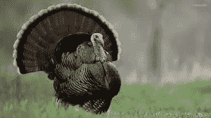
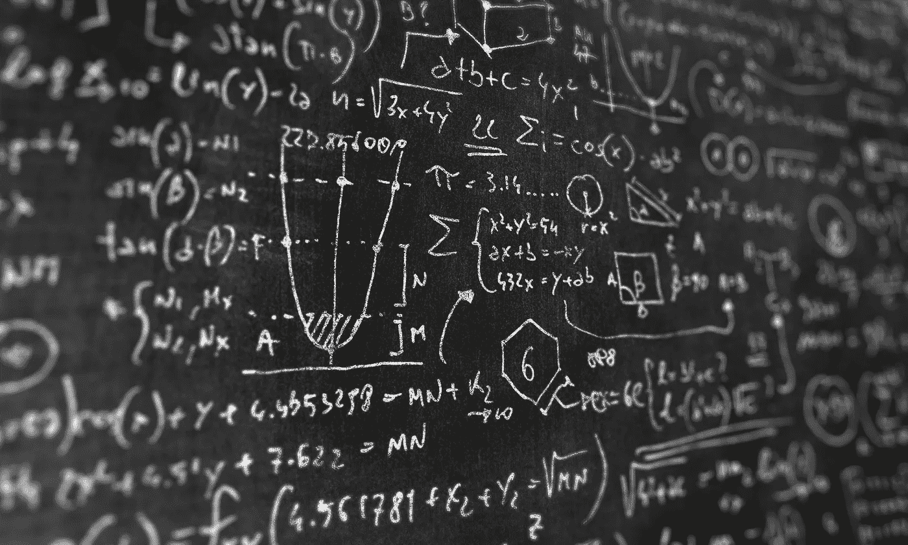

# 黑天鹅和加密货币

> 原文：<https://medium.com/hackernoon/black-swans-and-cryptocurrencies-63861ea6f851>

*关于加密货币投资，纳西姆·塔勒布的书能教给我们什么*

# 介绍

当我第一次读《T2》和《黑天鹅》时，它完全改变了我对系统如何工作和运作的看法。重读我在这本书上的笔记，我立即意识到《T4》中的许多原则可以应用到今天的加密货币领域。在这篇文章中，我将使用来自 *The Black Swan* 的想法来整体分析加密货币，并希望读者们能够对加密货币背后的系统以及一般系统有更多的了解。

请注意，在本文中，当我使用“加密货币”一词时，我也将区块链技术包含在该定义中。

# 我们理解的错觉

作为人类，我们受到各种心理偏见的困扰，这些偏见导致我们相信事实上并不真实的事情，尤其是在回顾历史的时候。这三种心理偏见是:

1.  理解的错觉，或者说每个人都认为自己知道一个比他们意识到的更复杂(或随机)的世界正在发生什么
2.  回溯性扭曲，或者说我们如何在事后才评估事情，就好像它们在后视镜里一样
3.  对事实信息的高估以及权威和学者的阻碍

我认为，当谈到加密货币时，第一点和第二点是本次讨论中最突出的问题。第一点适用于当我们相信我们了解世界是如何运作的，而事实上我们并不了解。当我试图向其他人解释比特币和其他加密货币如何对其他家人和朋友起作用时，我发现这种情况尤其普遍。对他们来说，他们认为数字货币没有任何价值，因为它是人造的。他们认为自己明白金钱是如何运作的，但实际上他们受到理解错觉的困扰。

这并不是说那些了解加密货币价值的人不会受到这种心理偏见的困扰。我敢肯定，我对加密货币也只有一个虚幻的理解，在 10/20 年内，加密货币将能够完成我以前从未想过的事情。以亚马逊为例，它开始时只卖书。现在，你只需点击一个按钮，就可以在亚马逊上买到几乎任何东西。在 90 年代末，很难预测亚马逊会走这条路，但现在我们做到了。同样的原理也适用于加密货币。

第二点，关于追溯扭曲，也很重要，因为这给了我们“我一直都知道”的态度。纳西姆·塔勒布解释了追溯性扭曲，他说“过去发生的许多事情被认为是完全疯狂的。然而，在事件发生后，它似乎并没有那么疯狂。”我相信加密货币也是如此。在 10/20 年内，那些对加密货币不屑一顾或不理解的人将会认为这是必然会发生的事情。当然，就加密货币而言，增长和采用将呈指数级增长。正如塔勒布所说——“历史和社会不会爬行。他们跳”。我真相信加密货币将是我们社会的下一个飞跃。

# 火鸡谬论

我相信火鸡谬论是我们对世界的虚幻理解的完美例子。这是谬论背后的故事:

一个家庭选择一只火鸡作为感恩节的火鸡。为了准备盛宴的火鸡，家人在感恩节前几个月就开始给火鸡额外的食物，让它变得格外丰满。现在，在火鸡看来，他过得很好。他不断被喂食越来越多的食物。事实上，如果火鸡认为这种情况会永远持续下去，它会过得很好。最后，在感恩节那天，这家人拿起火鸡，马上杀了它，尽情享用。

火鸡谬论本质上是这样的:事情运行直到它们不运行。我们从过去学到的东西要么是不相关的，要么是完全错误的，最糟糕的是，把过去当作未来的例子会产生难以置信的误导。毫无疑问，土耳其就是如此，加密货币也是如此。例如，市值前 20 名的加密货币可能有致命的安全缺陷，突然变得一文不值。防止此类事件影响您的最佳方式是分散您的加密货币投资组合。

这个意想不到的事件就是塔勒布所说的黑天鹅，它来自于这样一个事实，即 14 世纪的探险家认为所有的天鹅都是白色的。然而，有一天，他们遇到了一只黑天鹅，这个世界观被打破了。

黑天鹅既有积极的一面，也有消极的一面，但要记住的关键一点是，积极的黑天鹅需要时间来展示它们的效果，而消极的黑天鹅可能会非常迅速地出现。毫无疑问，加密货币也是如此。负面黑天鹅，比如道黑，发生的非常快，导致以太坊的价格很快就坑了。与此同时，积极的黑天鹅，比如可以建立在以太坊上的应用程序，通常需要更长的时间来显示它们的效果，因为这些积极的事件需要时间来发生。

# 确认我们的世界观

人们没有意识到黑天鹅的主要原因是因为人们经常希望证实他们已经相信的事情，而不是事实真相。如果你足够努力地寻找，很容易找到证实你相信是真的来源。

不幸的是，这是看待事物的错误方式。你应该看看证据，然后得出一个假设，而不是反过来。一旦你提出了一个假设，你就应该立即寻找与你的假设相反的证据来检验它。问问你自己，“有什么证据能证明我是错的？”如果你发现了与你的假设的有效性相反的证据，那么只阅读你的假设。

这种类型的思考让你对事物形成结构良好、透彻的假设。当涉及到加密货币时，这一点尤其重要，因为该领域倾向于学习复杂的假设，而不是简单的假设。这个世界更倾向于灰色阴影，而不是简单的非黑即白的观点，后者通常只是对复杂问题的天真简化。

# 为什么我们不能预测黑天鹅

黑天鹅的一个关键组成部分是，它们在后果方面高度不对称。例如，如果你看看比特币，你就会明白我的意思。在过去的 7 年里，一个比特币的价值大幅上升，即使对于了解比特币能力的人来说，也几乎无法预测。其他黑天鹅，如 DAO hack，对以太坊和加密货币的整体前景造成了极大的负面影响。

人们可以理解为什么能够预测黑天鹅是有用的——毕竟，如果我们可以预见它的到来，那么我们就可以完全避免它的影响。不幸的是，预测黑天鹅几乎是不可能的。为什么？因为我们天生倾向于认为自己知道的比实际知道的多。这也被称为*认知自大*，这是关于我们自己的知识极限的傲慢。

同样，问题是人们可能承认这个事实，但认为某个领域的专家比正常人更有能力预测这些类型的事情。事实上，我们越是把自己视为某个领域的“专家”，我们在其他领域的估计就越不准确:看门人和出租车司机比哈佛的 MBA 们更能准确地预测随机事实，比如建筑物的高度。

研究表明，专业做预测的人特别容易产生这种心理偏差。比特币的公开价格预测预测价格将在 10 年内达到[10 万美元](https://www.cnbc.com/2017/05/31/bitcoin-price-forecast-hit-100000-in-10-years.html)

其他新闻来源也不甘示弱，预测一枚比特币的价格将达到 10 亿美元。

这些预测更多的是基于制造耸人听闻的标题和新闻故事，而不是基于现实。公开陈述价格预测的人通常会被激励做出古怪的声明，因为:

1.  这是个很好的标题
2.  如果事实证明他们是对的，这给了他们“自始至终都知道”的感觉。这些人将被誉为天才或市场“奇才”
3.  如果他们错了，他们可以简单地转移问题。最有可能的是，价格预测无论如何都会很快被遗忘。

当你做出不正确的预测时，你通常会以三种方式偏离:

1.  你告诉自己你在玩一个完全不同的游戏。
2.  你调用异常值。即“那是百万分之一的事件，所以无法预测！”
3.  你使用“几乎正确”的辩护:你专注于你做对的部分，而不是你做错的部分。

同样重要的是要记住，预测事件的复杂方法并不一定比简单的方法更准确。

# 工具和玩具

我们在社会中取得的最重要的进步也是最不可预测的。比特币就是一个明显的例子。几乎所有的社会进步都是一种工具的直接结果。这些工具会导致意想不到的效果和结果，而这些效果和结果本身又会导致更多意想不到的结果。不管工具会导致什么，它们很少被完全用于它们最初的目的。脸书最初只面向哈佛学生。举一个更奇怪的例子，Play-Doh 最初是因为 Kroger 想要一种可以清除墙纸上煤渣的产品而创建的。

*“我们制造玩具。其中一些玩具改变了世界”。*

最大限度地接触积极的黑天鹅的最好方法是继续研究和收集潜在的机会。然而，重要的是，我们不要经常把过去作为未来的参照。很多时候，当我们想到明天的时候，我们只是把它想象成又一个昨天。俗话说，“过去的表现并不代表未来的结果。”即使过去在某种程度上预示了未来，我们也并不真正了解过去。

区分混沌系统和随机系统也很重要。随机系统是完全随机的，没有任何可预测的属性。另一方面，混沌系统具有可预测的属性，但难以理解和了解。彩票号码是随机的，加密货币的价格是混乱的。能够区分这两者是发现黑天鹅的关键。

# 如何最大化(正面)黑天鹅的效果

现在你明白了什么是黑天鹅，它们有多难被发现，你能做些什么来增加你被黑天鹅影响的可能性？你必须最大化你的意外收获。意外之喜被定义为“事件以一种快乐或有益的方式偶然发生和发展”。为了最大化你的意外收获，你必须找到高度不对称的正支出的例子(例如，比特币、其他替代币等。)并尽可能多地接触这些实例。

当你面对这些高度不对称的机会时，你必须在许多不同的领域或领域中这样做，以分散你的意外收获，同时限制你的下降趋势，最大化你的上升潜力。让我们用加密货币之外的另一个领域作为例子:风险投资。假设一个风险投资家在 10 家不同的初创公司成立一年后投资了 2.5 万美元，所有这些公司都可能有积极的黑天鹅。假设这些公司中有 8/10 经历了负面的黑天鹅，这些公司破产了。在剩下的两家公司中，其中一家刚好达到盈亏平衡，你可以赚回你的钱，但仅此而已。不幸的是，你还是少了 20 万美元。

但是最后一家公司呢？如果你最近投资的公司是优步或脸书，会怎么样？突然间，这 25000 美元可能价值数亿美元，远远超过你其他的损失。同样的原则也适用于投资加密货币:你可能无法准确选择下一个大赢家，但你可能会分散投资于 10 种不同的硬币，这些硬币在未来可能会有积极的黑天鹅。

# 结论

准确预测黑天鹅通常是徒劳的，因为通常发生的是将信号解读为噪声并过度解读数据。相反，建议你花时间去寻找极有可能存在积极的黑天鹅的区域，即使你还不知道它到底是什么。抓住任何看起来像机会的东西，因为它们比你想象的要难得多。记住，要感受积极的黑天鹅的影响，你必须先接触它们。

最后，请记住，通常会有一段平静和稳定的时期，其间会出现由少数黑天鹅引发的巨大变化(无论是好是坏)。那些黑天鹅是你要小心的，也是你最意想不到的。

如果你想支持我的写作努力，你可以在这里捐赠 ETH 和 ERC20 令牌:0x 0 BCB 78d 67 d8d 929 DC 03542 a5 aedef 257 f 378 e 513

纳西姆，如果你在读这篇文章:我是你的超级粉丝。

你可以通过发电子邮件到我的电子邮箱直接联系我。