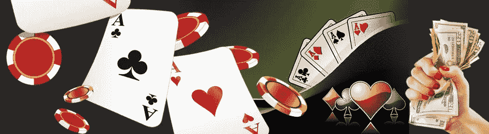
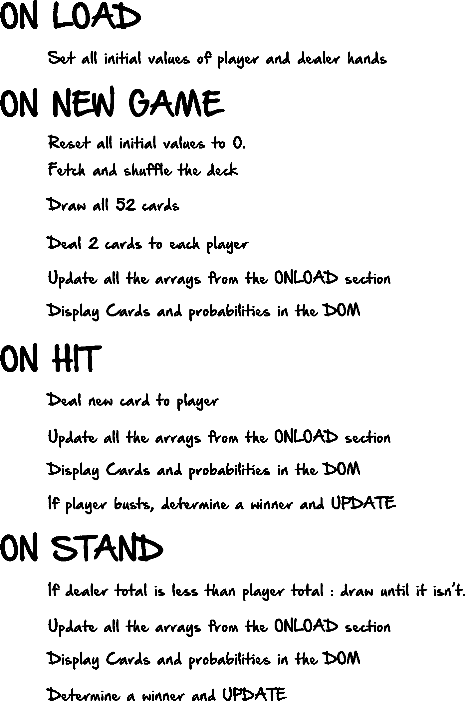
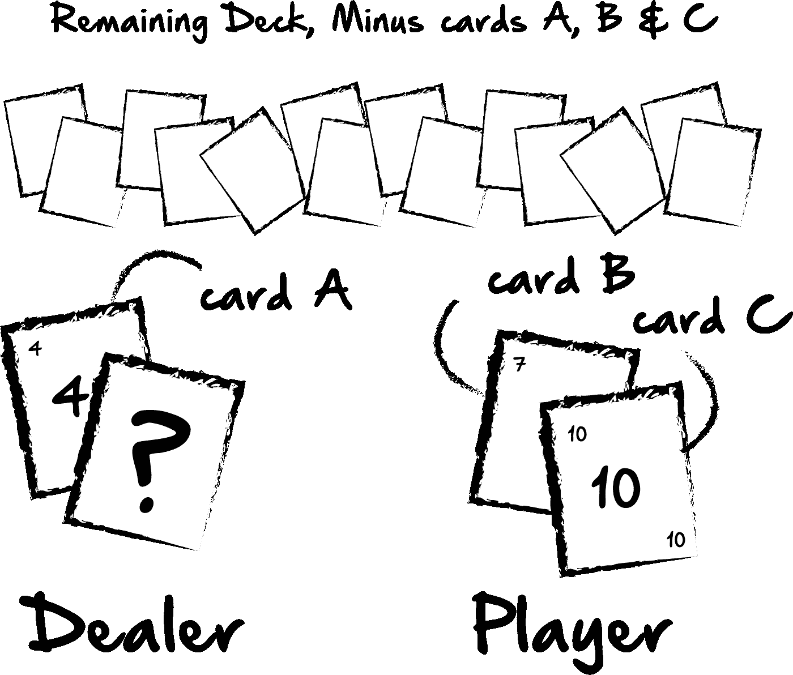

# 带有 JavaScript 的 21 点应用程序

> 原文：<https://medium.com/hackernoon/blackjack-application-with-javascript-2c76db51dea7>



几周前，我写了一篇关于使用 Python 计算 21 点中某些结果的概率的文章。如果你想读那篇文章，请自便。[https://hacker noon . com/gambling-probability-python-DFD 3 e 301 B1 ad](https://hackernoon.com/gambling-probability-python-dfd3e301b1ad)。

这个想法是你可以通过创建一个模拟游戏在 21 点中设置一个场景。然后模拟那个游戏的结果一百万次，算出某些结果的概率是多少。

这让我想到，如果我创造一个真实的游戏来实时计算这些概率，这样的东西会有多有用。所以，我开始这样做。在这篇文章中，我将谈论如何创建这样一个应用程序的一些想法，如果你曾经对此感兴趣的话，以及我如何使我的工作背后的一些逻辑。

如果你想在进一步阅读之前看到我的应用程序的最终产品，这里是我目前所拥有的:

https://safe-springs-65895.herokuapp.com/[。](https://safe-springs-65895.herokuapp.com/)

# API

首先，我找到了这个奇妙的扑克牌 API:【https://deckofcardsapi.com/[。](https://deckofcardsapi.com/)

这是一个很好的入门工具，允许您根据自己的需要进行多种类型的 API 调用。例如，您可以获得一副全新的牌，或者使用一副牌 ID#洗牌。无论哪种方式，拿到这副牌后，你都可以从这副牌中抽一张牌。理论上，当游戏中的玩家每次点击按钮抽一张牌时，提出一个抽一两张牌的请求是有意义的。例如，洗牌的 url 如下所示:

```
https://deckofcardsapi.com/api/deck/new/shuffle/?deck_count=1
```

然后，如果你想抽一张牌，你可以用:

```
https://deckofcardsapi.com/api/deck/<<deck_id>>/draw/?count=2
```

然而，我发现，出于我的目的，我想一次抽完所有 52 张牌，并使用该副牌的剩余值来计算我以后要使用的概率。所以当一个玩家开始一个新游戏时，我会这样做:

```
https://deckofcardsapi.com/api/deck/<<deck_id>>/draw/?count=52
```

然后使用 JavaScript，我将从该数组中取出 2 张牌给庄家，2 张牌给玩家。

抽牌时来自 API 的响应如下所示:

```
{
    "success": true,
    "cards": [
        {
            "image": "https://deckofcardsapi.com/static/img/KH.png",
            "value": "KING",
            "suit": "HEARTS",
            "code": "KH"
        },
        {
            "image": "https://deckofcardsapi.com/static/img/8C.png",
            "value": "8",
            "suit": "CLUBS",
            "code": "8C"
        }
    ],
    "deck_id":"3p40paa87x90",
    "remaining": 50
}
```

所以很自然地，在玩 21 点的时候，我就忽略了套房，因为它们无关紧要。然后，我检查并更改了所有的国王，皇后和杰克值为 10。最后，对于 a，我的想法是，你总是希望 a 的值为 11，除非你的总手牌值超过 21，那么你会希望 a 为 1，因为你可以选择 a 的任何一个值。最初，当我循环我的初始牌时，我想把所有的 ACE 值都变成 11。

考虑到这一点，我需要考虑我的游戏的结构。我真的只需要 3 个按钮。一个是新游戏，它将重置所有的值，除了每个玩家的总输赢。一个是 HIT，它会为玩家抽一张牌。另一个是 STAND，它将检查数值，如果需要，为庄家抽一张牌。至少，这是我真正需要的。我是这样看待我的游戏流程的:



## 初始值和数组:

```
 let allCards = [];
      let iterations = 1000000;
      let player = [];
      let dealer = [];
      let dealerValues = [];
      let playerValues = [];
      var playerSum ;
      var dealerSum ;
      let winsPlayer = 0;
      let winsDealer = 0;
      let testDeck = [2,2,2,2,3,3,3,3,4,4,4,4,5,5,5,5,6,6,6,6,7,7,7,7,8,8,8,8,9,9,9,9,10,10,10,10,10,10,10,10,10,10,10,10,10,10,10,10,11,11,11,11];
```

这些都是我将在游戏中运用的价值观。

我的想法是，每次卡片被绘制或更新时，我将使用`testDeck`在后台创建一个场景。通过 testDeck，我将重新创建当前的卡牌值场景，并确定某些游戏结果。`iterations`值将决定我测试每个场景的次数，目前设置为 100 万次。`player`和`dealer`将包含每个玩家的所有卡片信息。`playerValues`和`dealerValues`是一个数组，我将把每个玩家当前所有的牌值都放入其中，只是为了方便我以后循环。`playerSum`和`dealerSum`是我将用来确定每个玩家的当前总数，并确定赢家。`winsPlayer`和`winsDealer`是我用来记录每位玩家当前获胜次数的工具。最后，一旦我获取了我的卡，我将把这个值设置为`allCards`值。由于获取的卡片将存在于 newGame 函数中，我需要在该函数之外访问它们。

## 超文本标记语言

我的 HTML 看起来非常简单，但是我将使用`newGame`、`hit`和`stand`id 来创建我的 onclick 函数:

```
<body>
<div class="navContainer">
  <div class="title8" id="newGame">new game</div>
  <div class="title11" id="hit">hit</div>
  <div class="title12" id="stand">stand</div>
</div>
<div class="title3">Dealer</div>
  <div id="dealerCards"></div>
<div class="title2">Player</div>
  <div id="playerCards"></div>
  <div class="title4" id="dealerSum"></div>
  <div class="title5" id="playerSum"></div>

  <div id="currentPercent"></div>

  <div id="currentBust"></div>

  <div class="dealerWins">
    <h1>Dealer Wins</h1>
  <div id="dealerWins"></div>
</div>
<div class="playerWins">
  <h1>Player Wins</h1>
  <div id="playerWins"></div>
</div></body>
```

## 回到 JavaScript

这里是我真正需要的三个 onclick 函数，我将在设置所有初始值后创建它们。

```
$('#newGame').click(function(){})$('#hit').click(function(){})$('#stand').click(function(){})
```

## 新游戏

在声明了所有的初始变量后，现在我需要将它们设置为 0 或空。这是因为在新游戏中，当我把数据推给这些变量时，它们就会有值了。我还需要清除 innerHTML 中的 HTML 元素，因为这将是新一轮的开始。

```
document.getElementById('dealerWins').innerHTML = winsDealer;
document.getElementById('playerWins').innerHTML = winsPlayer;
      document.getElementById('dealerWins').innerHTML = '';
document.getElementById('playerWins').innerHTML = '';
      let hit = document.getElementById('hit');
      hit.disabled = false;
         player = [];
         dealer = [];
         dealerValues = [];
         playerValues = [];
         playerSum = 0;
         dealerSum = 0;
document.getElementById('dealerCards').innerHTML = "";
      document.getElementById('playerCards').innerHTML = "";
      document.getElementById('playerSum').innerHTML = "";
      document.getElementById('dealerSum').innerHTML = "";
```

## 进行我的 API 调用

接下来，我将请求一副牌和卡片:

```
fetch('[https://deckofcardsapi.com/api/deck/<<deckID>>/shuffle/').then(function(response)](https://deckofcardsapi.com/api/deck/bbz3hqp3kgoo/shuffle/').then(function(response)) {
      if (response.status != 200) {
        window.alert("Oh dangit");
        return;
      }response.json().then(function(data) {
        let api = data;
        let deckID = api.deck_id;fetch('[https://deckofcardsapi.com/api/deck/'+deckID+'/draw/?count=52').then(function(response)](https://deckofcardsapi.com/api/deck/'+deckID+'/draw/?count=52').then(function(response)) {
            if (response.status != 200) {
              window.alert("You done messed up");
              return;
            }response.json().then(function(data) {
              let firstDeal = data.cards;
```

接下来，正如我前面谈到的，我需要重置包含“国王”、“王后”、“杰克”和“王牌”的牌的值。同时，我会将这些值推送到我的`playerValues`和`dealerValues`数组中。然后，有了正确值的卡片，我将把`allCards`变量设置为`firstDeal`变量的值，因为它位于我的`newGame`函数之外。

```
for (var i = 0; i < firstDeal.length; i++) {
              if(firstDeal[i].value == "KING" || firstDeal[i].value == "QUEEN" || firstDeal[i].value == "JACK"){
                firstDeal[i].value = 10;
              }
              if(firstDeal[i].value == "ACE"){
                firstDeal[i].value = 11;
              }
              if(firstDeal[i].value != "KING" && firstDeal[i].value != "QUEEN" && firstDeal[i].value != "JACK" && firstDeal[i].value != "ACE"){
                firstDeal[i].value = parseInt(firstDeal[i].value);
              }
              }
allCards = firstDeal;
```

## 为每位玩家抽牌

接下来，我需要为每个玩家抽牌。我将从`allCards`数组中选择一张卡片，将其推入`dealer`或`player`数组，并更新`playerValues`和`dealerValues`。

```
var card1 = allCards[Math.floor(Math.random()*allCards.length)];

              let index1 = allCards.indexOf(card1);

              allCards.splice(index1,1);

              player.push(card1);

              var card2 = allCards[Math.floor(Math.random()*allCards.length)];

              let index2 = allCards.indexOf(card2);

              allCards.splice(index2,1);

              player.push(card2);

              var card3 = allCards[Math.floor(Math.random()*allCards.length)];

              let index3 = allCards.indexOf(card3);

              allCards.splice(index3,1);

              dealer.push(card3);

              var card4 = allCards[Math.floor(Math.random()*allCards.length)];

              let index4 = allCards.indexOf(card4);

              allCards.splice(index4,1);

              dealer.push(card4);
```

在下面的函数中，我将遍历玩家的牌，用他们当前的手牌更新 DOM，并用当前的牌值更新 playerValues。有了 forLoop，我可以在整个代码中重用这个函数，因为玩家手中目前有多少张牌并不重要。它只是获取所有的卡并更新 DOM 和 playerValues。然而，这里要记住的一件事是，在运行这个函数之前，你需要清除当前的 playerValues 并清除 DOM 上的玩家卡。否则，它将简单地添加到当前总数中。如果你已经有 3 张牌，而你的价值是 15。然后你加一张卡重新算，它会把新卡加到现在的三张卡上。例如，如果您的新卡是 2，而不是总共 17，您的总数将是 32 (15 + 15 + 2)。

```
for (var i = 0; i < player.length; i++) {
                card = ``;
                playerValues.push(player[i].value);
                document.getElementById('playerCards').innerHTML += card;
              }
```

这个完全相同的功能也可以为庄家互换，但是用当前玩家变量替换庄家变量。因为我们在 newGame 函数中，我们不需要清除当前值，因为它们已经是空的了。但是当在 hit 或 stand 函数中运行函数时，我们需要首先清除这些值。例如，我们会这样做:

```
 document.getElementById('playerCards').innerHTML = "";
      playerValues = []; for (var i = 0; i < player.length; i++) {
        card = ``;
        playerValues.push(player[i].value);
        document.getElementById('playerCards').innerHTML += card;
      }
```

现在，这几乎是我游戏的支柱。我还添加了计算百分比、当前胜率等的函数，但这确实是这里的基本格式。在 hit 和 stand 函数中，我们只需要在运行该函数时添加条件语句。例如，在更新玩家卡、庄家卡和值之后，我们将检查并查看是否有玩家失败，或者是否有玩家赢得了游戏。我的大多数条件都很简单，比如:

```
if (playerSum > 21 && playerValues.includes(11)==true){// do something}
```

在这个例子中，当一个玩家抽牌，并且他当前的总点数超过 21 时，我们将检查该玩家是否包含任何 11(这将是我们设置的 ACE 牌的值)。如果是真的，我们将得到那张卡的索引，将值重置为 1 而不是 11，并重新更新当前值、总和以及 DOM。

当然还有条件语句来决定赢家:

```
if(playerSum > dealerSum && playerSum <= 21){}
```

在这个例子中，如果玩家总和高于庄家总和，我们将确定玩家是赢家，只要玩家总和也在 21 岁以下。

整个游戏中最耗时的部分可能是确定胜负，因为玩家和庄家的价值、总和以及百分比需要在每种情况下进行更新。

我也有我喜欢的这个条件:

```
while(playerSum > dealerSum && playerSum <= 21){
}
```

这里，我使用 while 循环，而不是 for 循环或 if 语句。这在我的 stand 函数中。基本上，当玩家站立时，我要检查值，如果庄家的值小于玩家的值，我们将继续为庄家击球，直到他赢或输，因为玩家在该点不能再击球。

## 计算百分比:

对我来说，最后一部分是我开始做这件事的第一步:确定某些结果的概率。例如，我想确定庄家的牌比玩家的牌高的概率。



因为我知道最初发牌后的三张牌。基本上，这将是一个多部分功能:

## 1 创建一个模拟甲板。

## 2 从这副牌中取出已知的牌。

## 3 抽一张新卡，替换未知卡。

## 4 如果新卡加上已知庄家卡的总和高于玩家总和，则变量加 1。

## 5 如果测试运行了一百万次，确定结果使庄家的牌比玩家的牌高的次数。

下面是我的函数的样子，把伪代码变成实际代码:

```
function determinePercent(p,d){
      let percentageOne = 0;
      let testDeck2 = testDeck;
      let valP = [];
      let valD = [];
      for (var i = 0; i < player.length; i++) {
        valP.push(player[i].value);
      }
      for (var i = 0; i < dealer.length; i++) {
        valD.push(dealer[i].value);
      }
      p = valP;
      d = valD;

      for (var i = 0; i < p.length; i++) {
        if(testDeck2.includes(p[i])==true){
          let index1 = testDeck2.indexOf(p[i]);
          testDeck2.splice(index1,1);
        }
      }
      for (var i = 0; i < d.length; i++) {
        if(testDeck2.includes(d[i])==true && i!=0){
          let index1 = testDeck2.indexOf(d[i]);
          testDeck2.splice(index1,1);
        }
      }

      let dealerValues2 = [d.pop()];
      function getSum(total, num) {
        return total + num;
      }
      let playerSum2 = p.reduce(getSum);
   let dealerSum2 = dealerValues2.reduce(getSum);
console.log(dealerSum2);

      for (var i = 0; i < iterations; i++) {
        let dealerCard1 = testDeck2[Math.floor(Math.random()*testDeck2.length)];

        if(dealerSum2+dealerCard1 > playerSum2){
          percentageOne = percentageOne + 1
        }
      }

      let percentageTwo = Math.round((percentageOne/iterations)*100);

      return percentageTwo;
    }
```

现在，我可以在代码的任何地方运行这个函数，并更新它，确定一个新的概率。无论如何，希望这是有意义的，至少有一点点帮助和娱乐。很明显，我还可以更详细地讨论这些，但是为了避免这篇文章变得更加无聊，我就在这里把它结束了。如果我犯了一些错误，请随时联系我，或者我可以回答任何问题。

让我知道你喜欢这个游戏，或者如果你有任何反馈或建议。谢谢！

[https://www.linkedin.com/in/ethanjarrell/](https://www.linkedin.com/in/ethanjarrell/)