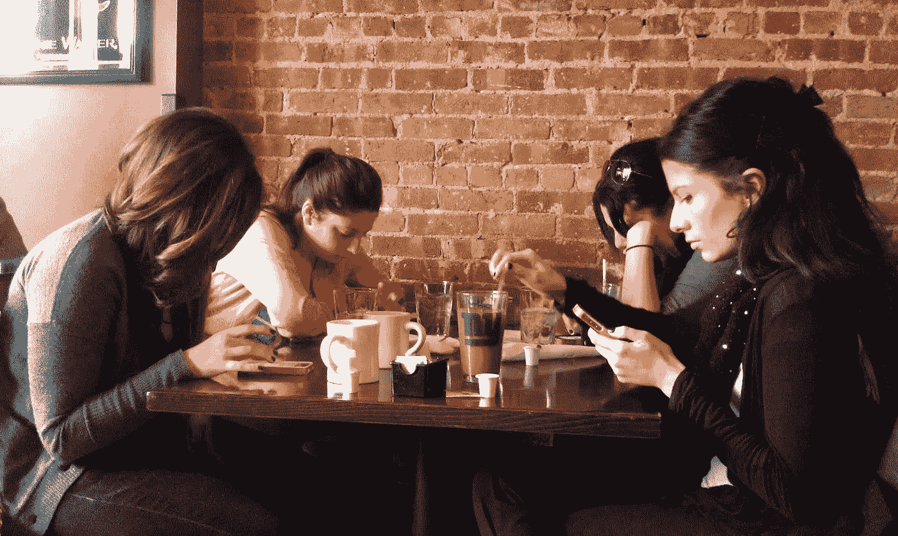
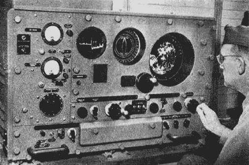

# 也许这不仅仅是上瘾

> 原文：<https://medium.com/hackernoon/blind-to-vigilance-7e9b72ab2ad4>

技术专家经常过于简单化。考虑一下当代将所有类型的重度智能手机使用描述为上瘾的趋势。智能手机和应用程序肯定有一些内在的上瘾性，这要归功于许多秘密的[设计](https://hackernoon.com/tagged/design)模式。但是上瘾并不是故事的全部。在某些情况下，我认为这完全是个错误的故事。

用户不仅仅是*上瘾*:他们也(并且更经常)保持*警惕*。

警惕是分配重要的注意力资源来执行持续的警戒。这种警觉是极端的，并与自我保护相关联；例如，斑马在吃草的时候会睁大眼睛和耳朵寻找捕食者。不在食物链顶端的动物会花费大量的时间和精力保持警惕。

我们人类当然处于食物链的顶端。我们通过警惕地监控我们的手机来寻求保护的并不是身体上的自我。相反，它是数字化的社会自我，包括我们自己的**自我感**(和自我价值)的越来越多的方面，这些方面是通过我们不断努力通过中介体验进行社交来建立和保持的。

*Image from* [*Life Without a Smartphone*](https://www.theodysseyonline.com/life-without-smartphone)

保持我们自身的这些方面对我们的幸福感和健康的社会联系是如此重要，这应该是显而易见的，但一个具体的例子可能会有启发性。人类的社会化涉及许多机制，特别是[身份表现](https://en.wikipedia.org/wiki/Identity_Performance)——一个反复的过程，我们做一些事情，观察人们如何反应，然后相应地适应。身份表现提供了流畅和即时的社会反馈，帮助我们了解我们应该如何行动，以及我们是谁——这在网上发生就像在现实世界中一样容易。

然而，与现实世界不同的是，内向中介通信和社会反应不是即时的，可以在我们的智能手机上随时出现。回应很容易被忽略:人们必须持续部分注意力，以监测某人可能对他们说了一些重要的事情，或者对帖子或消息做出了重要回应的线索。

因此，我们变得警惕，对我们的设备感到极度警惕，每天检查通知，即使我们没有听到或看到通知进来。上瘾的设计模式可能会让你在你的设备上停留的时间比你计划的更长，但警惕性通常是导致你首先看你的设备的原因。

为什么技术专家没有看到这一点？例如，*瘾*是一个[生成隐喻](https://www.cambridge.org/core/books/metaphor-and-thought/generative-metaphor-a-perspective-on-problemsetting-in-social-policy/E480B763CC44D69A927508BF90117239)，它导致我们将大量使用设备视为某种化学依赖问题。这使得它很难“看到”大量的设备使用，更不用说像警惕这样很自然的事情了。

此外，我们在人机交互中保持警惕的历史概念过于局限。它始于第二次世界大战，当时英国认知心理学家 Norman Mackworth 注意到，当雷达操作员在雷达终端呆得太久时，他们的表现会下降——错过更多的信号和更多的误报。他称这种现象为警惕性下降。雷达操作员的任务是坐下来盯着一个小屏幕，目视扫描以观察任何可能出现的光点。Mackworth 发现，将雷达班次限制在 30 分钟[可以显著提高操作员的表现。](http://journals.sagepub.com/doi/10.1080/17470214808416738)

*A WWII radar operator. Image from “Radar: The Silent Weapon of World War 2”. October 1945 edition of Radio News,* [*archived here.*](http://www.rfcafe.com/references/radio-news/radar-silent-weapon-wwii-october-1945-radio-news.htm)

警惕成为认知心理学和人机交互的一个应用研究领域，但奇怪的是，只有在完全类似于雷达操作员的情况下，你才有(1)训练有素的专业用户,( 2)位于物理终端,( 3)其任务涉及视觉注意力，通常致力于防止伤害他人。

也许这些概念上的限制在 20 世纪 40 年代早期是有意义的，那时每个人的口袋里都有一台不可或缺的超级计算机，时刻提醒人们注意。像智能手机这样的“个人通信设备”的想法纯粹是科幻小说，计算机只对从事重要工作的高技术专业人员开放。我认为，麦克沃思的雷达操作员自己无意中成了一个生成隐喻，因为不符合他的角色的用户不会被研究人员视为警惕的。空中交通管制员、麻醉师、监控操作员、导航员都可以保持警惕，但日常智能手机用户却不能。旧形式的警戒使用都是为了防止身体伤害，而不是心理伤害。

在现实中，每天的智能手机用户都非常警惕，以避免错误、糟糕或错过社交带来的心理伤害。这种形式的警惕是中介社会化的结果，其普遍程度前所未见。

在“智能手机成瘾”的案例中，技术专家的过度简化创造了一个概念盲点，导致我们错过了设备滥用问题的潜在解决方案。幸运的是，Mackworth 和其他人——特别是 Parasuraman——的工作为我们如何更好地设计支持警惕性提供了线索:

1.  为用户提供休息时间。重要的是要认识到，这些休息时间不仅仅是简单的废弃，它们必须是用户真正下班并感到安全的时间，他们不需要监视任何东西。
2.  在你发出的信号中引入变化。在智能手机上，信号通常是视听/触觉警报和通知。默认情况下，使更重要的警报更加突出，易于区分和检测。询问用户什么是最重要的也是至关重要的——因为我们处理的是社交体验，所以没有放之四海而皆准的解决方案来区分信号的优先级。
3.  更明智地燃烧。限制信号或通知的数量。批量生产类似的。不要把不重要的东西放入设备的通知层。没有广告，没有不请自来的使用提示，等等。只表示重要的事情。