# 幸福地 2018 年度中小企业 SaaS 趋势报告

> 原文：<https://medium.com/hackernoon/blissfully-2018-annual-smb-saas-trends-report-6470d7945e71>

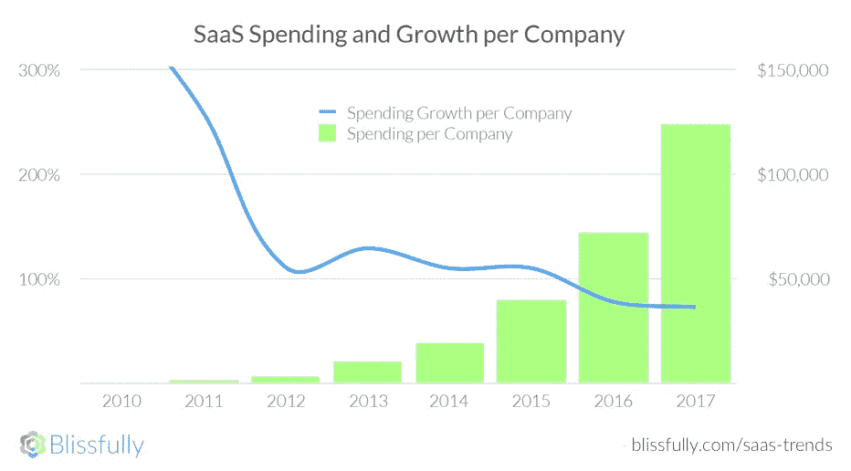

# SaaS 增长:看不到尽头

去年，2017 年，新 SaaS 订阅的速度略有放缓，但在 SaaS 上的花费有所增加。因此，虽然看起来我们开始看到一些围绕工具的整合，但组织并不羞于支付软件即服务，这将帮助他们发展和管理他们的业务。

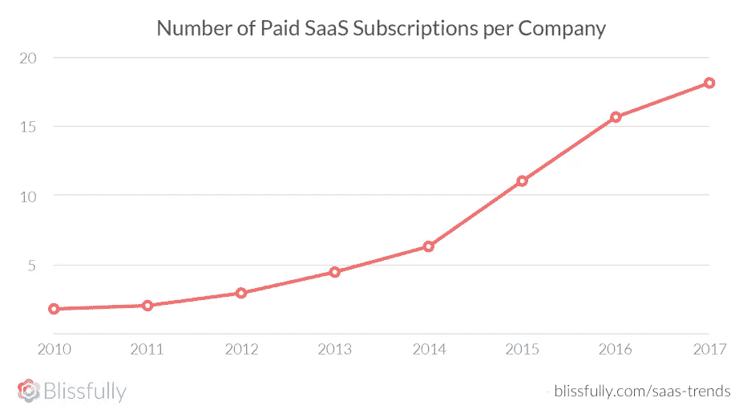

# SaaS 趋势:为什么它们很重要

密切关注软件在现代商业中的应用非常重要，因为它是当今经济的支柱。了解 SaaS 的趋势可以帮助企业做出明智的投资决策。此外，深入挖掘哪些有效，哪些无效，有助于发现改进的机会。

正如我们之前所写的，SaaS 的安全还有很长的路要走。此外，当团队注意他们在哪里投资以避免功能重叠和优化资源时，通常会有节省成本的主要机会。根据工作流程的构建方式，生产力可能会大幅提高，也可能会受到技术的阻碍，因此定期评估您的 SaaS 使用情况(并查看更广泛的行业)是了解您是否在朝着正确方向前进的好方法。

总的来说，在你做出任何重大决定之前，比如在哪里投资，在哪里削减，以及如何更好地整合和构建你的团队已经使用的技术，关注 SaaS 的发展势头是一个好主意。我们希望这个指南能帮助你做到这一点。

# 按组织部门列出的 SaaS 使用情况

在过去的十年里，SaaS 教渗透到了所有的部门。虽然 engineering 毫无疑问是早期的领跑者，而且仍然是支出的领导者，但近年来在订阅数量方面，Business Ops 已经摘得桂冠。在 2018 年，很明显 SaaS 在整个组织中被广泛使用。

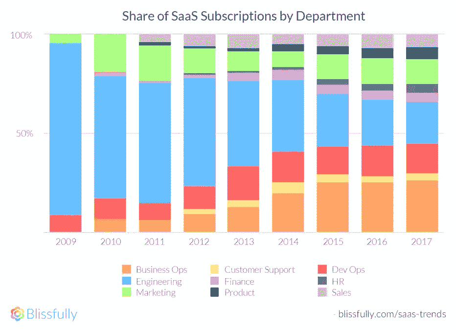

平均而言，我们看到 18 个 SaaS 订阅，每个公司的总支出约为 136，000 美元。然而，值得注意的是，截至 2017 年第三季度，运行率接近 20 个订阅和 186，000 美元的年化支出，因此我们预计这些数字在 2018 年将会增长，就像前几年一样。

让我们来看一下 SaaS 使用情况和趋势的部门细分。

# 💻工程

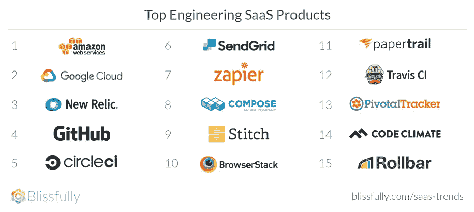

工程团队自然是由技术驱动的，因为他们当然是 SaaS 的先驱，所以他们第一个一头扎进去是有道理的。当然，工程和开发运维之间有一些重叠，但是这里是纯工程团队最喜欢的三个产品:

*   AWS :在云计算领域工作的人不会对 AWS 名列榜首感到惊讶，因为它是最大的云基础设施提供商。
*   [谷歌云](https://www.blissfully.com/google-cloud/):谷歌云还没有像 AWS 一样占据市场份额，但他们也是云基础设施领域的领跑者。
*   [New Relic](https://newrelic.com/):New Relic 是一个“数字智能平台”，它提供了对你的整个堆栈如何运行的深入和广泛的洞察，长期以来一直是开发人员的最爱。

# 💼商业运作

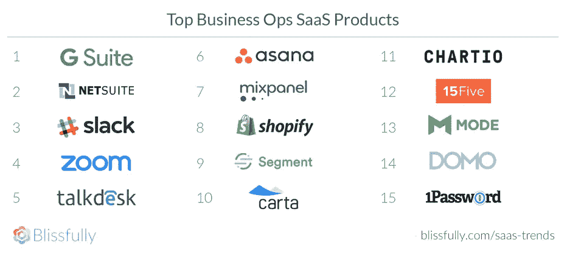

仅次于工程，业务运营是 SaaS 产品的主要用户。很有道理。业务运营专家负责保持整个组织平稳运行，投资开发能够简化和促进沟通的工具是他们工作的核心。以下是三大业务运营 SaaS 应用程序:

*   GSuite :在这里找到运行当今许多业务的应用程序套件并不令人惊讶。GSuite 因其易用性、全面性和安全性而受到我们的青睐。
*   [NetSuite](https://www.blissfully.com/netsuite/) :需要在一个地方管理您企业的财务、运营和客户关系吗？NetSuite 是您的后盾。
*   Slack 可能是当今市场上最热门的沟通工具，它因其能够取代电子邮件并使团队更加紧密而广受欢迎。另外，使用起来很有趣。

# 📣营销

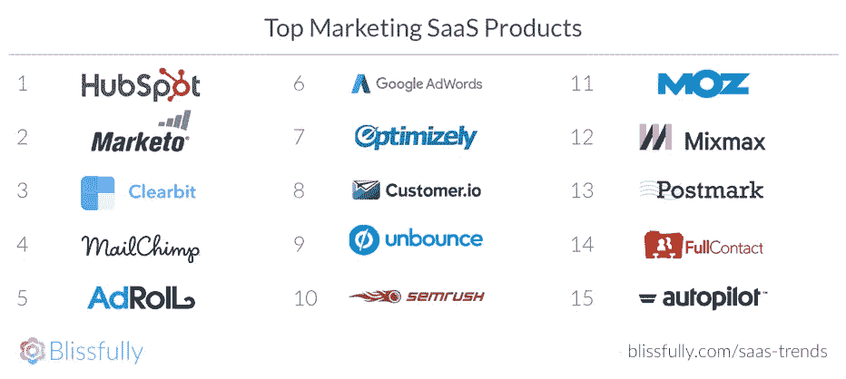

随着市场营销越来越成为一门技术性和以 KPI 为中心的学科，依靠技术来支持增长也就不足为奇了。这包括从大型营销自动化平台到从登录页面到设计的各种定制解决方案。面向营销人员的一些顶级 SaaS 产品包括:

*   [Hubspot](https://www.blissfully.com/hubspot/) :这款一体化营销自动化工具脱颖而出不足为奇，因为它能够为从中小型企业到大型企业的所有人进行扩展。
*   另一个营销自动化 SaaS 奖获得者，Marketo 是一个受企业欢迎的工具。
*   Clearbit : Clearbit 使营销人员能够更好地了解他们的前景，为营销部门提供数据驱动的洞察力。

# 😀客户支持

如果你的客户精通技术，你当然也最好如此。客户支持团队花了一段时间才开始采用 SaaS。但很明显，他们使用的 SaaS 工具正在产生巨大的影响。如今的客户期望得到出色的支持，而大规模做到这一点只需要良好的技术。客户支持的一些最爱包括:

*   [Zendesk](https://www.blissfully.com/zendesk/) :一个流行的一体化客户服务平台，提供从实时聊天到服务台到票务等一切服务。
*   [Help Scout](https://www.blissfully.com/help-scout/) :帮助台软件，旨在使客户服务互动更加人性化(符合 HIPAA 标准可加分！)
*   Front :一个团队共享的收件箱，Front 使与客户的互动变得更加容易，并且不会在过程中丢球。用数据驱动的洞察力为营销部门赋能。

# 💵金融

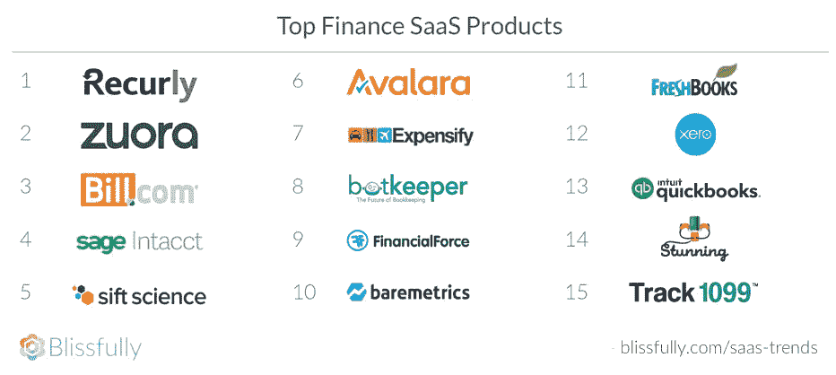

是时候让你的财务状况井然有序了吗？在 2018 年，如果没有一些优秀的 SaaS 金融工具的支持，你很难成功做到这一点。虽然对安全性和合规性的担忧(也许还有一点老派的态度)导致了这个部门的缓慢增长，但它在最近几年显然已经起飞了。最物有所值的应用？

*   Recurly :顾名思义，Recurly 为基于订阅计费的公司提供了一个智能平台。
*   [Zuora](https://www.blissfully.com/zuora/) :与 Recurly 类似，Zuora 提供了一个订阅管理平台，受到需要密切管理收入的企业的欢迎。
*   [Bill.com](https://www.blissfully.com/billcom/):这项服务不仅能帮助企业获得报酬，还能帮助他们管理对供应商和承包商的付款。

# 👩🏾‍💻产品

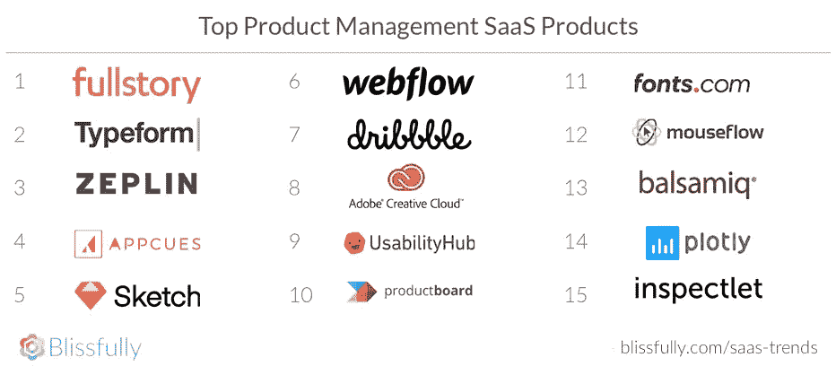

打造 SaaS 产品？你会想要一些 SaaS 的产品来帮助你管理这个过程…事实上，即使是那些自己没有开发技术的公司也可以从当今市场上一些强大的产品开发和管理工具中受益。以下是产品团队常用的三种 SaaS 工具:

*   [FullStory](https://www.blissfully.com/fullstory/) :想要了解您的客户如何与您的平台互动，以便您能够改善体验？完整故事是你的工具。
*   [Typeform](https://www.blissfully.com/typeform/) :大多数企业在他们的网站上至少需要一些表单，而 Typeform 提供了一种精心设计的、简化的方式来构建它们。
*   [泽普林](https://www.blissfully.com/zeplin/):需要缩短设计和开发之间的路径？Zeplin 使协作变得容易，并确保最终产品看起来完全符合要求。

# 👨🏼‍🔧DevOps

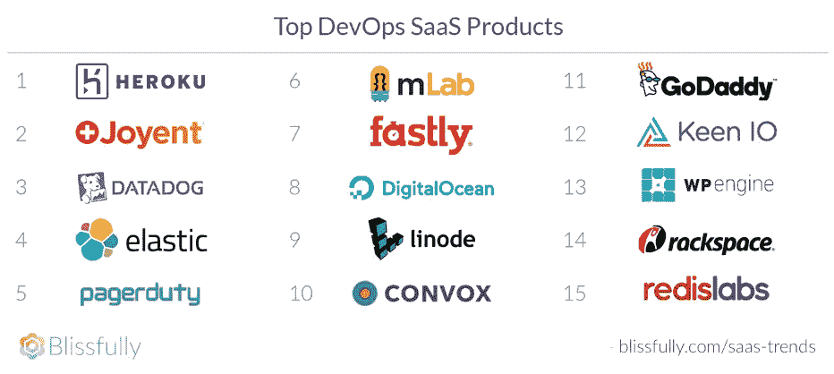

DevOps 团队是自然的早期采用者，因为他们沉浸在技术中。由于 DevOps 团队同时承担开发和运营任务，因此他们的 SaaS 投资涵盖所有领域，重点关注简化基础架构以支持连续应用交付是有道理的。以下是开发运维团队所依赖的一些出色的 SaaS 工具:

*   Heroku :这个云平台使公司能够构建、交付、监控和扩展应用，而无需担心基础设施需求。
*   Joyent 宣称自己是“下一代云”，为任何类型的基础设施提供计算、存储和分析，包括容器。
*   [Datadog](https://www.blissfully.com/datadog/) :监控和分析您的整个技术体系，提供可见性和洞察力。

# 💙人力资源（部）

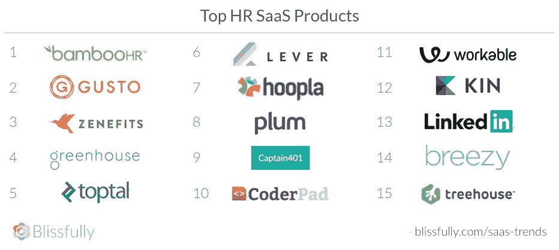

人力资源团队是最慢开始采用 SaaS 的。最近的增长来自越来越好操作的人力资源流程(如[入职](https://www.blissfully.com/employee-onboarding-guide/)和离职),这些流程需要技术形式的支持才能保持平稳运行。人力资源专业人士的一些热门话题包括:

*   [BambooHR](https://www.blissfully.com/bamboohr/) :一个强大的平台，包括从申请人跟踪到自我入职再到人力资源报告的所有内容。
*   [兴致](https://www.blissfully.com/gusto/):集人力资源、薪资和福利于一体，加上按需获得人力资源专家的帮助，这使得它成为中小型企业的热门选择。
*   从人力资源专家到客户，再到福利经纪人，这个工具为每个人都提供了一些东西，提供了一种简化的方式来处理工资、福利、合规等问题。

# 🤝销售

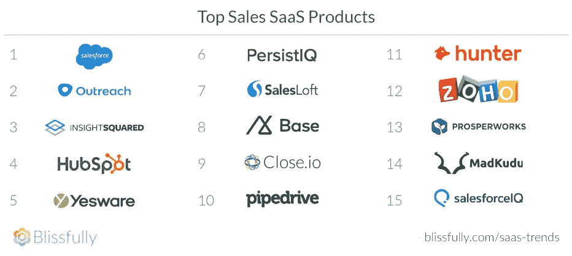

销售团队不断接受评估，并根据他们销售的速度、效率和效果进行 KPI。总有改进的空间和减少脂肪的机会。在这里，技术可以成为一个巨大的推动者。三种最受欢迎的 SaaS 销售工具是:

*   [Salesforce](https://www.blissfully.com/salesforce/) :作为一个笨拙的 SaaS 巨头，Salesforce 提供了销售团队所要求的几乎所有东西，从机会跟踪到提议到分析——甚至更多。
*   [外联](https://www.blissfully.com/outreach/):这个销售互动平台帮助团队填补渠道、预约会议，并发现哪些销售策略确实有效。
*   InsightSquared :是时候向董事会展示事情进展如何了？InsightSquared 将数据转化为清晰、可操作的收入报告。

# 权力越大，责任越大

SaaS 爆炸是一件好事。它更易于部署，采用速度更快，并且不需要 It 或开发人员入门。甚至不太懂技术的团队成员也可以部署许多 SaaS 产品。人们更喜欢它，因为应用程序可以解决广泛的业务挑战。但是，当一个组织投资大量应用程序时，它会很快导致混乱。

您必须考虑某些工具如何与其他工具相处(或不相处)。您需要寻找简化技术密集型工作流程的方法。您需要确保满足安全性和合规性要求和责任，并以应有的尊重和敏感程度对待客户的数据。你还需要确保围绕 SaaS 工具优化运营和支出，这样扩散就不等于浪费。

负责任地投资软件即服务意味着应对这些挑战。这是确保您的组织从所有这些令人惊叹的技术中获得净收益的唯一方法。

# 幸福地:SaaS 混乱的解药

听起来很难？别担心。Blissfully 帮助数百家公司轻松管理他们的 SaaS 供应商，涵盖数千份订阅和数百万的月支出。安装后，它可以显示 SaaS 使用、支出和数据管理的历史和最新准确数据。

幸福地提供:

*   自动 SaaS 工具清点(包括免费和未经批准的应用程序)
*   支出跟踪和优化
*   降低风险的安全监控
*   内置的 IT 工作流程简化和自动化

[今天就免费试用](https://www.blissfully.com/)。

# 查看更多内容并免费下载完整报告

您可以在 blissfully.com/saas-trends/2018-annual/[的](https://www.blissfully.com/saas-trends/2018-annual/)查看完整报告并下载 PDF 文件

【www.blissfully.com】最初发表于**。**