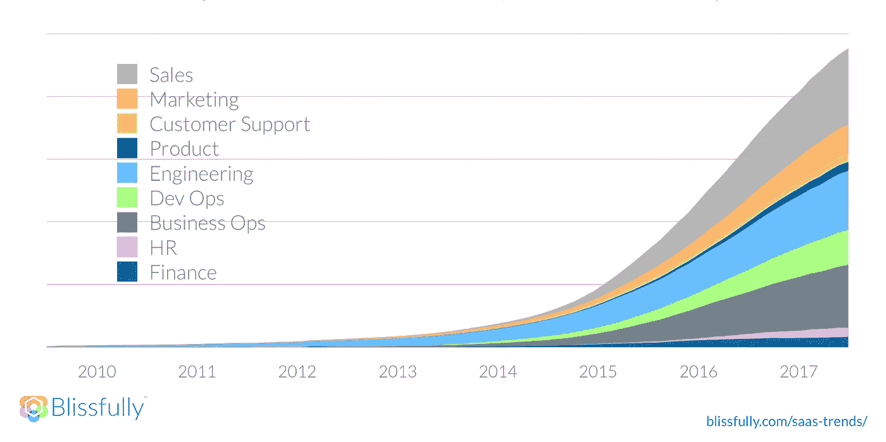

# 幸福地宣布投资 350 万美元，为 IT 的未来提供动力

> 原文：<https://medium.com/hackernoon/blissfully-announces-3-5-million-investment-to-power-the-future-of-it-cf6af6ccfbd4>

在过去的 5-10 年里，SaaS 已经非常成熟，团队可以直接采用他们工作所需的软件，而无需任何监督。满足各种商业需求的大量高质量产品推动了 SaaS 的快速崛起。事实上，我们自己对 500 多个客户的数据显示，这种[在 SaaS](https://www.blissfully.com/saas-trends/) 的扩散正主导着所有的业务职能。

SaaS 应用的爆炸式增长会给企业带来新的挑战。这些是影响整个组织的重要问题，包括:

**安全性&合规性**:营销部门选择的新供应商是否符合 SOC 2 标准？哪些供应商可以访问敏感信息？我们的员工是否遵循基本的账户安全最佳实践？

**预算**:谁在定期审查 SaaS 的开支，现在它是损益表中的一个重要项目？

供应商管理:你如何评估和比较供应商，或者管理更新过程？

**人员运营和工作流程**:您如何确保新员工能够访问他们高效工作所需的应用程序？还是说以前的员工没有权限？

在过去，IT 团队通常会解决这些挑战，但现在情况看起来更加不正式，甚至是混乱的。

在许多情况下，财务部门被留下来发现不受控制的支出问题，而工程团队处于安全和合规性挑战的第一线，这可能会危及组织的声誉和业务。与此同时，人员运营团队让入职和离职员工掌握正确的技术。SaaS 让它成为每个人的工作，但今天这种工作的大部分纯粹是被动的。如果组织现在没有感受到 SaaS 混乱的痛苦，他们很快就会感受到了。

解决 SaaS 混乱需要合作努力，而不是一个人，一个团队，或一个点的解决方案。组织需要与 IT 和安全部门、财务部门、人力资源部门、团队领导、管理人员等合作。我们愉快地创建了，让这些团队实时了解 SaaS 应用的使用和支出情况，为整个组织的 [SaaS 管理层](https://www.blissfully.com/product-tour/saas-management/)提供单一记录来源。我和 Aaron White 有幸为两家公司共事过的方正集团的 Eric Paley 喜欢说，我们正在“为未来的 IT 团队创造操作系统”

自去年秋天推出私有测试版以来，我们已经与 500 多家客户合作，解决他们组织中的棘手问题。我们很高兴能继续建设。为了继续投资我们对幸福 SaaS 管理的愿景，我们宣布了一轮 350 万美元的种子轮投资，由 Hummer Winblad Venture Partners(HWVP)领投，HubSpot、Founder Collective 和一批伟大的天使投资人也参与了进来。领导这轮融资并加入我们董事会的 HWVP 资深运营商和普通合伙人 Mitchell Kertzman 表示:“我们认为拥有合适的平台来管理 SaaS 应用和供应商的激增是当今现代 IT 的基础，我们很高兴能够支持幸福来实现这一愿景。”

这笔资金将加速我们的愿景，为专为 SaaS 世界打造的新 IT 管理模式提供动力，帮助我们在产品、增长和团队方面进行持续投资。

HubSpot 是一家幸福的投资者和 SaaS 的领导者，为 40，000 多家中小企业提供服务，亲眼目睹了该行业的飞速发展。首席执行官布莱恩·哈利根补充说:“SaaS 在各种规模的公司中的广泛增长是市场对幸福需求的领先指标。我们相信 Blissfully 团队可以解决 SaaS 混乱的问题，为企业提供对其应用程序堆栈的关键见解。”

SaaS 改变了团队的工作方式。现在，IT 管理方法必须随着当今人们的工作方式而发展。Blissfully 的最终目标是给公司一个新的可见性水平，帮助他们处理 SaaS 的混乱，做出更聪明、更明智的决定。

你可以在 Blissfully.com 了解更多信息并免费注册。

*原载于 2018 年 8 月 9 日*[*【www.blissfully.com】*](https://www.blissfully.com/blog/blissfully-announces-3-5-seed-round/)*。*