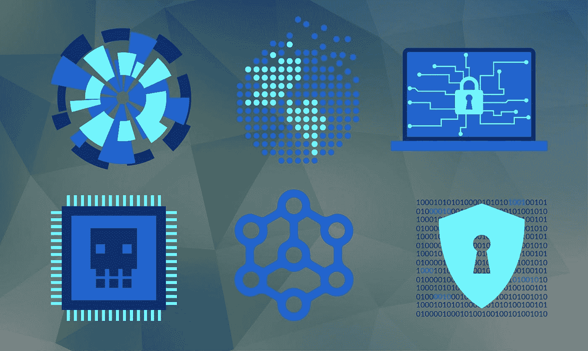

# BLMP 保护您品牌的创新策略

> 原文：<https://medium.com/hackernoon/blmps-innovative-strategies-to-protect-your-brand-f2b106cf08d>

品牌在任何行业都扮演着核心角色，虚拟商品市场也不例外。这些商品被定义为消费者在游戏、社交媒体和其他数字环境中购买和使用的物品，通常包含品牌内容。品牌越受欢迎，消费者就越渴望购买。虽然这个行业对品牌来说利润很高，但许多人不愿意涉足，很大程度上是因为目前与虚拟商品相关的不确定性。

BLMP 为品牌提供了充分参与虚拟商品生产和销售所需的保护。使用尖端的区块链技术，BLMP 开发了一系列智能合同、跟踪工具和其他资源，品牌可以用它们来保护自己的财产。通过这种方式，该平台有可能消除品牌参与的最严重障碍，包括以下问题:

**支付问题**

虚拟商品产业目前价值超过 500 亿美元，即使这个庞大的数字可能也只是其最终价值的一小部分。但许多品牌不想涉足这一领域，部分原因是他们担心这一价值不会渗透到他们身上。当品牌与出版商达成销售虚拟商品的协议时，他们需要这些出版商诚实地说明他们是如何销售商品的，以及他们产生了多少收入。如果出版商扣留他们的收入，品牌将创造价值，但没有得到任何回报。品牌可以通过诉讼和其他法律手段让无良出版商支付他们的公平份额，但并不是所有的品牌都有这样的资源，即使是那些有资源的品牌也可能不想麻烦。支付的不确定性导致许多品牌避开虚拟商品行业。

BLMP 通过开发智能合同将不确定性降至最低。智能合约被定义为自我执行的合约，它依赖于存储在区块链中的指令，或者包含相互链接的数据片段的不可变链。这样，每当出版商进行销售时，合同自动在品牌、出版商和任何其他出资方之间分配收入。出版商没有机会扣留收入。

除了智能合约，BLMP 还创建了自己的加密货币，可用于虚拟商品交易。这些代币易于追踪，为数字产品的销售和交换增加了更高的透明度。这使得出版商很难在不报告所有收入的情况下销售虚拟商品，因此品牌可以确信他们从每笔销售中获得了分成。

**未经授权使用**

除了支付问题，品牌还担心将知识产权的控制权交给独立艺术家和出版商。许多品牌努力培养公众形象，这往往涉及到将自己与某些理想或态度联系起来。但是，如果出版商以错误的方式使用品牌的知识产权，就有可能破坏这种形象。例如，想象一下，一个品牌希望被视为对孩子或家庭友好，但一个出版商在明显暴力或性的内容中使用其标志。看到这一点的消费者将不再认为该品牌有益健康，从而破坏其声誉和营销策略。

品牌通常会明确说明如何在虚拟商品许可协议中使用其内容。但是只有当品牌知道它的内容在哪里被使用时，这样的指令才能被执行。如果出版商以未经授权的方式使用品牌内容，但没有告诉品牌，该品牌可能直到其声誉被破坏后很久才知道。

为了防止出版商在品牌不知情和未经品牌许可的情况下使用品牌内容，BLMP 为平台上创建的每件虚拟商品分配一个序列号。这个序列号然后被存储在区块链中，平台使用它来跟踪和记录每次使用商品的时间。这使得出版商几乎不可能在品牌不知情的情况下使用商品。如果出版商以品牌没有授权的方式使用商品，品牌可以立即停止使用。品牌不必担心自己的声誉会因未经授权的知识产权使用而受损。

**强调真实性**

声誉受损并不是未经授权使用知识产权的唯一后果。当出版商和艺术家在未经所有者许可的情况下经常使用品牌内容时，他们会导致消费者降低对品牌的价值。无论是虚拟商品还是任何其他类型的物品，消费者都希望知道他们购买的是真实的，而不是由无良公司制造的廉价仿制品。出版商未经授权使用品牌内容越普遍，消费者对所有品牌内容的怀疑就越多。他们不会关心他们购买的产品是什么品牌的，这导致即使是那些没有涉足虚拟商品行业的品牌也有较低的销售额。

BLMP 恢复品牌内容的真实性和合法性。通过跟踪所有虚拟商品并确认它们按预期使用品牌图像，该平台使出版商和其他公司更难逃脱未经授权的使用。他们不太可能尝试，减少了市场上不真实虚拟商品的总数。消费者将更加相信他们购买的品牌商品是真实的，从而为各种品牌带来好处。

BLMP 2018，新加坡

BLMP(block chain Licensing market place)是区块链的一家技术公司，致力于消除障碍，促进虚拟商品行业中围绕供应链管理交易的复杂问题的信任。

*BLMP Network 利用区块链技术，将全球的数字平台与全球品牌连接起来，将跨任何数字平台的官方授权虚拟商品货币化；从游戏到流媒体服务&社交媒体，让数百万用户能够接触到一个全新的品牌虚拟产品世界。*

联系我们:

[网站](https://www.blmp.network/)

[推特](https://twitter.com/BLMPNetwork)

[脸书](https://www.facebook.com/BlmpNetwork)

[领英](https://www.linkedin.com/company/blmp/)

[AngelList](https://angel.co/blmp-network)