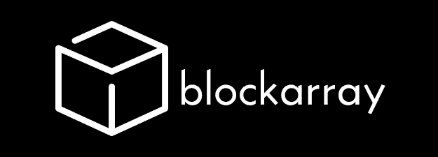

# 区块阵列:用区块链技术重新定义供应链

> 原文：<https://medium.com/hackernoon/blockarray-redefining-the-supply-chain-with-block-chain-technology-b7a9a0481d85>

# DYOR 信息

**网页:**https://blockarray.com/ T2

**硬币名称:** Block.array (ARY)

**总供应量:**—10525 万元

**Ico 前价格:** — 1 元= 0.26 美元(0.00021 瑞士法郎)

**通过 ICO 筹集的代币/资金:**——5000 万美元中的 5000 万美元(100%)

**白皮书:**—[https://drive . Google . com/file/d/1 ws1 pukozcgj 2 w-uyhhsotiz 3 uzuipbdo/view](https://drive.google.com/file/d/1wS1pukoZCgJ2W-uYHhSOTIZ3uZUipbdO/view)

**令牌类型:** — ERC20

# 关于块阵列的信息

总部位于田纳西州的 Block Array 推出了一款集成的区块链解决方案，以增强企业供应链运营的可追溯性计划。

通过提供创建垂直整合堆栈的基础设施，以及在以太坊区块链上嵌入产品信息的 ARY 令牌系统，它们将为企业和消费者提供一系列服务。

# 它是如何工作的

世界各地的许多公司，如亚马逊、沃尔玛和易趣，要求他们处理的产品具有非营利组织 G1 颁发的条形码。G1 条形码中包含的信息仅限于公司前缀和产品识别号。大型零售商需要这些信息来处理公司的产品，但这些信息对于公司的供应链系统来说是不够的。

Block Array 使用区块链数据接口协议(BDI)开发了用于创建软件库的基础设施，在软件库中存储了产品在供应链中移动时的信息。使用 G1 开发的 EPCIS 标准，这些库将允许公司创建和共享可见性事件数据，并将其表示为 URI。

# 物流

有了标准化的协议，数据可以来源于大量的遗留系统，并以统一的方式呈现。每个能见度事件也将被记录在以太坊区块链上。这允许数据以智能合同的形式呈现，使公司能够遵守最近通过的法律，如加州透明供应链法案或电子测井数据指令。

智能合同允许公司在处理供应链的不同部分时定义具体的员工权限。与基于地理围栏的自动触发器相结合，这使该公司能够更细致地了解其运营效率。跟踪监管链还将提高他们处理问题的能力，例如产品被转移到灰色市场，以及将假冒商品排除在供应链之外。

EPCIS 标准的采用也将允许在港口码头更有效地处理货物。

# 开发中的项目

Block Array 正在为他们的企业应用程序开发一个仪表板功能，让公司可以概述他们的整个供应链。

他们还在开发 Badger 移动应用程序，这将允许客户直接扫描参与公司的条形码。通过在 G1 条形码中嵌入 URI 信息，并将其锚定到以太坊区块链，客户将可以立即获得关于产品来源的可靠信息，以及从供应商到零售商的信息。

随着物流公司与该服务签约，Block Array 将在一个局部区域内汇总未使用的货运空间的可用性。这些信息将被用作开发虚拟市场的基础，允许卡车司机通过点对点网络出售空间。

# 辅币代表什么

ARY 令牌不是作为一种投机产品而创建的。相反，它们将在 Block Array 创建的框架内使用，以访问服务并为服务付费。以下操作需要 ARY 令牌:

从 Block Array 购买 GS1 条形码并将它们锚定到以太坊区块链。这是通过刻录这些令牌的一部分来创建时间戳来实现的。

参与由 Block Array 驱动的供应链管理系统(例如，针对卡车司机)

从点对点虚拟市场购买闲置的卡车空间

# **社交媒体信息:**

***推特***

网址:[https://twitter.com/blockarraygroup](https://twitter.com/blockarraygroup)

追随者:**1125**追随者

***电报***

网址:——[https://t.me/Block_Array](https://t.me/Block_Array)

用户:**4372**成员

***Youtube***

[https://www.youtube.com/channel/UCWywPYTBOlYbwn3N002p_CA](https://www.youtube.com/channel/UCWywPYTBOlYbwn3N002p_CA)

订户:**27**订户

***中等***

网址:——[https://medium.com/blockarray](https://medium.com/blockarray)

从动件:**31**40】从动件

***GitHub***

网址:——[https://github.com/blockarraygroup](https://github.com/blockarraygroup)

# **员工/团队信息:**

名称:**山姆·巴查**

头衔:**联合创始人**

生物:经济学学士/工商管理硕士

山姆在过去的 6 年里一直在亚马逊和美国电话电报公司工作，从 IT 的角度学习供应链管理的业务。Sam 和 Micah 已经是超过 14 年的朋友了，并且一起在两个不同的创业公司工作

领英:——[https://www.linkedin.com/in/sam-bacha-b6bb4423/](https://www.linkedin.com/in/sam-bacha-b6bb4423/)

姓名:**弥迦奥斯**

头衔:**联合创始人**

bio:Micah 拥有超过 15 年的软件开发经验，知道如何设计和执行复杂的系统以及支持这些系统所需的基础设施。他的最后一个创业公司是 Invert Game Studios，在那里他创建了 uFRAME，这是一个 MVVM 设计的框架，用于 Unity 3D 游戏引擎，这是最流行的手机游戏引擎。uFrame 是 2014 年 Unity Awards 的决赛选手。uFrame 是 2015 年作为开源项目捐赠的。

领英:——[https://www.linkedin.com/in/micah-osborne-1b078813/](https://www.linkedin.com/in/micah-osborne-1b078813/)

姓名:**尤里·森尤特**

职位:**系统管理员/开发人员**

Bio : — Yuri 曾为大型企业的分布式计算开发过各种闭源应用程序。最近与 SS&C 投资组合管理解决方案合作，该解决方案可以支持多种资产类别、多种货币投资组合和复杂的全球基金结构。转到 Python Oracle 12c Oracle RAC。净，RHE，CCNA

领英:——[https://www.linkedin.com/in/yuriy-senyut-a7969817/](https://www.linkedin.com/in/yuriy-senyut-a7969817/)

姓名:**乔 R.**

头衔:**自由职业者**

生物:移动开发人员乔自 2011 年以来一直活跃在加密货币社区。自 2012 年以来，他一直是一名自由职业者和合同开发人员，在世界各地从事各种移动应用程序项目。全栈均值/MERN Python MySQL/PostgreSQL AWS Azure Magento Swift Xcode

**公司地址:**

市场街 800 号，200-113 套房

田纳西州查塔努加

块阵列有限责任公司