# 区块链 101:账本到超账本

> 原文：<https://medium.com/hackernoon/blockchain-101-ledger-to-hyperledger-36836c4db1c1>

[区块链](https://hackernoon.com/tagged/blockchain)、密码术和加密货币可能是你可能听说过的术语，可能对任何人来说都是令人生畏的。

然而在这篇文章中，您将从头开始了解一个[【区块链】](https://hackernoon.com/tagged/blockchain) [网络](https://hackernoon.com/tagged/network)是如何发展的，所有的安全和信任负担都留给了先进的加密技术。

不用强调这些东西的逐字定义，让我们直接开始吧。一路上你会了解很多事情的真正意义。

假设你有三个朋友——艾伦、比尔和史蒂夫。你们四个都经常交易。但是因为你们住在不同的城市，所以不可能马上用现金支付。所以我们想出了创建和维护一个**分类账的主意。**

# **总账**

执行的所有交易都将添加到分类帐中。

交易将有收款人姓名、收款人姓名和要支付的金额。

现在假设你们每个月见一次面。付出比所得多的人会把差额放进罐子里。必须接受的人可以从壶中取出所需的量。这样我们就很容易解决不能马上付款的问题。

这个分类帐将在一个地方，并且每个人都可以看到，也就是说，它将是**集中的**和**公开的**。

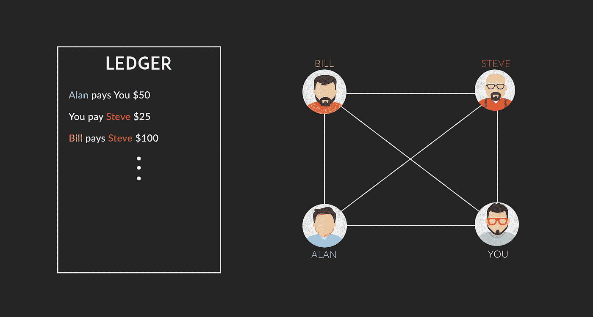

A Centralised Ledger system

以上面的例子为例，艾伦必须支付 50 美元，比尔支付 100 美元。所以底池中有$150 可以拿。

你得到了$50，而你必须支付$25，所以你将从底池中获得$50-$25 = $25。史蒂夫将得到 125 美元。

因此，你们都使用分类账系统轻松结算了余额。

## 漏洞:

**任何人都可以在总账中添加一行。**
*这意味着比尔可能会像* ***史蒂夫欠比尔 300 美元*** *甚至史蒂夫都没有批准。*

你可能认为应该有一种方法让史蒂夫可以批准或不批准以他的名义进行的交易。是的，你是对的。

我们可以考虑使用数字签名来授权每一笔交易。

# 数字签名

你不能像在纸上签名一样在数字账本上签名。因此，您可能会考虑使用一种独特的二进制数字模式来代表您的签名。

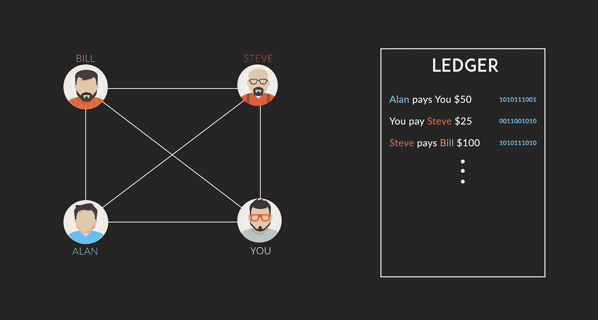

Steve adds his signature to the transaction

你用钢笔在纸上签名有点难以准确复制。但我们使用的上述签名只不过是一个简单的数字模式，很容易被复制。

比尔是个聪明人，他发起了一笔交易，从史蒂夫那里收到了 100 美元。

史蒂夫用数字签名批准了它。然而，现在比尔可以随心所欲地复制史蒂夫的签名，并生成虚假交易。

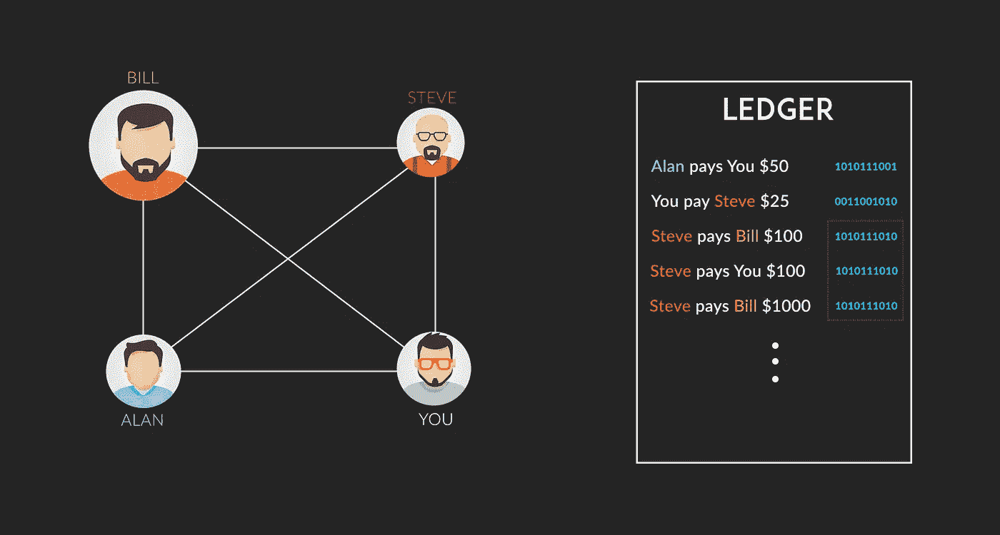

Bill adds fake transactions by copying signatures of Steve

## 漏洞:任何人都可以复制二进制数字的模式，根据需要创建尽可能多的虚假交易。

Alan 提出了一个为数字签名实现公钥加密系统的想法。我想简单地讨论一下公开密钥加密系统。在实际实现中会涉及到很多复杂的数学问题，但这并不重要。

## 公钥加密系统

你们每个人都有一个私钥和一个公钥。

顾名思义，您的公钥将对所有人开放，而私钥必须保密。

这些私人和公共密钥将被用来唯一地生成数字签名，并且也验证这一点。让我们看看如何，

邮件需要您的密钥来生成您的数字签名。

**签名函数**现在将接受两个输入——交易消息和您的密钥。它将产生一个 256 位长的数字签名，附加到交易中。

**验证功能**将接受三个输入，消息、签名和您的公钥，并判断签名是否有效。

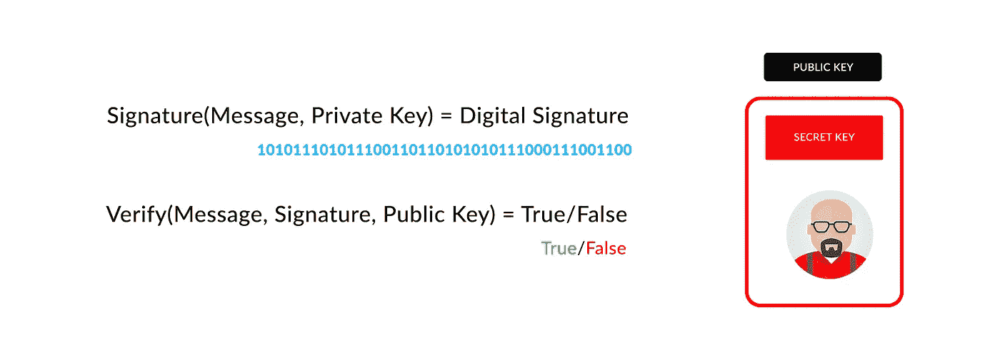

既然数字签名需要一个人的私人钥匙和电文，就不能简单地进行多次交易，因为每份电文的数字签名是不同的。

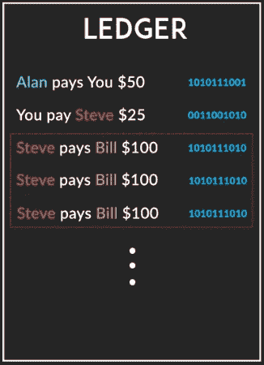

## 但是还有一个漏洞需要弥补。

假设史蒂夫同意将 100 美元的交易支付给比尔。比尔可以任意多次复制同一条消息，因为消息和付款人密钥是相同的。

这个问题的解决方案是**为每条消息**和**附加一个唯一的 ID，作为签名和验证函数的输入。**

## 迄今为止创建的协议:

1.  任何人都可以向分类帐添加行
2.  每月用真钱结算。
3.  只有已签名的交易才被认为是有效的。

## 使用公钥密码签名和事务索引解决了信任问题这一大难题。

## 漏洞:

如果一个人承诺支付比他实际拥有的更多的钱，并继续增加交易，而在真正的钱被兑换时实际上没有出现，该怎么办？

# 给每个人固定数量的钱

假设一开始每个人都分到 200 美元。所以现在我们只需要检查没有人花费超过那个。

如果每个人都能保持收支平衡，就可以很容易地发现有人入不敷出的情况。

像在这种情况下，比尔做的最后一笔交易是无效的，因为他已经花了 200 美元，但没有收到任何东西。因此，由于他的余额已经变成 0 美元，他不能发送更多。

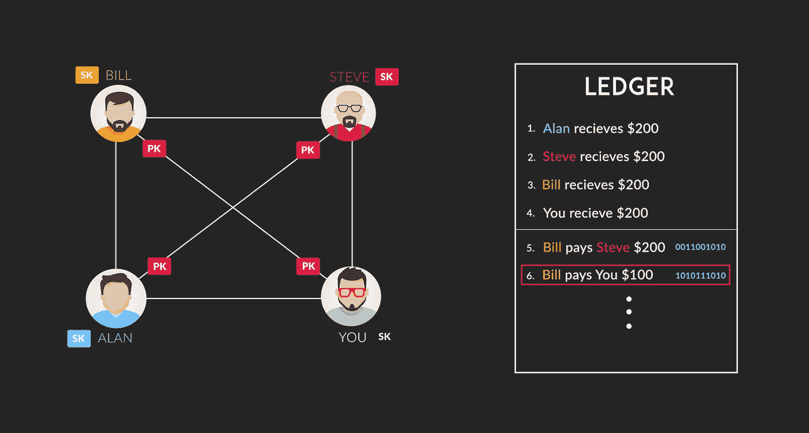

你有没有注意到这样一个事实，既然一种虚拟货币已经分发给每个人，我们现在不需要实际的钱来进行交易。我们建立了自己的虚拟货币，人们可以用它来进行交易。让我们称我们的新货币 ***为分类账美元。***

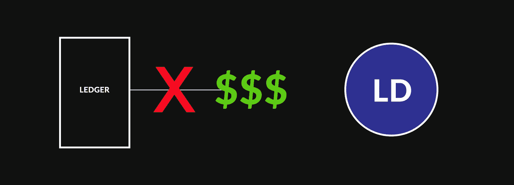

你们中的任何人都可以和其他人交换你的分类帐美元，以换取真正的货币，如美元、英镑等。无论多少。汇率将由市场本身决定，但这是另一篇关于 BTC 兑美元和其他汇率如何决定的文章的主题。

从一个简单的分类账开始，你现在已经到了创建自己的虚拟货币的阶段。为了让它听起来更花哨，你可以称它为 [***加密货币***](https://hackernoon.com/tagged/cryptocurrency) ***。***

我提到了两个词:加密货币和去中心化。我们已经了解了什么是加密货币，现在我们应该看看称为去中心化的第二个方面。

## 问题:

**我们的分类账仍然保存在一个集中的地方。你必须相信维护分类账的权威，而且数据库也有可能被破坏，所有的交易都变得无效。**

如果公司在一次重大失误中丢失了你的数据，或者管理数据库的人被收买修改了一些数据，那么对当局、大组织和公司的信任可能会适得其反。这些事情并不罕见，而且长期以来一直在各个部门发生。然而，权力下放似乎是这个问题的正确答案。

# 分散

去中心化的基本理念是让网络中的每个人都保留他/她自己的分类账副本，而不是维护一个中央分类账。每当有新的交易时，都应该广播到每个人的账上，以便每个人都了解最新情况。

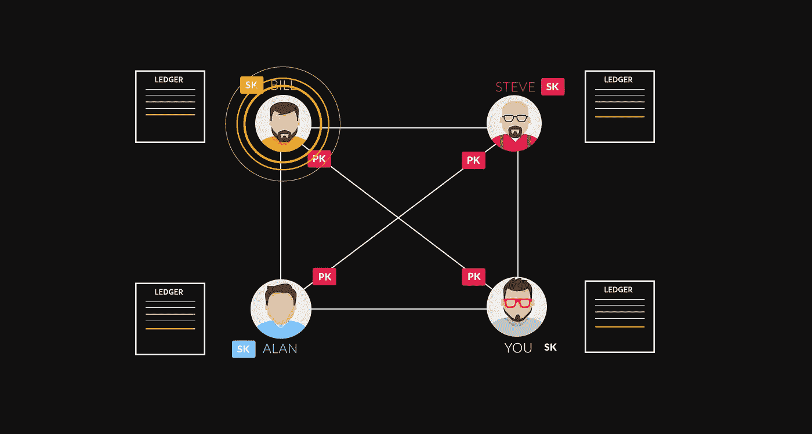

Everyone keeps an updated keep an updated copy of Ledger

这种设置带来了一个新问题，**您如何相信您的系统接收到的事务与其他人接收到的事务是一样的**。不仅如此，我们还必须记录每个人的当前余额。

## 这个问题的解决方案是一个去中心化的分类账系统如何运作的基础。

## 解决方案:
信任计算工作量最大的分类帐。

为了真正理解什么是计算工作，让我们稍微了解一下哈希函数。

# 哈希函数

散列函数是一个数学函数，它返回一个非常随机的摘要或一个数字。对同一消息应用哈希函数将生成相同的输出。无法通过某种方式解密摘要来获取原始消息。

即使是信息中的一个小变化也会极大地改变摘要。广泛使用的散列函数的一个例子是 SHA256 函数，它返回一个 256 位数。

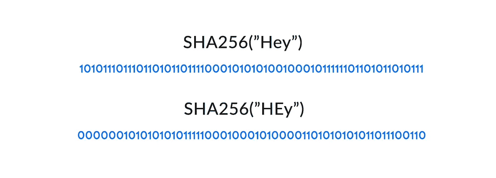

一个 256 位的模式可以代表 2 个⁵⁶不同的可能消息。为了让您了解提取原始消息有多困难:通过暴力破解对称的 256 位密钥需要比 128 位密钥多 2 倍⁸的计算能力。理论上，50 台每秒可以检查 10 亿(1018)个 AES 密钥的超级计算机需要大约 3×10 **⁵年**才能耗尽 256 位密钥空间。

## **但是这款 SHA256 如何帮助您解决所需的计算工作问题呢？**

请记住，我们已经负责核实所有的交易，现在的问题是，我们必须确保每个人都保持分类账的更新和正确版本。

为了使事务安全并使它们不可变，我们将从把一些事务捆绑到一个**块开始。**

每个要添加到每个人的分类账中的模块都应该包含一个工作证明或计算工作证明。

## 工作证明

要认为一个块是有效的，必须在块的末尾加上一个数字。假设，函数的散列以及附加的数字必须以 40 个零开始，这样一个块才被认为是有效的，并被广播给每个人。

如前所述，很难猜测这种模式可以实现的次数。这需要系统尝试数十亿个数字，以便块的散列从 40 个零开始。这个数字将是工作的证明，这将是固有地绑在块，这将使其安全和永久的。

稍后，您将会理解，对于被认为有效的块来说，实现特定的哈希摘要模式的重要性。

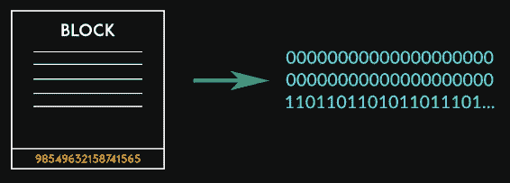

现在，由于**块**中的事务是按特定顺序进行的，所以这些块也必须按顺序进行。这是通过将它们排列成类似链状结构来实现的。一个块还应该包含前一个块的散列。这个块的散列也将依赖于前一个块的散列，以及它后面的整个链。

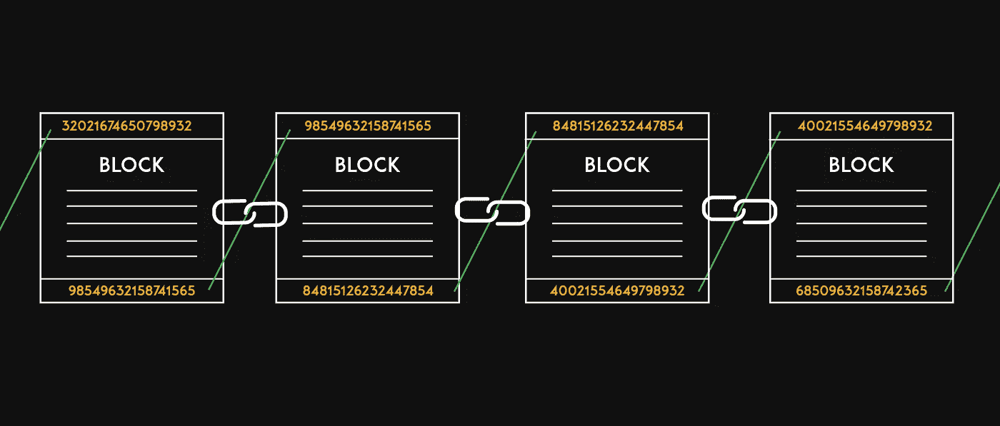

如果我们试图改变块的顺序，甚至是块事务的一点点，多米诺效应会迫使每个散列和块改变，这是不可能的。你将不得不对每一个方块重新做所有的工作，以找到特定模式的数字。电力和计算能力是天文数字。

因此，现在我们已经创建了排列成链状结构和分散结构的块。我们终于创造了我们的**去中心化的区块链。**

# 区块链矿工

如果你还记得，我提到过 ***系统*** 要尝试十亿个数字。

实际上这是由叫做**区块链矿工的人完成的。**区块链矿工监听交易，将其捆绑起来，并试图找到具体的模式。他们的大量金钱和时间资源被浪费在寻找最重要的数字上。作为对他们工作的回报，他们每成功开采一个区块，就会获得奖励/区块回报交易。

成千上万的区块链矿工带着他们强大的图形处理器和机器在那里玩一种彩票。

**抽奖活动是这样的:首先猜中一个街区的号码的人将获得奖励。**

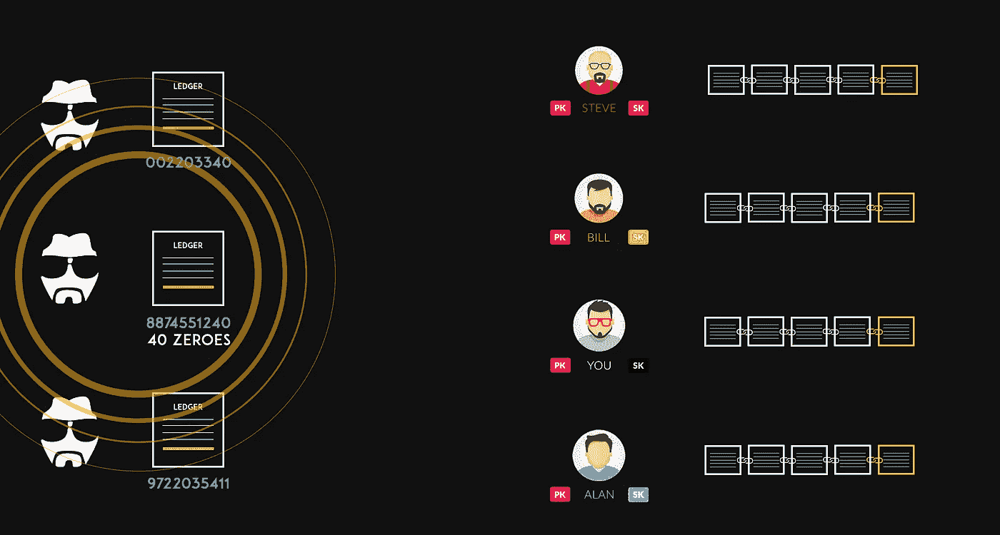

向矿工支付加密货币的交易被自动附加该块。没有人真的付那笔钱。因此，每开采一个区块，就会产生新的比特币货币。这个街区将被广播给区块链网络上的所有人。

**如果你听到两个不同的广播会怎样？**

你应该总是相信这个有更多计算工作量的链。如果它们是相同的，等待更多的广播，然后使用更长的链。

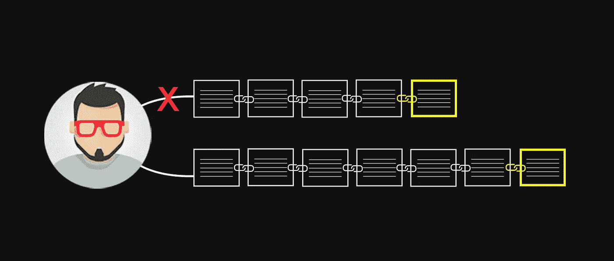

为了验证这个系统是否安全，我们将看看当一个人试图创建欺诈交易时会发生什么，以及对计算工作的依赖如何实际解决这个问题。

# 创建欺诈块

让我们假设艾伦向你的账本广播假块。他必须比其他矿工更快地挖掘出包含欺诈交易的区块。这很困难，但让我们假设这是可能的。

为了保持这种欺诈交易，艾伦将不得不保持比别人更快的挖掘速度，以便你总是相信艾伦的广播。根据统计，Alan 将不得不拥有世界上超过 50%的计算资源，以便保持一个事务。

因此，制造欺诈和虚假交易几乎是不可能的，这使得区块链网络成为最安全的记录方法。

分散的、不可变的、不能被销毁的记录。

我们讨论的主要观点是:

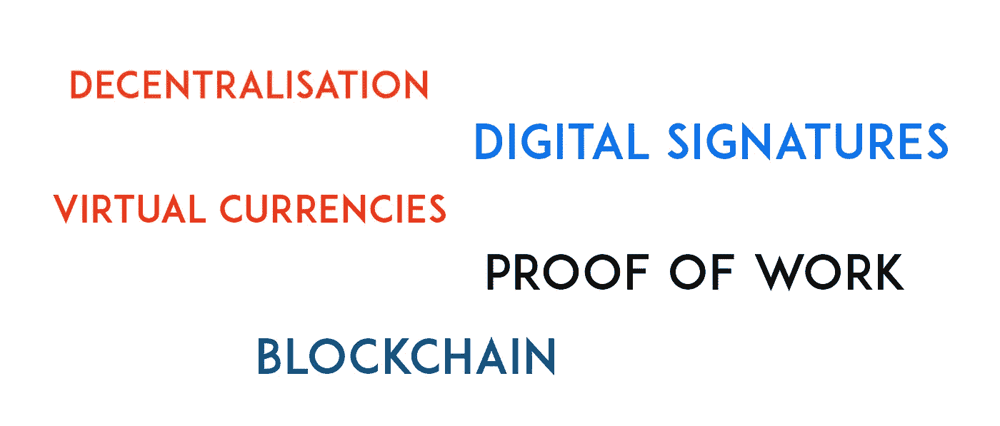

这几个想法是区块链网络的底层基础，几乎被所有的加密货币和区块链系统所使用。

## 区块链的应用

比特币、以太网只是使用区块链网络的几个例子。我与你讨论了如何创建一个虚拟货币交换网络，但区块链的基本原则不仅限于金融应用。

区块链可以用来创建投票应用程序，独特的识别系统，土地记录系统，健康记录数据库。

你可以把区块链看作是一个现代版的数据库，它是去中心化的、不可变的，不需要中间人和组织。

这是人类努力消除对他人信任的依赖的自然延续。

Photo by [Joshua Sortino](https://unsplash.com/photos/LqKhnDzSF-8?utm_source=unsplash&utm_medium=referral&utm_content=creditCopyText) on [Unsplash](https://unsplash.com/search/photos/network?utm_source=unsplash&utm_medium=referral&utm_content=creditCopyText)

我希望这篇文章能帮助您理解即将出现的区块链系统的基础。

我会写更多关于区块链和密码学的文章。跟随我。

**想鼓掌多少次就鼓掌多少次，它们是免费的。** ❤:我很想听听你的回应。如果你觉得这篇文章有用，请分享。❤