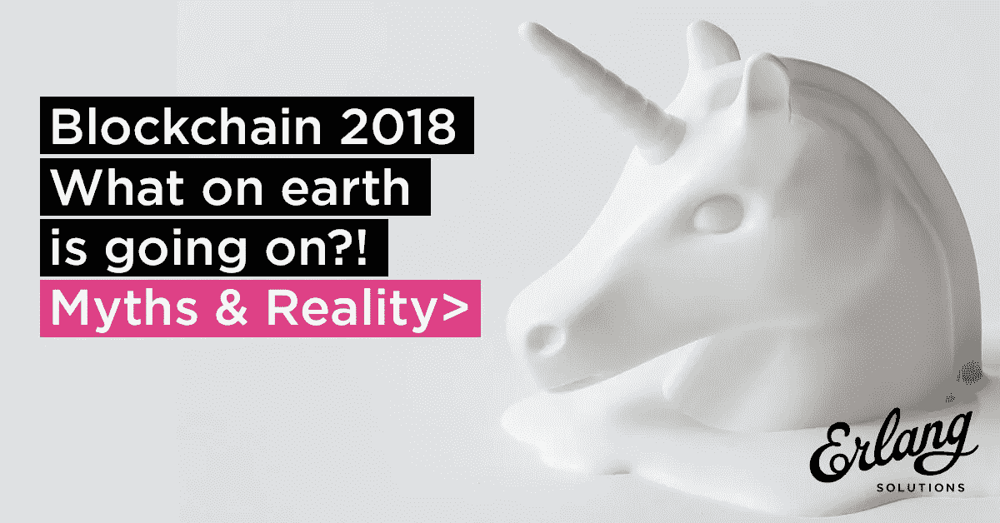
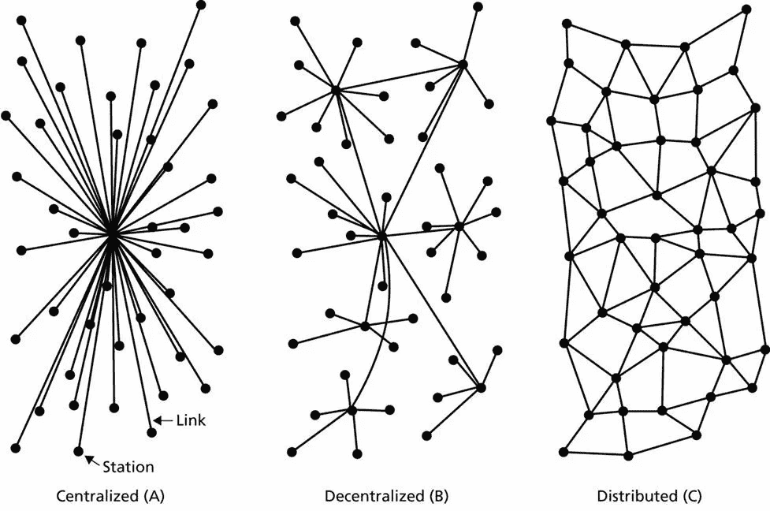

# 区块链 2018:神话 vs 现实

> 原文：<https://medium.com/hackernoon/blockchain-2018-myths-vs-reality-325d0ce72c09>

多米尼克·佩里尼 2018 年 10 月 17 日

在成功参与了一年区块链的各种项目后，我觉得退一步观察这个新兴行业(但仍有数十亿美元)的新兴趋势是有益的，并质疑迄今为止采取的一些方向是否明智，或者是否有必要进行任何修正。我将提供区块链技术发展状态的“快照”,描述到目前为止出现的解决方案的优点和缺点，而不是在这个阶段提出创新(这些想法将成为未来博客帖子的主题)。如果您有兴趣听听我和 Erlang Solutions(我在 Erlang Solutions 担任可伸缩性架构师和技术主管)对区块链的看法，让我带您浏览一下:

# 背景

在这篇博文中，我不打算深入区块链数据结构本身的细节，也不会讨论什么是最佳的 Merkle 树解决方案。我还将避免热门话题，如“每秒交易量”(TPS)和实现大量交易量的机制，这实际上是广泛采用的最终基准，用于衡量解决方案相对于市场主要参与者的竞争力；比特币和以太坊。

相反，我想检查的是技术的成熟度，以及它与支撑分布式分类帐生态系统的核心原则的一致性。我希望对这些原则以及它们如何演变的清晰描述会有所帮助。

# 原则

由于创新的主要动力来自于公开、开源的区块链，这将是我们关注的焦点。

区块链技术主要旨在包含以下高级原则:

1.  历史的永恒性
2.  控制的分散化
3.  可行的共识机制
4.  分布和弹性
5.  交易自动化(包括“智能合同”)
6.  透明度和信任
7.  与外部世界的联系

让我们一个一个来看:

# 1.历史的永恒性

在一个理想的世界中，希望保存事件的准确历史痕迹，并确保该痕迹不会随着时间的推移而恶化，无论是通过自然事件，还是通过人为错误或欺诈行为者的干预。随着时间的推移，在模拟世界中生产的人工制品面临着变化，尽管人们往往希望确保它们能够经受住威胁改变并最终摧毁它们的力量。在数字世界中，存储信息的量化/二进制性质提供了连续校正的可能性，以防止可能随时间发生的任何恶化。

编写一个不可变的区块链旨在保留一个不能随时间改变的数字历史，在此之上，人们可以验证一个事件(称为事务)的痕迹是否被记录在其中。当涉及到评估资产的所有权或真实性或者验证一个或多个交易时，这是特别有吸引力的。

我们应该注意到，除了设计和实现良好的区块链固有的不变性之外，哈希算法还提供了一种对写入历史的信息进行编码的方法，以便验证跟踪/事务的能力只能由拥有足够数据来计算单向 [1](https://www.erlang-solutions.com/blog/blockchain-2018-myths-vs-reality.html#fn1) 级联编码/加密的参与者来执行。这通常是在 Merkle 树的顶部实现的，在 Merkle 树中计算串联散列的散列。

关于无限期存储不可变数据结构的保证，可以提出合理的问题:

1.  如果这是一个无限增长的历史，那么当它增长到超出分类帐的容量时，可以将它存储在哪里呢？
2.  随着历史规模的增长(和/或验证进一步交易所需的计算能力的增加)，这将减少生态系统中潜在参与者的数量，导致事实上的去中心化损失。这种“权力”的集中在什么程度上产生了担忧？
3.  随着历史的增长，验证性能如何恶化？
4.  当用户同时在上面写入大量数据时，它会如何恶化？
5.  您在每个分类帐节点上复制的数据段有多长？
6.  这种复制会产生多少网络流量？
7.  需要多少历史记录才能计算新的交易？
8.  在历史的线性化、信息的复制、从异常中恢复的能力和 TPS 吞吐量方面需要做出什么样的妥协？

除了上述问题之外，我们还想了解需要多少个与特定历史(即共识)相一致的副本才能继续现有的历史，特别是:

1.  一个支离破碎的网络能否继续书写他们已知的历史 [2](https://www.erlang-solutions.com/blog/blockchain-2018-myths-vs-reality.html#fn2) ？
2.  通过奖励最长的分叉来“修复”不变的交易历史中的任何差异的方法是否公平有效？
3.  这种威慑是否足够强大，足以阻止一组分类账形成自己的分支 [3](https://www.erlang-solutions.com/blog/blockchain-2018-myths-vs-reality.html#fn3) 最终被更广泛地采用？

此外，遵守欧洲通用数据保护法规(GDPR)和“被遗忘权”的新要求给无限期保留永久和不可变的痕迹带来了新的挑战。这一点很重要，因为违反 GDPR 的罚款可能非常高。到目前为止介绍的解决方案有效地旨在匿名化进入不可变链上存储过程的信息，而敏感信息单独存储在支持数据库中，如果需要，可以删除这些信息。这些方法都没有经过法院的检验，也没有定义 GDPR 的“被遗忘权”在实践中意味着什么。

这里具有挑战性的方面是预先决定什么被认为是敏感的，什么可以安全地放在不可变的历史上。一个错误的前期选择可能会在后期产生适得其反的后果，如果任何相关的参与者设法通过不可改变的历史提取或追踪敏感信息。

不变性是激励区块链技术研究的基本原则之一，无论是私人的还是公共的。到目前为止，通过引入历史线性化技术、单向散列加密、merkle 树和离链存储，探索的解决方案已经设法提供了对市场需求的满意响应，尽管不可变历史的线性 [4](https://www.erlang-solutions.com/blog/blockchain-2018-myths-vs-reality.html#fn4) 是有代价的(特别是交易量)。

# 2.控制的分散化

在 2008 年全球金融危机的余波中(一种解释是，这场危机突显了过度集权和经济激励错位可能引发的全球金融灾难)，人们对“传统的”、中央集权的政治和商业机构产生了深深的不信任。反对这种集中的一个反应是探索各种分散的机制，以取代传统的集中结构。理想情况下，在社会环境中运作的个人希望享受独立于中央权威的自由，这一观点越来越受欢迎。自决、民主公平和作为一种财富形式的异质性是西方(以及越来越多的非西方)社会广泛认可的主导价值观。这些价值增加了在系统中引入去中心化是积极的运动的分量。我很少看到这种想法受到质疑(同样，人们很少听到对“信息想要免费”这一命题的批评)，尽管在某些情况下，使用这种方法的不良后果显而易见。

例如，有人可能会争辩说，这只是由于我们的习惯，我们通常通过联系中央机构来解决系统中的异常情况，根据我们隐含或明确的合同条款，中央机构对系统发生的事情负责。因此，如果因系统故障或欺诈行为者导致的错误交易造成损失，我们通常倾向于联系中央责任人进行干预，并尝试解决所遭受的损失。人类历史的特点是等级权力结构的演变，即使在最“民主”的社会中也是如此，这些等级制度自然会产生中央集权，独立于任何特定社会的主导政治结构。这一特点一直延续到 21 世纪初。

然而，随着权力下放，就没有这样的中央权威来为我们解决这些问题。传统的中央系统拥有完善的反欺诈和资产追回机制，人们对此已经习以为常。如果用户想要获得新的分散技术的所有好处，那么使用新的分散技术会给他们带来更大的责任，迫使他们在处理和存储数字资产时采取额外的预防措施。特别是，他们需要保护对数字钱包的访问，确保不会丢失。类似地，在进行交易时，例如将数字资产赠送给朋友或亲戚，他们必须确保数字资产被发送到正确的地址/钱包，否则它将实际上丢失或错误地移交给其他人。

此外，如果一个人将自己的钱包私钥交给一个安全性松懈的中间人(又是更加“集中化”),那么拥有一个超级安全的区块链就没有意义:这就像拥有世界上最安全的保险箱，然后在同一房间的白板上写下密码。

随着安全区块链的正确实施而增加的个人责任是用户愿意付出的代价吗？或者他们会牺牲一些安全性来换取易用性(以及，从定义上来说，更多的集中化)？现在看这件事结果如何还为时过早。如果人们愿意在这方面做出妥协，那么他们愿意接受哪些其他妥协，比如安全性或集中化，以换取更低的成本/易用性？我们不知道，因为还没有一个安全的区块链生态系统可以大规模运作。

对去中心化原则的广泛认可和成功的另一个威胁是政府对数字资产和生态系统的监管/法律压力。这是为了确保个人不会利用区块链逃税，并以某种方式保护其数字资产的所有权。然而，任何试图从一个中心点监管这个市场的努力，都在破坏推动采用权力分散形式的努力。

# 3.共识；一致

对分散形式的控制和责任的持续推动揭示了无需中央机构(或干预)即可验证交易的基本要求；这就是所谓的“共识”问题，许多方法已经从区块链工业中发展出来，有些是竞争的，有些是互补的。

区块链生态系统中的治理概念也是一个重要的焦点。这涉及到需要监管新区块加入区块链的速度以及对采矿者的相关奖励(在区块链，使用工作证明(POW)共识方法)。更一般地说，重要的是建立激励和威慑机制，使感兴趣的行为者能够为价值链的健康持续增长做出积极贡献。

除了作为对拒绝服务和垃圾邮件攻击的经济威慑之外，POW 方法是通过使用计算能力自动计算出哪些分类帐/参与者有权创建/挖掘新块 [5](https://www.erlang-solutions.com/blog/blockchain-2018-myths-vs-reality.html#fn5) 的首批尝试之一。随后出现了其他类似的方法(空间证明、带宽证明等),但是，它们都存在偏离预期的公平控制权分配的风险。富裕的参与者实际上可以利用这些方法，通过大量购买高性能(CPU /内存/网络带宽)专用硬件，并在电力相对便宜的管辖区运行，从而获得优势。这导致超越竞争对手以获得奖励和开采新区块的权力，这具有集中控制的内在效果。此外，在 POW 共识机制中开采新区块的竞争性竞赛的低效率性质带来的巨大能源消耗已经引起了对其环境影响和经济可持续性的关注。关于比特币的[能量使用的最新报告可以在 digiconomist 上看到。](https://digiconomist.net/bitcoin-energy-consumption)

利害关系证明(POS)和重要性证明(POI)是通过使用更多的社会参数而不是计算资源来推动共识的概念之一。这两种方法将权威与累积的数字资产/货币财富或参与参与者的衡量生产率联系起来。实现 POS 和 POI 机制，同时防止权力/财富的集中，对它们的架构师和开发者提出了不小的挑战。

最近，由人工管理的分类帐组驱动的半自动方法正在实施解决方案，以克服上述策略的局限性和有争议的公平性。委托利益证明(DPOS)和授权证明(POA)方法承诺更高的吞吐量和更低的能耗，而人的因素可以确保对由试图利用系统漏洞的恶意行为者引起的潜在偏差做出更具适应性和灵活性的响应。

这些解决方案实际上是否能够满足由控制分配原则设定的内在要求，这是有争议的。同样，当谈到为策展引入另一层人类驱动的共识时，很明显我们正在放弃一定程度的自动化。在治理一个特定的区块链时，以尊重信任和声誉的方式行使权力，似乎带回了一种集权控制的形式，这显然违背了初衷和区块链精神。

这似乎是一个领域，尽管最初有热情，但还没有一个明确的解决方案，以公平、可持续和自动化的方式推动共识。展望未来，我预计这将是该行业参与者的主要研究重点，因为当前的解决方案让许多观察者无动于衷。很可能会出现许多不同的方法，每种方法都适合特定的用例类别。

# 4.分布和弹性

除了分散权限、控制和治理，区块链解决方案通常采用分布式对等(P2P)设计模式。这种偏好是由这些类型的网络所引入和展示的内在弹性和灵活性所推动的，特别是在文件和数据共享的环境中([参见这里的简要 p2p 历史](/paratii/a-brief-history-of-p2p-content-distribution-in-10-major-steps-6d6733d25122))。下图经常用来解释三种网络拓扑结构的区别:集中式、分散式和分布式。

中央网络，典型的大型机和中央服务 [6](https://www.erlang-solutions.com/blog/blockchain-2018-myths-vs-reality.html#fn6) ，明显暴露于“单点故障”漏洞，因为操作总是被路由到中央节点。如果中心节点出现故障或拥塞，所有其他节点都会受到中断的影响。

分散式和分布式网络试图减少在一个节点上发生的问题可能在其他节点上触发的有害影响。在分散式网络中，一个节点的故障仍然会影响到几个依赖它来执行操作的相邻节点。在分布式网络中，想法是单个节点的故障不应该显著影响任何其他节点。事实上，即使当网络中的一条优先/最佳路由变得拥塞或完全中断时，消息也可以通过另一条路由到达目的地。这大大增加了在出现故障或恶意攻击(如拒绝服务(DOS)攻击)时保持服务可用的机会。

在区块链网络中，分布式拓扑结构与支持历史的高冗余分类账相结合，偶尔会被狂热分子宣布为“无法破解”，或者如一些更谨慎的辩论者所言，“难以破解”。这是有道理的，特别是当涉及到比特币等非常大的网络时(见此处的附加解释)。在这样一个高度分布式的网络中，产生重大中断所需的资源非常高，这不仅满足了弹性要求，而且也是对恶意攻击的一种威慑(主要是因为成功实施恶意攻击的成本变得令人望而却步)。

虽然分布式拓扑可以对故障或流量峰值提供有效的响应，但我们需要意识到，针对长期的超容量需求或恶意攻击提供弹性需要足够的适应机制。虽然比特币网络定位良好，因为它目前受益于高容量条件(由于第三方矿工购买硬件的历史高激励 [7](https://www.erlang-solutions.com/blog/blockchain-2018-myths-vs-reality.html#fn7) )，但随着其他新兴网络越来越受欢迎，情况并非如此。这就是能够提供与应用于 P2P 级别的背压节流相结合的抢先适应的新型工具具有巨大价值的地方。

分布式系统并不新鲜，虽然它们为许多企业和政府问题提供了非常健壮的解决方案，但是它们受制于物理定律，并且要求它们的架构师考虑在它们的设计和实现中需要做出的权衡(例如，一致性与可用性)。区块链系统的情况依然如此。

# 5.自动化

为了维持一个连贯、公平和一致的区块链及其周围的生态系统，需要高度的自动化。对自动化有高度需求的现有领域包括大多数分布式系统共有的领域。比如说；部署、弹性拓扑、监控、异常恢复、测试、持续集成和持续交付。在区块链的环境中，这些代表了成熟的 IT 工程实践。此外，R&D 还创造性地致力于自动化处理一系列新问题空间(如物流、数字资产创建和交易等)中的资产、计算资源和用户所需的交互。

社交互动的趋势已经出现了向事务性操作脚本化的重大转变。这就是“智能合约”和受约束的虚拟机(VM)解释器出现的地方——以太坊项目开创的一项努力。

通过脚本定义如何操作资产交换、在什么条件下以及由哪个触发器操作的可能性吸引了许多区块链爱好者。智能合约最常见的应用包括彩票、数字资产交易和衍生品交易。尽管引入智能合约显然会释放出令人兴奋的潜力，但它也确实仍是一个准入门槛很高的领域。只有那些愿意花时间学习领域特定语言(DSL)的熟练开发人员才能接触到这些合同的实际创建和修改。

此外，开发人员可以创建包含错误或无法在意外条件下运行的合同。例如，当合同的实现被委托给不具备足够领域知识的开发人员时，就会发生这种情况。尽管该行业正在朝着正确的方向前进，但要想自动适应不可预见的条件，并在重要的用例中创建有效的智能合同，还有很长的路要走。当智能合约应用于偏离“快乐路径”的边缘情况场景时，面临的挑战是如何应对安全和保障问题。如果设计糟糕的合同不能正确地回滚/撤销一个流产的交易，它们的执行可能会导致资产丢失或错误地移交给不想要的接收者。许多组织正在进行 R&D 工作，以应对这些已知问题，并引入在更严格的限制下运行的虚拟机，以提供更高水平的安全性。然而，从概念的角度来看，这是一种限制，降低了实现特定需求的灵活性。

另一个非常需要自动化的领域是治理。任何用户和计算资源的区块链生态系统都需要参数的周期性配置，以持续一致地运行。这导致一项复杂的调整激励和威慑的工作，以保证实现雄心勃勃的合作和分散的目标。新兴领域“区块链经济学”(结合经济学；博弈论；社会科学和其他学科)仍处于起步阶段。

很明显，中央裁决机构的移除产生了真空，需要由适当的决策制定机构来填充，该决策制定机构通常配备有保持静态和动态配置设置的组合的自动化。前面提到的那些共识解决方案使用计算资源或社会可堆叠资产来分配权限，不仅产生区块，而且操纵治理的可变部分 [9](https://www.erlang-solutions.com/blog/blockchain-2018-myths-vs-reality.html#fn9) ，最初已经成功地以公平和自动化的方式填补了决策差距。连续地，利用治理的静态元素中的缺陷阻碍了这些模型的成功。这促成了 POA 或 DPOS 等策划方法的流行，这些方法不仅带来了集中控制，还降低了治理的自动化程度。

我预计这将是区块链必须改进的主要领域之一，以便成功获得广泛的市场采用。

# 6.透明度和信任

为了让区块链产生预期的受众参与度，并最终决定其大规模采用和成功，其共识和治理机制需要透明地运行。用户需要知道谁可以访问哪些数据，这样他们就可以决定哪些数据可以存储，哪些数据可以共享。这些是用户同意分享他们的数据的合同条款。如前所述，用户可能需要行使删除其数据的权利，这通常是通过辅助的“离线”数据库提供的功能。相比之下，只有实际上没有任何意义的散列信息会永久保存在链上。

考虑到链历史的不可改变性，提前决定哪些数据应该永久地写在链上，哪些写在链外是很重要的。应该让用户知道哪些数据存储在链上，以及可能与谁共享。改变对链上数据的访问或删除它违背了不变性的基本原则，因此几乎是不可能的。在一开始就做出错误的决定会极大地影响所讨论的区块链的成本和可用性(以及采用的可能性)。

除了透明性，信任是用户合理寻求的另一个关键特征。这也是为什么区块链能够吸引那些对传统的中央控制网络(尤其是在导致 2008 年金融危机的次级抵押贷款处理不当之后的银行和评级机构)产生了不信任的客户的原因之一。因此，至关重要的是，以《行动纲领》/《DPOS 共识》为代表的中央运作机构要以透明和可信的方式行事，这样决策者才不会被视为追求自己目标的精英，而不是为了集体利益行事。

当区块链信息与现实世界相联系时，对相关人员信任的另一个例子变得很重要。正如将在下一个原则(见标题 7)的上下文中阐明的那样，这种联系涉及致力于保证准确保存这些联系以防止环境恶化或欺诈性滥用的人员和技术。

信任也必须超越相关人员的范围，因为系统也需要被信任。每个静态元素，如加密算法、对库的依赖或固定配置，都可能暴露于漏洞。考虑到过去几年发生的越来越多广为人知的黑客攻击和安全漏洞，这种担忧是可以理解的。在加密货币领域，这些攻击经常导致犯罪者成功地带走大笔资金，而没有留下可用于追踪其身份或回滚到之前健康状态的痕迹。在非加密领域，它们导致了大范围的数据窃取和企业及民用 IT 系统的瘫痪。

在某些情况下，数字钱包成为攻击目标，因为用户可能没有将访问密钥存储在足够安全的地方，而在其他情况下，则是区块链本身。以太坊的[‘道攻击】或者比特币](https://www.coindesk.com/understanding-dao-hack-journalists/)所谓的[‘51%攻击】就是这种情况。](https://www.investopedia.com/terms/1/51-attack.asp)

区块链爱好者往往会忘记，只有拥有足够数量的分类账支持历史，才能保持不变性。从理论上讲，如果一个真实的历史被一个对支持不同历史感兴趣的大型集团账簿否决，我们可能会陷入缺乏共识的境地，这将导致一个链条的分叉。如果有足够多的分类账支持，最受欢迎的分支可能会盖过真正的次要分支，使其实际上变得无关紧要。这不是过度恐慌的理由；当我们信任一个系统时，这应该是一个需要注意的问题。例如，比特币网络目前由如此庞大的账簿支持，任何人都无法入侵。

对于最先进的加密技术也需要进行类似的考虑，基于当前的成本和计算能力的可用性，它对暴力攻击具有威慑作用。如果量子计算等新技术出现，预计即使是加密也需要升级。

# 7.与外部世界的联系

区块链给互联网市场带来的吸引力将仅限于处理数字资产，除非有办法将信息与现实世界联系起来。出于某种原因，这让我想起了受欢迎的电影“黑客帝国”和勒内·笛卡尔的哲学问题，即什么是真实的，以及在感知的现实背后是否存在另一个现实。在不过度沉溺于可论证的类比的情况下，可以有把握地说，如果我们接受区块链只能在数字世界的限制性边界下运行，而不能连接到我们生活的模拟现实世界，人们的兴趣就会减少。

用于克服这些限制的技术包括信息物理设备，如用于输入的传感器和用于输出的机器人激活器，在大多数情况下，还包括人和组织。当我们通读大多数区块链白皮书时，我们可能偶尔会遇到 oracle 的概念，简而言之，Oracle 是一种命名来自可信外部来源的输入的方法，该输入可能会触发/激活智能合同中的一系列交易，或者可用于验证区块链本身无法验证的一些信息。

在透明和信任部分，我们讨论了这些外围区域如何像核心区块链和智能合约自动化一样容易受到错误和恶意干扰。例如，假设我们正在跟踪一件珍贵的收藏品的历史，除非我们有能力可靠地识别所讨论的实物，否则我们就有其历史丢失或归因于另一个物体的风险。

Everledger 使用的通过物理特征识别物体的方法就是一个很好的例子。如简要说明的， [40 元数据信息](https://techcrunch.com/2015/06/29/everledger/)可以从对象中提取，包括切割、清晰度、颜色等。考虑到所讨论对象的准不可变性质，这已经被证明是一个特别成功的用例。相反，更具挑战性的是准确识别随时间退化的物体(如艺术品)。在这种情况下，通常涉及受信任的人，或者人和传感器元数据的组合。依靠专家来提供外部验证依赖于一套恰当的激励机制。“传统”行业在处理这些问题方面有着悠久的历史，并且有着成熟的处理机制:总部位于区块链的解决方案公司正在探索多种方式来对接(并适应)这些现有的机制。

从另一个角度来看，只有在“现实世界”中运用财富，财富本身才有意义。这对于区块链以及传统的中央控制系统都是有效的，事实上，虚拟化财富的想法对我们来说并不新鲜，因为我们已经从直接交易时间和商品转向将财富存入账户。这方面的新内容是引入了被称为加密货币的替代货币。

区块链领域的两个主导项目(2018 年 9 月)比特币和以太坊被许多投资者视为分散投资组合或投机各自加密货币价值的机会。这同样适用于各种其他加密货币，但法定挂钩货币除外，最明显的是 Tether，其价值实际上与美元绑定。从一种加密货币到另一种加密货币以及从一种加密货币到另一种法定货币的转换通常由交易所代表投资者来操作。这些也是外围服务，作为与外部世界的链接。

从区块链的角度来看，一些人认为加密货币投资者要求的风险控制——以便有可能后退并转换回法定货币——是错误的思维模式。然而，可以理解的是，向加密货币多样化传播信任需要一个实施期，在此期间，投资者可能会合理地希望行使退出的选择权。

除了神谕和网络物理链接之外，将智能合约链接在一起以提供全面解决方案的兴趣正在兴起。契约确实可以在跨链场景中运行，以提供各种数字资产和协议之间的互操作性。尽管已经出现了结合不同协议和方法的尝试(例如，见[EEA](https://entethalliance.org/)和 [Accord 项目](https://www.accordproject.org/)，但这仍然是一个需要进一步研发的领域，以便为开发者和企业家提供足够的工具和保证。面临的挑战是在没有中央管理机构/团体支持的情况下提供跨链功能。

# 结论

通过 2017 年至 2018 年首次发行硬币(ICO)进行的大规模筹资活动，区块链市场受益于金融提振，这为进行大量 R&D 研究提供了机会，旨在找到解决本文所述挑战的解决方案。尽管 S. Nakamoto 和 V. Buterin 等具有数学背景的有远见的个人的工作已经引入了阶跃变化，但似乎很明显，需要来自各种专家的贡献，以确保技术和周围生态系统的成功发展。这是一项涉及福音传播、社会心理学、自动化、监管合规和道德方向的工作。

市场面临的挑战可以解释为雄心勃勃的企业家介入并解决共识、治理、自动化和与现实世界联系等悬而未决的基本问题的机会。从这个意义上来说，重要的是要确保与你一起工作的人具备能力、技术和对要解决的问题的良好理解，以便成功地推动这项研究向前发展。

正如在引言中所讨论的，这篇博文只关注于评估技术的进步状态以响应激励原则，并且分析了已知的问题而没有提出解决方案。也就是说，我和我的同事们正在积极地寻找解决方案，这些方案将在另一个论坛上展示和讨论。如果你有兴趣了解更多，请关注下一章:-)..

脚注

1.在这种情况下，单向意味着您无法从哈希值中检索原始信息，这也经常涉及信息的破坏，可能会导致罕见的冲突(阅读更多关于[完美哈希函数](https://en.wikipedia.org/wiki/Perfect_hash_function))。 [↩](https://www.erlang-solutions.com/blog/blockchain-2018-myths-vs-reality.html#ref1)

2.在分裂大脑的情况下，典型的共识策略是允许碎片化的网络在其已知链上继续写入块，并且一旦连接被重新建立，最长的链部分(也称为分叉)是优选的，而最短的被删除。请注意，这可能会导致暂时的双重支出，这在区块链(和“传统”)世界是一个基本的“禁忌”。 [↩](https://www.erlang-solutions.com/blog/blockchain-2018-myths-vs-reality.html#ref2)

3.请注意，在这种情况下，资产所有权的概念可能会受到威胁。例如:如果我是历史中唯一有效的保留者，而世界上的其他人却不同意我的观点。我的有效历史实际上已经失效了。历史的确是由胜利者书写的！ [↩](https://www.erlang-solutions.com/blog/blockchain-2018-myths-vs-reality.html#ref3)

4.区块链以线性形式存储其区块，尽管已经尝试引入图形分叉容忍方法，如 [IOTA 缠结](https://www.iota.org/)。 [↩](https://www.erlang-solutions.com/blog/blockchain-2018-myths-vs-reality.html#ref4)

5.挖掘是将事务块添加到链中的过程(参见此处的说明和此处的更多上下文)。 [↩](https://www.erlang-solutions.com/blog/blockchain-2018-myths-vs-reality.html#ref5)

6.鉴于高性能硬件的高成本和终端的低成本，历史上中央服务器是唯一经济可行的选择。 [↩](https://www.erlang-solutions.com/blog/blockchain-2018-myths-vs-reality.html#ref6)

7.比特币的力量是用比特币加密货币奖励一名成功的矿工。在一些国家，这已不再是一种激励措施。见[此处](https://www.marketwatch.com/story/heres-how-much-it-costs-to-mine-a-single-bitcoin-in-your-country-2018-03-06)五月份发布的一份关于每个国家开采 1 个比特币的成本的报告。 [↩](https://www.erlang-solutions.com/blog/blockchain-2018-myths-vs-reality.html#ref7)

8.例如，Solidity 是一个受 JavaScript 启发的流行 DSL [。](https://solidity.readthedocs.io/en/latest/) [↩](https://www.erlang-solutions.com/blog/blockchain-2018-myths-vs-reality.html#ref8)

9.一旦被发现和理解，恶意用户可以利用任何静态/不可变的配置。例如，富有/足智多谋的个人可以通过购买大量的计算资源来扭曲 POW 公平性，从而获得优势。 [↩](https://www.erlang-solutions.com/blog/blockchain-2018-myths-vs-reality.html#ref9)

10.一个常见的准则是将访问密钥分成多个部分，并将每个部分存储在不同的密码库中。 [↩](https://www.erlang-solutions.com/blog/blockchain-2018-myths-vs-reality.html#ref10)

11.在撰写本文时(2018 年 9 月)，比特币网络估计计算能力达到 [80704290 petaflops](https://bitcoincharts.com/bitcoin/) ，而世界上最强大的超级计算机达到 [200 petaflops](https://www.engadget.com/2018/06/08/summit-supercomputer-research-ai-oak-ridge/) 。这显然只允许通过类比来推断网络上分类帐数量的大小。 [↩](https://www.erlang-solutions.com/blog/blockchain-2018-myths-vs-reality.html#ref11)

发表在 Erlang 解决方案上的原始帖子:[http://www2.erlang-solutions.com/l/23452/2018-10-17/5sr8yb](http://www2.erlang-solutions.com/l/23452/2018-10-17/5sr8yb)