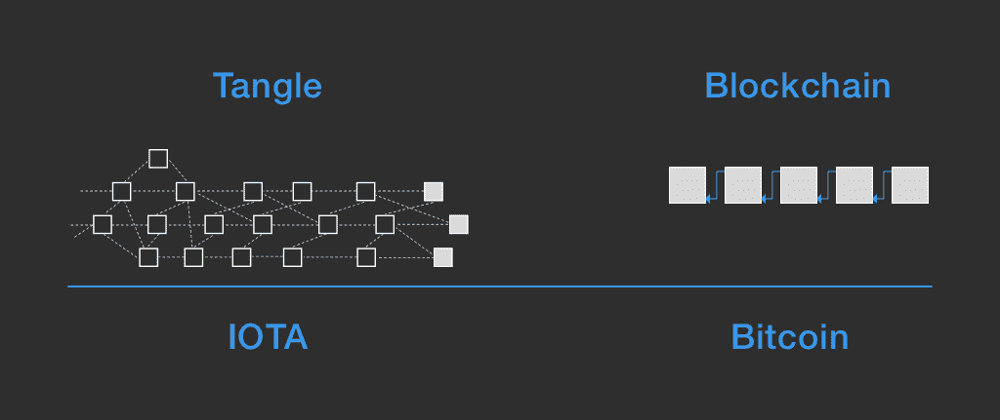

# 区块链:通向自治乌托邦的一站式商店？

> 原文：<https://medium.com/hackernoon/blockchain-a-one-stop-shop-to-autonomous-utopia-305dc13d13be>

你有没有看过 iRobot，想知道我们什么时候会有一个完全自主的社会？你可能想过。但是，你可能无法想象这什么时候会实现，因为直到最近，这还只是科幻小说。

直到现在，还没有一种技术能够承载物的经济。物联网(IoT)——日常物品通过互联网的连接——可能是过去十年中发展起来的最迷人的概念之一。

想象一下:世界意识到它需要一个“物的数据经济”来支持指数增长的人口的生活方式。最终，你会习惯在你的车送你去上班的时候吃早餐，看电子报纸。你的汽车可能会停下来充电，然后搭载另一名乘客，因为汽车会变成一名合同工，就像优步或 Lyft 一样。你去上班，而你的车为你工作。与此同时，你的机器人顾问或网上经纪公司会每小时给你发送一次当天交易的最新信息。下班后，你步行去取一些晚餐缺少的食材。你没有走近收银台就离开了商店，你的车准时来接你。

可以想象，这个基础设施非常复杂；因此，如果世界努力通过机器对机器的通信实现自动化，它必须渴望为这些物联网设备制定一个协议。

但是，什么样的技术或公司会得到报价呢？没有人知道，但我们肯定可以猜一猜。目前，相当多的比特币和区块链支持者设想该技术将推动我们进入自主和物联网的未来。但是，我有一些保留。由于其速度，比特币的区块链技术可能不会成为自治乌托邦的一站式商店。

比特币的区块链很慢。它每秒只能处理少得可怜的 7 个事务(TPS ),创建一个块大约需要 10 分钟。上下文来说，以太坊的区块链大概十五 TPS，Litecoin 大概一千 TPS，Ripple 大概一千五百 TPS。这仍然是比特币设计的一个主要缺陷。大规模挖掘给单个用户在策略和交易速度方面带来太大的影响。如果这还不够的话，专家建议，当那个时候到来时，包含区块链协议的自动化技术可能无法支持数百万用户的激增。。

那么，如果比特币和区块链技术做不到，谁能做到呢？我相信在这个新的、自主的未来世界中，加密货币仍有一席之地。

作为加密货币 IOTA 基础的协议 Tangle 在可扩展性和速度方面取得了显著进步。该图说明了分散式分类账形成共识的方式。IOTA 的 Tangle 通过区域用户组在一笔交易前验证两笔交易来达成共识，这与大多数比特币区块链通过要求“矿工”使用能够解决复杂算法的特定硬件来验证每一笔交易来达成共识相反。IOTA 的开发者证明了挖掘是一项不必要的繁重操作，它是以牺牲应用程序的可伸缩性和速度为代价的。

尽管 IOTA 的含义被视为理想，但 Tangle 在其开发方面仍然非常初级，需要进行大规模测试，与预计到 2020 年将连接到互联网的 300 亿设备合作。总而言之，如果比特币和其他总部位于区块链的加密货币的社区被证明是缓慢的，并且继续缺乏简单的平等主义概念，那么它们可能不太适合支持物联网。