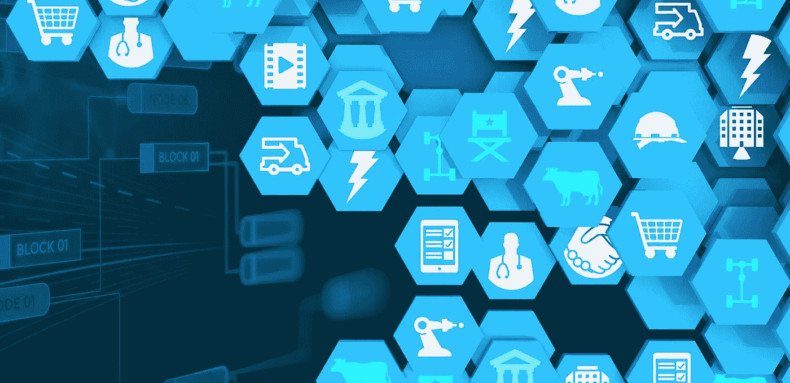

# 区块链:技术游戏改变者

> 原文：<https://medium.com/hackernoon/blockchain-a-technology-game-changer-acfce5c8af1b>

区块链涵盖了产品和服务流中涉及的广泛活动。它已经成为许多企业不可或缺的一部分。

此外，它对于创造公司成功的透明度以及客户满意度也是必不可少的。然而，当应用于当前系统时，会遇到许多异常和问题。因此，需要一种更好的系统来管理数据。

此外，资产的真实性和质量可能是一个挑战，因为传统系统冗长、复杂且缺乏透明度。

但是我们不能忽视这项技术提供的新的可能性。区块链基于对等系统。这意味着“简单的两党合作”的概念可能会真正改变这个行业的游戏规则。

它使用户和另一方之间的交易在对等和平行的平台上进行。因此，区块链技术的引入将能够方便用户与世界各地的廉价交易。

**区块链的可能性**

区块链提供了许多可能性，可以改变任何部门的工作方式以及技术利用互联网上存储的信息的方式。

> **这项技术的真正发明是保持任何部门的透明度。**

因此，它可能会改变钻石或洗钱的确定和追踪方式。

区块链是安全性和速度的结合，特别是在金融领域。因此，它可以节省大量的钱，而金融机构的时间被用于随机目的。

这项技术比其他技术更有优势。由于这项技术是新的，对于[应用开发公司](http://www.quytech.com/)来说，有更多的东西可以尝试。

在此之前，比特币和其他一些应用已经开始运行。但是这项新技术可以根据自己的兴趣进一步开发和使用。

着眼于区块链有可能改变商业和工业的游戏规则。它可以很容易地影响该技术可以产生最大影响的领域和服务。

> **因此，许多应用程序开发公司的开发人员都试图在开发时借助区块链来解决关键问题。**

区块链可能会彻底改变整个证券行业。因此，它允许交易者几乎瞬间完成他们的资金处理，而不是几天。

**兑换货币**

区块链技术已经改变了全球货币兑换的方式。由于本质上是去中心化的，区块链技术还保护我们处理货币的方式，防止不良行为者稀释货币供应。

**网络管理**

区块链解决方案已经出现了许多针对行业的解决方案。此外，企业应该探索这项技术的潜力。因此，现在是评估开源和商业打包解决方案的时候了。预测以建立组织知识并简化网络管理。

**智能合约**

区块链技术的发展允许企业建立去中心化的模型。这有助于为企业开展交易和达成协议打开新的视野。因此，这是一项最新的技术，为智能合约的传统模式提供了替代方案。

**区块链商务需求:**

> **区块链可以成为商业领域的游戏规则改变者。区块链组装方法将有助于更好地了解我们的世界。**

当涉及到各种规模企业的验证和交易时，这种技术是最佳选择。区块链数据是一种有吸引力的数据交付方法，使品牌可以轻松理解他们收集的所有数据。

人工智能和机器学习等技术趋势将使区块链保持竞争优势。因此，更新业务以使其更加有效和高效是至关重要的。区块链的未来将是动态的、敏捷的和更智能的，由人工智能和机器学习驱动。

随着时间的推移，这些技术将通过帮助挑选、分类、选择物品的过程来降低成本。

**结束…**

在未来，区块链科技将成为改变未来的游戏规则改变者，使系统过程准确透明。因此，区块链是追踪一种货币并保护其免受欺诈的理想选择。

这是共享经济背后的底层技术。它不仅将增强银行服务，降低交易成本，还将用户体验提升到一个新的水平。

因此，区块链技术可以成为记录和跟踪交易的无缝、集中和透明的系统，这是目前还不可能实现的。因此，市场上有许多专注于区块链可能性的应用程序开发公司。同样地， [Quytech](http://www.quytech.com/mobile-application-development.php) 也在利用区块链的能力发展移动应用开发服务。