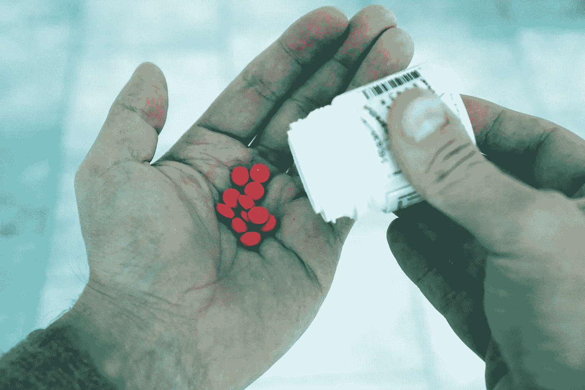

# 区块链旨在遏制处方药滥用

> 原文：<https://medium.com/hackernoon/blockchain-aims-to-curb-prescription-drug-abuse-47fc9cc66379>

image source: [Pexels](https://www.pexels.com/)

不管电视节目和电影让毒品看起来有多酷，它们都不是。滥用毒品是一种世界性的流行病，真实的人正在遭受痛苦。联合国估计全世界有 2950 万人患有药物使用障碍。

更可怕的是，大部分毒品问题并不存在于肮脏的小巷、毒品房，甚至好莱坞的豪宅中。它存在于普通家庭中，人们从合法药物中获得固定药物——医生开的药片，人们可以从街角的药店买到。

解决这个问题的一部分是确保正确的药物只到达需要它们的人手中。医疗保健行业已经转向技术来帮助解决这个问题。像 [MediLedger](https://www.mediledger.com/) 和 [BlockMedx](https://www.blockmedx.com/) 这样的项目甚至利用区块链这样的新兴技术为医药供应链提供安全性和透明度。

## 合法药物滥用

除了安眠药和抗焦虑药，止痛药是最常被滥用的合法药物。根据美国疾病控制和预防中心(CDC)的数据，2016 年美国记录了超过 42，000 例因阿片类药物过量而导致的死亡。年轻人面临的风险最大。12 至 25 岁的美国人滥用药物的比例最高。

许多滥用者开始尝试家中现有的药物。通常，这些物质作为入门药物，会导致使用者以后探索更危险的药物。最终，他们倾向于尝试具有更强精神改变效果的药片。

成瘾会促使他们进行处方欺诈。一些人试图欺骗医生获得合法的处方，或者让药店开假药。

BlockMedx 的首席执行官迈克尔·布鲁纳(Michael Brunner)说:“目前的处方和配药系统是最受控制和最危险的药物，这令人震惊。处方是手写在处方纸上的，处方纸通常包含较差的安全特征，并且由患者手动递送到药房。这就创造了一个处方很容易被伪造、复制或篡改的环境。”

这些物质也可以通过可疑的途径非法获得。供应往往来自供应链盗窃和制造假药。

## 供应链漏洞

制药业面临越来越大的压力，要确保他们的产品不会落入坏人之手。供应链安全漏洞确实存在。欺诈和盗窃甚至早在原材料的生产和运输过程中就可能发生。之后的每一个环节都可能是薄弱环节，因为产品从制造到分销和配送。

简单地信任其他利益相关者来传输和交付安全的产品已经变得非常不可靠。在供应链的任何一个环节都可能发现恶意的装腔作势者。原材料可以被窃取或非法购买，以制造这些药物的假版本。

假药已经成为一个全球性的行业，有着组织严密的经营者。据估计，这个市场每年的价值在 1630 亿到 2170 亿美元之间。此外，即使是真正的产品也可能从交货地点和仓库被盗，然后在黑市和通过人贩子出售。真正的毒品也可以被“切割”或与其他物质混合，以稀释它们，增加非法经销商的供应。这种篡改会污染这些药物，使它们更加不安全。

由于某些物质中的活性成分，这些物质的销售也必须受到监控和保护。例如，感冒药 Sudafed 被业余厨师用来制造甲基苯丙胺，然而，Sudafed 在药店柜台后面可以买到，所有人都可以购买。

政府也渴望解决这个问题。除了积极的缉毒运动之外，正在通过一些关键的立法，以迫使该行业采取防止药物滥用的措施。在美国，[药品供应链安全法案](https://www.fda.gov/Drugs/DrugSafety/DrugIntegrityandSupplyChainSecurity/DrugSupplyChainSecurityAct/ucm427033.htm)要求配药员、制造商和分销商提供所有通过他们的药品的追踪信息。这将有助于保证只有真正的和未受污染的产品通过供应链。

image source: [Pexels](https://www.pexels.com/)

## 区块链如何提供帮助

药品供应链利益相关者争相遵守法律。事实证明，像跟踪技术和区块链这样的新技术在为跟踪信息带来安全性、透明性和不变性方面非常有用。

例如，精神分裂症药物 [Abilify MyCite](https://www.abilifymycite.com/) 具有一个数字传感器和跟踪系统，可以跟踪摄入情况。虽然该技术旨在帮助患者跟踪他们的使用情况，但这种技术也可用于打击伪造和药物滥用。

在供应方面，制药巨头辉瑞和基因泰克与其他几家公司合作推出了 MediLedger 项目。这项工作旨在使制造商、批发商和医院拥有产品在交付过程中如何移动的不可改变的记录。通过这种方式，可以阻止恶意代理人利用供应链，帮助确保只有安全的药物才能进入市场。

区块链初创公司 BlockMedx 一直在使用以太坊区块链开发一个端到端的处方平台。该平台使用一个智能系统，该系统使用加密令牌来促进交易。使用该平台传输的处方可以与医生和患者的详细信息一起进行验证。医生将能够研究他们自己的处方历史，如果他们认为有问题，甚至可以撤销处方。药店也可以确保他们将履行合法的处方。

“在一个存在如此广泛安全漏洞的系统中，欺诈和滥用比比皆是，是时候制定一个全面的解决方案来打击它们了。BlockMedx 正在开发一个这样的解决方案。区块链技术非常适合这种用例。处方不能再被更改或伪造，系统中的利益相关者的身份可以被正式验证。Brunner 补充道:“处方交易与金融交易非常相似(区块链就是一个很好的案例),因此使用区块链的技术开处方真的是一个好主意。

## 建立信任，拯救生命

这种系统鼓励药品供应链利益相关者确保他们发送和接收的产品的质量和真实性。由于区块链让交易变得透明，利益相关者很容易发现问题并采取相应的干预措施。通过使恶意玩家很难玩游戏和利用系统，将更容易遏制这些物质的滥用和误用

这些努力还表明，打击药物滥用并不仅仅依赖于发动一场积极的反毒品战争。在利益相关者之间建立信任也会有所帮助。通过采用这些新技术，可以挽救更多的生命，降低犯罪率。

 [## 美国的医疗保健

### 这个国家医疗保健人性化的一面。

healthcareinamerica.us](https://healthcareinamerica.us)